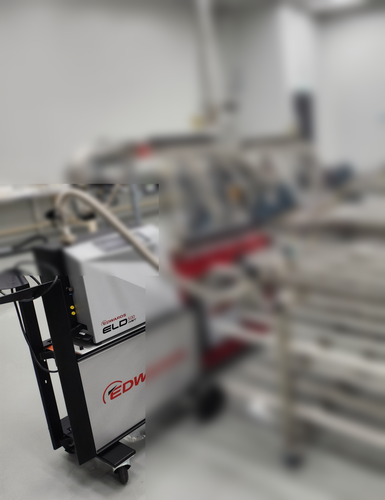
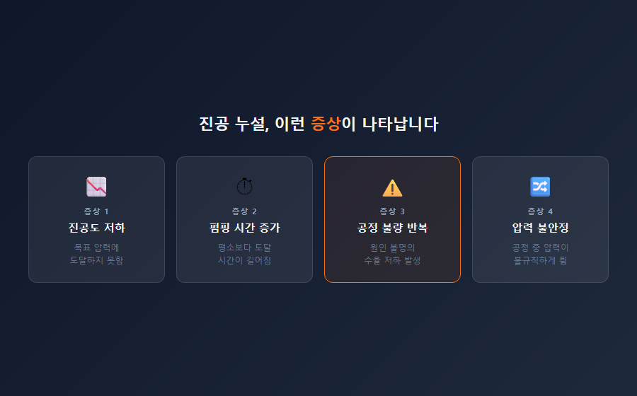
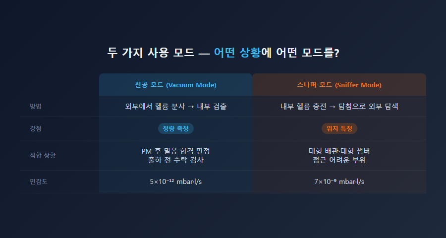
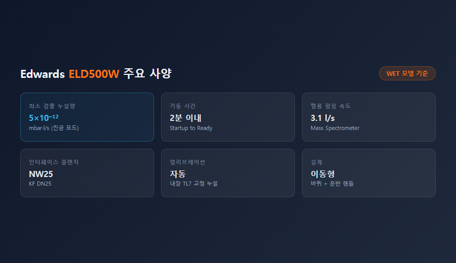

# ELD500W 리크디텍터, 어떤 상황에서 꼭 필요할까요?

진공 장비를 운용하다 보면 한 번쯤은 이런 상황을 겪게 됩니다. 챔버를 열었다 닫은 뒤부터 진공도가 이상하게 잘 나오지 않는 것입니다. 펌프를 교체해봤는데도 마찬가지입니다. 수치가 나빠진 건 분명한데, 어디서 누설이 발생하는지 찾을 수가 없습니다.

이런 상황에서 필요한 것이 **헬륨 리크디텍터**입니다. Edwards ELD500W는 반도체·디스플레이·연구소 현장에서 진공 누설을 수치로 확인하고 위치까지 특정할 수 있는 정밀 계측 장비입니다. 스마텍이 공급하고 기술 지원하는 제품입니다.

---

## 진공 누설은 왜 찾기 어려울까요?

진공 시스템의 누설은 눈에 잘 보이지 않습니다. 기압 차이로 인해 외부 공기(산소, 수분, 질소)가 미세한 틈을 통해 안으로 유입되지만, 그 경로는 수μm 수준인 경우도 많습니다.

현장에서 나타나는 1차 증상은 대개 이렇습니다.

- 챔버 도달 진공도가 목표값에 미치지 못함
- 펌핑 시간이 예전보다 길어짐
- 공정 압력이 불안정하게 튀거나 재현성이 떨어짐
- 이유 모를 공정 불량이 반복됨

이 증상들이 나타나도 "어디서" 누설이 발생하는지는 압력계만으로는 알 수 없습니다. O-링 한 곳인지, 배관 용접부 여러 곳인지, 게이트 밸브 시트인지 — 범위가 너무 넓습니다.

---

## 헬륨을 쓰는 이유가 있습니다

리크디텍터가 헬륨을 추적 가스(tracer gas)로 사용하는 데는 이유가 있습니다.

헬륨의 원자 질량은 4로, 불활성 가스 중 가장 가볍습니다. 분자 크기가 작아 공기보다 약 2.7배 빠르게 미세한 틈을 통과합니다. 아주 작은 누설 경로도 헬륨은 빠져나오고, 그 신호를 ELD500W가 포착합니다.

또한 대기 중 헬륨 농도는 약 5 ppm에 불과합니다. 배경 잡음이 낮아 미세 신호도 뚜렷하게 구별됩니다. 독성이 없고 불연성이라 현장에서 안전하게 사용할 수 있습니다.

ELD500W(WET 모델)의 최소 검출 누설량은 **5×10⁻¹² mbar·l/s**입니다. 이는 1년 동안 분자 수십억 개 수준의 극미세 누설도 감지할 수 있는 수준입니다.

---

## 두 가지 사용 방법 — 어떤 상황에 어떤 모드를?

ELD500W는 버튼 하나로 두 가지 모드를 전환할 수 있습니다.

**진공 모드 (Vacuum Mode)**
시험체를 리크디텍터에 연결하여 진공을 형성한 뒤 외부에서 헬륨을 뿌립니다. 챔버 전체의 누설량을 수치로 정확하게 측정할 때 사용합니다. 밀봉 합격/불합격 기준을 수치로 판정해야 하는 출하 검사, 정기 점검에 적합합니다.

**스니퍼 모드 (Sniffer Mode)**
시험체 내부에 헬륨을 충전하고 탐침으로 외부를 훑습니다. 배관·용접부·접합면 등 대형 시스템에서 누설 위치를 빠르게 좁혀나갈 때 사용합니다. 이동이 자유로워 현장 적용성이 높습니다.

---

## 어떤 현장에서 가장 많이 쓰이나요?

반도체·디스플레이·연구소 설비 담당자분들이 가장 많이 활용하는 상황은 아래와 같습니다.

1. **챔버 유지보수 후 복귀 전 밀봉 확인** — O-링 교체, PM 작업 후 재가동 전 누설 검증
2. **로드락·전달 챔버 점검** — 게이트 밸브, 도어 씰 누설 여부 확인
3. **가스 배관·용접부 검증** — 가스 패널, 공정 가스 라인 접합부 누설 여부
4. **원인 불명의 진공도 저하 진단** — 반복되는 공정 이상의 근본 원인 파악
5. **장비 납품·출하 전 수락 검사** — 제조사 기준 밀봉 합격 판정

연구소에서는 질량분석기, 전자현미경, 표면분석 장비에도 자주 적용됩니다. 이 장비들은 10⁻⁹ Torr 이하의 초고진공 환경이 필요하고, 극미세 누설도 측정 결과에 직접 영향을 주기 때문입니다.

---

## ELD500W, 현장에서 쓰기 편한 이유

저희 스마텍이 이 장비를 추천하는 데는 이유가 있습니다.

기동 시간이 **2분 이내**입니다. 현장에 가져가면 곧바로 검사에 들어갈 수 있습니다. 내장 캘리브레이션 리크(TL7)가 포함되어 있어 별도 교정 장비 없이 현장에서 바로 정확도를 확인할 수 있습니다.

바퀴가 달린 이동형 설계라 좁은 클린룸, 설비 밀집 구역도 이동이 가능합니다. WET(오일식)과 DRY(오일프리) 두 가지 모델이 있어 환경에 따라 선택할 수 있습니다. DRY 모델은 클린룸이나 오일 오염이 민감한 연구소에 적합합니다.

---

## 진공 누설, 지금 의심되신다면

진공도가 이유 없이 나빠졌거나, PM 후 재가동이 안 되거나, 공정 불량이 반복된다면 — 리크디텍터로 먼저 확인해보시는 것을 권장드립니다.

오래 찾던 누설 위치가 ELD500W 한 번 작업으로 수 분 내에 특정되는 경우도 적지 않습니다. 스마텍은 Edwards 코리아 공식 대리점으로서, 제품 구매부터 현장 기술 지원까지 함께합니다.

궁금한 사항은 언제든 연락 부탁드립니다.

**031-204-7170 / www.smartechvacuum.com**

---

#리크디텍터 #ELD500W #Edwards진공펌프 #헬륨리크테스트 #진공누설검사 #반도체설비 #진공펌프수리 #에드워드리크디텍터 #스마텍 #진공장비
