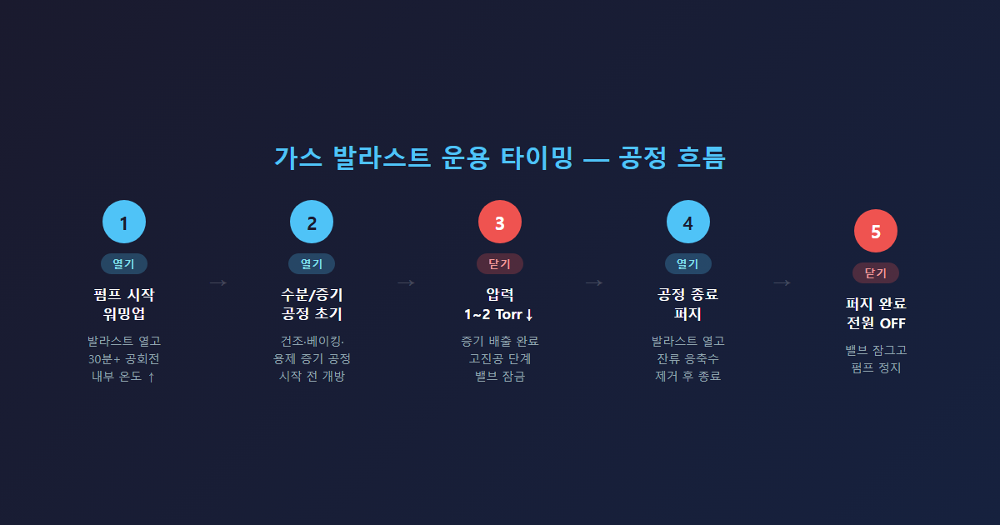

# 가스 발라스트(Gas Ballast) 사용 시점과 원리 — 오일 로터리 베인 펌프 완전 가이드

오일 로터리 베인 펌프에서 가스 발라스트를 잘못 사용하면 오일 오염과 펌프 손상으로 이어집니다. 수분·용제 증기 공정에서는 열고, 고진공 달성 단계에서는 반드시 닫아야 합니다.

---

## 가스 발라스트의 역할

가스 발라스트 밸브를 열면 압축 행정이 시작되기 전에 소량의 건조 기체(공기 또는 질소)가 챔버로 유입됩니다. 이 기체가 혼합 기체의 부분 압력을 조절해 수분이나 용제 증기가 액체로 응축되기 전에 배기구 밖으로 배출되도록 합니다. 이를 통해 오일 내 에멀젼(물-기름 혼합) 형성을 방지합니다.

---

## 열어야 할 때 — 3가지 기준

**워밍업 단계:** 펌프 시동 후 30분 이상 가스 발라스트를 열고 공회전합니다. 내부 온도가 100°C 이상이 되어야 오일 안 수분이 증기 상태로 배출됩니다.

**수분·응축성 증기 공정:** 건조 공정, 챔버 베이킹 후 진공 뽑기, 용제 증기가 발생하는 공정에서는 공정 시작부터 열어야 합니다. 닫은 상태로 운전하면 오일에 수분이 녹아들어 에멀젼이 형성됩니다.

**공정 종료 후 퍼지:** 공정이 끝난 직후 밸브를 열고 잠시 공회전을 지속해 오일 내 잔류 응축수를 제거합니다. 이후 포지션 0(완전 닫힘)으로 두고 종료합니다.

---

## 닫아야 할 때 — 고진공 달성 단계

시스템 압력이 1~2 Torr 이하로 내려가면 가스 발라스트를 닫습니다. 밸브를 열어 두면 공기가 지속적으로 유입되어 펌프가 도달 가능한 최저 압력(ultimate pressure)에 도달하지 못합니다. 에드워드 RV 시리즈의 도달 진공도는 2.0×10⁻³ mbar(가스 발라스트 닫힘 기준)입니다. 건조·불활성 기체만 처리하는 공정에서도 발라스트는 닫아야 합니다. 장시간 열어 두면 펌프 온도가 과도하게 상승해 오일 열화로 이어집니다.

---

## 에드워드 포지션별 선택 기준

에드워드 RV·E2M 시리즈 가스 발라스트 밸브는 0·I·II 세 포지션으로 구성됩니다.

| 포지션 | 상태 | 사용 시점 |
|--------|------|-----------|
| 0 | 완전 닫힘 | 고진공 필요 시, 건조 기체 공정, 펌프 종료 전 |
| I | 저유량 개방 | 일반적인 수분 처리 공정 |
| II | 고유량 개방 | 수분·증기가 많은 공정, 워밍업 초기 최대 퍼지 |

N2 가스 발라스트 어댑터가 장착된 경우, 포지션 0(잠금) 상태에서 중앙 포트를 통해 질소가 공급됩니다. 포지션 I·II로 돌리면 질소와 함께 공기도 유입되어 진공 누설이 발생하므로 주의가 필요합니다.

---

## 현장 체크포인트

오일 점검창에서 오일이 뿌옇고 거품이 발생한다면 이미 에멀젼 상태입니다. 즉시 가스 발라스트를 열고 워밍업을 진행하거나 오일을 교체해야 합니다. 에드워드 RV·E2M 시리즈의 권장 오일은 Ultragrade 19입니다.

가스 발라스트 조작 자체는 단순하지만, 공정 단계에 맞게 열고 닫는 시점을 지키는 것이 오일 오염 방지와 펌프 장기 수명의 핵심입니다. 펌프 운영 중 판단이 어려운 상황이 생기면 언제든 문의하십시오.
