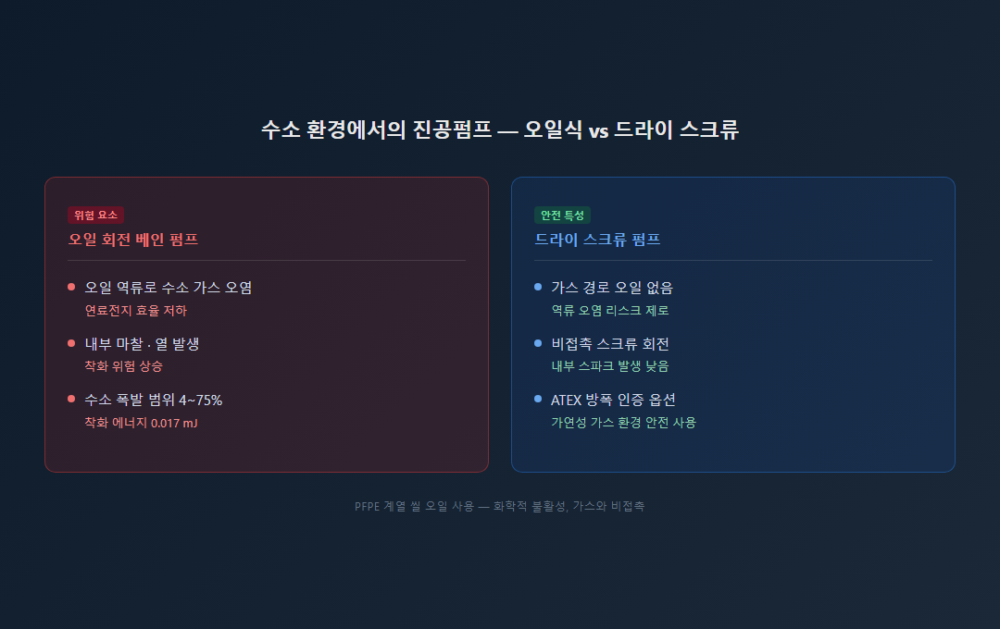
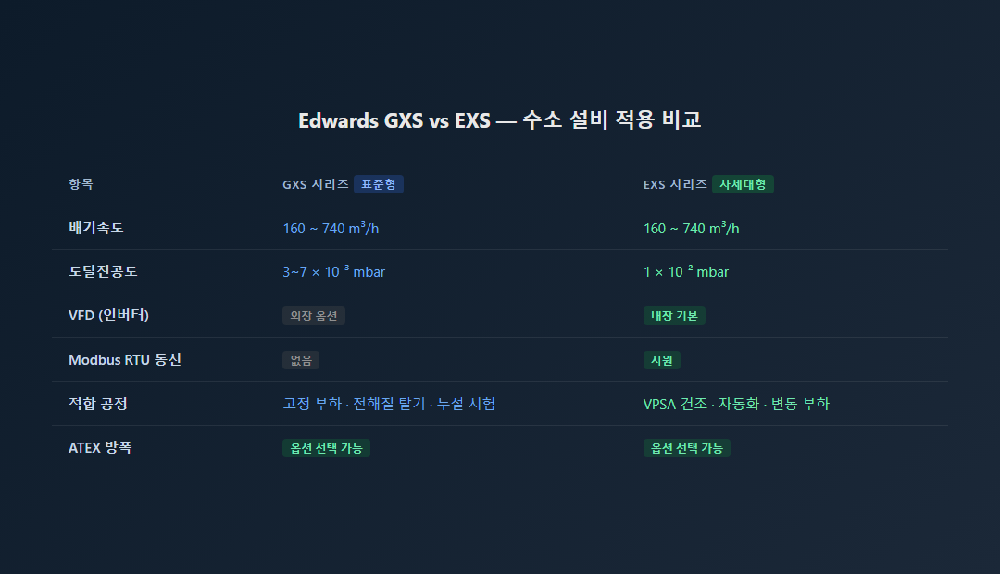
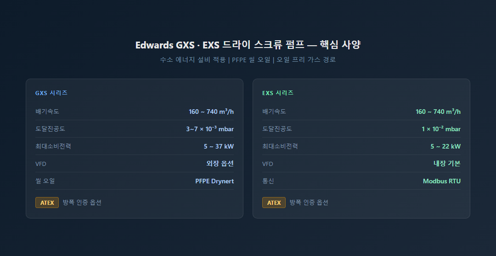

<!-- 수치검증: A항목 12개 확인 / B항목 2개 확인 / 삭제 0개 / 교체 0개 -->

# 수소 충전소·연료전지 설비를 위한 진공펌프 선택 가이드

수소 에너지 설비는 제조·저장·충전 과정 전반에 걸쳐 진공 공정을 필요로 합니다. 동시에 수소는 폭발 범위가 넓고 착화 에너지가 매우 낮은 가연성 가스입니다. 이 두 조건이 결합되면 진공펌프 선택은 성능만이 아닌 안전 기준의 문제가 됩니다.

## 수소 산업에서 진공이 필요한 주요 공정

연료전지 제조에서는 전해질 탈기(요구 진공도 1~10 mbar), 양극판 PVD 코팅(10⁻³ mbar 이하), 셀 스택 누설 시험이 진공 공정에 해당합니다. 수전해조에서는 배관 사전 진공 처리와 양극판 코팅이 필요하며, 수소 건조(VPSA) 공정은 흡착제 재생을 위해 수십~수백 mbar 구간의 반복 진공을 요구합니다. 액화 수소 보냉 탱크에는 이중벽 구조의 극저온 단열을 위해 10⁻³~10⁻⁴ mbar의 고진공이 요구됩니다.

## 오일 없는 드라이 스크류 펌프가 필요한 이유

수소(H₂)의 공기 중 폭발 범위는 4~75%이고 착화 에너지는 매우 낮습니다. 오일 회전 펌프를 수소 공정에 사용하면 배기 중 오일이 가스와 섞여 수소 순도를 저하시키고, 내부 열과 마찰 스파크로 인한 착화 위험을 높입니다.

드라이 스크류 펌프는 가스 경로에 오일을 사용하지 않습니다. 씰 부위에 화학적 불활성 PFPE 계열 오일을 소량 사용하지만, 이 오일은 가스와 직접 접촉하지 않습니다. 스크류 회전자는 비접촉으로 작동해 내부 스파크 발생 위험이 낮고, ATEX 방폭 인증 옵션을 선택하면 가연성 가스 환경에서도 안전하게 운용할 수 있습니다.

## GXS vs EXS — 공정에 맞는 모델 선택

Edwards **GXS 시리즈**는 배기속도 160~740 m³/h, 도달진공도 3~7×10⁻³ mbar의 산업 표준 드라이 스크류 펌프입니다. 고정 속도 운전으로 안정성이 높으며 전해질 탈기·배관 전처리·누설 시험 공정에 적합합니다.

**EXS 시리즈**는 VFD(가변속 드라이브)를 내장해 공정 조건에 따라 속도를 자동 조절합니다. 배기속도 160~740 m³/h, Modbus RTU 통신 지원으로 자동화 설비 연동이 가능합니다. 부하 변동이 있는 수소 건조(VPSA) 공정이나 스마트 팩토리 연동 환경에 강점이 있습니다.

## 공정 진공도별 권장 구성

| 공정 | 진공도 범위 | 권장 구성 |
|------|------------|----------|
| 전해질 탈기·VPSA 수소 건조 | 1~10 mbar | GXS160 / EXS160 이상 단독 |
| 배관 전처리·누설 시험 | 1~100 mbar | GXS / EXS 단독 |
| 양극판 PVD 코팅 | 10⁻³ mbar 이하 | GXS+EH 부스터 조합 |
| 극저온 보냉 탱크 단열 | 10⁻³~10⁻⁴ mbar | GXS / EXS+EH 부스터 |

부스터 조합 구성은 공정 가스 종류·온도·부하 조건에 따라 달라집니다. 현장 사양을 알려주시면 최적 구성을 제안해 드립니다.
