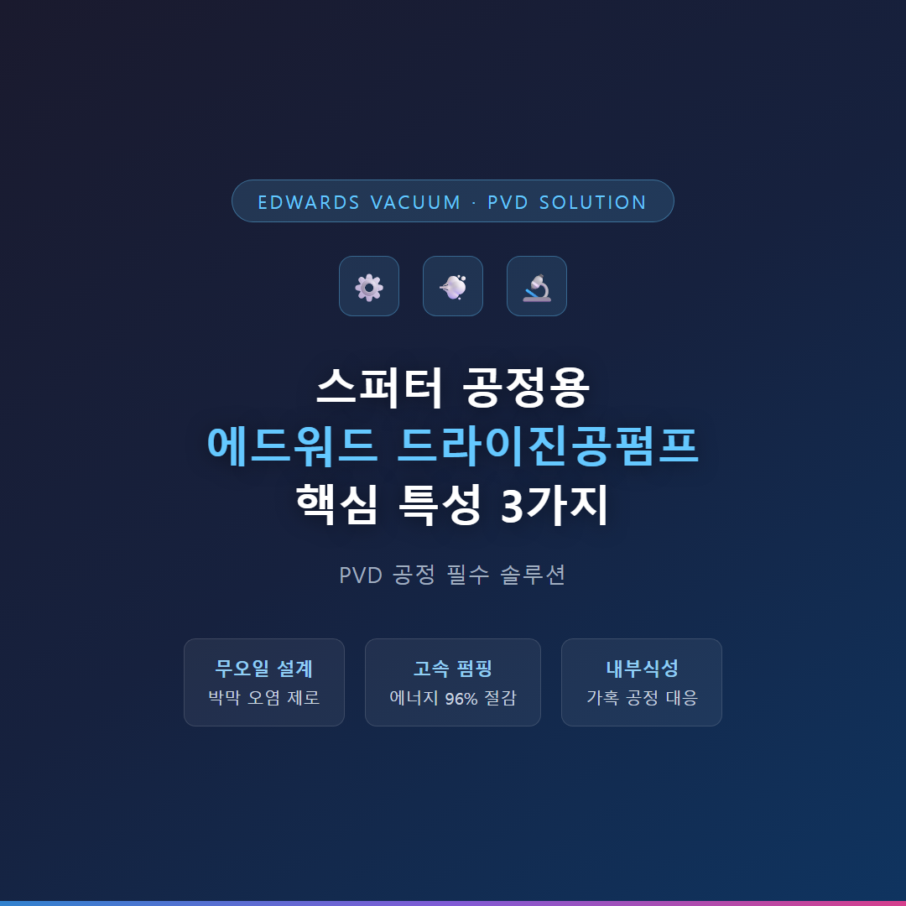
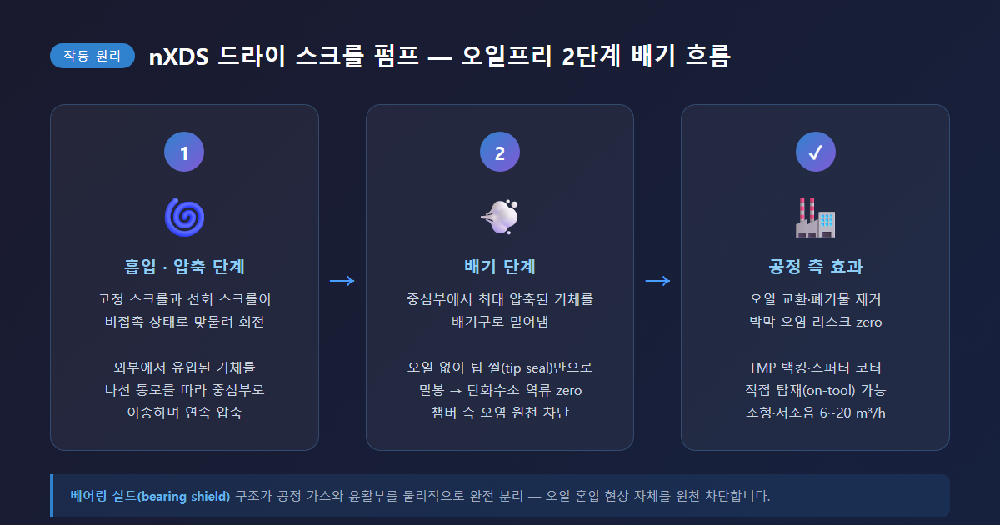
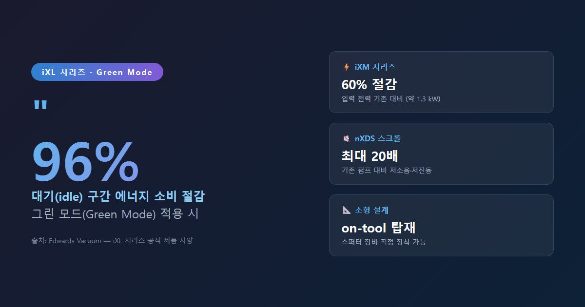
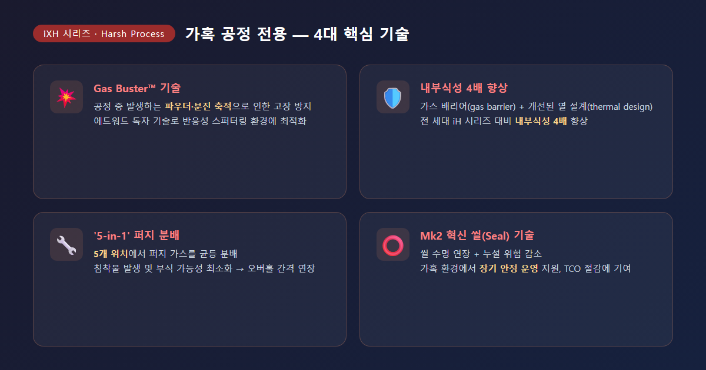
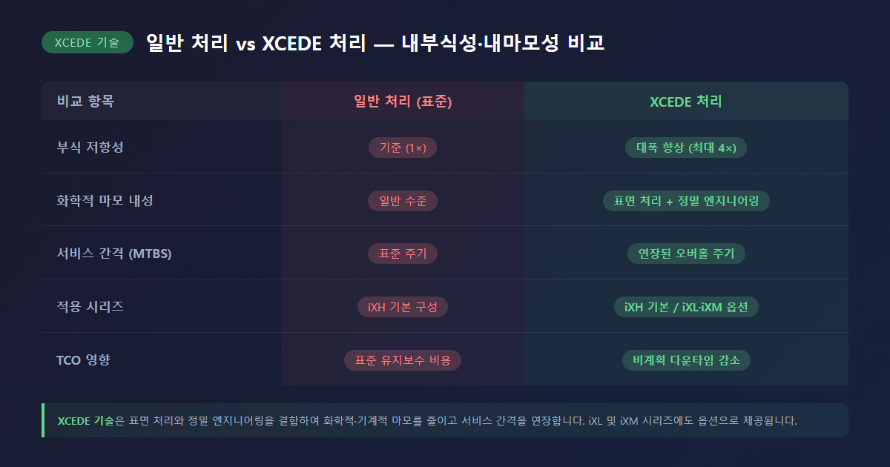
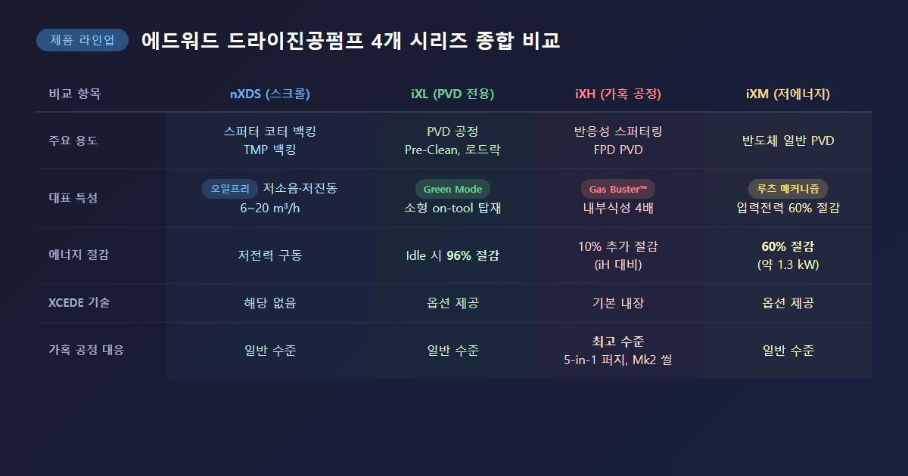

# 스퍼터 공정용 에드워드 드라이진공펌프 핵심 특성 3가지

스퍼터링(Sputtering) 공정에서 진공 환경의 품질은 박막(thin film) 성능과 반도체 수율을 직접 좌우합니다. 공정 중 아르곤 가스와 각종 반응성 가스가 지속적으로 유입되는 환경에서, 챔버 내 압력을 안정적으로 유지하고 잔류 가스를 신속하게 배기하는 역할을 맡는 것이 바로 드라이진공펌프입니다. 에드워드(Edwards)의 드라이진공펌프는 PVD(Physical Vapor Deposition) 공정 전반에 걸쳐 검증된 솔루션으로 널리 활용되고 있습니다.

---

## 첫 번째 특성은 무엇인지요? — 무오일 설계로 청결한 진공 환경 보증

에드워드 드라이진공펌프의 가장 핵심적인 특성은 오일을 전혀 사용하지 않는 무오일(oil-free) 설계입니다. 기존 로터리 베인 펌프는 내부 윤활 및 밀봉에 오일을 사용하기 때문에, 펌프 역류(back-streaming) 시 탄화수소 오일 증기가 챔버 쪽으로 유입될 위험이 있습니다. 스퍼터링 공정에서 오일 오염은 박막 품질에 치명적인 영향을 미치므로, 무오일 구조는 선택이 아닌 필수 요건으로 판단됩니다.

무오일 구조가 구현되는 방식은 시리즈별로 다음과 같이 정리됩니다.

| 시리즈 | 구동 방식 | 무오일 적용 특성 |
|--------|----------|----------------|
| GXS (스크류) | 비접촉 스크류 로터 양단 지지 구조 | 오일프리 진공 공간, 비접촉 장수명 씰, TMP 백킹 최적 |
| iXH (가혹 공정) | 비접촉 드라이 메커니즘 + 베어링 실드 | 공정 가스와 윤활부 완전 분리 |

특히 베어링 실드(bearing shield) 구조는 공정 가스와 베어링 윤활부 사이를 물리적으로 완전히 분리하여, 오일이 공정 측으로 혼입되는 현상 자체를 원천 차단합니다. 결과적으로 박막 오염 리스크 제거, 반도체 수율 향상, 오일 관련 후처리 비용 절감의 세 가지 효과를 동시에 기대할 수 있습니다.

---

## 두 번째 특성은 무엇인지요? — 고속 펌핑 속도와 에너지 절감의 동시 구현

에드워드 드라이진공펌프는 스퍼터링 공정의 진공 요구사항에 최적화된 높은 펌핑 속도와 낮은 에너지 소비를 동시에 제공합니다. 특히 24시간 연속 가동하는 반도체 팹(fab) 환경에서 에너지 절감 성능은 운영 비용과 직결되므로 매우 중요한 사항입니다.

주요 시리즈별 에너지 및 펌핑 성능을 비교하면 다음과 같습니다.

| 시리즈 | 펌핑 속도 | 에너지 절감 특성 |
|--------|----------|----------------|
| GXS | 160 ~ 750 m³/h (모델별) | 고효율 드라이브 적용, 저진동·저소음 (최대 70 dB(A) 이하) |
| iXM | 중·대형 반도체 공정 | 입력 전력 기존 대비 최대 60% 절감 (약 1.3 kW) |

GXS 시리즈는 에드워드 독자의 고효율 드라이브(high efficiency drive)를 탑재하여 고속 펌핑과 낮은 운전 비용을 동시에 실현합니다. 모델별 최고 70 dB(A) 이하의 저소음·저진동 특성 덕분에 스퍼터링 장비 인근에 직접 배치하거나 팹 웨이퍼 플로어에 설치하기에도 적합하며, 대용량 배기가 요구되는 PVD 챔버 백킹(backing) 용도에도 충분한 성능을 제공합니다. iXM 시리즈는 에드워드의 효율적인 루츠(Roots) 메커니즘을 적용하여 동급 대비 입력 전력을 최대 60% 낮추었습니다.

---

## 세 번째 특성은 무엇인지요? — 반응성 가스 환경에서의 내부식성과 부산물 처리 능력

반응성 스퍼터링(reactive sputtering) 공정에서는 아르곤 외에 질소(N₂), 산소(O₂), 수소(H₂) 등 반응성 가스가 추가로 사용됩니다. 이 과정에서 분말 형태의 부산물, 응결성 물질, 부식성 가스가 발생하며, 펌프 내부를 손상시키거나 조기 고장을 일으키는 요인이 됩니다. 에드워드 드라이진공펌프는 이러한 가혹한 환경에 대응하는 독자적인 기술을 적용하고 있습니다.

가혹 공정 전용 iXH(Harsh Process) 시리즈의 핵심 기술은 다음과 같습니다.

1. **Gas Buster™ 기술**: 공정 중 발생하는 파우더·분진이 펌프 내부에 축적되어 고장을 일으키는 현상을 방지하는 에드워드 독자 기술입니다.
2. **내부식성 4배 향상**: 가스 배리어(gas barrier) 기술과 개선된 열 설계(thermal design)를 통해 전 세대 iH 시리즈 대비 내부식성을 4배 높였습니다.
3. **XCEDE 기술**: 표면 처리와 정밀 엔지니어링을 결합하여 화학적·기계적 마모를 줄이고, 서비스 간격(MTBS, Mean Time Between Service)을 연장합니다. iXM 시리즈에도 옵션으로 제공됩니다.
4. **'5-in-1' 퍼지 분배 최적화**: 5개 위치에서 퍼지 가스를 분배하여 침착물 발생 및 부식 가능성을 최소화합니다.
5. **Mk2 혁신 씰 기술**: 펌프 씰 수명을 연장하고 누설 위험을 줄여, 가혹한 공정 환경에서도 장기 안정 운영을 지원합니다.

이러한 내부식성 기술의 적용 결과, iXH 시리즈는 에너지 소비 10% 추가 절감, 오버홀(overhaul) 간격 연장, 비계획 다운타임(unscheduled downtime) 감소 등의 효과를 통해 총소유비용(TCO, Total Cost of Ownership)을 낮추는 데 기여합니다.

---

## 에드워드 드라이진공펌프 시리즈 종합 비교

| 시리즈 | 주요 스퍼터 용도 | 대표 특성 |
|--------|----------------|----------|
| GXS (스크류) | PVD 챔버 백킹, TMP 백킹, 대용량 배기 | 오일프리, 160~750 m³/h, 고효율 드라이브 |
| iXH (가혹 공정) | 반응성 스퍼터링, FPD PVD | Gas Buster™, 내부식성 4배, XCEDE 기술 |
| iXM (저에너지) | 반도체 일반 PVD | 입력전력 60% 절감, 루츠 메커니즘 |

---

스퍼터링 공정의 박막 품질과 설비 가동률을 동시에 높이기 위해서는, 공정 특성에 맞는 드라이진공펌프를 선택하는 것이 무엇보다 중요합니다. 대용량 배기가 필요한 PVD 공정에는 GXS 시리즈를, 반응성 가스나 분말 발생이 수반되는 가혹 공정에는 iXH 시리즈를, 에너지 절감이 최우선이라면 iXM 시리즈를 적극 검토하시기를 권장드립니다. 도입 전 공정 압력 범위, 가스 조성, 설치 환경을 에드워드 공식 대리점이나 기술 지원 채널을 통해 반드시 확인하시기를 부탁드립니다.

---

#에드워드드라이진공펌프 #스퍼터링공정 #드라이진공펌프 #PVD공정 #반도체진공장비 #iXH #GXS #드라이스크류펌프 #반응성스퍼터링 #진공펌프특성
