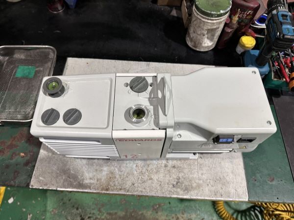
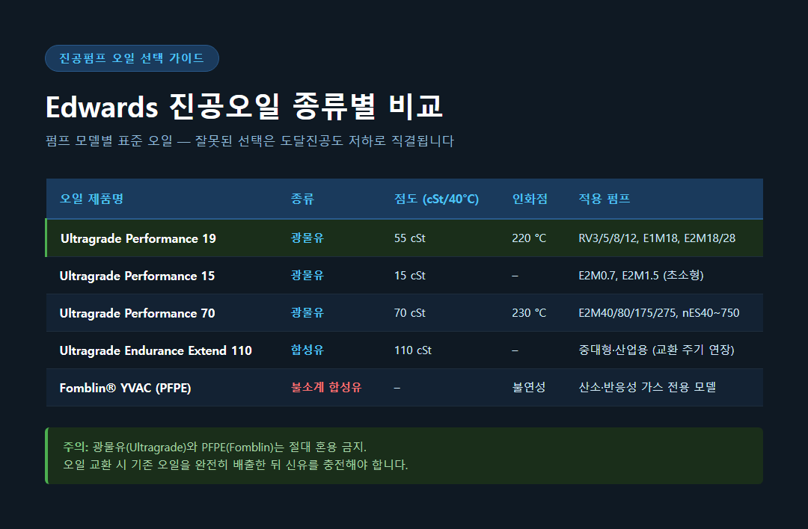
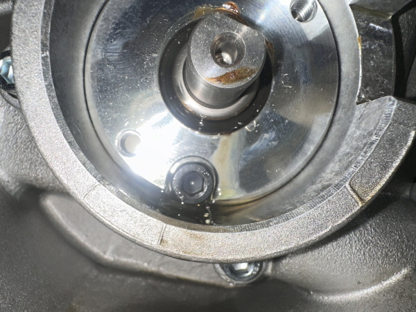

<!-- 수치검증: A항목 8개 확인 / B항목 0개 확인 / 삭제 0개 / 교체 0개 -->

# 진공펌프오일 교환 시기와 종류 선택법 — 실험실 RV·E2M 기준 3가지 핵심

진공펌프를 쓰면서 오일 교환을 언제 해야 하는지, 어떤 오일을 골라야 하는지 헷갈려 본 적 있으신가요?

최근 연구·분석 분야 고객사인 G사에서 Edwards RV12 펌프 납품 문의를 주셨을 때, 오일 선택 기준에 대한 질문이 함께 들어왔습니다. RV12는 출하 시 Ultragrade 19가 기본 충전되어 있고 오일 용량이 1L인 소형 2단 로터리 베인 펌프입니다. 질량분석기·전자현미경·원심분리기·로터리 증발기 등 실험실 장비의 백킹 펌프로 많이 쓰이는 모델이죠. 그런데 "어떤 오일을 사용해야 하나요?", "언제 교환해야 하나요?" 라는 질문을 받을 때마다, 이 부분이 생각보다 많은 분들이 놓치고 계신다는 것을 느낍니다.

이번 글에서는 Edwards 공식 카탈로그와 MSDS를 기반으로, 진공펌프오일 교환 시기와 종류 선택법을 정리해 드리겠습니다.

---

## 진공펌프오일, 언제 교환해야 하나요?

Edwards 공식 페이지에 따르면, 진공펌프오일은 **3~6개월마다 교환**하는 것이 기본 원칙입니다. 단, 사용 강도에 따라 교환 주기는 달라집니다.

| 사용 환경 | 권장 교환 주기 |
|-----------|---------------|
| 경부하 (간헐적 사용, 청정 가스) | 6개월마다 |
| 중부하 (일상적 실험실 사용) | 3개월마다 |
| 고부하 (연속 가동, 응축성 가스 처리) | 3개월 미만 + 수시 육안 점검 |

주기뿐 아니라 아래 신호가 보이면 즉시 교환을 검토해야 합니다.

- **오일 색상이 어두워짐** — 열화·오염의 직접적 신호
- **오일 레벨 감소** — 사이트 글라스(오일 확인창)로 확인 후 즉시 보충
- **도달진공도 저하 또는 배기속도 감소** — 오일 오염의 결과
- **운전 온도가 비정상적으로 높음** — 오일 열화 가속화 신호
- **과도한 진동 발생** — 내부 마모 또는 오일 상태 이상

오일 상태를 주기적으로 육안으로 확인하는 습관이 펌프 수명을 결정합니다.

---

## RV·E2M 소형 펌프에는 어떤 오일을 써야 하나요?

실험실에서 가장 많이 쓰이는 RV 계열과 E2M 소형 계열의 표준 진공오일은 **Ultragrade Performance 19(광물유)**입니다.

- **RV3, RV5, RV8, RV12**: 출하 시 Ultragrade 19 기본 충전. 오일 용량은 RV12 기준 1.00L.
- **E1M18, E2M18, E2M28**: 동일하게 Ultragrade 19 권장.
- **도달진공도(총압 기준)**: 2.0×10⁻³ mbar — 연구·분석 실험실의 일반적인 진공 요구 수준을 충족합니다.

Ultragrade 19는 점도 55 cSt @ 40°C, 인화점 220°C의 광물유로, 산화 저항성과 증기압 안정성이 뛰어납니다. 응축성 가스(수증기, 용매 증기)를 다루는 로터리 증발기 백킹 용도라면 가스 밸러스트(gas ballast) 밸브를 병행 운전하는 것을 권장드립니다.

반면, E2M0.7·E2M1.5 같은 초소형 2단 펌프에는 점도가 낮은 **Ultragrade Performance 15(15 cSt @ 40°C)**가 권장됩니다.

---

## E2M 중대형·nES 산업용 펌프라면 오일이 달라지나요?

E2M40/80/175/275 같은 중대형 계열과 nES40~nES750 산업용 펌프에는 **Ultragrade Performance 70(광물유)**이 표준입니다.

- 점도: 70 cSt @ 40°C
- 인화점: 230°C — Ultragrade 19 대비 10°C 높아 고온 산화 안정성이 우수합니다.

연속 가동이나 서비스 간격을 늘려야 하는 환경에서는 **Ultragrade Endurance Extend 110(합성유)**을 선택할 수 있습니다. Edwards 공식 카탈로그에서 "교환 간격 연장" 효과가 명시된 제품입니다. 다만 구체적인 연장 시간 수치는 개별 모델 매뉴얼에서 확인하셔야 합니다.

---

## 산소나 반응성 가스를 다룰 때는 오일이 달라야 하나요?

반드시 달라져야 합니다. 산소 농도 21% 초과 환경이나 반응성·부식성 가스를 처리할 때는 일반 광물유 대신 **Fomblin® YVAC(PFPE 불소계 합성유)**를 사용해야 합니다.

PFPE는 "부식 저항성과 화학적 불활성을 가진 오일로, 일반 석유계 오일이 신속히 파괴되는 악조건 공정용"입니다. (Edwards 공식 유지보수 지식베이스)

단, 여기서 중요한 주의사항이 있습니다.

**PFPE 사용 시 도달진공도가 크게 낮아집니다.**

- RV 계열 기준: Ultragrade 19 사용 시 2.0×10⁻³ mbar → Fomblin 사용 시 2.0×10⁻² mbar (약 10배 차이)

이 차이는 실험 결과에 직접적인 영향을 줄 수 있습니다. PFPE 환경이 필요하다면, 반드시 PFPE 사전처리 전용 모델(RV 계열의 경우 A65X09XXX 계열)을 별도 주문하셔야 합니다. 일반 모델에 Fomblin 오일만 넣는 방식은 불가합니다.

또한 광물유와 PFPE는 절대 혼용해서는 안 됩니다. 오일 교환 시 기존 오일을 완전히 배출한 뒤 신유를 충전해야 합니다.

[IMAGE: Fomblin YVAC PFPE 불소계 합성유 — 산소·반응성 가스 환경 전용 진공오일]

---

## 오일 선택, 결국 한 줄로 정리하면?

| 펌프 계열 | 표준 오일 |
|-----------|-----------|
| RV3/5/8/12 | Ultragrade 19 (출하 기본 충전) |
| E2M0.7/1.5 | Ultragrade 15 |
| E1M18/E2M18/E2M28 | Ultragrade 19 |
| E2M40/80/175/275 | Ultragrade 70 |
| nES40~nES750 | Ultragrade 70 또는 Endurance Extend 110 |
| 산소·반응성 가스 환경 | Fomblin® YVAC (PFPE 전용 모델 필수) |

오일 선택은 펌프 모델에 따라 정해져 있습니다. 모델 확인 없이 "아무 진공오일이나"를 사용하면 도달진공도 저하, 오일 열화 가속, 최악의 경우 펌프 손상으로 이어질 수 있습니다.

모델별 정확한 오일 사양과 교환 주기는 각 펌프의 Instruction Manual에 기재되어 있으며, 불확실할 때는 스마텍으로 문의 주시면 확인해 드립니다.

---

Tel : 031 204 7170
info@smartechvacuum.com
www.smartechvacuum.com

---

#진공펌프오일 #진공오일 #Edwards진공펌프 #RV진공펌프 #실험실진공펌프 #에드워드진공펌프 #Ultragrade19 #PFPE오일 #진공펌프관리 #스마텍
