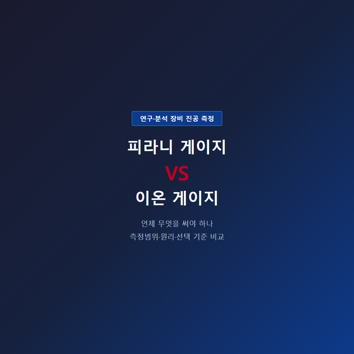

<!-- 수치검증: A항목 6개 확인 / B항목 0개 확인 / 삭제 0개 / 교체 0개 -->

# 연구용 진공 측정 — 피라니 게이지 vs 이온 게이지, 언제 무엇을 써야 하나

"우리 실험 장비에 어떤 진공게이지를 달아야 하나요?" 연구실에서 자주 받는 질문입니다. 피라니 게이지와 이온 게이지는 측정 원리가 완전히 다르고, 측정 가능한 압력 범위도 겹치지 않습니다. 잘못 고르면 장비가 어느 진공도까지 도달했는지 아예 확인이 안 되는 상황이 생깁니다.

## 피라니 게이지 — 대기압~중진공 구간 모니터링

피라니 게이지는 열전도 원리를 이용합니다. 가열된 필라멘트 주변에서 기체 분자가 열을 빼앗아가는 속도를 측정합니다. 기체가 많으면 열 손실이 크고, 기체가 적으면 열 손실이 줄어드는 것을 이용하는 방식입니다. 구조가 단순해 내구성이 높고 가격도 상대적으로 저렴합니다.

Edwards APG200의 측정범위는 대기압(1,000 mbar)부터 5×10⁻⁴ mbar까지입니다. NW16 또는 NW25 플랜지를 사용하며, TIC/ADC/TAG 컨트롤러와 호환됩니다.

펌프다운 모니터링, 공정 진입 조건 확인, 진공 오븐·건조 공정에 적합합니다. 단, 10⁻³ mbar 아래로 내려가면 측정값을 신뢰하기 어렵습니다. 이 영역에서는 기체 분자 자체가 너무 적어 열전도 원리로 측정이 되지 않습니다. 질소(N₂) 기준으로 교정되어 있어 헬륨·아르곤 환경에서는 보정 계수를 적용해야 합니다. 피라니 게이지 하나만으로 고진공 장비의 전체 범위를 커버하려는 시도는 측정 오류로 이어질 수 있습니다.

## 이온 게이지 — 고진공·초고진공 측정

이온 게이지는 전자를 쏘아 기체 분자를 이온화시키고, 만들어지는 이온 전류를 읽는 방식입니다. 분자가 적을수록 이온 전류가 줄어드는 것을 이용합니다. 오히려 기체 분자가 너무 많은 구간(대기압~10⁻² mbar)에서는 작동하지 않습니다.

Edwards AIM200은 냉음극(역자장) 방식이며 측정범위는 1×10⁻⁹ ~ 1×10⁻² mbar입니다. 필라멘트가 없어 오염·방전에 강하고 수명이 깁니다. 터보분자펌프가 달린 코팅 장비, 전자현미경, 이온빔 장비 등 10⁻⁶ mbar 이하 고진공 실험에서 필수입니다. 열음극 방식 대비 유지보수 주기가 길고, 반응성 가스 환경에서도 상대적으로 안정적으로 동작합니다. 단, 대기압 상태에서 이온 게이지에 전원을 공급하면 고전압에 의해 헤드가 손상될 수 있으므로, 반드시 10⁻² mbar 이하에서만 작동시켜야 합니다.

## 둘 다 필요한 경우

터보분자펌프를 사용하는 장비는 대기압에서 시작해 10⁻⁶ mbar 이하 실험 영역까지 도달합니다. 하나의 게이지로 전 범위를 볼 수 없어 피라니와 이온 게이지를 각각 다른 포트에 달아 역할을 나누는 방식을 많이 씁니다. 공정 진입 조건 확인은 피라니로, 실험 중 고진공 확인은 이온 게이지로 분리하는 구성입니다. 두 게이지를 함께 사용하면 펌프다운 전 구간을 연속으로 모니터링할 수 있어 진공 공정의 안정성이 높아집니다. 특히 이온 게이지 작동 가능 압력(10⁻² mbar)에 도달했는지 피라니로 먼저 확인한 뒤 이온 게이지 전원을 켜는 순서를 지켜야 헤드 손상을 방지할 수 있습니다.

## 게이지 교체 시기와 점검 기준

피라니 게이지는 필라멘트 오염이 누적되면 측정값이 실제보다 낮게 표시됩니다. 동일한 공정에서 이전보다 진공도 도달 시간이 길어지거나, 압력값이 불안정하게 튀는 경우 게이지 헤드 교체를 먼저 의심해야 합니다. 반응성 가스(HF, Cl₂, NF₃ 등)를 다루는 환경에서는 교체 주기가 더 빨라집니다.

이온 게이지는 대기에 노출되거나 갑작스러운 압력 상승(벤트)이 반복되면 헤드가 손상됩니다. 헤드를 교체할 때는 컨트롤러 호환성을 반드시 확인해야 합니다. TIC·ADC 컨트롤러는 AIM200과 직접 연결되며, TAG 계열은 별도 어댑터가 필요한 경우가 있습니다.

## WRG200 — 포트 하나로 전 범위

배관 포트가 부족하거나 게이지 수를 줄이고 싶을 때 WRG200 광범위 게이지를 고려할 수 있습니다. 피라니와 역자장 이온 방식을 하나의 헤드에 통합해 1×10⁻⁹ ~ 1,000 mbar를 단일 게이지로 커버합니다.

## 상황별 선택 기준 요약

| 상황 | 권장 게이지 | 이유 |
|------|-----------|------|
| 진공 오븐·건조 공정 | APG200 (피라니) | 1~1,000 mbar 모니터링으로 충분 |
| 터보펌프 부착 연구 장비 | AIM200 (이온) | 10⁻⁶ mbar 이하 고진공 확인 필수 |
| 전 범위 단일 모니터링 | WRG200 (복합) | 포트 1개로 대기압~초고진공 커버 |
| 펌프다운~고진공 실험 모두 | APG200 + AIM200 조합 | 역할 분리, 각 범위 정확 측정 |

게이지 선택은 장비 도달 진공도와 실험 압력 범위를 먼저 확인한 후 결정해야 합니다. 터보펌프 사양서에 적힌 최저 도달 압력(ultimate pressure)을 기준으로 이온 게이지 필요 여부를 판단하는 것이 가장 확실한 방법입니다. 도달 압력이 10⁻⁵ mbar 이하라면 이온 게이지 없이는 실제 진공도를 확인할 수 없습니다. 사양 확인이 어려우시면 장비 스펙을 가지고 문의해 주시면 안내드립니다.

게이지를 처음 설치하거나 교체할 때는 배관 플랜지 규격도 함께 확인해야 합니다. APG200·AIM200·WRG200은 모두 NW16 또는 NW25 플랜지를 사용하며, 기존 포트와 규격이 맞지 않으면 어댑터 플랜지가 필요합니다. 설치 전 현재 장비의 포트 규격을 확인한 후 주문하는 것을 권장합니다.

스마텍은 Edwards 진공게이지 전 라인업을 취급합니다. APG200, AIM200, WRG200 모두 재고 보유 중이며, 컨트롤러 호환성 확인부터 설치 후 현장 점검까지 지원합니다. 게이지 교체·신규 설치 모두 상담 가능합니다. 기존 게이지 모델명과 현재 증상을 함께 알려주시면 더 빠르게 안내드릴 수 있습니다.

문의: 031-204-7170 / info@smartechvacuum.com
