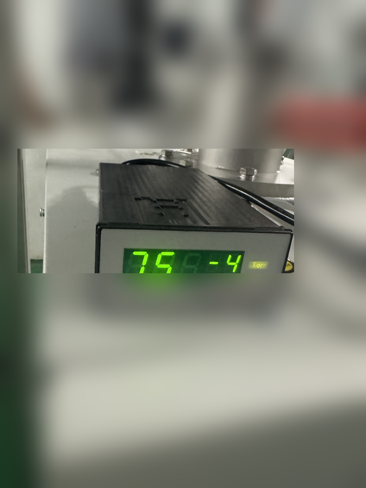
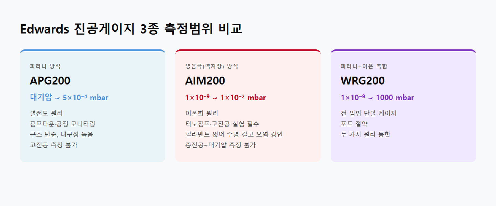

<!-- 수치검증: A항목 6개 확인 / B항목 0개 확인 / 삭제 0개 / 교체 0개 -->

# 피라니 게이지 vs 이온 게이지 — 연구실 진공 측정 선택 기준

"우리 실험 장비에 어떤 진공게이지를 달아야 하나요?" 연구실에서 자주 받는 질문입니다. 피라니 게이지와 이온 게이지는 측정 원리가 완전히 다르고, 측정 가능한 압력 범위도 겹치지 않습니다. 둘 중 하나를 잘못 고르면, 자신의 장비가 어느 진공도까지 도달했는지 아예 확인이 안 되는 상황이 생깁니다.

## 피라니 게이지는 어떤 원리로 측정하나요?

가열된 필라멘트 주변에서 기체 분자가 열을 빼앗아가는 속도를 이용합니다. 기체가 많으면(압력 높음) 열 손실이 크고, 기체가 적으면(압력 낮음) 열 손실이 줄어드는 것을 측정합니다.

스마텍이 취급하는 Edwards APG200의 측정범위는 대기압(1,000 mbar)부터 5×10⁻⁴ mbar까지입니다. (✅ 스마텍 product_master_table) 펌프를 켠 직후 대기압에서 시작해 중진공 구간까지 연속으로 모니터링하는 데 최적입니다.

단점이 있습니다. 10⁻³ mbar 아래로 내려가면 측정값을 신뢰하기 어렵습니다. 이 영역에서는 기체 분자 자체가 너무 적어져 열전도 원리로 측정이 안 됩니다. 또 질소(N₂)를 기준으로 교정되어 있어, 헬륨이나 아르곤 가스 환경에서는 보정이 필요합니다.

## 이온 게이지는 어떤 원리로 측정하나요?

고진공 상태에서 전자를 쏘아 기체 분자를 이온화시키고, 만들어지는 이온 전류를 읽습니다. 분자가 적을수록 이온 전류가 줄어드는 것을 이용합니다. 오히려 기체 분자가 너무 많은 구간(대기압~10⁻² mbar)에서는 이온 게이지가 작동하지 않습니다.

Edwards AIM200은 냉음극(역자장) 방식이고, 측정범위는 1×10⁻⁹ ~ 1×10⁻² mbar입니다. (✅ 스마텍 product_master_table) 필라멘트가 없어서 오염에 강하고 수명이 깁니다. 터보분자펌프가 달린 코팅 장비, 전자현미경, 이온빔 장비 등 10⁻⁶ mbar 이하 고진공 실험에 필수입니다.

## 둘 다 필요한 경우도 있나요?

많습니다. 터보분자펌프를 사용하는 장비는 대기압에서 펌프다운을 시작해 10⁻⁶ mbar 이하 실험 영역까지 도달합니다. 이 경우 하나의 게이지로 전 범위를 볼 수 없습니다.

얼마 전 서울대학교 재료공학부 연구실에 서비스를 다녀온 적이 있습니다. 로터리 펌프 누유 수리로 방문했는데, 옆에 있는 장비 진공도도 한번 봐달라고 했습니다. 그 자리에서 게이지를 연결해 측정해드렸는데, 연구실 장비에 피라니와 이온 게이지가 각각 다른 포트에 달려 있었습니다. 공정 진입 조건 확인은 피라니로, 실험 중 고진공 확인은 이온 게이지로 역할을 나누는 방식입니다.

## WRG200 — 한 개로 전 범위를 봐야 한다면

배관 포트가 부족하거나 게이지 수를 줄이고 싶으면 WRG200 광범위 게이지를 고려할 수 있습니다. 피라니와 역자장 이온 방식을 하나의 헤드에 통합해 1×10⁻⁹ ~ 1,000 mbar를 단일 게이지로 커버합니다. (✅ 스마텍 product_master_table)

## 상황별 선택 기준 요약

- **진공 오븐, 일반 건조 공정**: APG200(피라니) — 1~1,000 mbar 모니터링이면 충분
- **터보펌프 부착 실험 장비**: AIM200(이온) — 10⁻⁶ mbar 이하 고진공 확인 필수
- **배관 포트 제한, 전 범위 모니터링 필요**: WRG200 — 하나로 대기압~초고진공 커버
- **펌프다운부터 실험까지 모두**: APG200 + AIM200 조합 — 역할 분리

게이지 선택은 장비 도달 진공도와 실험 압력 범위를 먼저 확인한 후 결정해야 합니다. 확인이 어려우시면 장비 사양을 가지고 문의하시면 안내드립니다.

---

Tel : 031 204 7170
info@smartechvacuum.com
www.smartechvacuum.com

---

#진공게이지 #피라니게이지 #이온게이지 #APG200 #AIM200 #WRG200 #연구실진공 #Edwards진공게이지 #고진공측정 #진공측정기
