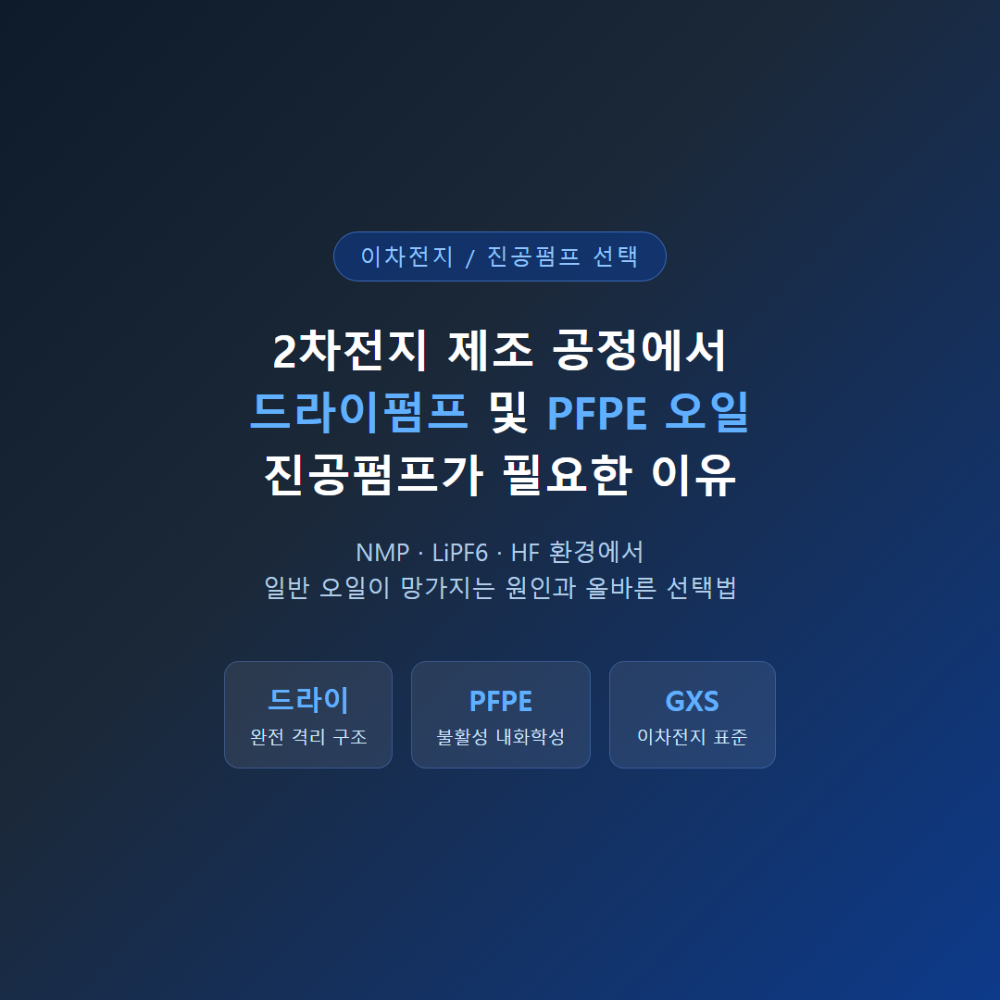

<!-- 수치검증: A항목 7개 확인 / B항목 0개 확인 / 삭제 0개 / 교체 0개 -->

# 2차전지 제조 공정에서 드라이펌프 및 PFPE 오일 진공펌프가 필요한 이유

이차전지(리튬이온 배터리) 제조 공정에는 NMP 용제, LiPF6 전해액, HF(불화수소) 등 일반 진공펌프 오일을 빠르게 열화시키는 화학 물질이 존재합니다. 이 환경에서 드라이펌프 또는 PFPE 오일을 사용하는 진공펌프가 필요한 이유를 공정 단계별로 설명합니다.

## 2차전지 공정에서 진공이 필요한 단계

배터리 제조 과정에서 진공 기술이 적용되는 주요 단계는 다음과 같습니다.

| 공정 단계 | 진공 목적 | 주요 위험 물질 |
|-----------|-----------|---------------|
| 전극 건조 | NMP 제거, 수분 40ppm 이하 달성 | NMP 증기 대량 발생 |
| NMP 회수 | 용제 재활용, 환경 규제 대응 | NMP 고농도 증기 |
| 전해액 주입·디개싱 | 기포 없는 균일 주입, 기포 제거 | LiPF6, HF 가능 |
| 셀 봉합·화성 | 밀봉, 초기 충방전 가스 처리 | CO₂, H₂, HF 가스 |

전해액 디개싱 공정의 요구 진공도는 0.1 mbar 이하입니다. (✅ Edwards GXS Application Note)

## 드라이펌프가 필요한 이유 — 공정 가스와 오일의 완전 격리

오일식 로터리베인 펌프(E2M, RV 등)는 공정 가스가 오일 속을 통과하는 구조입니다. NMP 증기가 오일에 흡수되어 점도를 낮추고, LiPF6가 수분과 반응해 생성된 HF가 오일을 부식시킵니다. 결과적으로 점도 저하 → 도달 진공도 악화 → 슬러지 형성 → 교환 주기 단축의 악순환이 반복됩니다.

드라이 스크류 펌프(GXS 등)는 공정 가스 경로에 오일이 없습니다. 기어박스 윤활유는 별도 격리 공간에 있으며, 샤프트 씰 퍼지 구조가 공정 가스의 침투를 차단합니다. NMP·HF 환경에서도 오일 열화 문제가 원천적으로 발생하지 않으며, 오일 역류(backstreaming)가 없어 배터리 전극 오염 위험도 없습니다.

## PFPE 오일 진공펌프 — 오일식이 불가피한 경우의 선택

드라이펌프 도입이 어려운 경우, 오일식 진공펌프에 PFPE(퍼플루오로폴리에테르) 오일을 사용하는 방법이 있습니다.

PFPE 오일은 탄소-불소 결합으로만 구성된 합성 오일입니다. 거의 모든 유기 용제에 불용성이어서 NMP와 섞이지 않고, HF 등 부식성 가스에도 반응하지 않습니다. 유해 공정 조건이 일반 탄화수소 오일을 빠르게 파괴하는 환경에서 PFPE 오일이 사용됩니다. (✅ edwardsvacuum.com — Vacuum pump oil and fluids)

단, PFPE 오일을 사용하더라도 오일식 펌프의 구조적 한계(공정 가스와 오일의 직접 접촉)는 유지됩니다. 일반 오일 대비 수명이 훨씬 길지만, 전극 오염 위험(역류)은 드라이펌프와 같은 수준으로 해결되지 않습니다.

## GXS 드라이펌프의 이차전지 공정 적합 특성

Edwards GXS 산업용 드라이 스크류 펌프는 이차전지 전 공정에 걸쳐 적용되는 표준 솔루션입니다. (✅ Edwards — Lithium-Ion Battery Manufacturing)

GXS는 기어박스 윤활유로 **PFPE Drynert® 25/6**을 전 모델에 채택합니다. 공정 가스 경로와 기어박스가 샤프트 씰 퍼지로 완전 격리되어 있으며, DME·Dioxolane·LiPF6에 내화학성을 갖도록 재질이 설계되었습니다. (✅ Edwards GXS Application Note)

- GXS250 단독 도달진공도: 4×10⁻³ mbar (✅ Edwards GXS 브로슈어)
- GXS250/2600 콤비 도달진공도: 5×10⁻⁴ mbar (✅ Edwards GXS 브로슈어)
- 전해액 디개싱 기준 요구 진공도 0.1 mbar 이하를 단독으로 달성 가능
- 오일 역류 없음 — 배터리 전극 오염 위험 제거

## 오일식 펌프 사용 시 발생하는 문제

이차전지 공정에서 일반 오일식 로터리베인 펌프를 사용하면 다음 문제가 반복됩니다.

- NMP 흡수 → 오일 점도 저하 → 도달 진공도 악화
- HF 발생 → 오일 산화·분해 → 슬러지 생성 → 펌프 손상
- 오일 역류 가능성 → 배터리 전극 오염 → 수율 저하
- 잦은 오일 교환 → 생산 중단 빈도 증가 → 유지비 급증

PFPE 오일 사양 펌프 또는 드라이펌프 채택이 권장됩니다. 이차전지 공정 진공 솔루션에 대해 궁금하신 점은 스마텍으로 문의해 주십시오. Edwards 코리아 공식 대리점으로서 30년 이상의 현장 경험을 바탕으로 최적의 솔루션을 안내해 드립니다.
