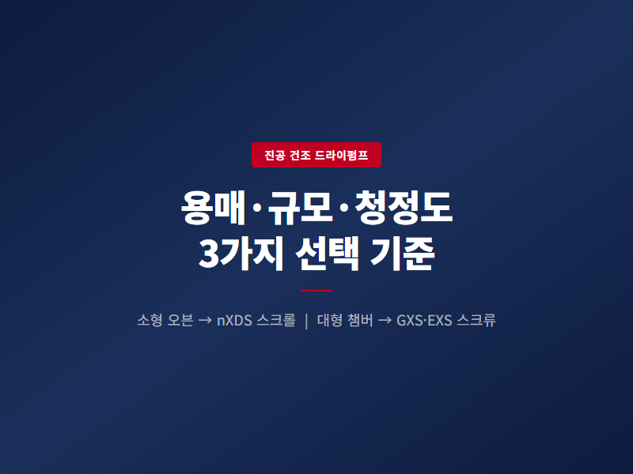
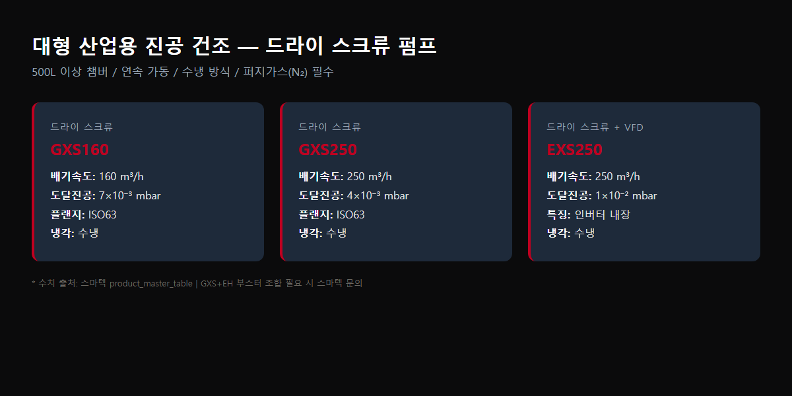

<!-- 수치검증: A항목 12개 확인 / B항목 0개 확인 / 삭제 0개 / 교체 0개 -->

# 진공 건조 공정에서 드라이펌프를 선택하는 3가지 기준

진공 오븐이나 건조 챔버에 연결할 진공펌프를 결정할 때, 오일 로터리 펌프와 드라이펌프 중 어느 쪽이 맞는지는 건조 대상 용매, 챔버 규모, 청정도 요구 수준에 따라 달라집니다. 의약품 중간체 건조, 배터리 전극 수분 제거, 식품 동결건조 전처리 등 공정마다 요구하는 진공 범위와 허용 오염도가 다르기 때문입니다.

스마텍에는 "오일 펌프를 드라이로 교체하면 얼마나 좋아지나요?"라는 문의가 자주 들어옵니다. 교체 후기를 들어보면 공통적으로 두 가지를 언급합니다. 오일 교환 주기를 더 이상 신경 쓰지 않아도 된다는 점, 그리고 건조 후 제품 표면에 오일 미스트 흔적이 사라졌다는 점입니다. 이 글은 그 판단 기준을 수치와 함께 정리합니다.

## 오일 로터리 펌프의 한계

오일 로터리 펌프는 진공도와 가격 측면에서 경쟁력이 있지만, 진공 건조 공정에서는 뚜렷한 약점이 있습니다. 수분, NMP, 에탄올 같은 용매 증기가 펌프 내부로 유입되면 오일에 녹아 오염을 일으킵니다. 오일 점도가 낮아지고 밀봉 성능이 저하되어 교환 주기가 크게 단축됩니다. 가스발라스트 기능을 켜면 수증기 처리에 도움이 되지만(RV12 기준 290 g/h), 고비점 유기용매는 가스발라스트만으로 대응이 어렵습니다.

오일 오염이 반복되면 역류(backstreaming)로 인해 건조 제품에 오일 미스트가 묻을 수 있습니다. 의약품이나 반도체 부품처럼 오염 허용치가 엄격한 공정에서는 이 점이 결정적인 선택 기준이 됩니다.

## 소형 오븐 — 드라이 스크롤 펌프(nXDS, XDS)

챔버 5~200L 수준의 소형·중형 오븐, 연구실 배치 공정에는 드라이 스크롤 펌프가 적합합니다.

| 모델 | 배기속도 | 도달진공 | 적용 오븐 용량 |
|------|---------|---------|--------------|
| nXDS6i | 6.2 m³/h | 2×10⁻² mbar | 5~20L |
| nXDS10i | 11.4 m³/h | 7×10⁻³ mbar | 20~50L |
| nXDS15i | 15.1 m³/h | 7×10⁻³ mbar | 50~100L |
| XDS35i | 35 m³/h | 1×10⁻² mbar | 100~200L |

오일프리 구조여서 용매 오염이 없고 유지보수 항목이 단순합니다. nXDS 계열은 소음 52 dB(A)로 실험실 환경에도 적합합니다. 드라이 스크롤 방식은 내부에 오일이 없어 배기 증기가 역류해도 제품 오염 위험이 없고, 오일 교환·점검 없이 팁 씰(tip seal) 교체만으로 유지보수가 가능합니다. 팁 씰 교체 주기는 통상 2~3년이며, 예방정비 키트로 현장에서 자체 교체할 수 있습니다.

## 대형 산업용 — 드라이 스크류 펌프(GXS, EXS)

500L 이상 대형 챔버, 배치 사이클이 짧은 연속 공정에는 드라이 스크류 펌프가 필요합니다. 스크류 방식은 배기속도가 크고 부하 변동에 강해 산업용 대형 건조 설비에 주로 채택됩니다.

| 모델 | 배기속도 | 도달진공 | 주요 특징 |
|------|---------|---------|---------|
| GXS160 | 160 m³/h | 7×10⁻³ mbar | 표준 스크류 |
| GXS250 | 250 m³/h | 4×10⁻³ mbar | 대용량 |
| EXS180 | 180 m³/h | 5×10⁻³ mbar | VFD 내장 |

EXS 계열은 VFD(인버터)가 내장되어 대기압~진공 구간에서 회전수를 자동 제어하므로 에너지 효율에 유리합니다. GXS, EXS 모두 운전 중 질소 퍼지를 유지해야 하며, 배기 라인에 냉각 트랩을 설치해 용매를 회수하는 것을 권장합니다.

## 설치·운전 시 공통 주의사항

- **배기 라인**: 드라이펌프는 고온 배기가 발생하므로 배기 라인에 응축 트랩 필수. NMP처럼 비점이 높은 용매는 냉각 온도를 20°C 이하로 유지해야 포집 효율이 올라갑니다. 트랩 용기는 교환·세척 주기를 정해 운용하는 것을 권장합니다.
- **질소 퍼지**: 스크류 펌프(GXS, EXS)는 내부 세정과 폭발 위험 방지를 위해 N₂ 퍼지 라인 필요.
- **도달진공 확인**: 오븐 내부 진공도는 펌프 사양만으로 결정되지 않습니다. 배관 길이, 밸브 수, 오븐 기밀 상태에 따라 실제 진공도가 달라집니다. 첫 설치 시 리크 테스트를 권장합니다.

## 선택 기준 요약

1. **건조 대상**: 수분·에탄올 등 저비점 용매 → nXDS 스크롤 / NMP 등 고비점 유기용매 → 드라이 스크류
2. **챔버 규모**: 50L 이하 → nXDS / 50~200L → XDS 또는 nXDS15i / 500L 이상 → GXS·EXS
3. **청정도**: 오일 역류 흔적 불허 공정 → 드라이 필수

펌프 교체 전에는 현재 사용 중인 오일 교환 주기와 오염 발생 이력을 확인하는 것이 좋습니다. 교환 주기가 3개월 미만으로 짧아졌거나, 건조 후 제품에 오일 냄새·변색이 생기기 시작했다면 드라이 전환 시점으로 볼 수 있습니다.

공정 조건이 명확하지 않다면 챔버 사양과 건조 대상 물질, 현재 오일 교환 주기를 가지고 문의하시면 최적 모델을 안내드립니다.
