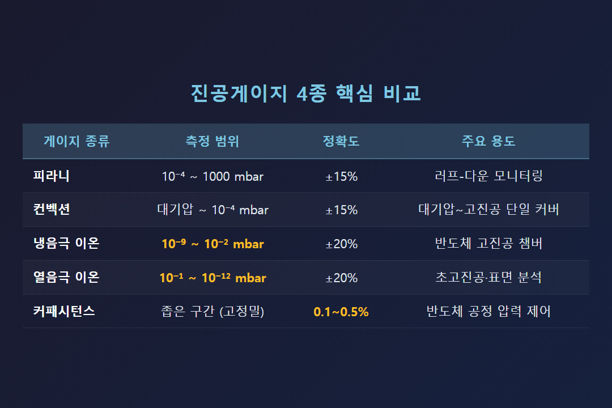
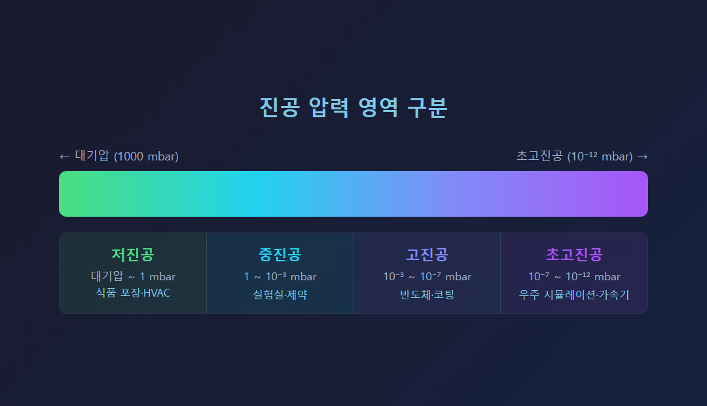
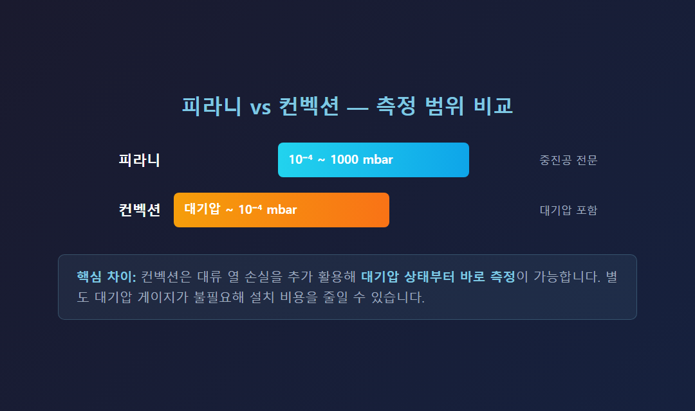
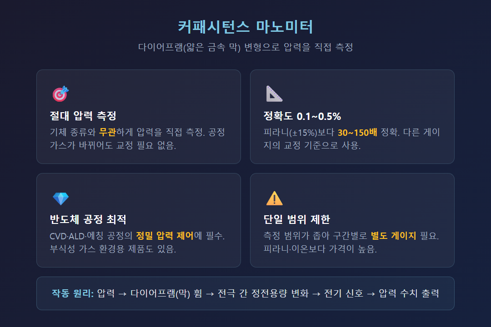
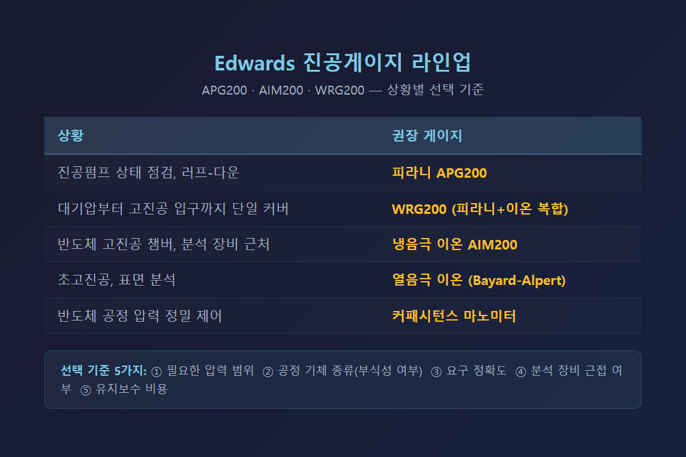

# 진공게이지 종류 완전 정리 — 피라니, 이온, 컨벡션 뭐가 다를까

진공게이지는 종류가 여러 가지인데, 현장에서 잘못 선택하면 엉뚱한 수치만 보다가 공정을 망칩니다. 피라니, 이온, 컨벡션, 커패시턴스 마노미터 — 이 네 가지가 각각 어떤 원리로 작동하고, 어느 상황에 맞는지 정확히 정리했습니다.

---

---

## 진공게이지가 왜 필요한가

진공펌프는 챔버 안의 공기를 빼내는 장비지만, 지금 진공도가 어느 수준인지는 알 수 없습니다. 게이지 없이는 공정 조건을 맞출 수 없고, 펌프에 이상이 생겨도 감지가 안 됩니다. 진공게이지는 공정 압력 모니터링, 펌프 상태 진단, 공정 재현성 확보를 위한 필수 측정 수단입니다.

진공 영역은 크게 네 단계로 나뉩니다:

| 영역 | 압력 범위 | 대표 용도 |
|---|---|---|
| 저진공 | 대기압 ~ 1 mbar | 식품 포장, HVAC |
| 중진공 | 1 ~ 10⁻³ mbar | 실험실, 제약 |
| 고진공 | 10⁻³ ~ 10⁻⁷ mbar | 반도체, 코팅 |
| 초고진공 | 10⁻⁷ ~ 10⁻¹² mbar | 우주 시뮬레이션, 가속기 |

어떤 압력 구간을 다루느냐에 따라 쓸 수 있는 게이지가 달라집니다.

---

---

## 피라니 게이지 — 중저진공의 표준

피라니 게이지는 가열된 필라멘트에서 기체로 빠져나가는 열량을 이용합니다. 압력이 낮아지면 기체 분자가 줄어 열 손실이 감소하고, 이 변화를 전기 신호로 변환해 압력을 읽습니다.

**측정 범위**: 약 10⁻⁴ ~ 1000 mbar
**정확도**: ±15% 수준 (100 mbar 미만 구간)

장점은 구조가 단순하고 내구성이 좋다는 것입니다. 응답 속도도 빠르고 연속 모니터링에 적합해 진공펌프 러프-다운(대기압에서 진공 진입 구간) 모니터링에 가장 많이 씁니다.

단점은 기체 종류에 따라 열전도율이 달라서, 공정 가스 조성이 바뀌면 오차가 생긴다는 점입니다. 10⁻⁴ mbar 이하 고진공에서는 사용이 불가합니다.

Edwards APG200은 대기압 ~ 5×10⁻⁴ mbar까지 커버하는 피라니 게이지입니다. 0~10V DC 아날로그 출력, TIC·ADC·TAG 컨트롤러와 호환됩니다.

---

## 컨벡션 게이지 — 피라니의 측정 범위를 넓히다

컨벡션 게이지는 피라니의 변형입니다. 기본 열전도 원리에 **대류 열 손실**을 추가로 활용해, 대기압 근처까지 측정 범위를 확장했습니다. 피라니만으로는 측정이 어려운 고압 구간을 커버하는 것이 핵심입니다.

**측정 범위**: 대기압(~1000 mbar) ~ 10⁻⁴ mbar 수준

가장 큰 장점은 벤트(대기압 개방) 상태부터 공정 진입까지 전 구간을 단 하나의 게이지로 모니터링할 수 있다는 것입니다. 별도 대기압 게이지가 필요 없어 설치 비용을 줄일 수 있습니다.

다만 기체 종류 의존성은 피라니와 동일하게 남아 있고, 정확도도 피라니 수준입니다.

---

---

## 이온 게이지 — 고진공·초고진공의 필수 수단

피라니나 컨벡션으로는 측정이 불가능한 고진공 영역(10⁻³ mbar 이하)에서는 이온 게이지를 사용합니다. 기체 분자를 이온화해 발생하는 이온 전류가 압력에 비례한다는 원리입니다.

### 냉음극 이온 게이지 (Cold Cathode)
필라멘트 없이 고전압 방전으로 전자를 생성하고, 자기장으로 전자 경로를 연장해 이온화 효율을 높입니다.

**Edwards AIM200 측정 범위**: 1×10⁻⁹ ~ 1×10⁻² mbar

필라멘트가 없어 대기 노출로 인한 단선 위험이 없고, 교체 빈도가 낮아 유지비가 경제적입니다. 외부 자기장이 매우 작아 질량분석기, 전자빔 장비 등 민감한 분석 장비 근처에도 설치할 수 있습니다.

### 열음극 이온 게이지 (Hot Cathode)
가열된 필라멘트에서 전자를 방출해 기체 분자를 이온화합니다. Bayard-Alpert 방식이 대표적이며, **측정 범위는 10⁻¹ ~ 10⁻¹² mbar**로 가장 넓습니다. 단, 필라멘트가 대기에 노출되면 즉시 끊어지므로 취급에 주의가 필요하고 정기적인 교체가 필요합니다.

---

## 커패시턴스 마노미터 — 기체 독립·고정밀 측정

얇은 금속 다이어프램에 압력이 가해지면 막이 휘고, 막과 기준 전극 사이의 정전용량 변화를 전기 신호로 변환해 압력을 직접 측정합니다. 기체 종류와 무관한 **절대 압력 측정**이 핵심입니다.

- 정확도: **0.1 ~ 0.5%** (피라니 ±15%와 비교해 30~150배 정확)
- 반도체 CVD/ALD/에칭 공정의 공정 압력 정밀 제어에 최적
- 부식성 가스 환경용 제품도 있어 반도체 공정에 폭넓게 사용
- 다른 게이지의 교정 기준(기준기)으로 활용될 만큼 신뢰도가 높음

단, 단일 게이지로 커버 가능한 범위가 좁아 구간별로 게이지를 갖춰야 하고, 가격이 피라니·이온 게이지보다 높습니다.

---

---

## 어떤 상황에 어떤 게이지를 써야 하나

| 상황 | 권장 게이지 |
|---|---|
| 진공펌프 상태 점검, 러프-다운 | 피라니 (APG200) |
| 대기압부터 고진공 입구까지 단일 커버 | WRG200 (피라니+이온 복합, 1×10⁻⁹~1000 mbar) |
| 반도체 고진공 챔버, 분석 장비 근처 | 냉음극 이온 (AIM200, 1×10⁻⁹~1×10⁻² mbar) |
| 초고진공, 표면 분석 | 열음극 이온 게이지 (Bayard-Alpert) |
| 반도체 공정 압력 정밀 제어 | 커패시턴스 마노미터 |

게이지 선택은 크게 다섯 가지 기준으로 결정됩니다. ① 필요한 압력 범위 ② 공정 기체 종류(부식성 여부) ③ 요구 정확도 ④ 분석 장비 근접 설치 여부 ⑤ 유지보수 빈도 및 비용.

---

---

진공게이지 선택이 헷갈리거나, 현재 시스템에 맞는 게이지를 확인하고 싶다면 스마텍 기술팀에 문의해 주세요. Edwards 공식 대리점으로 사양 검토부터 납품까지 도움드립니다.

---

Tel : 031 204 7170
info@smartechvacuum.com
www.smartechvacuum.com

---

#진공게이지 #피라니게이지 #이온게이지 #컨벡션게이지 #커패시턴스마노미터 #Edwards게이지 #APG200 #AIM200 #WRG200 #진공측정 #반도체진공 #진공펌프
