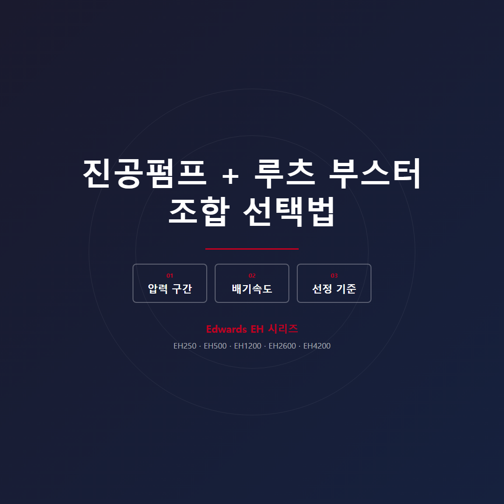

# 진공 시스템 성능을 배기속도 기준으로 판단하는 법: 루츠 부스터 조합 선택 가이드

드라이펌프 단독으로는 배기 시간이 너무 길고, 루츠 부스터를 추가하자니 비용과 관리 부담이 걱정되시나요? 압력 구간과 처리량 요건 두 가지를 기준으로 판단하면 선택이 명확해집니다. 루츠 부스터는 0.001~100 mbar 구간에서 드라이펌프의 배기속도 한계를 2~8배 끌어올려주는 장치입니다. 단독으로는 진공을 만들지 못하며, 반드시 배후 드라이펌프와 조합해 사용합니다.

## 부스터 조합이 필요한 경우는?

아래 조건 중 하나라도 해당되면 조합을 검토하십시오.

- 챔버 용적이 크거나 여러 챔버를 빠른 사이클로 반복 펌핑해야 할 때
- 10 mbar 이하 진공이 필요하면서 높은 처리량(throughput)이 동시에 요구될 때
- 코팅, 밸브 테스트, 반도체 공정 등 빠른 사이클 타임이 경쟁력을 좌우할 때

반대로 소량 사용이고 극한 진공이 불필요하거나, 챔버 용량 자체가 작은 분석 장비라면 드라이펌프 단독으로도 충분합니다.

## Edwards EH 부스터 모델 선택 기준

배후 펌프 배기속도의 2~8배 수준으로 EH 모델을 선정합니다.

| 모델 | 배기속도 | 냉각 |
|------|----------|------|
| EH250 | 310 m³/h | 공냉 |
| EH500 | 505 m³/h | 공냉 |
| EH1200 | 1,195 m³/h | 수냉 |
| EH2600 | 2,590 m³/h | 수냉 |
| EH4200 | 4,140 m³/h | 수냉 |

GXS250(250 m³/h)을 배후 펌프로 사용하는 현장에서는 EH2600(2,590 m³/h)을 조합한 사례가 많습니다. EH1200 이상 대형 모델은 수냉이 필수입니다. EH1200·EH2600·EH4200은 유체커플링(Hydrokinetic drive) 보호를 위해 질소(N₂) 퍼지를 0.3~0.5 bar로 상시 공급해야 합니다.

## 운전 시 반드시 지켜야 할 2가지

첫째, 기동 순서입니다. 배후 펌프를 먼저 가동해 시스템 압력을 낮춘 뒤 부스터를 기동하십시오. 대기압 상태에서 부스터를 바로 켜면 모터 과부하로 손상됩니다.

둘째, 오일 관리입니다. 기어박스·베어링용 오일(Ultragrade 20)은 적정 레벨을 유지해야 합니다. 오일 부족은 베어링·기어 손상, 오일 과다는 온도 상승으로 조기 고장을 유발합니다. 부식성 가스 환경에서는 FX형(PFPE) 오일 사양을 선택하십시오.

## 최적 조합이 확신이 안 설 때

챔버 용적, 목표 진공도, 처리 가스 종류, 운전 온도 조건을 스마텍에 알려주시면 현장 맞춤 구성을 검토해드립니다. Edwards 공식 대리점으로서 EH 부스터부터 GXS·EXS 드라이펌프까지 토탈 솔루션을 제공합니다.
