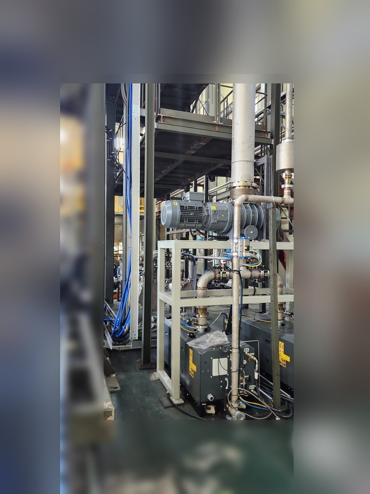
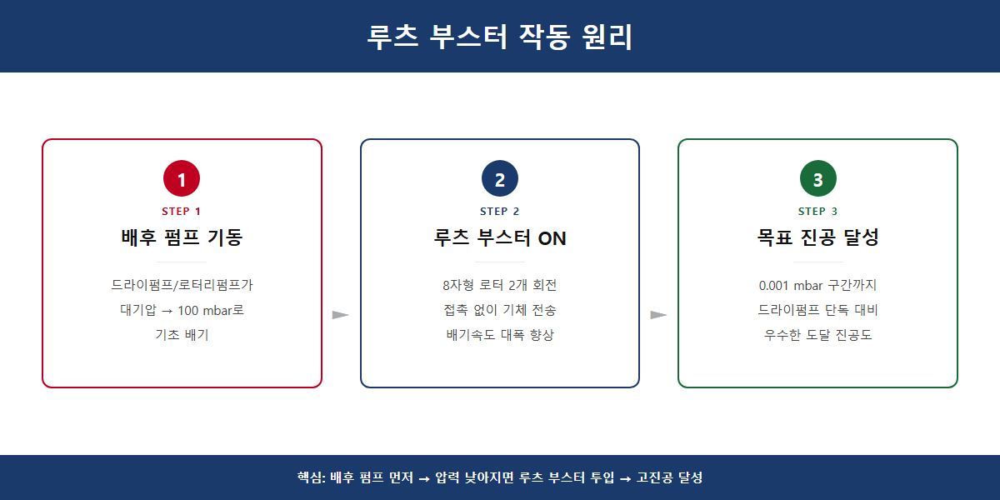
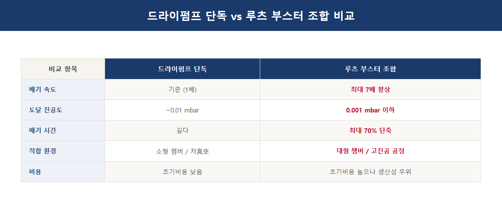
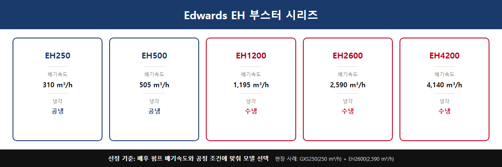
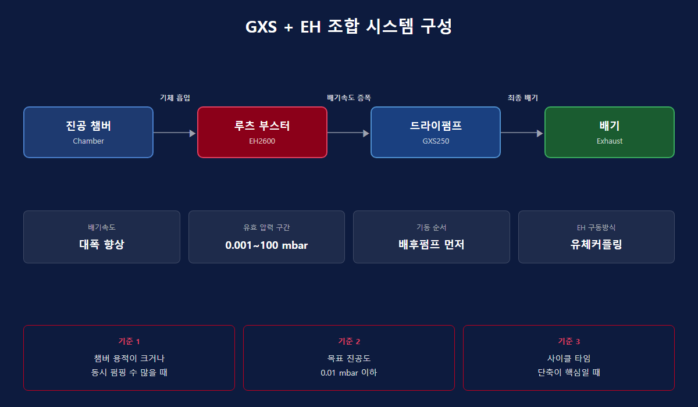

# 진공펌프 루츠 부스터 조합 선택법 3가지 핵심 기준

고객사에서 가장 자주 받는 질문 중 하나가 바로 이겁니다. "드라이펌프 하나로는 부족한데, 루츠 부스터를 붙여야 할까요?" 밸브 테스트 설비를 운영하는 V사에서 연락이 왔습니다. 밸브 4개를 동시에 펌핑해야 하는데 기존 펌프로는 사이클 타임이 너무 길다는 문제였습니다. 드라이펌프 단독으로 갈지, 루츠 부스터를 조합할지 — 이 판단 하나가 설비 효율을 크게 좌우합니다.

## 루츠 부스터가 뭔지 먼저 알아야 할까요?

루츠 부스터는 8자 모양의 회전체(로터) 2개가 반대 방향으로 맞물려 돌면서 기체를 밀어내는 펌프입니다. 로터끼리 직접 닿지 않는 구조라 오일 없이도 작동합니다. 단, 루츠 부스터 단독으로는 대기압에서 진공을 만들 수 없습니다. 반드시 드라이펌프나 로터리펌프 같은 배후 펌프(backing pump)가 먼저 압력을 낮춰줘야 합니다. 역할을 나누면 이렇습니다 — 배후 펌프가 기초 작업을 하면, 루츠 부스터가 배기속도를 2~8배 끌어올립니다.

## 어떤 압력 구간에서 효과가 있을까요?

루츠 부스터가 실력을 발휘하는 구간은 **0.001 mbar ~ 100 mbar** 사이입니다. 이 중간 진공 구간에서 드라이펌프 단독은 배기속도가 급격히 떨어지는데, 루츠 부스터가 이 약점을 보완합니다. 조합 시 배기속도는 최대 수배 향상되며, 중간 진공 구간에서 드라이펌프 단독 대비 도달 진공도도 함께 개선됩니다. 반면 100 mbar 이상 고압 구간에서는 로터가 과열될 위험이 있어 단독 기동은 금지입니다. 바이패스 밸브 또는 인버터 기동 방식이 필수입니다.

## 드라이펌프 단독과 조합, 무엇이 다른가요?

| 항목 | 드라이펌프 단독 | 드라이펌프 + 루츠 부스터 |
|------|----------------|--------------------------|
| 배기속도 | 기준(100%) | 약 2~8배 향상 |
| 도달 진공도 | 펌프 사양에 따름 | 중간 진공 구간에서 향상 |
| 초기 비용 | 낮음 | 높음 |
| 유지보수 | 단순 | 부스터 오일·기어 관리 추가 |
| 적합 용도 | 소~중형 챔버, 분석 장비 | 대용량 챔버, 반도체, 코팅, 밸브 테스트 |

V사 사례로 돌아가면, 밸브 4개 동시 펌핑이라는 조건에서는 대용량 드라이펌프 + 루츠 부스터 조합이 사이클 타임 단축에 훨씬 유리했습니다. 밸브별 1:1 구성도 검토했지만, 넓은 공간에 대용량 1대를 두고 4개를 동시에 처리하는 방식이 작업 효율 면에서 앞섰습니다.

## Edwards EH 시리즈, 어떻게 고르나요?

스마텍에서 취급하는 Edwards EH 부스터 시리즈는 산업 현장에서 검증된 기계식 부스터입니다. 모델별 배기속도는 다음과 같습니다.

| 모델 | 배기속도 | 냉각 방식 |
|------|----------|-----------|
| EH250 | 310 m³/h | 공냉 |
| EH500 | 505 m³/h | 공냉 |
| EH1200 | 1,195 m³/h | 수냉 |
| EH2600 | 2,590 m³/h | 수냉 |
| EH4200 | 4,140 m³/h | 수냉 |

선정 기준은 배후 펌프 배기속도의 **2~8배** 수준에서 EH 모델을 고르는 것입니다. 예를 들어 GXS250(250 m³/h)을 배후 펌프로 사용하는 현장에서는 EH2600(2,590 m³/h)을 조합한 사례가 있습니다. EH1200 이상 대형 모델은 수냉이 필수입니다. EH1200·EH2600·EH4200은 공정 가스 종류에 관계없이 유체커플링 보호를 위해 질소(N₂) 퍼지를 0.3~0.5 bar로 상시 공급해야 합니다.

## 기동 순서를 반드시 지켜야 하는 이유가 있을까요?

루츠 부스터는 반드시 배후 펌프를 먼저 기동해 시스템 압력을 충분히 낮춘 뒤에 작동시켜야 합니다. 대기압 상태에서 부스터를 바로 켜면 모터에 과부하가 걸려 손상될 수 있습니다. 오일 관리도 중요합니다 — 기어박스·베어링 윤활용 오일(Ultragrade 20)은 오일 레벨 부족 시 베어링과 기어가 손상되고, 오일이 너무 많으면 오일 온도가 올라가 조기 고장으로 이어집니다. 부식성 가스 환경에서는 HC형(탄화수소 오일) 대신 FX형(PFPE 오일) 사양을 선택해야 합니다.

조합 선택에서 막히는 부분이 있다면 현장 조건(챔버 용적, 목표 진공도, 가스 종류, 처리 온도)을 알려주시면 최적 구성을 검토해드립니다.

---
Tel : 031 204 7170
info@smartechvacuum.com
www.smartechvacuum.com

#진공펌프 #루츠부스터 #드라이펌프 #EH시리즈 #Edwards진공펌프 #산업용진공펌프 #진공펌프조합 #GXS펌프 #스마텍
