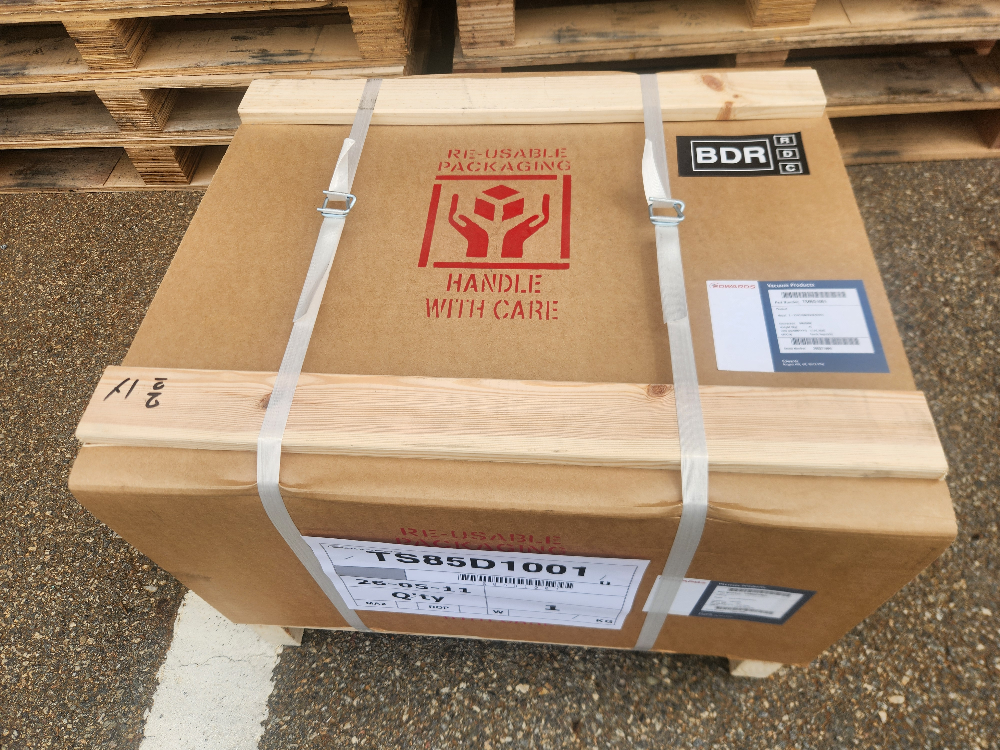
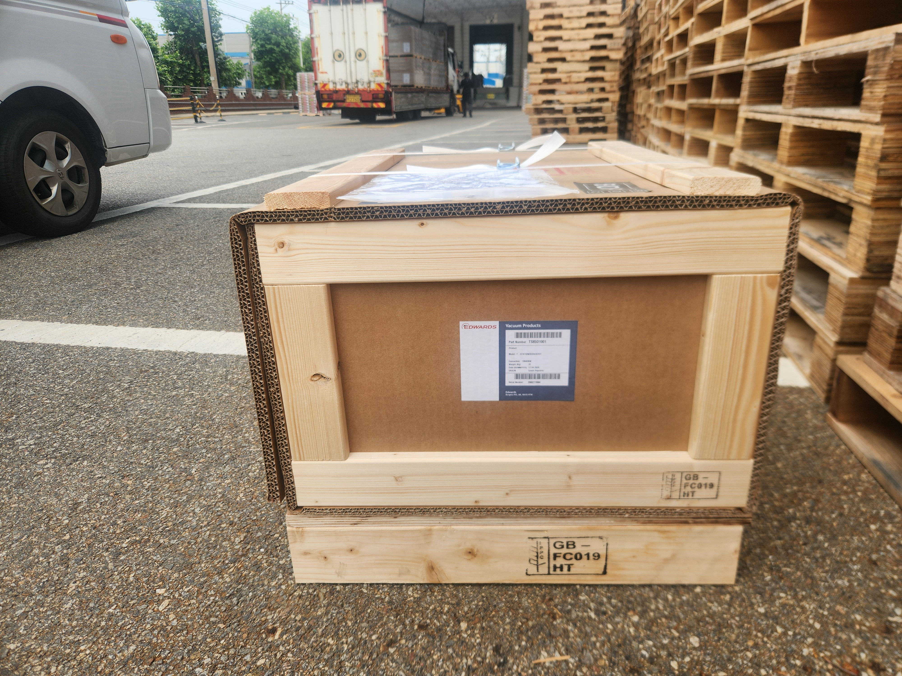

<!-- 수치검증: A항목 4개 확인 / B항목 0개 / 삭제 0개 / 교체 0개 -->

# 촉매 연구 분석장비에 Edwards T-Station 85D를 납품한 이유

촉매 연구소의 정밀 분석장비는 진공 시스템의 청정도에 민감합니다. XPS(X선 광전자 분광법), 질량분석기(MS), GC-MS 같은 표면분석 및 성분분석 장비들은 10⁻⁸ mbar 이하의 초고진공이 필요하고, 오일 한 방울이 시료 표면을 오염시키면 분석 데이터 전체의 신뢰도가 무너집니다.

2026년 6월 22일, 귀금속 촉매 성능·내구성 분석 공정에 Edwards T-Station 85D(TS85D1001)를 납품했습니다. 현장 설치와 진공도 테스트까지 완료한 사례입니다.

## T-Station 85D를 선택한 핵심 이유 — 오일 없는 건식 시스템

T-Station 85D는 nEXT85D 터보분자펌프와 XDD1 건식 다이어프램 백킹펌프를 하나로 통합한 콤팩트 진공 스테이션입니다.

백킹펌프로 XDD1 다이어프램 펌프를 채택한 것이 핵심입니다. 일반적인 오일 로터리 펌프는 오일 증기가 역류해 진공 라인을 오염시킬 가능성이 있습니다. 이를 막으려면 콜드트랩이나 오일 미스트 필터를 추가해야 하고, 그래도 완전한 차단이 어렵습니다.

XDD1 다이어프램 펌프는 오일을 전혀 사용하지 않기 때문에 역류 오염 경로 자체가 없습니다. 시료의 화학 조성이나 표면 상태에 영향을 주지 않아 촉매 분석 결과의 정확도를 높게 유지할 수 있습니다.

## T-Station 85D 주요 성능 수치

도달진공도는 5×10⁻¹⁰ mbar 미만으로, XPS·표면분석기·질량분석기가 요구하는 초고진공 영역을 충족합니다. N₂ 기준 펌핑속도는 NW40 입구에서 47 L/s이며, N₂ 압축비는 10¹¹ 이상입니다. XDD1 백킹펌프의 배기속도는 50Hz 기준 1.2 m³/h입니다. (✅ Edwards T-Station 85 Datasheet)

터보분자펌프와 건식 백킹펌프가 일체형으로 설계되어 있어 별도 배관 연결이나 오일 체크 없이 바로 운용할 수 있습니다.

## 연구실 환경에 맞는 설계

연구소에서 진공 장비는 성능만큼이나 설치 공간과 조작 편의성도 중요합니다.

T-Station 85D는 무게 17 kg의 소형 일체형 장비로 실험실 벤치 옆이나 장비 하단에 바로 설치할 수 있습니다. 통합 컨트롤러는 단일 버튼으로 터보펌프 시작·정지가 가능하고, 진공 게이지를 연결하면 목표 진공도 도달 후 자동으로 터보를 가동하는 딜레이 스타트 기능도 지원합니다. 소음은 56 dB(A) 이하로 연구실 환경에서 장시간 운용해도 부담이 없는 수준입니다.

입구 플랜지는 NW40, ISO63, CF63을 지원하므로 기존 분석장비의 플랜지 규격에 맞춰 연결이 가능합니다.

## 기존 E2M1.5 오일 로터리 펌프와의 병행 운용

해당 연구소에는 기존에 Edwards E2M1.5 소형 오일 로터리 베인 펌프도 운용 중이었습니다. E2M1.5는 별도 분석 장비의 1차 진공(러핑) 공급에 사용되고 있었으며, 이번 방문 시 현장 점검을 함께 진행해 정상 운전 상태를 확인했습니다.

오일 펌프와 건식 펌프를 같은 라인에 연결하는 것은 권장하지 않습니다. 장비별로 백킹 방식을 분리해 운용하는 것이 분석 신뢰도 측면에서 유리합니다. 장비 역할을 구분해 운용하는 방식이 효율적입니다.

## 분석장비용 터보 스테이션 선택 시 확인할 점

연구소에서 터보 진공 스테이션을 도입할 때 제품 사양 외에 실제로 확인해야 할 항목들이 있습니다.

**백킹펌프 방식 확인**: 오일 로터리 방식인지, 건식 다이어프램 방식인지 반드시 구분해야 합니다. 오일 방식은 초기 도달 압력이 조금 유리하지만 시료 오염 리스크가 있고, 주기적인 오일 교환이 필요합니다. 건식 방식은 유지보수가 단순하고 오염 걱정이 없습니다.

**입구 플랜지 규격**: 기존 분석장비의 입구 플랜지(KF/NW, ISO, CF)와 맞는지 확인해야 연결 비용을 줄일 수 있습니다. T-Station 85D는 NW40, ISO63, CF63 세 가지를 지원합니다.

**컨트롤러 기능**: 게이지 연동 여부, 딜레이 스타트(저압 달성 후 터보 가동) 지원 여부가 운용 편의성에 영향을 줍니다. 특히 시료를 교체할 때마다 벤팅과 재펌핑을 반복하는 경우에는 자동화 기능이 중요합니다. T-Station 85D는 이 기능을 기본으로 내장하고 있어 별도 컨트롤러 없이 바로 활용할 수 있습니다.

## 같은 고민을 가진 연구소라면

촉매·소재·화학·제약 분야 연구소에서 표면분석이나 질량분석 장비를 운용 중이라면, 백킹펌프의 오일 오염 문제가 데이터 품질에 직접 영향을 줄 수 있습니다. T-Station 85D처럼 건식 백킹 방식의 터보 스테이션은 이 문제를 구조적으로 해결합니다.

기존 장비 배관 연결 방식, 플랜지 규격 확인, 모델 선정, 기존 장비 점검 등 궁금한 점은 언제든 문의해 주십시오. 스마텍은 Edwards 코리아 공식 대리점으로, 연구소 진공 시스템 구성부터 기존 장비 정기 점검까지 함께 지원합니다.

---

Edwards T-Station 85D(TS85D1001)는 nEXT85D 터보분자펌프와 XDD1 건식 다이어프램 펌프의 일체형 진공 스테이션입니다. 도달진공도 5×10⁻¹⁰ mbar, 무게 17 kg. 연구소·분석장비 적용 및 기존 오일 펌프 점검·교체 상담 가능합니다.
