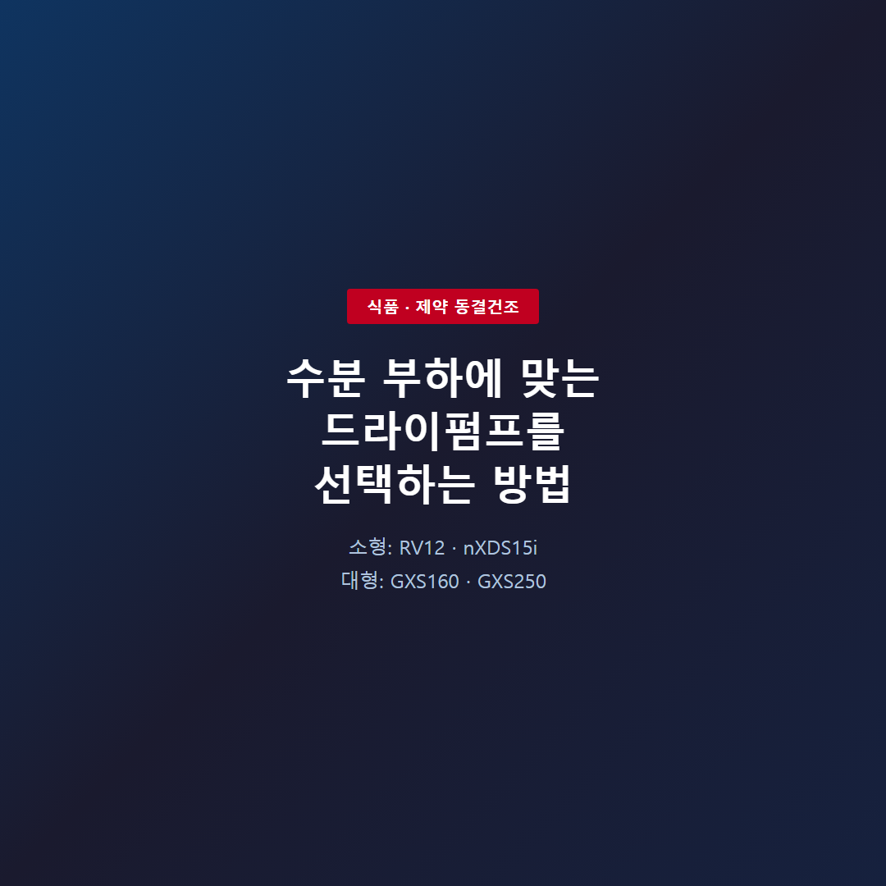

<!-- 수치검증: A항목 10개 확인 / B항목 0개 확인 / 삭제 0개 / 교체 0개 -->

# 동결건조 공정에서 수분 처리 조건에 맞는 드라이펌프 선택하기

동결건조(freeze drying)는 수분을 얼음 상태로 승화시키는 공정 특성상 1차 건조 구간에서 대량 수증기가 발생합니다. 진공펌프 선택 시 이 수분 부하를 어떻게 처리할지가 핵심입니다.

## 동결건조 공정의 진공 요구조건

동결건조는 세 단계로 나뉩니다. 1차 건조(승화 건조)에서는 처리물 수분의 대부분이 수증기로 발생하며 진공 시스템에 고부하가 걸립니다. 2차 건조(탈착 건조)에서는 0.01~0.1 mbar의 깊은 진공과 상온~40°C 온도가 필요합니다.

대부분의 동결건조기는 펌프 앞단에 콘덴서(cold trap)를 설치해 수증기를 포집합니다. 펌프는 콘덴서 통과 후 잔여 수분만 처리하지만, 이 잔여 수분의 처리 방식이 펌프 수명을 좌우합니다.

## 소형~파일럿 동결건조기 — RV 오일 로터리 또는 nXDS 드라이 스크롤

처리량 0.1~20 kg/배치 수준의 소형·파일럿 동결건조기에는 두 가지 선택지가 있습니다.

**RV 오일 로터리 펌프**
- 도달진공: 2×10⁻³ mbar — 2차 건조 구간 커버
- RV12: 가스발라스트 II 수증기 처리 290 g/h
- 가격 경쟁력 있음. 단, 오일 교환 및 가스발라스트 관리 필요.

**nXDS 드라이 스크롤 펌프 (오일프리)**

| 모델 | 배기속도 | 도달진공 |
|------|---------|---------|
| nXDS10i | 11.4 m³/h | 7×10⁻³ mbar |
| nXDS15i | 15.1 m³/h | 7×10⁻³ mbar |

수분 유입 시 오일 오염 없음. 유지보수 항목 단순.

## 산업용 대형 동결건조기 — GXS 드라이 스크류

처리량 20 kg/배치 이상, 연속 가동 라인에는 GXS 드라이 스크류 펌프가 적합합니다.

| 모델 | 배기속도 | 도달진공 |
|------|---------|---------|
| GXS160 | 160 m³/h | 7×10⁻³ mbar |
| GXS250 | 250 m³/h | 4×10⁻³ mbar |

오일프리 공정부와 수냉 방식으로 장시간 연속 가동에도 안정적입니다. 배기 속도 확장이 필요하면 GXS160+EH1200, GXS250+EH2600 조합을 검토할 수 있습니다.

## 오일 로터리 선택 시 수분 관리 핵심 3가지

1. 1차 건조 구간 내내 가스발라스트 개방 운전
2. 배치 종료 후 가스발라스트 상태로 20~30분 추가 운전 (잔류 수분 배출)
3. 100~200시간 운전마다 오일 상태 확인 — 유화(백탁) 발견 즉시 교환

동결건조기 모델과 배치 조건을 가지고 문의하시면 적합한 펌프 모델을 바로 안내드립니다.
