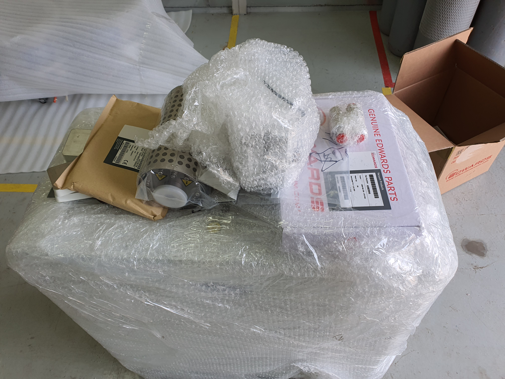

<!-- 수치검증: A항목 10개 확인 / B항목 0개 확인 / 삭제 0개 / 교체 0개 -->

# 동결건조 드라이펌프 선택법 — 수분 부하가 핵심입니다

동결건조기(Freeze Dryer)에 연결할 진공펌프를 고를 때 가장 중요한 조건이 있습니다. 수분 처리 능력입니다. 다른 진공 공정과 달리 동결건조에서는 처리물 무게의 60~80%에 달하는 수분이 수증기로 발생합니다. 이 수분이 펌프로 들어오는 양을 얼마나 줄이고, 들어온 양을 어떻게 처리하느냐가 펌프 수명과 직결됩니다.

## 동결건조 과정에서 진공펌프가 받는 부하는 얼마나 될까요?

동결건조는 세 단계로 진행됩니다. 재료를 동결하는 1단계 이후, 1차 건조 단계에서 얼음이 수증기로 직접 승화합니다. 이 구간에서 대량의 수증기가 발생하고, 진공 시스템 전체에 걸립니다.

대부분의 동결건조기는 콘덴서(cold trap)를 펌프 앞에 달아 수증기를 먼저 얼려 잡아둡니다. 하지만 콘덴서를 통과한 잔여 수분은 펌프가 처리해야 합니다. 2차 건조 단계에서는 잔류 결합수를 제거하기 위해 더 깊은 진공(0.01~0.1 mbar)이 필요합니다.

## RV 오일 로터리 펌프가 소형 동결건조기에서 쓰이는 이유

실제로 파일럿 규모 동결건조기에는 RV12 같은 오일 로터리 펌프가 많이 쓰입니다. 가격이 드라이펌프보다 저렴하고, 도달진공 2×10⁻³ mbar로 2차 건조 구간도 커버하기 때문입니다. (✅ 스마텍 product_master_table)

얼마 전 태영엘에스 담당자와 상담 시, 레콩코 동결건조기에 연결할 RV12 2대 구매 건이 있었습니다. 콘덴서가 수분을 먼저 포집하는 구조여서 펌프에 도달하는 수분 양이 제한적인 경우입니다. 가스발라스트 II 기능을 켜면 수증기 처리 능력이 290 g/h까지 올라갑니다. (✅ 스마텍 product_master_table)

단, 오일 로터리를 쓰면 오일 관리가 따릅니다. 1차 건조 구간 내내 가스발라스트를 열어두고, 배치가 끝나면 오일 상태를 확인하는 루틴이 필요합니다. 오일이 뿌옇게 유화되면 바로 교환해야 합니다.

## 드라이 스크롤 펌프(nXDS)는 어떤 동결건조기에 맞나요?

랩 스케일 동결건조기(처리량 0.1~2 kg/배치)에는 nXDS 시리즈가 잘 맞습니다. 오일프리 구조여서 수분이 들어와도 오일 오염이 없고, 유지보수도 간단합니다.

- nXDS10i: 배기속도 11.4 m³/h, 도달진공 7×10⁻³ mbar (✅ 스마텍 product_master_table)
- nXDS15i: 배기속도 15.1 m³/h, 도달진공 7×10⁻³ mbar (✅ 스마텍 product_master_table)

2차 건조 구간의 깊은 진공도 충분히 커버합니다. 실험실 연구용 동결건조기부터 식품 소배치 생산 라인까지 적합한 범위입니다.

## 산업용 대형 동결건조라면 드라이 스크류를 검토하세요

처리량이 20 kg/배치 이상이거나 24시간 연속 가동이 필요한 산업 라인에서는 GXS 드라이 스크류 펌프가 더 안정적입니다.

- GXS160: 배기속도 160 m³/h, 도달진공 7×10⁻³ mbar (✅ 스마텍 product_master_table)
- GXS250: 배기속도 250 m³/h, 도달진공 4×10⁻³ mbar (✅ 스마텍 product_master_table)

오일프리 공정부여서 수분 부하에도 오일 오염이 없고, 수냉 방식으로 연속 가동에도 열 관리가 됩니다. 질소 퍼지를 유지하면 수증기가 내부에서 응결되지 않습니다.

제약 동결건조 대형 라인에서는 배기 속도를 높이기 위해 EH 루츠 부스터를 추가하는 경우도 있습니다. GXS160+EH1200 또는 GXS250+EH2600 조합이 현장에서 확인된 구성입니다. (✅ 스마텍 현장 확인 조합표)

동결건조기 사양과 배치 조건을 가지고 문의하시면 최적 조합을 안내드립니다.

---

Tel : 031 204 7170
info@smartechvacuum.com
www.smartechvacuum.com

---

#동결건조 #동결건조기 #드라이펌프 #진공펌프선택 #RV12 #nXDS #GXS펌프 #식품동결건조 #제약동결건조 #Edwards진공펌프
