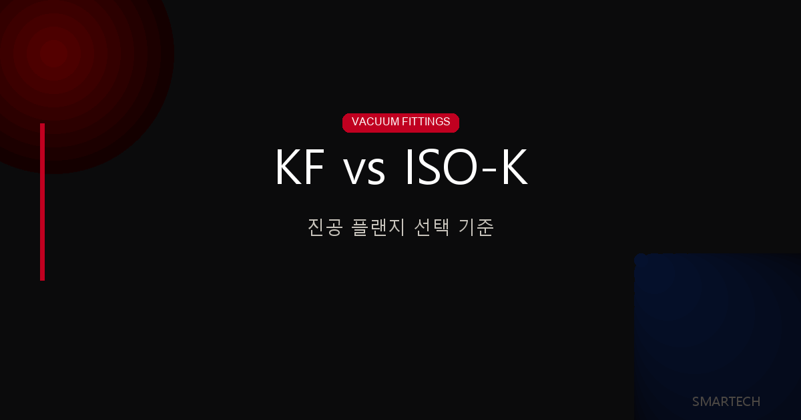
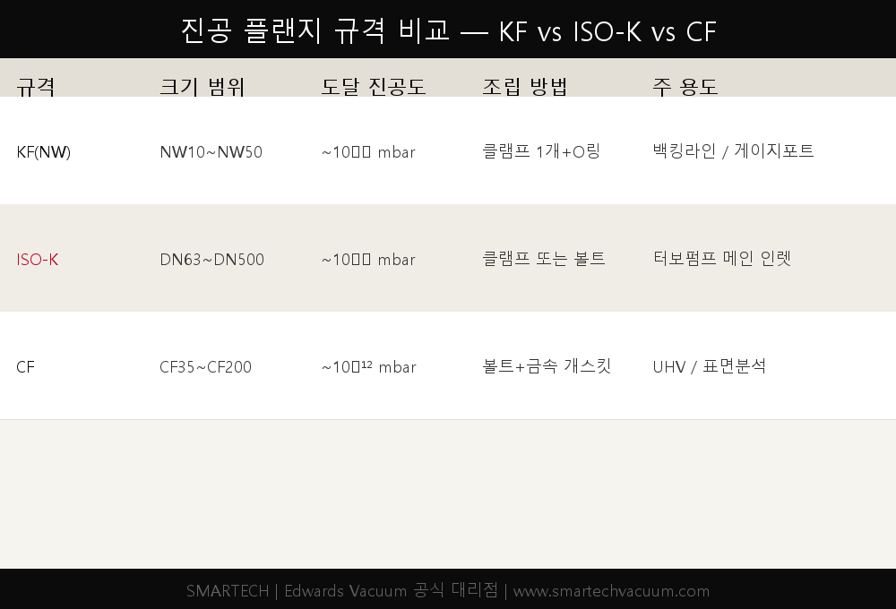
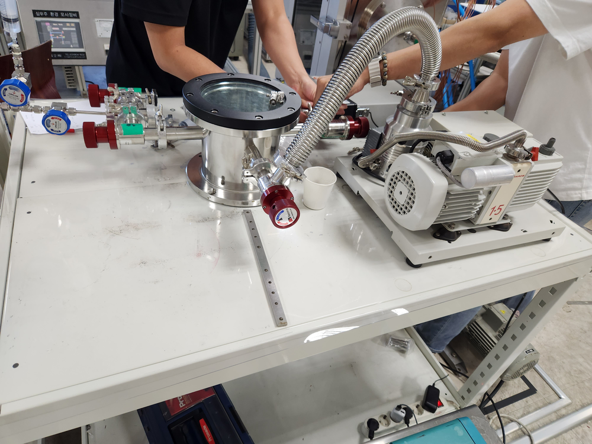
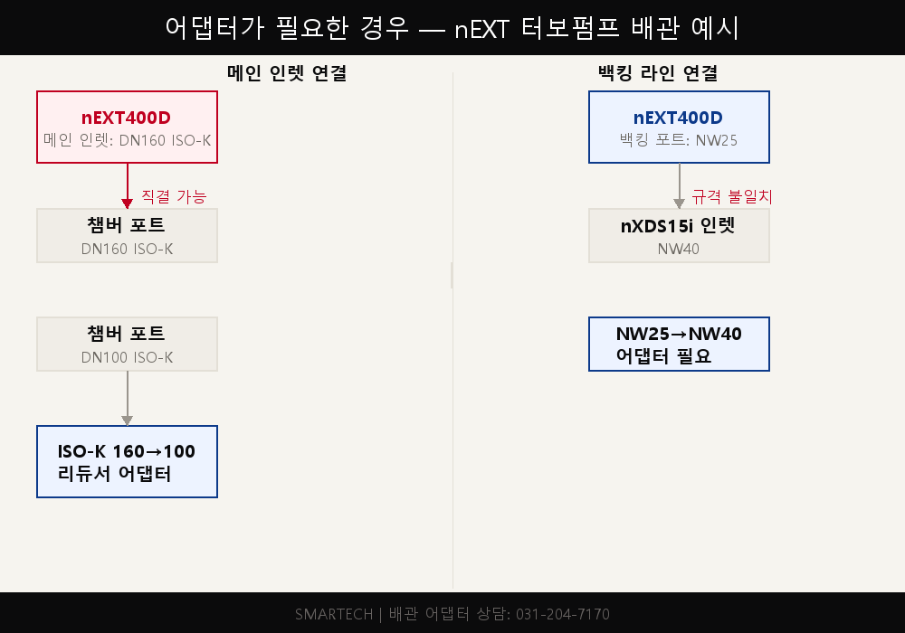

<!-- 수치검증: A항목 8개 확인 / B항목 2개 확인 / 삭제 0개 / 교체 0개 -->

# 연구용 진공 배관 피팅 선택 완벽 정리 — KF vs ISO-K 플랜지

연구실에서 진공 배관을 연결할 때 "이 플랜지가 맞는 건지" 확인하다 시간을 허비한 경험이 있을 것입니다. KF, ISO-K, CF — 이름도 다르고 규격도 달라 처음에는 혼란스럽습니다. 이 글에서는 연구용 진공 시스템에서 자주 쓰이는 세 가지 플랜지 규격의 차이를 정리하고, 어댑터가 필요한 상황에서의 선택 기준을 설명합니다.

---

## 세 가지 플랜지 한 줄 요약

진공 배관 피팅은 세 가지 기준으로 나뉩니다. **어디에 연결하느냐(크기)**, **얼마나 깊은 진공이 필요하느냐(진공 등급)**, **얼마나 자주 분리하느냐(조립 방식)** — 이 세 가지를 먼저 정하면 플랜지 규격이 자연스럽게 결정됩니다.

| 규격 | 별칭 | 크기 범위 | 도달 진공도 | 조립 방법 |
|------|------|----------|-----------|---------|
| KF(NW) | QF, Klein Flange | NW10~NW50 | ~10⁻⁸ mbar | 클램프 1개 + O링 |
| ISO-K | DN63~DN500 | DN63~DN500 | ~10⁻⁹ mbar | 클램프 또는 볼트 |
| CF | ConFlat | CF35~CF200 | ~10⁻¹² mbar | 볼트 + 금속 개스킷 |

---

## KF(NW) 플랜지 — 연구실의 기본 규격

KF 플랜지는 Quick Flange(빠른 플랜지)의 줄임말입니다. 별칭으로 NW(Nominal Width, 공칭 내경)나 QF로도 표기합니다. 모두 같은 규격입니다.

사용 규격은 **NW10, NW16, NW25, NW40, NW50** 다섯 가지입니다. 숫자는 플랜지 내경(mm)을 의미합니다. 조립은 O링이 들어간 센터링 링(Centering Ring)을 두 플랜지 사이에 끼우고, 클램프 한 개로 체결합니다. 공구 없이 손으로 조립·분리가 가능합니다.

**KF를 쓰는 대표적인 경우:**
- 로터리 펌프(RV 계열), 드라이 스크롤 펌프(nXDS 계열) 배출구 연결
- 소형 터보펌프(nEXT85 등)의 백킹 라인(NW16~NW25 포트)
- 로터리 펌프와 터보펌프 사이 배관
- 게이지 포트(피라니, 이온 게이지) 연결

**주의할 점:** KF는 NW50이 최대입니다. DN63 이상이 필요한 구간에는 KF를 쓸 수 없습니다. 터보펌프 메인 인렛(DN100 이상)에는 ISO-K나 CF를 써야 합니다.

---

## ISO-K 플랜지 — 터보펌프 인렛 표준

ISO-K는 국제표준화기구(ISO) 규격의 진공 클램프 플랜지입니다. DN63부터 DN500까지 있으며, 연구용 시스템에서 자주 쓰이는 규격은 **DN63, DN100, DN160, DN200**입니다.

DN160 ISO-K 기준으로 실제 외경은 약 202mm, 볼트 구멍 피치원 지름(PCD)은 약 180mm입니다. 위 사진처럼 자로 직접 실측하면 DN(공칭 내경)이 아닌 외경을 확인할 수 있어 오주문을 방지할 수 있습니다.

소형(DN63~DN160)은 클램프 방식, 대형(DN200 이상)은 볼트 방식(ISO-F 타입이라고도 부름)이 일반적입니다. 클램프 방식은 KF처럼 빠른 분리가 가능하고, 볼트 방식은 진동 환경이나 대형 시스템에서 더 안정적입니다.

**Edwards nEXT 터보펌프의 ISO-K 인렛 규격:**

| 모델 | 메인 인렛 | 백킹 포트 |
|------|---------|---------|
| nEXT85 | DN63 ISO-K 또는 DN100 ISO-K | NW16 |
| nEXT240 / nEXT300 | DN100 ISO-K | NW25 |
| nEXT400D | **DN160 ISO-K** | NW25 |
| nEXT730D | DN160 ISO-K | NW25 |
| nEXT930D | DN200 ISO-K | NW25 |

nEXT400D를 예로 들면, 메인 인렛은 DN160 ISO-K이고 백킹 포트는 NW25입니다. 기존 배관이 KF 계열로 구성된 연구실에서 nEXT400D를 도입하면 메인 인렛 쪽에 KF → ISO-K 어댑터가 필요합니다. 백킹 라인은 NW25이므로 기존 KF25 배관을 그대로 연결할 수 있습니다.

---

## CF 플랜지 — 초고진공(UHV)이 필요할 때

CF(ConFlat) 플랜지는 초고진공(UHV, 10⁻¹⁰ mbar 이하) 용도에 사용합니다. 나이프 엣지(Knife Edge) 구조의 스테인리스 플랜지가 알루미늄 또는 구리 가스켓을 파고들어 금속 대 금속 씰을 형성합니다.

O링이 없기 때문에 10⁻¹² mbar 수준의 초고진공과 250℃ 이상의 베이킹(가열)이 가능합니다. 단, 개스킷은 재사용이 어렵고, 볼트를 대각 교차 패턴으로 균일하게 조여야 해서 분리·재조립 작업이 KF·ISO-K보다 번거롭습니다.

표면분석(XPS, AES, LEED), 이온빔 시스템, 가속기 빔라인, 질량분석기 메인 챔버가 대표적인 CF 적용 사례입니다.

---

## 어댑터가 필요할 때 — 규격 혼용 배관 연결

연구실에서는 기존 배관 규격과 새로 도입한 장비 규격이 달라 어댑터가 필요한 경우가 자주 생깁니다.

**자주 쓰이는 어댑터 조합:**

| 상황 | 어댑터 |
|------|-------|
| KF40 배관 → ISO-K63 포트 연결 | KF40-ISO-K63 어댑터 플랜지 |
| nEXT400D(DN160) → DN100 챔버 포트 | ISO-K160 → ISO-K100 리듀서 |
| nEXT400D 백킹(NW25) → 기존 KF40 배관 | NW25 → NW40 어댑터 |
| nXDS15i 배출구(NW40) → KF25 배관 | NW40 → NW25 리듀서 |

어댑터 선택 시 반드시 확인할 사항:
1. **양쪽 플랜지 규격** — KF는 NW 숫자, ISO-K는 DN 숫자로 확인
2. **센터링 링 포함 여부** — 어댑터 단품만 사는 경우 센터링 링이 별도인 경우가 있음
3. **재질** — 일반 대기 포트는 Al 가능, 부식성 가스 환경은 SUS316L 권장

---

## 플랜지 실측 시 확인해야 할 3가지

현장에서 기존 플랜지 규격이 불확실할 때는 직접 측정해서 확인하는 것이 가장 정확합니다.

1. **내경(Bore) 측정**: 플랜지 중앙 구멍의 지름 → NW 숫자(KF) 또는 DN 숫자(ISO-K)와 일치 여부 확인
2. **외경(OD) 측정**: KF25=40mm, KF40=55mm, KF50=75mm / ISO-K63=114mm, ISO-K100=152mm, ISO-K160=202mm
3. **볼트홀 패턴**: KF는 볼트홀 없음(클램프만), ISO-K는 외경 원주상에 볼트홀 배치, CF는 내경 안쪽에 볼트홀

규격이 확인되면 센터링 링도 함께 준비합니다. 예를 들어 KF40 클램프 연결에는 KF40 센터링 링 1개, ISO-K160 클램프 연결에는 DN160 센터링 링 1개가 필요합니다.

---

## 스마텍 배관 부품 지원

스마텍은 Edwards Vacuum 공식 대리점으로, 진공 배관 피팅·어댑터·센터링 링·클램프를 국내 재고로 공급합니다. nEXT 터보펌프 도입 시 기존 배관 규격을 알려주시면 필요한 어댑터 구성을 함께 제안해 드립니다.

배관 구성 상담, 어댑터 규격 선정, 센터링 링·클램프 개별 구매는 스마텍에 문의해 주세요.

---

KF·ISO-K·CF 플랜지 규격 확인, 어댑터 선정, Edwards 진공 부품 구매 상담은 스마텍에서 제공합니다.

문의: 031-204-7170 / www.smartechvacuum.com
