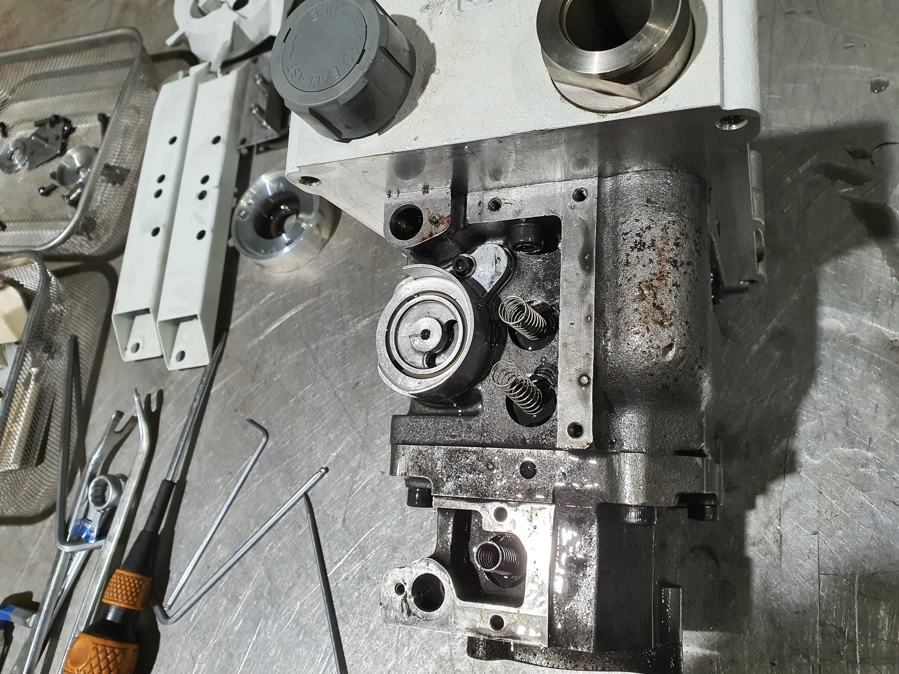
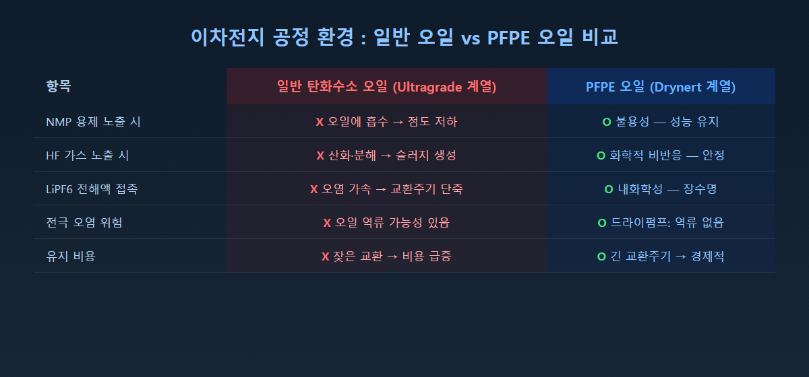

<!-- 수치검증: A항목 6개 확인 / B항목 0개 확인 / 삭제 0개 / 교체 0개 -->

# 이차전지 공장 진공펌프에 PFPE 오일이 필요한 3가지 이유

배터리 공장을 운영하다 보면 진공펌프 오일 때문에 곤란해지는 경우가 생깁니다. 오일을 갈아도 금세 까매지고, 도달 진공도는 자꾸 떨어지고, 심한 경우 펌프 내부가 끈적한 슬러지로 막혀버리는 상황입니다. 이 문제의 원인은 대부분 하나입니다. **NMP 용제와 전해액이 일반 탄화수소 오일을 빠르게 망가뜨리기 때문입니다.**

이차전지 제조 공정에는 PFPE 오일을 사용하는 진공펌프가 필요합니다. 왜 그런지, 공정 단계별로 구체적으로 설명드리겠습니다.

---

## 이차전지 공정에는 어떤 단계에서 진공이 필요할까요?

배터리 하나를 만들기 위해 진공 기술이 투입되는 단계는 생각보다 많습니다.

**① 전극 건조 (Electrode Drying)**
양극재·음극재 슬러리에는 NMP(N-메틸-2-피롤리돈)라는 유기 용제가 들어갑니다. 전극을 코팅한 뒤 이 NMP를 완전히 제거해야 배터리 성능이 나옵니다. 진공 건조를 통해 수분을 40ppm 이하까지 낮추는 작업인데, 이 과정에서 NMP 증기가 대량으로 발생합니다.

**② 전해액 주입 및 디개싱 (Electrolyte Filling & Degassing)**
LiPF6(리튬헥사플루오로포스페이트) 기반 전해액을 셀 안에 균일하게 채우려면 진공이 필요합니다. 주입 후에는 기포를 완전히 제거하는 디개싱 공정까지 진행합니다. 전해액 디개싱 공정의 요구 진공도는 **0.1 mbar 이하**입니다. (✅ Edwards GXS Application Note)

**③ 셀 봉합 및 화성 (Sealing & Formation)**
파우치 셀을 밀봉하고 초기 충방전(화성) 과정에서 발생하는 CO₂, H₂, 소량의 HF 가스를 처리해야 합니다.

---

## NMP 용제가 일반 오일을 망가뜨리는 이유

NMP는 매우 강력한 유기 용제입니다. 플라스틱도 녹일 정도로 용해력이 강한 물질인데, 이런 NMP 증기가 진공펌프 안으로 유입되면 어떻게 될까요?

일반 탄화수소 오일(Ultragrade 계열 포함)은 NMP에 서서히 녹아 들어갑니다. 오일 점도가 떨어지고, 밀봉력이 약해지면서 도달 진공도가 나빠집니다. 더 심해지면 NMP와 오일이 뒤섞여 끈적한 덩어리가 펌프 내부에 쌓입니다.

**PFPE(퍼플루오로폴리에테르) 오일은 다릅니다.** PFPE는 탄소와 불소만으로 이루어진 합성 오일로, 화학적 불활성이 매우 높습니다. NMP 같은 유기 용제와 섞이지 않습니다. 오일이 NMP를 흡수하지 않으니 점도도, 밀봉력도 그대로 유지됩니다.

유해한 공정 조건이 일반 탄화수소 펌프 오일을 빠르게 파괴하는 응용 분야에서 PFPE 오일을 사용합니다. (✅ edwardsvacuum.com — Vacuum pump oil and fluids)

---

## 전해액의 HF가 오일을 부식시킵니다

이차전지 전해액에 들어있는 LiPF6는 수분을 만나면 불화수소(HF)를 만들어냅니다. 공정 중 미량의 수분이 유입될 때마다 조금씩 HF가 발생합니다. HF는 강한 부식성 가스로, 일반 탄화수소 오일과 만나면 오일을 산화·분해시킵니다.

**PFPE 오일은 HF에 반응하지 않습니다.** 불소화합물로 이루어진 PFPE는 구조적으로 불소 계열 가스와 반응하지 않습니다. 불소(F₂), 삼불화질소(NF₃) 같은 반응성 가스를 펌핑하는 환경에서 PFPE 오일이 적합한 이유입니다. (✅ edwardsvacuum.com — Vacuum pump oil and fluids)

---

## GXS 드라이펌프가 이차전지 공정의 표준이 된 이유

Edwards의 GXS 산업용 드라이 스크류 펌프는 이차전지 제조의 거의 모든 진공 공정에 적용됩니다. (✅ Edwards — Lithium-Ion Battery Manufacturing 공식 자료)

GXS의 핵심 구조 특징은 다음과 같습니다.

| 특징 | 내용 |
|------|------|
| 윤활유 | **PFPE Drynert® 25/6** (전 모델 동일) |
| 샤프트 씰 퍼지 | 기어박스가 공정 가스와 완전 격리 |
| 도달진공도 | GXS250 단독: 4×10⁻³ mbar / GXS250/2600 조합: 5×10⁻⁴ mbar |
| 오일 역류 | 없음 (드라이 방식) — 전극 오염 위험 제로 |

(✅ Edwards GXS 브로슈어 Technical Data)

중요한 점은 GXS의 기어박스 윤활유 자체가 PFPE라는 것입니다. 공정 가스 경로에 오일이 없는 드라이 방식인 데다, 기어박스를 보호하는 오일도 PFPE로 되어 있습니다. 부식성 가스가 씰을 통해 미량 침투하더라도 PFPE 오일은 열화되지 않습니다.

GXS의 재질 자체도 전해액 성분인 DME(다이메톡시에탄), Dioxolane, LiPF6에 내화학성을 갖도록 설계되었습니다. (✅ Edwards GXS Application Note)

---

## 오일식 펌프를 이차전지 공정에 쓰면 어떻게 되나요?

E2M이나 RV 같은 오일식 로터리베인 펌프를 배터리 공정에 그대로 사용하면 다음과 같은 문제가 발생합니다.

- NMP 증기 → 오일 흡수 → 점도 저하 → 도달 진공도 악화
- HF 발생 → 오일 산화·분해 → 슬러지 생성 → 펌프 손상
- 오일 역류 가능성 → 배터리 전극 오염 → 수율 저하
- 교환 주기 대폭 단축 → 생산 중단 빈도 증가

이차전지 공장에서는 오일식 펌프라도 PFPE 오일로 교체한 전용 사양을 사용하거나, 처음부터 드라이펌프 채택을 검토하는 것이 일반적입니다.

---

## 마무리

배터리 공장의 진공펌프 오일 문제는 단순한 소모품 관리가 아닙니다. NMP, 전해액, HF라는 화학 환경을 이해하고, 그에 맞는 PFPE 오일 또는 드라이펌프 체계를 선택하는 것이 생산 안정성과 직결됩니다.

진공펌프 오일 선택이나 이차전지 공정용 진공 솔루션에 대해 궁금하신 점이 있으시면 스마텍으로 문의해 주십시오. Edwards 코리아 공식 대리점으로서 30년 이상의 현장 경험을 바탕으로 최적의 솔루션을 안내해 드립니다.

---

Tel : 031 204 7170
info@smartechvacuum.com
www.smartechvacuum.com

---

#이차전지진공펌프 #PFPE오일 #진공펌프오일 #배터리공장진공 #Edwards진공펌프 #NMP용제진공 #전해액주입진공 #GXS드라이펌프 #리튬이온배터리공정 #스마텍
