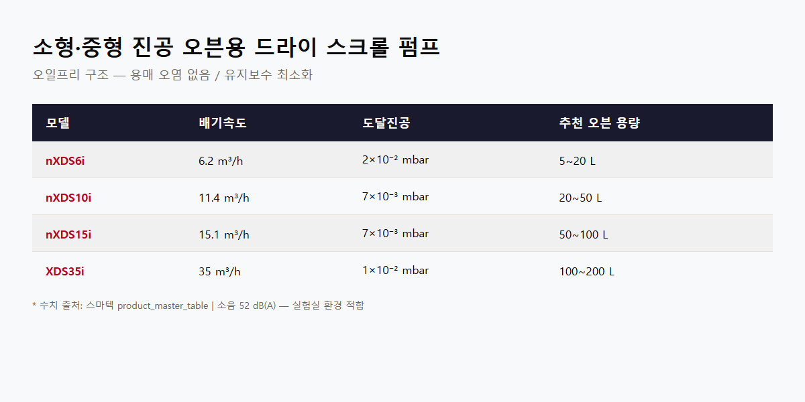

<!-- 수치검증: A항목 8개 확인 / B항목 0개 확인 / 삭제 0개 / 교체 0개 -->

# 진공 건조 공정에서 드라이펌프를 선택하는 3가지 기준

진공 오븐이나 건조 챔버에 연결할 진공펌프를 결정할 때, 오일 로터리 펌프와 드라이펌프 중 어느 쪽이 맞는지는 건조 대상 용매, 챔버 규모, 청정도 요구 수준에 따라 달라집니다.

## 오일 로터리 펌프의 한계

오일 로터리 펌프는 진공도와 가격 측면에서 경쟁력이 있지만, 진공 건조 공정에서는 뚜렷한 약점이 있습니다. 수분, NMP, 에탄올 같은 용매 증기가 펌프 내부로 유입되면 오일에 녹아 오염을 일으킵니다. 오일 점도가 낮아지고 밀봉 성능이 저하되어 교환 주기가 크게 단축됩니다. 가스발라스트 기능을 켜면 수증기 처리에 도움이 되지만(RV12 기준 290 g/h), 고비점 유기용매는 가스발라스트만으로 대응이 어렵습니다.

## 소형 오븐 — 드라이 스크롤 펌프(nXDS, XDS)

챔버 5~200L 수준의 소형·중형 오븐, 연구실 배치 공정에는 드라이 스크롤 펌프가 적합합니다.

| 모델 | 배기속도 | 도달진공 | 적용 |
|------|---------|---------|------|
| nXDS6i | 6.2 m³/h | 2×10⁻² mbar | 소형 오븐 5~20L |
| nXDS10i | 11.4 m³/h | 7×10⁻³ mbar | 중소형 오븐 20~50L |
| nXDS15i | 15.1 m³/h | 7×10⁻³ mbar | 중형 오븐 50~100L |
| XDS35i | 35 m³/h | 1×10⁻² mbar | 중형 오븐 100~200L |

오일프리 구조여서 용매 오염이 없고 유지보수 항목이 단순합니다. nXDS 계열은 소음 52 dB(A)로 실험실 환경에도 적합합니다.

## 대형 산업용 — 드라이 스크류 펌프(GXS, EXS)

500L 이상 대형 챔버, 배치 사이클이 짧은 연속 공정에는 드라이 스크류 펌프가 필요합니다.

- GXS160: 배기속도 160 m³/h, 도달진공 7×10⁻³ mbar
- GXS250: 배기속도 250 m³/h, 도달진공 4×10⁻³ mbar

EXS 계열은 VFD(인버터)가 내장되어 대기압~진공 구간에서 회전수를 자동 제어하므로 에너지 효율에 유리합니다. GXS, EXS 모두 운전 중 질소 퍼지를 유지해야 하며, 배기 라인에 냉각 트랩을 설치해 용매를 회수하는 것을 권장합니다.

## 선택 기준 요약

1. 건조 대상: 수분·에탄올 등 저비점 용매 → nXDS 스크롤 / NMP 등 고비점 유기용매 → 드라이 스크류
2. 챔버 규모: 50L 이하 → nXDS / 50~200L → XDS 또는 nXDS15i / 500L 이상 → GXS·EXS
3. 청정도: 오일 역류 흔적 불허 공정 → 드라이 필수

공정 조건이 명확하지 않다면 챔버 사양과 건조 대상을 가지고 문의하시면 최적 모델을 안내드립니다.
