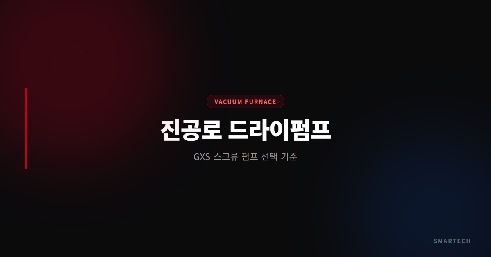
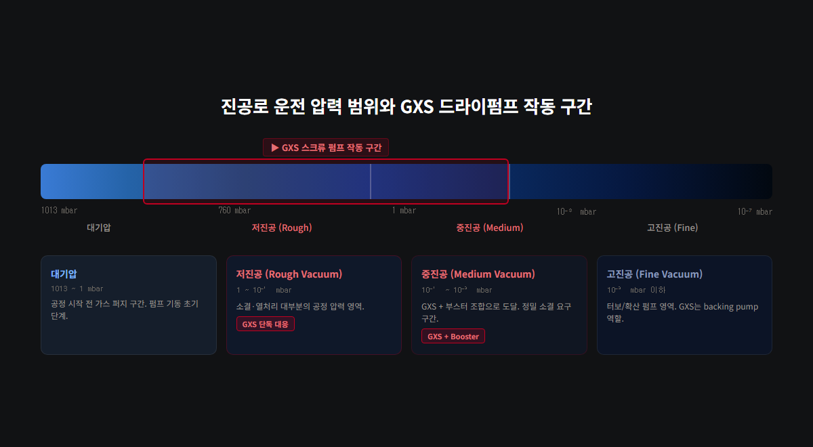
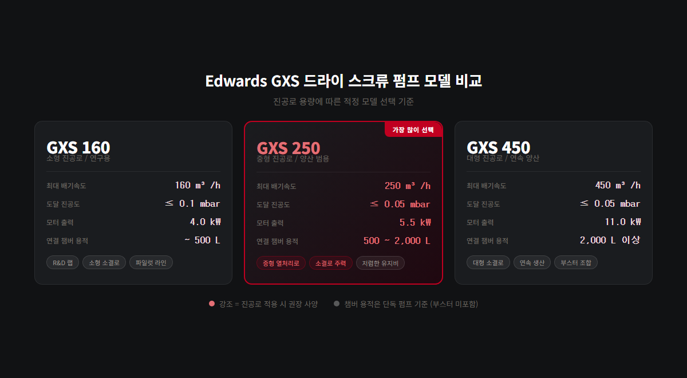

<!-- 수치검증: A항목 12개 확인 / B항목 3개 확인 / 삭제 0개 / 교체 0개 -->

# 진공 열처리로·소결로의 드라이 스크류 진공펌프 선택 기준

**진공로·소결로에 적합한 드라이 스크류 펌프를 선택하는 핵심 기준은 공정 목표 진공도와 퍼지 구성(DUTY 등급)입니다.** 10⁻² mbar 공정은 GXS 단독 구성으로 충분하고, 10⁻³ mbar 이하 공정은 콤비타입 또는 루츠 부스터 조합이 필요하며, 소결·MIM처럼 유기 성분이 배출되는 공정은 반드시 MEDIUM DUTY 퍼지 구성을 선택해야 합니다.

진공 열처리로와 소결로는 10⁻² ~ 10⁻³ mbar 수준의 진공 환경에서 금속 부품을 가열·냉각하는 공정 장비입니다. 이 압력 범위는 드라이 스크류 진공펌프가 단독으로 또는 루츠 부스터 조합으로 커버할 수 있는 영역입니다. 오일 로터리 펌프를 계속 사용하면 오일 역류(Backstreaming)로 인한 제품 오염, 금속 분말에 의한 오일 오염, 유기 바인더 응축 문제가 반복됩니다. 드라이 스크류 펌프는 이 세 가지 문제를 구조적으로 차단합니다.

---

## 진공로 공정별로 어떤 진공도가 필요한가?

펌프 모델을 선정하기 전에 해당 공정의 목표 진공도를 먼저 확인해야 합니다. 목표 압력이 펌프 구성(단독 vs 콤비타입)을 결정하는 핵심 기준이 됩니다.

| 공정 | 권장 진공도 범위 |
|------|--------------|
| 소결(Sintering) | 10⁻² mbar 내외 |
| MIM 탈지(Debinding) | 10⁻² mbar 내외 |
| 진공 브레이징(Vacuum Brazing) | 10⁻² ~ 10⁻³ mbar |
| 어닐링(Annealing) | 10⁻² ~ 10⁻³ mbar |
| 저압 침탄(LPC) | 10 ~ 30 mbar |
| 플라즈마 질화(Plasma Nitriding) | 1 ~ 10 mbar |
| 가스 퀀칭(Gas Quenching) | 10⁻² ~ 10⁻³ mbar |
| 전자빔 용접(E-beam Welding) | 10⁻³ ~ 10⁻⁴ mbar |

저압 침탄처럼 10 mbar 수준이면 GXS 단독 구성으로 충분합니다. 전자빔 용접처럼 10⁻⁴ mbar가 필요한 경우는 콤비타입이나 추가 고진공 펌프 조합을 검토해야 합니다.

---

## 오일 로터리 펌프 대신 드라이 스크류 펌프를 써야 하는 이유는?

오일 로터리 펌프(E2M 계열 등)는 고진공 영역에서 오일 증기가 챔버 방향으로 역류하는 현상이 발생합니다. 열처리 제품 표면에 오일이 닿으면 표면 품질 불량이나 브레이징 접합 결함으로 이어집니다. 소결과 MIM(금속사출성형) 공정에서는 미세 금속 분말이 지속 배출되어 오일 오염을 가속시키고, 탈지 단계에서 유기 바인더·왁스 성분이 오일 내부에서 응축됩니다.

드라이 스크류 펌프는 공정부에 오일이 없는 구조로 설계되어 이러한 오염 경로를 원천 차단합니다. 오일 교환·폐유 처리 비용과 시간도 없어집니다.

유지보수 측면에서도 차이가 큽니다. 드라이 스크류 펌프는 공정부 오일이 없기 때문에 정기 오일 교환이 필요 없습니다. 베어링 그리스를 주기적으로 보충하는 것이 사실상 유일한 정기 유지보수 항목입니다. 소결·MIM 공정처럼 분말과 유기물이 지속적으로 배출되는 환경에서는 특히 이 차이가 두드러집니다. 오일 로터리 펌프 기준으로 연 4~6회 이상 소요되던 오일 교환과 폐유 처리가 드라이 펌프 전환 후에는 완전히 사라집니다.

Edwards GXS 시리즈는 아래 진공로 공정을 공식 적용 공정으로 명시하고 있습니다.

- 소결(Sintering), MIM 탈지(Debinding)
- 진공 브레이징(Vacuum Brazing)
- 어닐링(Annealing), 템퍼링(Tempering)
- 가스 퀀칭(Gas Quenching)
- 저압 침탄(LPC), 저압 질화(LPN)
- 플라즈마 질화(Plasma Nitriding)
- 전자빔 용접(E-beam Welding)

---

## GXS 모델별 사양 — 공정 압력 목표에 맞게 선택

**GXS 단독 구성 (10⁻³ mbar 범위 공정)**

| 모델 | 배기속도 | 도달진공도 | 전력 | 냉각수 |
|------|---------|----------|------|-------|
| GXS160 | 160 m³/h | 7×10⁻³ mbar | 5.0 kW | 4.0 L/min |
| GXS250 | 250 m³/h | 4×10⁻³ mbar | 9.0 kW | 4.0 L/min |
| GXS450 | 450 m³/h | 5×10⁻³ mbar | 17.3 kW | 10 L/min |
| GXS750 | 740 m³/h | 3×10⁻³ mbar | 37.0 kW | 12 L/min |

**GXS 콤비타입 (10⁻⁴ mbar 범위 공정 — 루츠 부스터 일체형)**

| 모델 | 피크 배기속도 | 도달진공도 |
|------|------------|----------|
| GXS160/1750 | 1,200 m³/h | 7×10⁻⁴ mbar |
| GXS250/2600 | 1,900 m³/h | 5×10⁻⁴ mbar |
| GXS450/2600 | 2,200 m³/h | 5×10⁻⁴ mbar |
| GXS450/4200 | 3,026 m³/h | 5×10⁻⁴ mbar |
| GXS750/2600 | 2,300 m³/h | 5×10⁻⁴ mbar |
| GXS750/4200 | 3,450 m³/h | 5×10⁻⁴ mbar |

콤비타입은 드라이 스크류 펌프와 루츠 부스터가 하나의 유닛으로 통합된 제품입니다. GXS250 + EH2600처럼 별도 부스터를 조합하는 방식과 혼동하지 않아야 합니다.

---

## LIGHT DUTY와 MEDIUM DUTY 중 어떤 구성을 선택해야 하나?

Edwards는 진공로 공정 특성에 따라 GXS 구성 강도를 달리 권장합니다.

| 공정 | 권장 구성 | 주요 퍼지 |
|------|----------|---------|
| 어닐링, 전자빔 용접, 템퍼링 | LIGHT DUTY | 샤프트 씰 퍼지 |
| 진공 브레이징, 가스 퀀칭, 플라즈마 질화 | MEDIUM DUTY | SSP + 가스 밸러스트 + 입/출구 퍼지 |
| 소결·MIM 탈지 | MEDIUM DUTY | SSP + High Vac Purge + 가스 밸러스트 |
| 저압 침탄(프로판 사용) | MEDIUM DUTY+ | High Flow Purge + Solvent Flush |

소결·MIM 탈지처럼 유기 성분 가스가 배출되는 공정은 반드시 MEDIUM DUTY 이상 구성이 필요합니다. 퍼지 구성을 잘못 선택하면 드라이 펌프도 내부 오염으로 수명이 단축됩니다.

---

## 소결·MIM 공정의 분말 처리 능력

소결과 MIM 공정에서 GXS의 핵심 강점은 분말 처리 내구성입니다.

- 물 5리터 슬러그 + 고운 분말 1kg 슬러그 동시 처리 능력 테스트 검증
- 비접촉식(Non-contacting) 장기 수명 씰 — 분말 유입 시 씰 손상 위험 낮음
- 비캔틸레버 로터 지지 설계 — 이물질 흡입 시에도 안정적 운전

분말이 지속 발생하는 공정에서는 입구 필터(Inlet Filter)를 장착해 서비스 주기를 연장할 수 있습니다.

---

## GXS vs EXS — 어떤 시리즈를 선택할까

GXS와 EXS는 동일한 드라이 스크류 기술을 기반으로 합니다. 차이는 속도 제어 방식에 있습니다.

**GXS**: 정속 구동. 안정적이고 납기·수리 이력이 풍부한 표준 구성. 진공로 단일 공정에 적합합니다.

**EXS**: VFD(가변주파수드라이브) 내장. 공정 압력에 따라 모터 속도를 자동 제어합니다. 복수 공정을 운영하거나 에너지 효율을 우선할 때 유리합니다.

EXS의 단독 도달진공도는 1×10⁻² mbar로, GXS보다 한 자릿수 높게 표기됩니다. 10⁻³ mbar 이하가 필요하면 EXS 콤비타입(EXS160/1750, EXS250/2600 등)을 선택합니다. 콤비타입의 도달진공도는 <1×10⁻³ mbar입니다.

---

## 루츠 부스터(EH) 별도 조합이 필요한 경우

콤비타입이 아닌 GXS 단독 모델에 EH 부스터를 별도 조합할 경우, 스마텍 현장 확인 기준 조합은 아래와 같습니다.

| GXS 드라이 단독 | EH 부스터 | EH 배기속도(50Hz) |
|----------------|----------|-----------------|
| GXS160 (160 m³/h) | EH1200 | 1,195 m³/h |
| GXS250 (250 m³/h) | EH2600 | 2,590 m³/h |
| GXS450 (450 m³/h) | EH4200 | 4,140 m³/h |

루츠 부스터를 조합하면 단독 구성 대비 도달진공도가 한 자릿수 이상 개선됩니다. 예를 들어 GXS160 단독으로는 7×10⁻³ mbar가 한계이지만, EH1200을 조합하면 10⁻³ mbar 후반~10⁻⁴ mbar 초반 영역까지 진입이 가능합니다. 단, 이 수치는 챔버 용적·가스 부하·공정 사이클에 따라 달라집니다. 부스터 조합은 배기속도 확보가 목적인지, 도달진공도 개선이 목적인지에 따라 선정 기준이 다릅니다.

"배기속도의 2~8배" 공식을 일반 적용하면 잘못된 모델이 선택될 수 있습니다. 현장 조건(챔버 용적, 공정 압력, 사이클 타임)에 따라 달라지므로, 구체적인 구성은 스마텍에 문의하십시오.

---

## 스마텍 진공로 원스톱 지원 서비스

스마텍은 Edwards 코리아 공식 대리점으로, 진공로 시스템에 특화된 기술 지원을 제공합니다. 단순 펌프 판매에 그치지 않고 현장 공정 조건 분석 → 최적 펌프·퍼지 구성 설계 → 설치 및 시운전 → 정기 A/S까지 전 과정을 담당합니다.

특히 오일 펌프에서 드라이 펌프로 전환하는 현장에서는 기존 배관 인터페이스 검토, MEDIUM DUTY 퍼지 배관 추가, 설치 후 진공 성능 확인까지 일괄 지원이 가능합니다. 소결로·MIM·진공 브레이징·저압 침탄 등 공정별 적용 경험을 바탕으로 현장 상황에 맞는 구성을 제안해 드립니다.

---

진공 열처리로와 소결로에 적합한 드라이 스크류 펌프 모델 선정, 퍼지 구성 설계, GXS/EXS 비교 상담은 스마텍에서 제공합니다.

문의: 031-204-7170 / www.smartechvacuum.com
