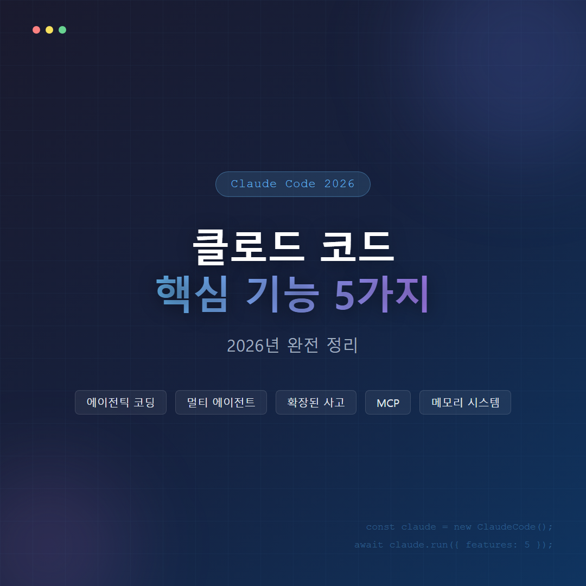
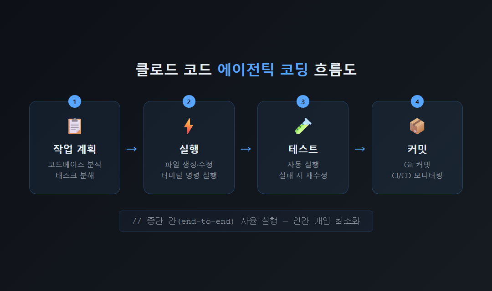
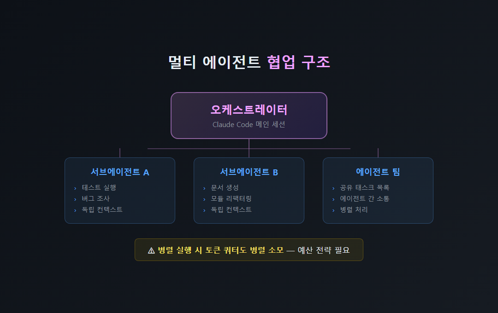
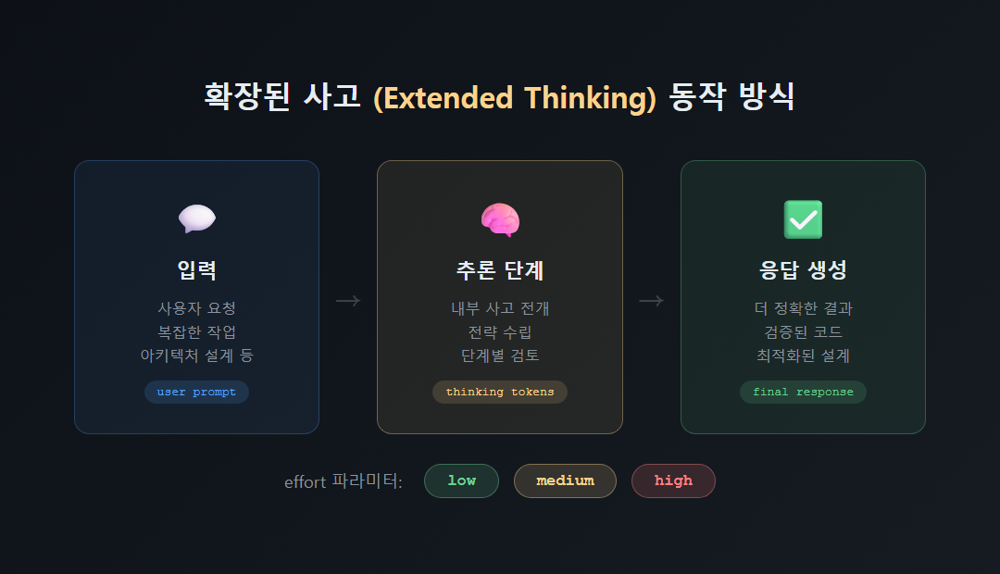
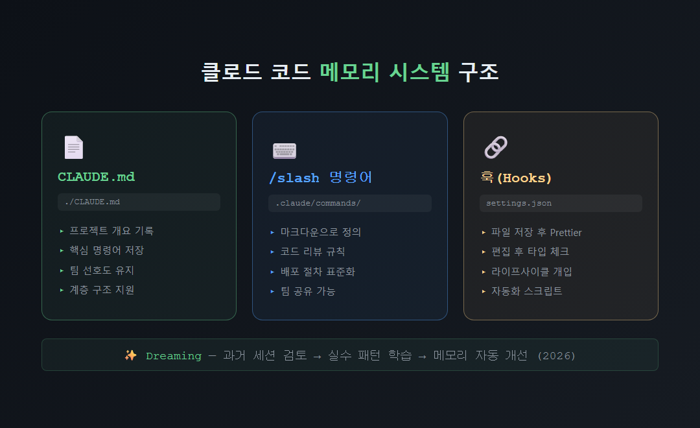

# 클로드 코드 핵심 기능 5가지 — 2026년 완전 정리

클로드 코드(Claude Code)는 단순한 코드 자동완성 도구를 넘어, 개발 작업 전반을 스스로 계획하고 실행하는 에이전틱(agentic) 코딩 시스템입니다. 2025년 2월 프리뷰 출시 이후 2025년 5월 클로드 4와 함께 정식 출시된 이 도구의 핵심 기능 5가지를 아래에서 정리해 드립니다.

---

## 클로드 코드가 기존 코딩 도구와 다른 점은 무엇인지요?

클로드 코드는 GitHub Copilot 같은 코드 자동완성 도구와 근본적으로 다릅니다. 프로젝트 전체 코드베이스를 읽고 디렉터리 구조를 파악한 뒤, 파일 생성·수정·터미널 명령 실행까지 하나의 에이전트가 종단 간(end-to-end)으로 처리합니다. 앤트로픽에 따르면 클로드 Opus 4.6은 인간이 14.5시간 걸리는 작업을 50% 성공률로 무감독 완료할 수 있다고 밝혔습니다 (2026년 2월 기준).

| 구분 | 기존 도구 (Copilot 등) | 클로드 코드 |
|------|----------------------|------------|
| 작업 단위 | 줄·함수 단위 제안 | 프로젝트 전체 종단 간 처리 |
| 파일 조작 | 불가 | 생성·수정·삭제 직접 실행 |
| 테스트 자동화 | 불가 | 실패 시 재수정·재실행 반복 |
| CI/CD 연동 | 불가 | GitHub·GitLab 파이프라인 모니터링 |

---

## 멀티 에이전트 오케스트레이션은 어떻게 작동하는지요?

클로드 코드는 여러 에이전트 인스턴스를 동시에 협업시키는 멀티 에이전트 기능을 지원합니다. 2026년 현재 세 가지 방식으로 운영됩니다.

1. **에이전트 뷰(Agent View)**: 터미널 대시보드에서 실행 중인 세션을 한 화면에 모아 시작·백그라운드 전환·재진입을 관리합니다. 노트북을 닫아도 슈퍼바이저 프로세스가 세션을 독립적으로 유지합니다.
2. **서브에이전트(Subagents)**: 각 서브에이전트는 독립된 컨텍스트 창을 가지며, 테스트 실행·문서 생성·모듈 리팩터링·버그 조사를 병렬로 처리합니다.
3. **에이전트 팀(Agent Teams)**: 공유 태스크 목록을 통해 작업을 조율하며, 팀원 에이전트들이 서로 직접 소통할 수 있습니다.

단, 병렬 실행은 비용도 병렬로 소모된다는 점에 유의하시기 바랍니다 (10개 동시 실행 시 토큰 쿼터 10배 소모). 작업 규모와 예산에 따라 전략적으로 활용하시기를 권장드립니다.

---

## 확장된 사고(Extended Thinking)로 어떤 문제를 해결할 수 있는지요?

클로드 코드는 응답을 생성하기 전 전용 추론 단계를 거치는 확장된 사고(Extended Thinking) 기능을 내장하고 있습니다. 어려운 문제에서 지연 시간을 일부 감수하는 대신 현저히 더 나은 답변을 얻을 수 있습니다. 기본적으로 모델이 스스로 사고 여부와 사고량을 결정하는 적응형 사고(adaptive thinking)를 사용하며, `effort` 파라미터(low·medium·high)로 사용자가 직접 조절할 수도 있습니다.

복잡한 아키텍처 설계, 성능 최적화, 버그 원인 분석처럼 난이도가 높은 작업일수록 이 기능의 이점이 크게 발휘된다고 판단됩니다.

---

## MCP 통합과 확장 에코시스템은 무엇인지요?

MCP(Model Context Protocol)는 앤트로픽이 관리하는 개방형 표준 프로토콜로, 클로드 코드가 외부 데이터 소스·도구와 연결되는 핵심 통로입니다. 세션이 시작되면 BashTool·FileReadTool 같은 내장 도구 외에도 MCP 서버가 제공하는 다양한 도구를 함께 사용할 수 있습니다.

확장 메커니즘은 네 가지로 구분됩니다.

| 확장 방식 | 역할 |
|-----------|------|
| MCP 서버 | Google Drive·Jira·Slack 등 외부 도구 연동 |
| 플러그인 | 컴포넌트 묶음 패키징 및 배포 |
| 스킬(Skills) | 도메인별 지침 주입, `.claude/skills/`에 마크다운으로 정의 |
| 훅(Hooks) | 도구 실행 라이프사이클 개입 (파일 저장 후 Prettier 자동 실행 등) |

2026년 현재 수백 개의 서드파티 MCP 서버로 생태계가 확장되고 있으며, 실제 활용 사례로는 Google Drive에서 설계 문서 읽기, Jira 티켓 자동 업데이트, Slack 데이터 가져오기 등이 있습니다.

---

## 메모리 시스템과 커스텀 명령어는 어떻게 활용하는지요?

클로드 코드는 세션이 종료되어도 프로젝트 지식을 유지하는 메모리 시스템을 갖추고 있습니다. 그 핵심은 `CLAUDE.md` 파일로, 프로젝트 개요·핵심 명령어·팀 선호도를 기록해 에이전트가 매 세션마다 컨텍스트를 이어받도록 합니다 (프로젝트 루트와 하위 디렉터리 계층 구조 지원).

- **커스텀 슬래시 명령어**: `.claude/commands/` 폴더에 마크다운 파일로 정의하며, `/명령어이름` 형식으로 호출합니다. 팀 고유의 코드 리뷰 규칙·배포 절차를 재사용 가능한 명령어로 표준화할 수 있습니다.
- **훅(Hooks)**: 파일 쓰기 후 Prettier 자동 실행, 편집 후 타입 체크 수행 등 도구 실행 생명주기 특정 시점에 스크립트를 자동 실행합니다.
- **드리밍(Dreaming)**: 2026년 도입된 기능으로, 에이전트가 과거 세션을 검토해 반복되는 실수·공유 워크플로우·팀 선호도를 추출하고 메모리를 자동으로 개선하는 예약 프로세스입니다.

---

클로드 코드의 5가지 핵심 기능(에이전틱 코딩·멀티 에이전트·확장된 사고·MCP 통합·메모리 시스템)은 단순 코드 보조 도구를 넘어 자율적인 개발 파트너로서의 가능성을 보여 줍니다. 각 기능을 프로젝트 규모와 팀 환경에 맞게 조합해 활용하시기를 권장드립니다. 궁금한 기능이 있으시면 댓글로 남겨 주시기 부탁드립니다.

---

#클로드코드 #ClaudeCode #에이전틱코딩 #AI코딩도구 #멀티에이전트 #MCP #확장된사고 #앤트로픽 #AI개발도구 #코딩자동화
