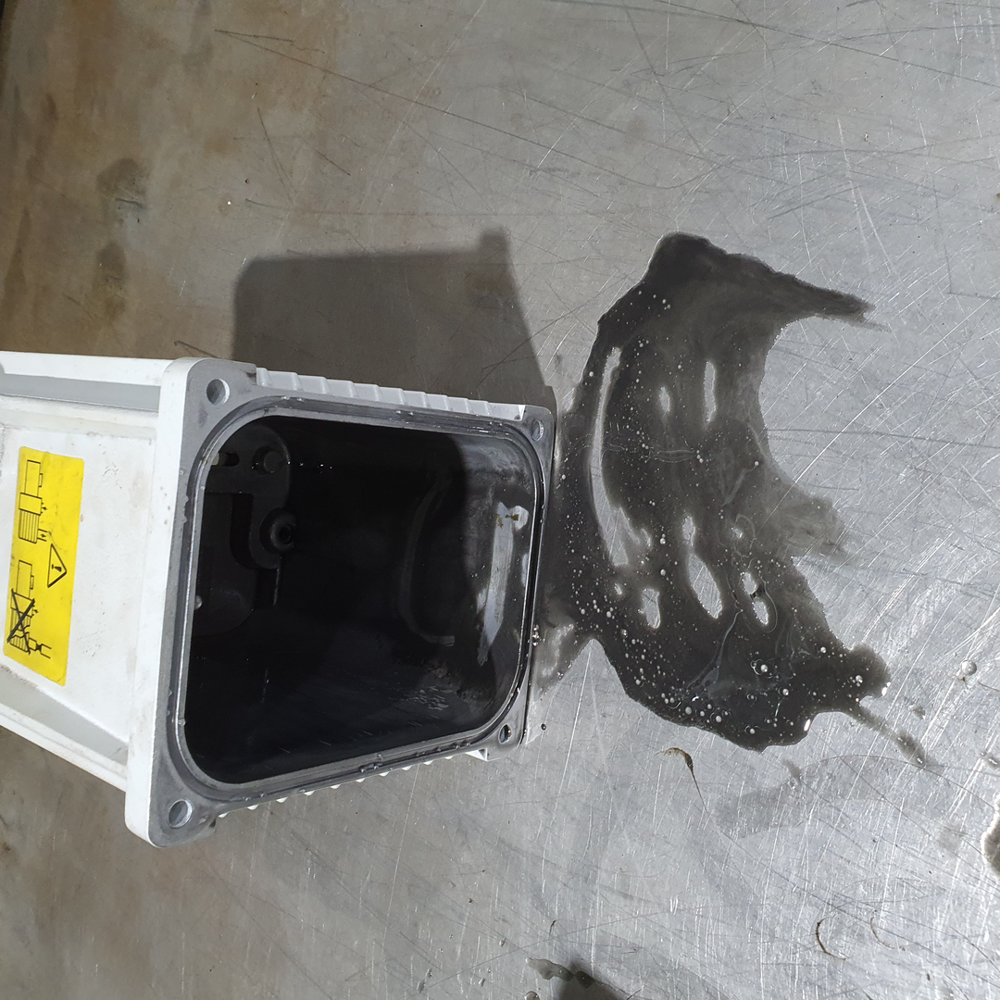
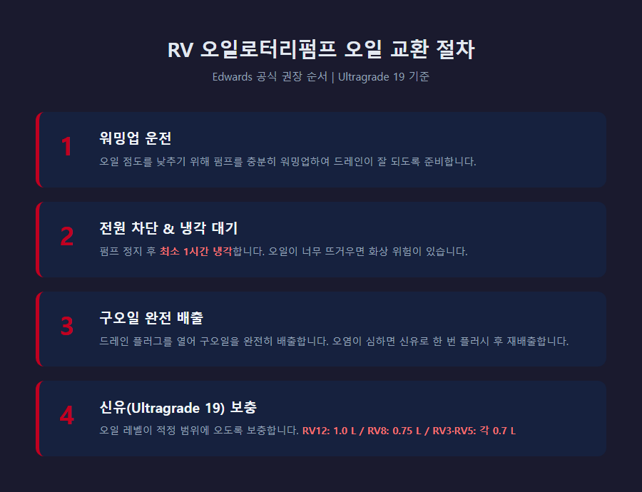
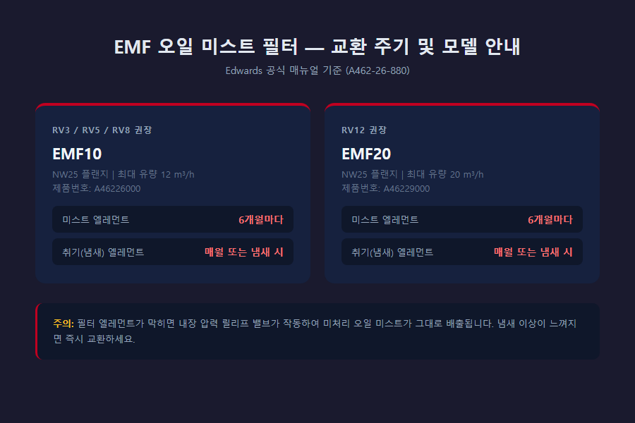

<!-- 수치검증: A항목 8개 확인 / B항목 0개 확인 / 삭제 1개(오일 교환 주기 수치 미명시) / 교체 0개 -->

# 로터리펌프 유지관리 핵심 3가지 — 분석 장비 RV 오일펌프 관리법

분석 실험실에서 RV 오일로터리펌프를 운영하다 보면, 어느 날 갑자기 진공이 안 뽑히거나 펌프 주변에 오일이 새어 나오는 경험을 하게 됩니다. 그 원인 대부분은 오랜 기간 미뤄온 세 가지 유지관리 소홀에서 시작됩니다.

스마텍에는 실제 현장에서 RV12를 직접 운용하는 연구소나 분석 업체로부터 "갑자기 진공 성능이 떨어졌다"는 문의가 꾸준히 들어옵니다. 점검해보면 대부분 오일 교환, 가스 발라스트 관리, 오일 미스트 필터 교환 — 이 세 가지 중 하나 이상이 오랫동안 방치된 상태입니다. 오늘은 Edwards RV 시리즈(RV3, RV5, RV8, RV12) 기준으로 세 가지 핵심 유지관리를 정리합니다.

---

## 1. 오일 교환 — 펌프 수명을 결정하는 가장 기본

**오일은 RV 로터리펌프의 심장입니다.** 오일이 오염되면 도달진공도가 나빠지고, 내부 부품에 마모가 가속됩니다.

Edwards RV 시리즈에는 **Ultragrade 19** 순정 오일이 기본 충전되어 출고됩니다. 이 오일은 낮은 증기압과 우수한 산화 저항성을 위해 특별히 설계된 미네랄 오일입니다.

**오일 상태 확인 방법:**
- 사이트 글래스(오일 창)로 오일 레벨을 정기적으로 확인
- 색상이 검게 탄화되거나 우유빛으로 변했다면 즉시 교환
- 오일이 유화(물과 섞여 뿌옇게 변함)된 경우 수분 오염 신호

**오일 교환 절차:**
1. 펌프를 충분히 워밍업하여 오일 점도를 낮춤
2. 전원 차단 후 최소 1시간 냉각
3. 드레인 플러그를 열어 구오일 완전 배출
4. 심하게 오염된 경우 신유로 한 번 플러시 후 재배출
5. 신유(Ultragrade 19)를 적정 레벨까지 보충

오일 용량 기준 (✅ Edwards RV 데이터시트): RV3/RV5 각 0.7 L, RV8 0.75 L, RV12 1.0 L

---

## 2. 가스 발라스트 — 수분을 몰아내는 핵심 기능

**가스 발라스트(Gas Ballast)** 는 진공 펌프 내부에서 수증기가 액화(응축)되는 것을 막아주는 기능입니다. 이 기능을 제대로 활용하지 않으면 오일이 수분과 섞여 에멀전 상태가 되고, 이것이 진공 성능 저하와 부식의 원인이 됩니다.

물은 20°C에서 포화 증기압이 약 24 mbar(18 Torr)입니다. (✅ Edwards 공식 웹사이트) 즉, 이 압력 이하로 내려가면 수증기가 액화되어 오일 속으로 혼입됩니다.

**Edwards RV 시리즈 가스 발라스트 수증기 처리 용량** (✅ Edwards RV 데이터시트):
- Position I: 60 g/h (전 모델 공통)
- Position II: 220 g/h (RV3/RV5/RV8), 290 g/h (RV12)

**가스 발라스트 사용 원칙:**
- 수분이나 증기를 다루는 공정(회전 증발기, 겔 드라이어 등) 중에는 항상 가스 발라스트를 열어두기
- 공정 시작 전후 가스 발라스트를 열고 10~15분 무부하 운전 → 오일 속 응축물 퍼징
- 가스 발라스트를 열면 도달진공도가 다소 낮아짐 (GB II 기준 1.2 × 10⁻¹ mbar 수준) — 고진공이 필요한 공정에서는 퍼징 후 닫기

G사(분석 장비 운용)의 경우, 회전 증발기 백킹 용도로 RV12를 사용하면서 가스 발라스트를 항상 닫아두었다가 오일이 빠르게 오염되는 문제를 겪었습니다. 가스 발라스트 운용 방법을 안내드린 후 오일 교환 주기가 크게 늘었습니다.

---

## 3. 오일 미스트 필터 — 환경과 오일 레벨을 지키는 방어막

오일로터리펌프는 운전 중 배기 가스와 함께 미세한 오일 미스트(기름 안개)를 배출합니다. 이 미스트를 방치하면 두 가지 문제가 생깁니다.

1. 작업 환경 오염 (냄새, 가연성 위험)
2. 펌프 오일 레벨 지속 감소 → 결국 오일 부족으로 펌프 손상

**Edwards RV 시리즈 권장 EMF 모델** (✅ Edwards EMF 매뉴얼):
- RV3, RV5, RV8 → **EMF10** (NW25, 최대 유량 12 m³/h)
- RV12 → **EMF20** (NW25, 최대 유량 20 m³/h)

**교환 주기** (✅ Edwards EMF 매뉴얼):
- 미스트 필터 엘레먼트: **6개월마다** (오염 공정은 더 자주)
- 취기(냄새) 엘레먼트: **매월 또는 오일 냄새 발생 시**

**주의사항:** 필터 엘레먼트가 막히면 내장된 압력 릴리프 밸브가 작동하여 미처리 미스트가 그대로 배출됩니다. 이 시점이 되면 교환 시기가 이미 지난 것입니다. 냄새 이상 또는 주기가 되면 미리 교환하는 것이 최선입니다.

오일 리턴 키트(EMF Clean Application Oil Drain Kit, A50419000 또는 Gas Ballast Oil Drain Kit, A50523000)를 함께 사용하면 필터에 포집된 오일을 자동으로 펌프로 되돌려 주어 오일 소모를 크게 줄일 수 있습니다.

---

## 마무리 — 세 가지만 지켜도 펌프 수명이 달라집니다

| 항목 | 핵심 요점 |
|------|-----------|
| 오일 교환 | Ultragrade 19 사용, 색상·레벨 정기 점검, 오염 시 즉시 교환 |
| 가스 발라스트 | 수분 공정 시 항상 개방, 시작·종료 시 퍼징 운전 |
| EMF 필터 | 6개월마다 미스트 엘레먼트, 매월 취기 엘레먼트 교환 |

RV 로터리펌프는 적절히 관리하면 매우 긴 수명을 자랑하는 장비입니다. 오일 교환, 가스 발라스트 활용, 오일 미스트 필터 관리 — 이 세 가지를 습관처럼 지키는 것만으로도 예상치 못한 다운타임과 수리 비용을 크게 줄일 수 있습니다.

RV 펌프 오일 교환, EMF 필터 교체 부품 문의, 또는 현장 점검이 필요하시면 스마텍으로 연락 주십시오. Edwards 코리아 공식 대리점으로서 정품 Ultragrade 19 오일, EMF 필터, 소모품 일체를 빠르게 공급해 드립니다.

---

관련 상담은 아래 연락처로 편하게 남겨주세요.

Tel : 031 204 7170
info@smartechvacuum.com
www.smartechvacuum.com

---

#로터리펌프유지관리 #오일로터리펌프 #RV펌프 #에드워드진공펌프 #진공펌프오일교환 #가스발라스트 #오일미스트필터 #EMF필터 #분석장비유지관리 #스마텍
