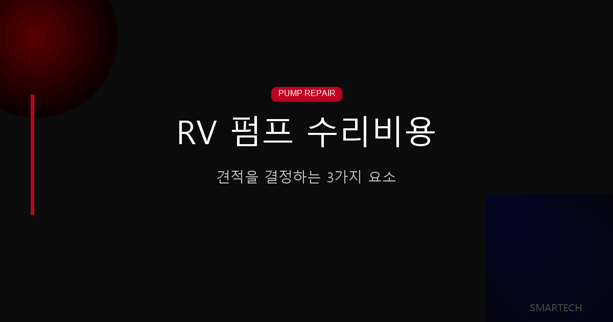
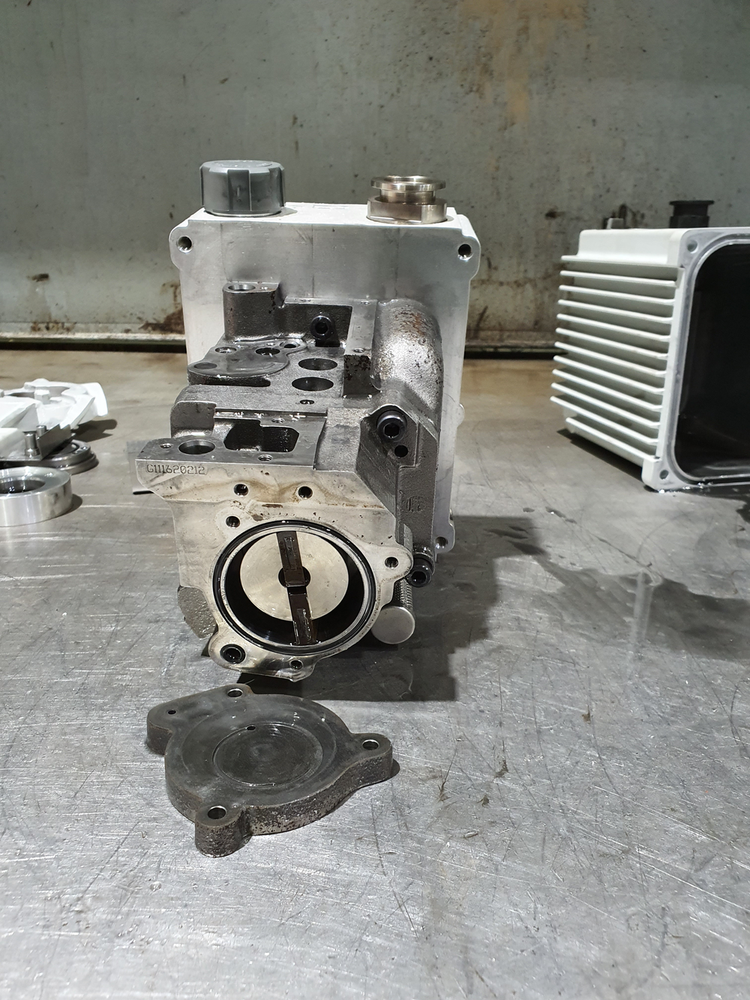
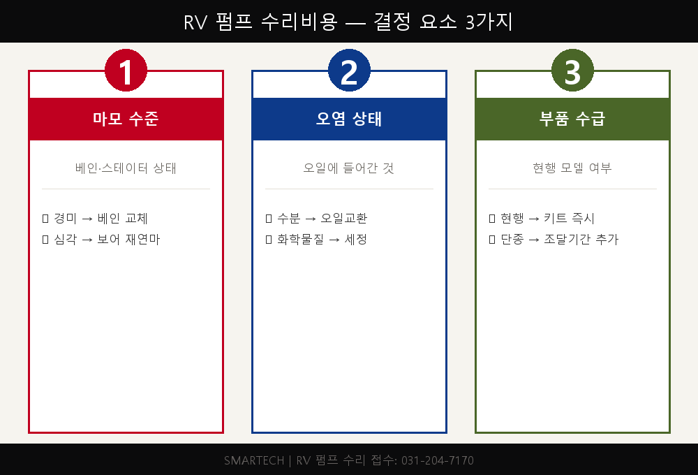
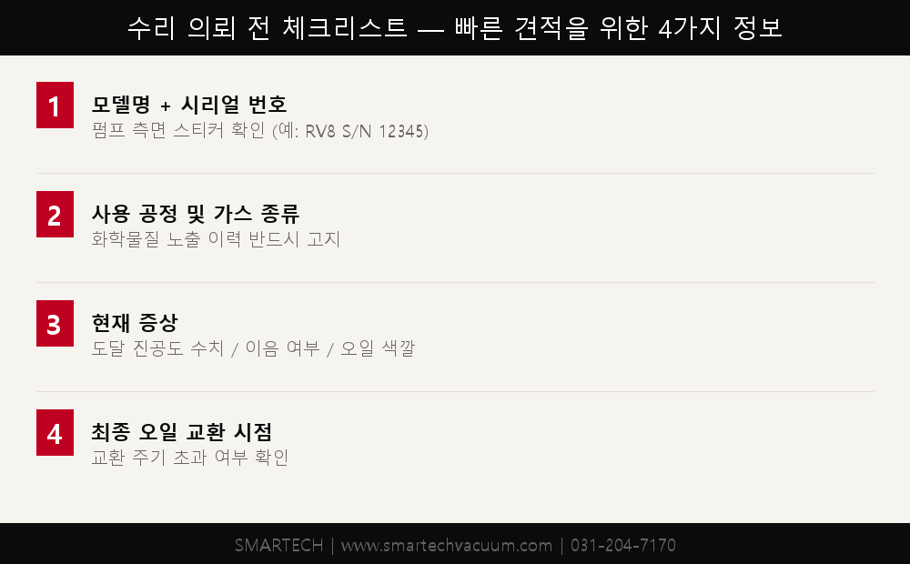

<!-- 수치검증: A항목 10개 확인 / B항목 2개 확인 / 삭제 0개 / 교체 0개 -->

# RV 오일로터리펌프 분해 수리비용 — 견적을 결정하는 3가지 요소

**RV 펌프 수리비를 결정하는 핵심 요소는 ① 베인 마모 수준, ② 오일 오염 종류, ③ 부품 수급성 세 가지입니다.** 같은 RV8 모델이라도 이 세 조건에 따라 수리비가 2~3배 이상 차이날 수 있습니다.

RV 오일로터리펌프 수리를 맡길 때 "왜 이 펌프는 수리비가 더 비싼가요?" 하는 질문을 자주 받습니다. 모델이 같아도 수리 견적이 크게 달라지는 이유는 세 가지 요소 때문입니다. 이 글에서는 글리트머티리얼즈 RV12, 한미정밀화학 RV8처럼 실제 수리 접수가 들어오는 소형 RV 펌프를 기준으로, 견적을 결정하는 3가지 요소를 설명합니다.

---

## RV 오일로터리펌프란

RV(Rotary Vane) 펌프는 원통형 스테이터 안에서 편심 로터가 회전하고, 로터 홈에 끼워진 베인(날개)이 스프링 힘과 원심력으로 스테이터 벽에 밀착하면서 가스를 압축·배출하는 방식입니다. 오일이 윤활과 씰 역할을 동시에 담당합니다.

Edwards RV 계열은 RV3(3 m³/h), RV5(5 m³/h), RV8(8 m³/h), RV12(12 m³/h)로 구성됩니다. 소형이지만 구조가 정밀해 분해 수리 시 기술 난이도가 높습니다.

위 사진은 실제 수리 접수된 RV 펌프를 분해한 상태입니다. 로터와 베인 슬롯, 흡·배기 밸브 플레이트, 스테이터 보어가 모두 드러나 있어 마모 상태를 직접 육안으로 확인할 수 있습니다.

---

## 요소 1 — 마모 수준: 베인과 로터 상태

수리비에서 가장 큰 비중을 차지하는 것은 **베인(Vane) 교체 여부**입니다. 베인은 로터 회전 중 스테이터 벽에 지속적으로 마찰되므로 사용 시간에 따라 두께가 줄어듭니다.

베인 마모가 한계치를 넘으면 기밀이 깨지고 도달 진공도가 떨어집니다. 이 단계에서 교체하지 않으면 베인 파편이 오일에 섞여 스테이터 보어까지 손상됩니다. 스테이터 교체나 재연마가 필요해지면 수리비가 크게 증가합니다.

**마모 단계별 작업 범위:**

| 상태 | 증상 | 작업 범위 |
|------|------|---------|
| 경미한 마모 | 도달 진공도 약간 저하 | 베인 교체 + 오일 교환 |
| 중간 마모 | 진공 성능 30~50% 저하 | 베인 + 씰 + 밸브 플레이트 교체 |
| 심한 마모 | 진공 불가, 이음 발생 | 전항목 + 스테이터 보어 점검·교체 |

---

## 요소 2 — 오일 오염 상태: 무엇이 오일에 들어갔나

두 번째 요소는 **오일 오염의 종류와 정도**입니다. RV 펌프 오일은 진공을 유지하는 씰 역할을 하기 때문에, 공정 가스나 이물질이 오일에 유입되면 오일 전체가 오염됩니다.

**오염 유형별 영향:**

| 오염 유형 | 원인 | 수리 추가 작업 |
|----------|------|-------------|
| 수분 혼입 | 대기 누입, 냉각 공정 | 가스 발라스트 운전 → 오일 전량 교환 |
| 부식성 화학물질 | 산·알칼리 공정 가스 | 내부 화학 세정 + 씰·O링 전량 교체 |
| 금속 분말 | 진공 가공 공정 | 오일 필터 교체 + 내부 연마 세정 |
| 솔벤트 혼입 | 코팅·세정 공정 | 전량 분해 세정 + 오일 교환 |

화학물질이 오일에 유입된 경우 내부 부품이 부식됩니다. 이 경우 단순 베인 교체만으로는 수리가 완료되지 않으며, 분해 후 화학 세정과 부품 전체 점검이 필요합니다. 수리 전 "어떤 공정에 사용했는지"를 반드시 고지해야 정확한 견적이 가능합니다.

---

## 요소 3 — 모델과 부품 수급: 단종 여부와 재고 상황

세 번째 요소는 **부품 수급성**입니다. 같은 제조사 제품이라도 오래된 모델은 정품 부품이 단종되어 입수에 시간이 걸리거나, 대체 가공 부품을 제작해야 하는 경우가 생깁니다.

Edwards RV3/5/8/12는 현재 현행 모델로 정품 수리 키트(Service Kit) 재고가 있어 납기가 빠릅니다. 단, RV 계열 중 단종된 구형 모델(RV65 등 대형)은 부품 조달 기간이 추가됩니다.

수리 서비스 키트 구성 내용 (Edwards 기준):

- 베인 세트 (Vane Set)
- 인렛·아웃렛 밸브 플레이트
- 가스킷 및 O링 세트
- 샤프트 씰

서비스 키트 1세트로 커버되지 않는 스테이터 보어 손상, 로터 편마모, 베어링 손상 등이 추가로 발생하면 키트 비용 외 별도 부품비가 발생합니다.

---

## 수리 견적 전 준비해야 할 정보는?

수리 견적을 빠르고 정확하게 받으려면 아래 정보를 미리 준비하세요.

1. **모델명과 시리얼 번호** — 펌프 측면 스티커에 표기. RV8인지 RV12인지에 따라 부품 규격이 다릅니다.
2. **사용 공정** — 어떤 가스나 화학물질을 배기했는지. 화학물질 노출 이력이 있으면 사전 고지 필수.
3. **현재 증상** — 도달 진공도 수치, 이음 여부, 오일 색깔·냄새 변화.
4. **최종 오일 교환 시점** — 오일 교환 주기를 넘긴 경우 오염 정도가 더 클 수 있습니다.

위 정보가 있으면 비분해 견적(외관 상태 기준)이 아닌, 실제 수리 범위에 맞는 견적을 처음부터 받을 수 있습니다.

---

## 수리 vs 교체 — 어느 쪽이 유리한가

RV 펌프 수리를 의뢰할 때 "그냥 새 펌프를 사는 게 낫지 않나요?" 하는 질문도 자주 나옵니다. 판단 기준은 단순합니다.

**수리가 유리한 경우:**
- 베인 마모 수준이 중간 이하이고 스테이터 보어에 손상이 없을 때
- 오일 오염이 수분이나 분말 수준이고 화학 세정이 불필요할 때
- 현행 모델로 서비스 키트 재고가 있어 납기가 짧을 때
- 신품 가격 대비 수리비가 60% 이하일 때

**신품 교체가 유리한 경우:**
- 스테이터 보어 심한 손상으로 재연마 또는 교체 필요
- 부식성 화학물질 오염으로 내부 부품 전체 교체 필요
- 수리비 견적이 신품 가격의 70% 이상

스마텍은 분해 점검 후 수리비가 신품 가격 기준을 초과할 경우 교체를 권장하고, 그 근거를 사진과 함께 설명해 드립니다.

---

RV 펌프 수리 견적은 겉에서 보면 단순해 보이지만, 베인 마모 수준, 오일 오염 종류, 부품 수급성이라는 세 가지 요소가 복합적으로 작용해 최종 금액이 결정됩니다. 세 조건이 모두 가벼울 때는 서비스 키트 교환만으로 마무리되지만, 하나라도 심각하면 추가 부품비와 작업 시간이 늘어납니다. 수리를 맡기기 전에 이 세 가지를 먼저 파악해두면, 견적 편차에 당황하지 않고 합리적인 결정을 내릴 수 있습니다.

---

RV3/5/8/12 분해 점검·사진 견적·도달진공도 측정 결과 제공. 화학물질 공정 사용 펌프는 접수 시 사전 고지 필수.
