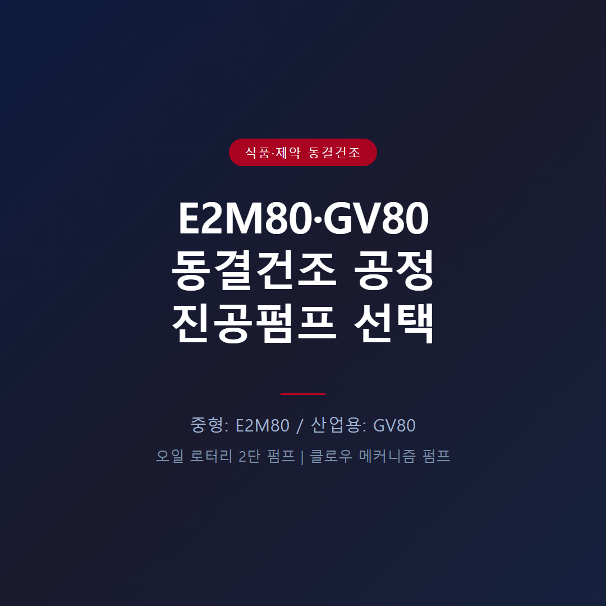

<!-- 수치검증: A항목 10개 확인 / B항목 0개 확인 / 삭제 0개 / 교체 0개 -->

# 동결건조 공정에 적합한 진공펌프 선택

동결건조(freeze drying)는 수분을 얼음 상태로 승화시키는 공정 특성상 1차 건조 구간에서 대량 수증기가 발생합니다. 진공펌프 선택 시 이 수분 부하를 어떻게 처리할지가 핵심입니다.

## 동결건조 공정의 진공 요구조건

동결건조는 세 단계로 나뉩니다. 1차 건조(승화 건조)에서는 처리물 수분의 대부분이 수증기로 발생하며 진공 시스템에 고부하가 걸립니다. 2차 건조(탈착 건조)에서는 0.01~0.1 mbar의 깊은 진공과 상온~40°C 온도가 필요합니다.

대부분의 동결건조기는 펌프 앞단에 콘덴서(cold trap)를 설치해 수증기를 포집합니다. 펌프는 콘덴서 통과 후 잔여 수분만 처리하지만, 이 잔여 수분의 처리 방식이 펌프 수명을 좌우합니다. 콘덴서 용량이 부족하거나 제상 없이 연속 운전하면 잔여 수분이 누적되어 펌프 오일 오염이 빠르게 진행됩니다. 동결건조 시스템 설계 단계에서 콘덴서 용량과 펌프 배기속도를 함께 검토하는 이유입니다.

## 소형 랩 스케일 동결건조기 — nXDS 오일프리 드라이 스크롤

랩 규모(0.1~2kg/배치)의 소형 동결건조기라면 오일 로터리보다 nXDS 시리즈 드라이 스크롤 펌프를 먼저 검토하는 편이 유지보수 측면에서 유리합니다.

**nXDS 시리즈 스펙**
- nXDS6i: 배기속도 6.2 m³/h, 도달진공 2×10⁻² mbar
- nXDS10i: 배기속도 11.4 m³/h, 도달진공 7×10⁻³ mbar
- nXDS15i: 배기속도 15.1 m³/h, 도달진공 7×10⁻³ mbar

오일프리 구조라 수증기를 직접 흡입해도 오일 오염 걱정이 없고, 도달진공 스펙상 2차 건조 구간에 필요한 깊은 진공(0.01~0.1 mbar)도 충분히 커버합니다. 배치 규모가 작아 콘덴서 용량도 상대적으로 여유 있게 설계되는 경우가 많아, 오일 관리 루틴 자체를 없애고 싶은 랩실에 적합합니다.

## 중형 동결건조기 — E2M80 오일 로터리 2단 펌프

처리량 20~200 kg/배치 수준의 중형 동결건조기에는 E2M80 오일 로터리 2단 펌프가 적합합니다.

**E2M80 오일 로터리 펌프**
- 배기속도: 74 m³/h (50Hz)
- 도달진공: 3.0×10⁻³ mbar — 2차 건조 구간 커버
- 수증기 처리 용량: 0.3 kg/h (가스발라스트 운전 시)
- 권장 오일: Ultragrade 70 (HC) 또는 Ultragrade 70 AZ (제약 동결건조 권장)
- AZ 버전은 Azide 계열 화합물 호환, 제약 동결건조 공식 적용처로 명시됨
- 가격 경쟁력 있음. 단, 배치마다 오일 상태 점검과 가스발라스트 관리가 필요합니다.

## 산업용 대형 동결건조기 — GV80 클로우 메커니즘 펌프

처리량 200 kg/배치 이상, 연속 가동 라인에는 GV80 클로우 메커니즘 펌프(DRYSTAR)가 적합합니다.

**GV80 클로우 메커니즘 펌프 (DRYSTAR)**
- 오일프리 공정부: 수분 부하에도 오일 오염 없음
- 연속 가동 적합: 24시간 산업 라인에 안정적
- 상세 사양 확인 필요 (배기속도·도달진공 수치는 별도 문의)

오일프리 구조로 수분 부하에도 공정부 오염이 없고, 클로우 메커니즘 방식이어서 장시간 연속 가동에도 안정적입니다. 대규모 제약·식품 동결건조 라인에서 GV80 도입 후 펌프 관련 비정기 유지보수가 줄었다는 사례가 보고되고 있습니다.

## 산업용 대형 라인의 또 다른 선택지 — GXS 드라이 스크류

연속 가동 대형 라인에서는 GV80 외에 GXS 시리즈 드라이 스크류 펌프도 비교 대상입니다.

- GXS160: 배기속도 160 m³/h, 도달진공 7×10⁻³ mbar
- GXS250: 배기속도 250 m³/h, 도달진공 4×10⁻³ mbar

오일프리 공정부 구조는 GV80과 동일하게 수분 오염에 안전하지만, 질소 퍼지 공급과 충분한 웜업 시간이 함께 필요합니다. 배치 사이클을 최소화해야 하는 대형 식품·제약 라인에서 GV80과 나란히 검토되는 모델입니다.

## 콘덴서(Cold Trap) 설치 및 운전 주의사항

동결건조 시스템에서 콘덴서는 펌프 수명과 직결됩니다. 콘덴서가 -50°C 이하로 충분히 냉각된 상태에서 진공 펌프를 가동해야 수증기 부하를 최소화할 수 있습니다. 콘덴서 온도가 불충분한 상태에서 배치를 시작하면 펌프로 유입되는 수증기량이 급격히 증가해 오일 오염 속도가 빨라집니다.

배치 종료 후 콘덴서 제상(defrost) 작업 시에는 반드시 펌프를 먼저 격리(밸브 차단)한 뒤 진행해야 합니다. 제상 중 발생하는 대량 수증기가 펌프로 역류하면 오일이 순식간에 유화됩니다.

## 오일 로터리 선택 시 수분 관리 핵심 3가지

1. 1차 건조 구간 내내 가스발라스트 개방 운전
2. 배치 종료 후 가스발라스트 상태로 20~30분 추가 운전 (잔류 수분 배출)
3. 100~200시간 운전마다 오일 상태 확인 — 유화(백탁) 발견 즉시 교환

오일 교환 주기가 100시간 미만으로 단축됐거나, 배치 후 오일 색이 뿌옇게 변한다면 콘덴서 성능 저하 또는 가스발라스트 미사용이 원인인 경우가 대부분입니다. 펌프 교체 전에 운전 조건부터 점검하는 것을 권장합니다.

## E2M80 vs GV80 선택 기준 요약

- **처리량**: E2M80은 20~200 kg/배치, GV80은 200 kg/배치 이상
- **도달진공**: E2M80은 3.0×10⁻³ mbar, GV80은 사양 확인 후 별도 안내
- **수분 처리**: E2M80은 가스발라스트 운전 필수, GV80은 오일프리 구조로 별도 조치 불필요
- **유지보수**: E2M80은 정기 오일 교환 주기 관리, GV80은 공정부 오염 자체가 없음
- **연속 가동**: E2M80은 배치 사이 관리가 필요, GV80은 24시간 연속 라인에 적합

## 자주 묻는 질문

**Q. 오일프리 드라이 펌프가 무조건 더 나은가요?**
A. 수분 오염 관점에서는 유리하지만, 초기 도입 비용은 오일 로터리보다 높습니다. 처리량이 작고 예산이 제한적인 소규모 라인이라면 오일 관리 루틴을 받아들이고 E2M·RV 시리즈를 쓰는 것도 합리적인 선택입니다.

**Q. 오일 로터리 펌프의 오일 교환 주기를 늘릴 방법이 있나요?**
A. 가스발라스트 운전과 콘덴서 온도 관리만 제대로 지켜도 교환 주기가 크게 늘어납니다. 오일이 뿌옇게 변하는 속도가 빠르다면 펌프 자체보다 이 두 가지 운전 조건부터 점검하는 것이 먼저입니다.

처음 동결건조 라인을 구성하거나 기존 펌프 교체를 검토 중이라면, 동결건조기 모델과 배치 조건을 가지고 문의하시면 적합한 펌프 모델을 바로 안내드립니다.

예산 범위와 배치 주기, 현재 오일 교환 빈도를 함께 알려주시면 더 구체적인 검토가 가능합니다. 단순히 펌프 모델만 교체하는 것인지, 콘덴서 포함 전체 진공 시스템을 재구성하는 것인지에 따라 권장 구성이 달라지므로, 현재 설비 구성도 함께 공유해 주시면 도움이 됩니다.
