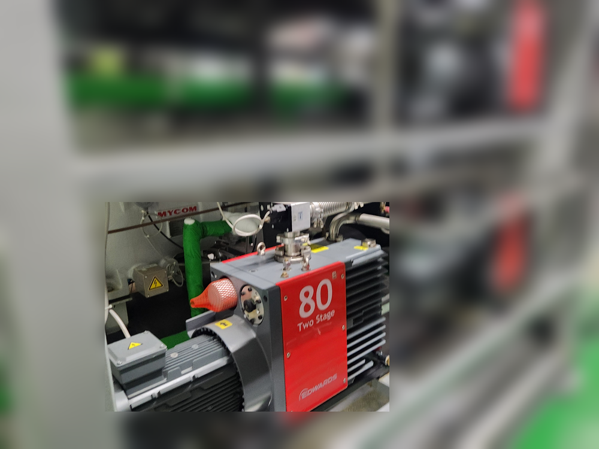
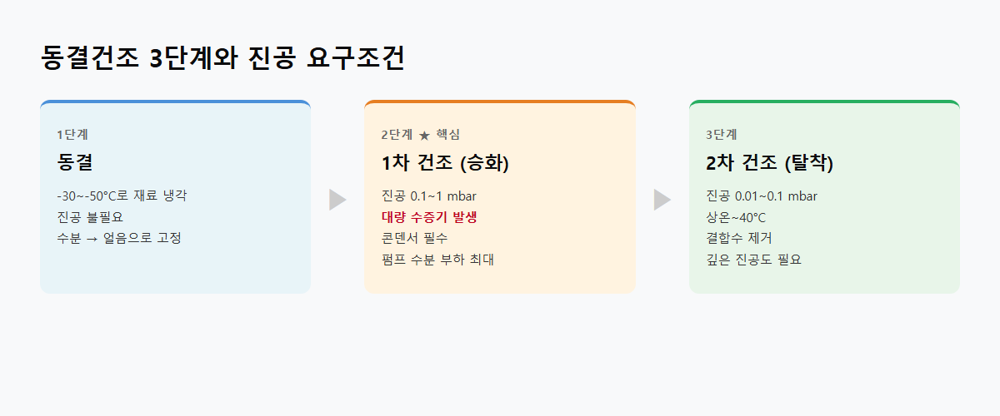
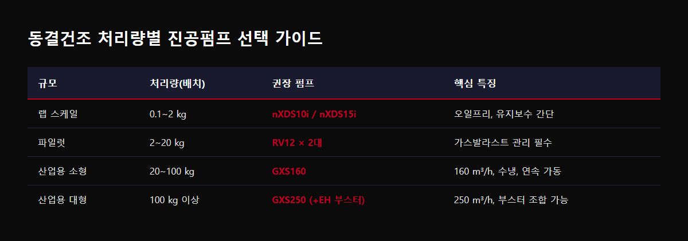

<!-- 수치검증: A항목 10개 확인 / B항목 0개 확인 / 삭제 0개 / 교체 0개 -->

# 동결건조 공정에 적합한 진공펌프 선택

동결건조기(Freeze Dryer)에 연결할 진공펌프를 고를 때 가장 중요한 조건이 있습니다. 수분 처리 능력입니다. 다른 진공 공정과 달리 동결건조에서는 처리물 무게의 60~80%에 달하는 수분이 수증기로 발생합니다. 이 수분이 펌프로 들어오는 양을 얼마나 줄이고, 들어온 양을 어떻게 처리하느냐가 펌프 수명과 직결됩니다.

## 동결건조 과정에서 진공펌프가 받는 부하는 얼마나 될까요?

동결건조는 세 단계로 진행됩니다. 재료를 동결하는 1단계 이후, 1차 건조 단계에서 얼음이 수증기로 직접 승화합니다. 이 구간에서 대량의 수증기가 발생하고, 진공 시스템 전체에 걸립니다.

대부분의 동결건조기는 콘덴서(cold trap)를 펌프 앞에 달아 수증기를 먼저 얼려 잡아둡니다. 하지만 콘덴서를 통과한 잔여 수분은 펌프가 처리해야 합니다. 2차 건조 단계에서는 잔류 결합수를 제거하기 위해 더 깊은 진공(0.01~0.1 mbar)이 필요합니다.

## 소형 랩실이라면 오일 로터리 대신 nXDS도 검토해보세요

처리량 0.1~2kg 배치 수준의 소형·랩 스케일 동결건조기라면, 처음부터 오일 로터리 대신 nXDS 시리즈 드라이 스크롤 펌프를 검토하시는 것도 방법입니다.

- nXDS6i: 배기속도 6.2 m³/h, 도달진공 2×10⁻² mbar
- nXDS10i: 배기속도 11.4 m³/h, 도달진공 7×10⁻³ mbar
- nXDS15i: 배기속도 15.1 m³/h, 도달진공 7×10⁻³ mbar

오일프리 구조라 수증기가 직접 들어와도 오일이 오염될 일이 없고, 오일 관리 루틴 자체가 사라집니다. 다만 오일 로터리 대비 초기 도입 비용은 더 높은 편이라, 배치 빈도와 예산을 함께 고려해서 판단하시는 게 좋습니다.

## E2M80 오일 로터리 펌프가 중형 동결건조기에서 쓰이는 이유

중형 규모 동결건조기에는 E2M80 오일 로터리 2단 펌프가 많이 쓰입니다. 배기속도 74 m³/h에 도달진공 3.0×10⁻³ mbar로 2차 건조 구간을 충분히 커버합니다. (✅ 스마텍 product_master_table)

제약 동결건조 라인에는 AZ 버전(Ultragrade 70 AZ 오일)을 사용합니다. Azide 계열 화합물에 호환되고, Edwards 공식 적용처에 제약 동결건조(Pharma freeze-drying)가 명시되어 있습니다. 가스발라스트 운전 시 수증기 처리 용량은 0.3 kg/h입니다. (✅ 스마텍 product_master_table)

단, 오일 로터리를 쓰면 오일 관리가 따릅니다. 1차 건조 구간 내내 가스발라스트를 열어두고, 배치가 끝나면 오일 상태를 확인하는 루틴이 필요합니다. 오일이 뿌옇게 유화되면 바로 교환해야 합니다.

## 산업용 대형 동결건조라면 클로우 메커니즘 펌프를 검토하세요

처리량이 많거나 24시간 연속 가동이 필요한 산업 라인에서는 GV80 클로우 메커니즘 펌프(DRYSTAR)가 더 안정적입니다.

- GV80: 오일프리 공정부, 연속 가동 적합 (상세 사양은 별도 문의)

오일프리 구조여서 수분 부하에도 공정부 오염이 없고, 클로우 메커니즘 방식으로 장시간 가동에도 안정적입니다. 질소 퍼지를 유지하면 수증기가 내부에서 응결되지 않습니다.

같은 대형 라인 조건이라면 GXS160·GXS250 드라이 스크류 펌프도 함께 비교해볼 만합니다. 오일프리인 건 GV80과 같지만, 질소 퍼지 공급과 충분한 웜업 시간을 별도로 챙겨야 합니다. 배치 사이클을 최대한 짧게 가져가야 하는 대형 라인에서 두 모델을 함께 검토하는 경우가 많습니다.

## 현장에서 실제로 있었던 사례

한 동결건조 설비 도입 현장에서는, 동결건조기 자체 납품이 2~3개월 걸리는 상황에서 RV12 오일 로터리 펌프 2대를 먼저 확보해 창고에 보관해둔 사례가 있습니다. 처리량이 크지 않은 파일럿 규모였고, 오일 관리 부담을 감수하더라도 가격 경쟁력 때문에 오일 로터리를 선택한 경우입니다. 배치 규모가 작다고 무조건 오일프리를 고집할 필요는 없고, 오일 관리 루틴을 받아들일 수 있는지가 실제 선택의 기준이 되는 경우가 많습니다.

## 자주 묻는 질문

**Q. 오일프리 드라이 펌프가 무조건 좋은 건가요?**
수분 오염 걱정이 없다는 점은 확실히 유리하지만, 도입 비용은 오일 로터리보다 높습니다. 소규모 라인이라면 오일 관리를 받아들이고 오일 로터리를 쓰는 것도 충분히 합리적인 선택입니다.

**Q. 오일 교환 주기를 늘릴 방법이 있을까요?**
가스발라스트 운전과 콘덴서 온도 관리, 이 두 가지만 제대로 지켜도 교환 주기가 눈에 띄게 늘어납니다. 오일이 자주 뿌옇게 변한다면 펌프보다 이 운전 조건부터 점검해보시길 권합니다.

동결건조기 사양과 배치 조건을 가지고 문의하시면 최적 조합을 안내드립니다.

---

관련 상담은 아래 연락처로 편하게 남겨주세요.

Tel : 031 204 7170
info@smartechvacuum.com
www.smartechvacuum.com

---

#동결건조 #동결건조기 #드라이펌프 #진공펌프선택 #E2M80 #GV80 #식품동결건조 #제약동결건조 #Edwards진공펌프
