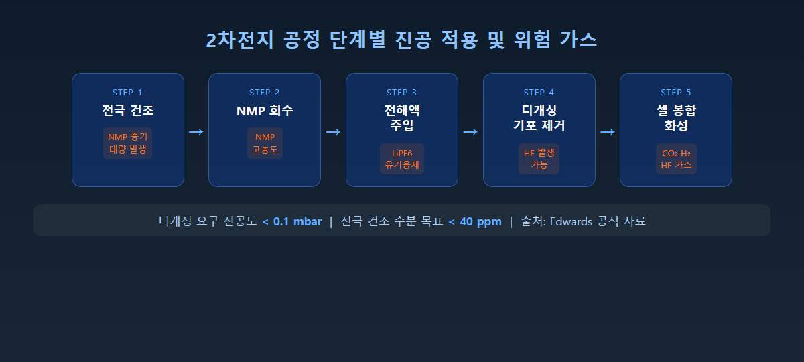
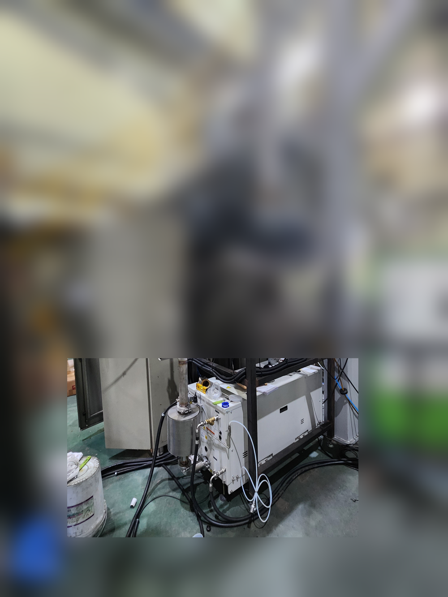

<!-- 수치검증: A항목 7개 확인 / B항목 0개 확인 / 삭제 0개 / 교체 0개 -->

# 2차전지 제조 공정에서 드라이펌프 및 PFPE 오일 진공펌프가 필요한 이유

배터리 공장을 담당하시는 분들께 가장 많이 받는 질문이 있습니다.

"이차전지 공정에 어떤 진공펌프를 써야 하나요?"

이 질문이 복잡해지는 이유가 있습니다. 오일을 갈아도 금방 까매지고, 도달 진공도는 자꾸 떨어지고, 심한 경우 펌프 내부가 끈적한 슬러지로 막혀버리는 상황이 반복된다는 겁니다. 원인은 대부분 하나입니다. **2차전지 공정에는 일반 진공펌프 오일을 빠르게 망가뜨리는 화학 물질이 존재하기 때문입니다.**

이 글에서는 왜 이차전지 공정에 **드라이펌프** 또는 **PFPE 오일을 사용하는 진공펌프**가 필요한지, 공정 단계별로 설명드리겠습니다.

---

## 2차전지 공정에서 진공이 필요한 단계

배터리 하나를 만드는 과정에서 진공이 필요한 단계는 생각보다 많습니다.

**① 전극 건조 (Electrode Drying)**
양극·음극재 슬러리에는 NMP(N-메틸-2-피롤리돈)라는 유기 용제가 들어갑니다. 전극 코팅 후 이 NMP를 완전히 제거해야 배터리 성능이 나옵니다. 진공 건조를 통해 수분을 40ppm 이하까지 낮추는 작업인데, 이 과정에서 NMP 증기가 대량으로 발생합니다. (✅ Edwards GXS Application Note)

**② NMP 회수 (NMP Recovery)**
건조 과정에서 나온 NMP 증기를 회수·재활용하는 공정입니다. 환경 규제 대응 목적도 있으며, NMP 농도가 특히 높아 일반 오일이 빠르게 오염됩니다.

**③ 전해액 주입 및 디개싱 (Electrolyte Filling & Degassing)**
LiPF6(리튬헥사플루오로포스페이트) 기반 전해액을 셀 안에 균일하게 채운 후 기포를 제거합니다. 이 공정의 요구 진공도는 **0.1 mbar 이하**이며, 전해액 성분이 펌프로 유입될 수 있습니다. (✅ Edwards GXS Application Note)

**④ 셀 봉합 및 화성 (Sealing & Formation)**
파우치 셀 밀봉과 초기 충방전(화성) 과정에서 CO₂, H₂, 소량의 HF 가스가 발생합니다.

이 네 단계에 공통으로 등장하는 물질이 있습니다. **NMP**, **LiPF6**, 그리고 **HF(불화수소)**입니다. 이 세 가지가 왜 문제인지가 핵심입니다.

---

## 왜 드라이펌프가 필요한가 — 공정 가스와 오일이 만나지 않는 구조

이차전지 공정에서 드라이펌프(건식 진공펌프)가 권장되는 가장 큰 이유는 **공정 가스가 오일과 전혀 접촉하지 않는 구조** 때문입니다.

오일식 로터리베인 펌프(E2M, RV 등)는 공정 가스가 오일 속을 통과하는 구조입니다. 이 경로에서 NMP 증기가 오일에 흡수되고, 전해액 성분이 오일과 섞이며, HF가 발생하면 오일을 부식시킵니다.

반면 드라이 스크류 펌프(GXS 등)는 공정 가스 경로에 오일이 없습니다. 기어박스 윤활유는 공정 가스와 격리된 별도 공간에 있으며, 샤프트 씰 퍼지(Shaft Seal Purge) 구조가 기어박스를 추가로 보호합니다. NMP·HF·LiPF6 환경에서도 오일 열화 문제가 원천적으로 발생하지 않습니다.

드라이펌프는 오일 역류(backstreaming)도 없어, 배터리 전극에 오일이 오염될 위험 자체가 없습니다. 전극 품질이 곧 배터리 수율에 직결되기 때문에 이 점은 특히 중요합니다.

---

## 오일식 펌프를 쓴다면 — 반드시 PFPE 오일이어야 하는 이유

드라이펌프를 도입하기 어려운 현장에서는 오일식 진공펌프에 **PFPE 오일**을 사용하는 방법이 있습니다. 단, 일반 탄화수소 오일(Ultragrade 계열)은 이 환경에서 절대로 사용할 수 없습니다.

**NMP와 일반 오일**
NMP는 매우 강력한 유기 용제입니다. 탄화수소 오일에 서서히 흡수되면서 점도를 낮추고, 심하면 오일과 뒤섞여 끈적한 덩어리가 펌프 내부에 쌓입니다. 도달 진공도가 떨어지고 교환 주기가 급격히 단축됩니다.

**HF와 일반 오일**
전해액 성분 LiPF6는 수분을 만나면 HF(불화수소)를 만들어냅니다. HF는 강한 부식성으로 탄화수소 오일을 산화·분해시킵니다. 펌프 내부에 슬러지가 쌓이고 부품이 급격히 마모됩니다.

**PFPE 오일은 다릅니다**
PFPE(퍼플루오로폴리에테르)는 탄소-불소 결합으로만 구성된 합성 오일입니다. 거의 모든 유기 용제에 불용성이어서 NMP와 섞이지 않고, 불소 계열 가스나 HF에도 반응하지 않습니다. 유해 공정 조건이 일반 탄화수소 오일을 빠르게 파괴하는 환경에서 PFPE 오일이 사용됩니다. (✅ edwardsvacuum.com — Vacuum pump oil and fluids)

단, 중요한 점이 있습니다. 오일식 펌프에 PFPE 오일을 사용하더라도 **공정 가스가 오일과 직접 접촉하는 구조**는 바뀌지 않습니다. PFPE는 NMP에 녹지 않고 HF에 부식되지 않지만, 오일 자체가 공정 가스를 흡수하는 양이 조금씩 쌓일 수 있습니다. 교환 주기가 훨씬 길어지지만 주기적인 점검은 여전히 필요합니다. 전극 오염 위험(역류 문제)도 드라이펌프 대비 완전히 해결되지 않습니다.

---

## GXS 드라이펌프가 이차전지 공정의 표준이 된 이유

Edwards의 GXS 산업용 드라이 스크류 펌프는 이차전지 전 공정에 걸쳐 적용되는 표준 솔루션입니다. (✅ Edwards — Lithium-Ion Battery Manufacturing)

GXS의 핵심 특성은 다음과 같습니다.

| 항목 | 내용 |
|------|------|
| 기어박스 윤활유 | **PFPE Drynert® 25/6** (GXS 전 모델 동일) |
| 공정 가스 격리 구조 | 샤프트 씰 퍼지 6L/min — 기어박스 완전 보호 |
| 내화학성 재질 | DME, Dioxolane, LiPF6 환경 설계 |
| 도달진공도(GXS250 단독) | 4×10⁻³ mbar |
| 도달진공도(GXS250/2600 조합) | 5×10⁻⁴ mbar |
| 오일 역류 | 없음 (드라이 방식) |

(✅ Edwards GXS 브로슈어 Technical Data)

기어박스 윤활유 자체가 PFPE이므로, 부식성 가스가 씰을 통해 미량 침투하더라도 오일이 열화되지 않습니다. GXS는 드라이 방식의 구조적 장점과 PFPE 오일의 화학적 내성을 동시에 갖추고 있습니다.

전해액 디개싱 공정 요구 진공도 0.1 mbar 이하는 GXS250 단독으로 충분히 달성됩니다. 더 낮은 진공도가 필요한 경우 EH 계열 루츠 부스터와 조합합니다.

---

## 마무리 — 공정 환경에 맞는 선택이 중요합니다

이차전지 공정에서 진공펌프를 선택할 때는 단순히 성능 수치만 볼 것이 아니라 **어떤 화학 환경에서 운전되는지**를 먼저 파악해야 합니다.

- NMP·HF 노출이 심한 공정(전극 건조, 디개싱): **드라이펌프 권장**
- 오일식이 불가피한 경우: **반드시 PFPE 오일 사양 확인**
- 전극 오염이 절대 안 되는 공정: **드라이펌프만 가능**

이차전지 공정 진공 솔루션에 대해 궁금하신 점이 있으시면 스마텍으로 문의해 주십시오. Edwards 코리아 공식 대리점으로서 30년 이상의 현장 경험을 바탕으로 최적의 솔루션을 안내해 드립니다.

---

추가로 궁금한 점은 아래로 문의해 주세요.

Tel : 031 204 7170
info@smartechvacuum.com
www.smartechvacuum.com

---

#이차전지진공펌프 #드라이펌프 #PFPE오일 #배터리공장진공 #Edwards진공펌프 #GXS드라이펌프 #NMP용제진공 #전해액주입진공 #2차전지공정 #스마텍
