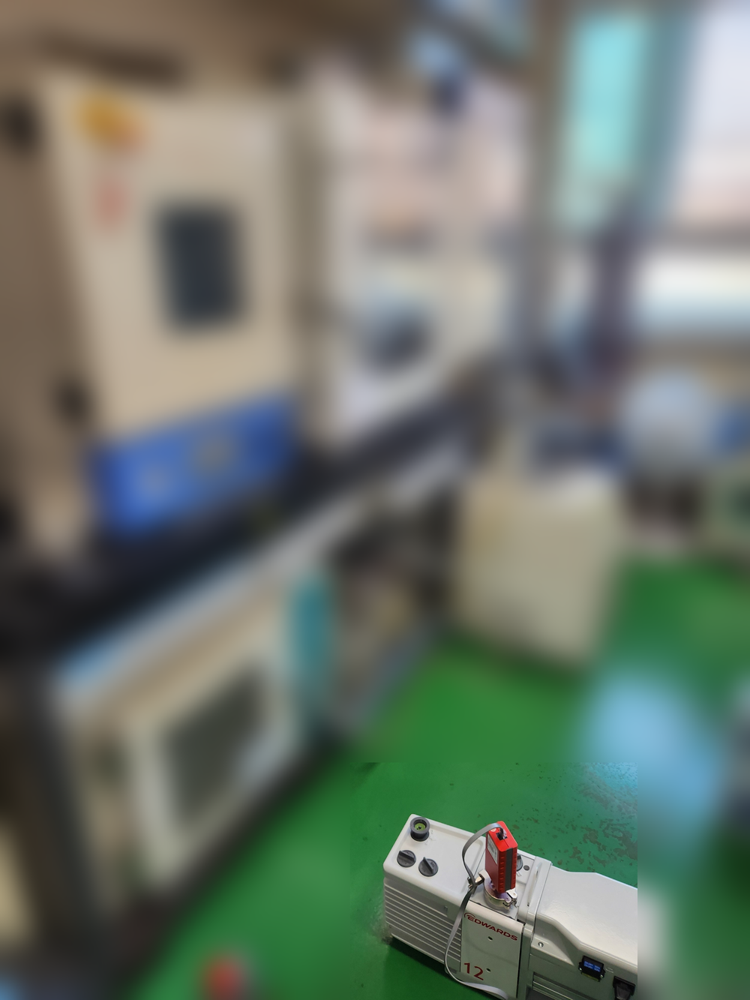

<!-- 수치검증: A항목 8개 확인 / B항목 0개 확인 / 삭제 0개 / 교체 0개 -->

# 진공 건조 드라이펌프 선택 기준 3가지 — 용매·규모·청정도

진공 오븐에 연결할 펌프를 고를 때 가장 많이 받는 질문이 있습니다. "오일 펌프랑 드라이 펌프 중 어떤 게 맞나요?" 오일 로터리 펌프가 훨씬 저렴하고 진공도도 충분히 나오는데, 왜 드라이펌프를 써야 하냐는 것입니다. 결론부터 말씀드리면, 건조 대상 용매와 챔버 규모에 따라 답이 달라집니다. 잘못 고르면 6개월 만에 오일을 버려야 하거나, 첫날부터 용량이 부족해 건조 시간이 두 배가 됩니다.

## 오일 로터리 펌프를 쓰면 안 되는 경우가 있나요?

진공 건조 공정에서 오일 로터리 펌프의 가장 큰 약점은 오일 오염입니다. 수분, NMP(이차전지 전극 코팅에 쓰는 용매), 에탄올 등 용매 증기가 펌프 내부로 들어오면 오일에 녹아버립니다. 오일 점도가 낮아지고 밀봉 성능이 떨어지면서 결국 오일 교환 주기가 짧아집니다. 일반 공정에서 500~1,000시간마다 교환하던 오일을, 용매 부하가 심한 건조 공정에서는 200~400시간으로 줄여야 하는 경우가 생깁니다.

가스발라스트 기능을 켜면 수증기 처리에 도움이 됩니다. RV12의 경우 가스발라스트 II 상태에서 수증기 290 g/h를 처리합니다. (✅ 스마텍 product_master_table) 하지만 이는 수분 건조에 국한된 이야기이고, NMP처럼 비점이 높은 용매는 가스발라스트만으로 해결되지 않습니다.

## 드라이 스크롤 펌프는 어떤 오븐에 맞나요?

nXDS 시리즈는 공정부에 오일이 없는 완전 오일프리 구조입니다. 용매 증기가 들어와도 내부가 오염되지 않아 소형 진공 오븐과 연구실 장비에 많이 씁니다.

- nXDS6i: 배기속도 6.2 m³/h, 도달진공 2×10⁻² mbar (✅ 스마텍 product_master_table)
- nXDS10i: 배기속도 11.4 m³/h, 도달진공 7×10⁻³ mbar (✅ 스마텍 product_master_table)
- nXDS15i: 배기속도 15.1 m³/h, 도달진공 7×10⁻³ mbar (✅ 스마텍 product_master_table)

챔버 5~50L 수준의 소형 오븐, 에탄올·아세톤·물 건조, 연구실 소배치 공정에 적합합니다. 소음이 52 dB(A)로 낮고 유지보수 항목이 단순해 관리 부담도 적습니다.

XDS35i는 배기속도 35 m³/h, 도달진공 1×10⁻² mbar로 중형 오븐(50~200L급)까지 커버합니다. NMP 용매를 다루는 배터리 관련 연구 라인에서도 선택하는 모델입니다.

## 산업 규모 건조라면 드라이 스크류 펌프가 맞습니다

챔버가 500L를 넘거나, 배치 사이클이 짧고 연속 가동이 필요한 라인이라면 드라이 스크류 계열을 검토해야 합니다.

GXS 시리즈는 대배기속도와 수냉 방식이 특징입니다.

- GXS160: 배기속도 160 m³/h, 도달진공 7×10⁻³ mbar (✅ 스마텍 product_master_table)
- GXS250: 배기속도 250 m³/h, 도달진공 4×10⁻³ mbar (✅ 스마텍 product_master_table)

EXS 시리즈는 VFD(인버터)가 내장되어 대기압에서 진공 구간까지 회전수를 자동 조절합니다. 배기 초반 고부하 구간에서 에너지를 절감하고 펌프 수명에도 유리합니다.

두 계열 모두 운전 중 질소 퍼지가 필요합니다. 퍼지 없이 용매 증기만 통과하면 내부 고착이 생길 수 있습니다. 배기 라인에 콘덴서(냉각 트랩)를 달아 용매를 회수하는 방식도 병행하면 좋습니다.

## 어떤 기준으로 최종 선택하나요?

세 가지를 확인하면 됩니다.

첫째, 건조 대상 용매입니다. 수분·에탄올처럼 비점이 낮고 오일에 잘 녹는 용매라면 드라이펌프 선택이 유리합니다. NMP 같은 고비점 유기용매도 드라이 방식이 오일 오염 걱정이 없습니다.

둘째, 챔버 용량과 배기 시간 요구치입니다. 소형 오븐(50L 이하)이라면 nXDS 스크롤, 대형 챔버(500L 이상)라면 GXS/EXS 스크류가 기준입니다.

셋째, 청정도 요구입니다. 반도체 부품, 의약품 중간체처럼 오일 역류 흔적도 허용되지 않는 공정이라면 드라이펌프가 필수입니다.

펌프 용량이 애매하거나 부스터 추가 여부가 불확실하다면 실제 챔버 사양과 공정 조건을 가지고 문의하시면 적합한 모델을 바로 안내드릴 수 있습니다.

---

관련 상담은 아래 연락처로 편하게 남겨주세요.

Tel : 031 204 7170
info@smartechvacuum.com
www.smartechvacuum.com

---

#진공건조 #드라이펌프 #진공오븐 #nXDS #GXS펌프 #오일프리 #EXS펌프 #진공펌프선택 #Edwards진공펌프 #에드워드진공펌프
