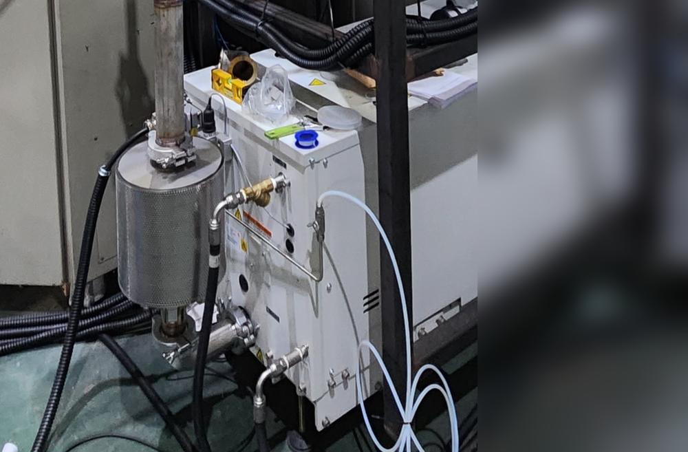

# 진공펌프 배기 소음 줄이는 방법 — 머플러·소음기 선택 기준

<!-- 수치검증: A항목 0개 / B항목 0개 / 삭제 0개 / 교체 0개 -->

GXS 드라이 스크롤 펌프를 새로 설치하고 첫 가동을 시작하면, 배기구에 아무것도 연결되지 않은 상태에서 상당한 맥동음이 발생합니다. 작업장 전체로 소리가 퍼지는 상황. 소음기(머플러) 없이 대기로 바로 배기가 되면 이런 현상은 피하기 어렵습니다.

소음기는 GXS 계열 펌프의 기본 사양에 포함되지 않고, 별도 옵션으로 구매해야 합니다. 설치 현장 조건에 따라 배관 연결로 대체할 수 있지만, 조건이 맞아야 합니다. 소음기 선택 기준과 현장 적용 방법을 정리합니다.

## 진공펌프 배기 소음의 원인

드라이 스크롤 펌프나 로터리 펌프는 내부에서 기체를 압축해 배기구로 강제 방출합니다. 기체가 대기압 환경으로 갑자기 팽창하면서 맥동성 소음이 발생합니다. 배기구 구경이 클수록, 유량이 많을수록 이 소리는 더 커집니다.

배기구에 소음기를 달거나 배관을 연결해 유속을 낮추고 팽창 충격을 분산시키는 것이 기본 해결 방법입니다. 어떤 방법을 선택할지는 현장 레이아웃과 공정 조건에 따라 달라집니다. 소음기 없이 운전을 계속하면 주변 작업자의 피로도가 쌓이고, 산업안전 소음 기준을 넘길 수 있습니다.

## 소음기(머플러)란 무엇인가

소음기는 배기구에 직결하는 방음 장치입니다. 내부에 흡음재(소결 금속 또는 스테인리스 울)가 들어 있어 배기음을 흡수하고 팽창 충격을 완충합니다. 추가 배관 없이 배기구에 바로 나사 결합 또는 플랜지로 연결하는 구조가 일반적입니다.

GXS 계열 펌프의 배기구는 사이드(측면) 배출 방향으로 나와 있는 형태가 많습니다. 여기에 같은 방향의 소음기를 직결하면 설치가 간단합니다. 현장 레이아웃 때문에 배기 방향이 맞지 않는다면 리어(후면 직선형) 배출 파트로 교체하는 방법이 있지만, 이 파트는 국내 재고가 없는 경우가 대부분이라 수입 납기를 감안해야 합니다. 설치 일정이 촉박하다면 현재 방향 그대로 소음기를 직결하는 것이 현실적입니다.

## 머플러 선택 기준 3가지

### 1. 펌프 배기구 사이즈(구경)

소음기는 펌프 배기 포트의 플랜지 규격에 정확히 맞아야 합니다. GXS 계열은 모델마다 배기구 규격이 다릅니다. 예를 들어 GXS160의 배기구는 NW25, GXS750은 NW40 규격으로 구분됩니다. 반드시 모델명을 확인한 후 대응하는 소음기를 선택해야 합니다.

구경이 맞지 않으면 어댑터를 추가해야 하는데, 이때 유로가 좁아지면서 배압이 올라가 펌프 성능에 영향을 줄 수 있습니다. 일반적으로 배기구보다 한 단계라도 작은 구경의 소음기를 연결하면 배압이 허용 범위(대부분 50mbar 이하)를 초과할 수 있으므로, 동일 규격 또는 한 단계 큰 소음기를 선택하는 것이 원칙입니다.

현장에서 어댑터를 이미 사용 중이라면, 어댑터 연결부의 내경을 줄이지 않았는지 반드시 확인하세요. 내경이 좁아진 구간이 생기면 맥동음이 오히려 증폭되는 경우가 있습니다.

### 2. 재질

건식 공정(클린룸, 반도체, 이차전지)에서는 오일 미스트 배출이 없으므로 표준 소결 스테인리스 타입으로 충분합니다. 이 재질은 내식성이 양호하고 유지관리 주기가 길어 범용 환경에 가장 많이 사용됩니다.

부식성 가스(염소계, 불소계, HCl, HF 등)가 포함된 배기라면 내화학성 재질(PTFE 내장형 또는 특수 코팅)을 써야 합니다. 재질이 맞지 않으면 소결체가 부식되고 오히려 배기 막힘이 생깁니다. 공정 가스 종류를 먼저 확인한 후 재질을 결정해야 합니다.

오일로터리 펌프처럼 오일 미스트가 함께 배출되는 경우에는 소결 금속 내부에 오일이 포화되어 막힐 수 있습니다. 이 경우에는 오일 트랩 또는 오일 미스트 필터를 소음기 전단에 추가 설치하거나, 별도 배관 배기 방식을 검토하는 것이 낫습니다.

### 3. 소음 감쇠량

소음기의 감쇠 성능은 제품마다 다릅니다. 일반적인 소결 스테인리스 소음기의 감쇠량은 주파수 대역에 따라 10~25dB(A) 수준입니다. 작업장 소음 규정에 따라 목표 감쇠량을 먼저 설정하세요.

산업안전보건법 기준으로 8시간 평균 90dB(A)를 초과하면 안 되고, 115dB(A) 이상은 순간 노출도 금지합니다. 소음기 없이 GXS 계열 펌프 배기 맥동음이 작업장 내에서 95~100dB(A)에 달하는 경우, 소음기 단독으로는 기준치 아래로 내리기 충분하지 않을 수 있습니다. 이 경우 소음기 장착 후 배관을 추가로 연결해 실외 배기를 병행하는 조합을 검토할 수 있습니다.

| 방법 | 장점 | 주의사항 |
|------|------|----------|
| 소음기 단독 직결 | 설치 간단, 공간 불필요 | 감쇠량에 한계 있음 |
| 배관 연결 (실외 배기) | 소음 + 오염가스 동시 해결 | 배압 상승 주의 |
| 소음기 + 배관 조합 | 최대 감쇠 효과 | 비용과 공간 필요 |

## 배관 연결로 대체할 수 있는 경우

소음기 없이 벨로즈 + 배관을 연결해 건물 외부로 배기를 내보내는 방법도 있습니다. 소음 저감과 오염 가스 외부 배출을 동시에 해결할 수 있어 효율적입니다.

다만 배관 길이가 길어질수록 배압(back pressure)이 올라가 펌프 성능이 영향을 받습니다. 배관 직경을 펌프 배기구보다 줄이지 않고, 굴곡 횟수를 최소화하는 것이 설계 원칙입니다. 현장 설계팀에서 간섭 문제로 배관 설치 자체가 어렵다면 소음기 단독 설치가 더 현실적인 선택입니다.

## 소음기 없이 배관으로 대체할 수 있는 조건

소음기 없이 배관만으로 배기를 처리하려면 아래 조건을 모두 충족해야 합니다. 하나라도 벗어나면 배압 초과나 소음 문제가 재발할 수 있습니다.

**배관 내경 조건**: 펌프 배기 포트 내경 이상을 유지해야 합니다. 내경을 줄이는 리듀서 사용은 배압 상승의 주요 원인입니다. GXS 계열 기준으로 배기구 내경(NW25~NW40)과 동일하거나 한 단계 큰 배관을 사용하세요.

**배관 길이 조건**: 직관(곡선 없는 직선 구간) 기준으로 5m 이내가 권장입니다. 5m를 초과하면 배압이 누적되어 허용 범위를 벗어날 수 있습니다. 10m 이상이 불가피하다면 배관 내경을 한 단계 더 크게 선택하거나, 소음기를 배기구 직결부에 함께 달아 합산 배압을 줄여야 합니다.

**엘보(꺾임) 횟수 제한**: 90도 엘보 1개는 직관 약 1~2m의 배압 저항과 동일합니다. 총 엘보 수를 3개 이내로 제한하고, 불가피할 경우에는 45도 엘보 2개를 직렬로 연결해 저항을 줄이는 방법을 사용합니다.

**실내 배기 라인 연결 시 주의**: 기존 건물 배기 덕트(공조 계통)에 진공펌프 배기를 합류시키는 경우, 합류 지점의 정압(靜壓) 조건을 반드시 확인해야 합니다. 공조 덕트 내 압력이 대기압보다 높으면 역류가 발생해 펌프에 심각한 손상을 줄 수 있습니다. 반드시 체크밸브를 설치하고, 전용 배기 라인으로 분리하는 것이 안전합니다.

## 설치 후 점검 체크리스트

소음기나 배관을 연결한 직후에는 아래 항목을 순서대로 점검합니다. 한 가지라도 이상이 있으면 펌프를 정지하고 원인을 확인한 후 재가동하세요.

**체결 토크 확인**: NW 클램프 방식의 소음기는 클램프를 손으로 충분히 조인 후 스패너로 2분의 1회전을 더 조입니다. 과도한 토크는 클램프 변형을 유발하고, 불충분한 조임은 배기 누설의 원인이 됩니다. 나사 결합 방식의 경우 규정 토크(제품마다 다름)를 확인하고, PTFE 테이프나 가스켓이 끼워졌는지 확인하세요.

**배압 확인**: 배기 라인에 압력계를 설치할 수 있다면 가동 초기에 배압을 측정합니다. GXS 계열 기준 허용 배압은 일반적으로 50mbar 이하입니다. 이를 초과하면 펌프 온도가 올라가고 최종 도달 진공도가 나빠질 수 있습니다. 별도 압력계가 없다면 펌프 배기구 부근의 온도 변화로 간접 확인이 가능합니다.

**진동 여부**: 소음기 또는 배관이 설치 후 가동 중에 흔들리거나 맥동 진동이 전달되면, 연결부 볼트 풀림이나 피로 균열로 이어질 수 있습니다. 가동 후 10분 이내에 배관 전 구간을 손으로 눌러보고 진동이 느껴지면 벨로즈(진동 흡수 이음매) 추가를 검토하세요.

**누설 확인**: 배기 연결부에 비눗물을 가볍게 도포하고 기포 발생 여부를 확인합니다. 배기가 이루어지는 양압 구간이기 때문에 누설이 발생하면 기포가 곧바로 확인됩니다. 누설이 발견되면 가동을 즉시 중단하고 클램프·가스켓을 재점검합니다.

## 현장 적용 사례 — GXS 계열 소음기

국내 산업 현장에 GXS 드라이 스크롤 펌프를 납품한 케이스에서, 소음기 없이 첫 가동을 진행했을 때 배기 맥동음이 작업 구역 전체로 퍼지는 문제가 발생했습니다. 배관 설치 공간이 없어 실외 배기가 어려운 상황이었고, 소음기 옵션을 사후 추가하는 방식으로 처리했습니다.

확인한 순서는 이렇습니다. 먼저 모델명으로 배기구 규격 확인 → 현재 사이드 배출 방향 그대로 소음기 선택 → 직결 설치. 추가 배관 없이 설치가 완료됐고, 현장 소음 수준을 만족할 수 있었습니다.

소음기를 나중에 추가하는 것도 가능하지만, 펌프 설치 시점에 함께 구매하면 설치 공수를 줄일 수 있습니다. 소음 문제가 예상되는 환경이라면 처음부터 옵션으로 포함하는 것을 권장합니다.

지금 GXS를 운영 중인데 배기 소음이 문제라면, 모델명과 배기구 방향(사이드/리어)을 먼저 확인하세요. 두 가지 중 어떤 방법이 적합한지 판단이 어렵다면 현재 모델명과 현장 상황을 알려주시면 함께 검토해 드립니다.

## 자주 묻는 질문

**Q. 소음기 교체 주기는 어떻게 됩니까?**

소결 스테인리스 소음기는 소모품이 아니라 내구재로 설계되어 있어 별도 교체 주기가 정해진 제품은 아닙니다. 단, 내부 소결체가 먼지·파티클·오일 미스트로 막히면 배압이 올라가므로, 배압이 기준치를 초과하거나 소음 저감 효과가 뚜렷이 줄었다면 세척 또는 교체를 검토해야 합니다. 오염이 심하지 않은 클린 공정에서는 수년간 문제없이 사용하는 경우도 많고, 오일 미스트가 함께 배출되는 환경에서는 6개월~1년 주기로 점검하는 편이 안전합니다.

**Q. 배기 가스에 부식성 성분이 포함되어 있는데, 소음기를 써도 됩니까?**

부식성 가스(HCl, HF, Cl₂ 등)가 포함된 배기에 표준 스테인리스 소결 소음기를 사용하면 소결체 내부부터 부식이 진행됩니다. 단기간에 소결체가 손상되어 소음 감쇠 효과가 사라지고, 부식 생성물이 탈락해 배관을 오염시킬 수 있습니다. 이런 환경에는 PTFE 내장형 또는 내화학 코팅 소음기를 선택하거나, 소음기 없이 배관으로 실외 배기를 처리하는 방법을 우선 검토해야 합니다. 공정 가스 성분을 미리 알려주시면 적합한 방식을 안내해 드립니다.

**Q. 배압 한계를 초과하면 어떤 문제가 생깁니까?**

배압이 허용 범위(GXS 계열 기준 약 50mbar)를 초과하면 다음 증상이 순서대로 나타납니다. 먼저 펌프 모터 부하가 높아지고 전류값이 올라갑니다. 이어서 펌프 본체 온도가 상승하고 내부 윤활유(그리스) 수명이 단축됩니다. 지속되면 최종 도달 진공도가 사양보다 나빠지고, 장기적으로는 내부 마모 및 베어링 수명 저하로 이어집니다. 배압 초과를 방치하면 수리 비용이 단순 소음기 교체 비용보다 훨씬 커지므로, 설치 후 초기 배압 확인은 반드시 실시하는 것이 좋습니다.

## 소음기 설치 전 자주 나오는 질문

**"소음기 없이 잠깐만 돌려도 되나요?"**
펌프 자체에 문제가 생기지는 않습니다. 소음기는 펌프 보호용이 아닌 소음 저감 장치입니다. 다만 산업안전보건법 소음 노출 기준(8시간 평균 90dB)을 지속적으로 초과할 경우 작업자 보호 의무가 생깁니다.

**"배관 대신 소음기를 사용하면 배기가스가 실내에 그대로 머무는 건 아닌가요?"**
맞습니다. 소음기는 소리만 줄이고 배기가스는 실내로 방출됩니다. 오염 가스나 냄새 문제가 있는 공정이라면 배관으로 실외 배기하는 방식이 우선입니다. 냄새나 가스 없이 소음만 문제라면 소음기로 충분합니다.

031-204-7170 / info@smartechvacuum.com

---

GXS·nXR 계열 진공펌프 소음기 선택 및 배관 구성 상담. 배기구 규격과 공정 조건에 따라 적합한 방식이 달라집니다.
