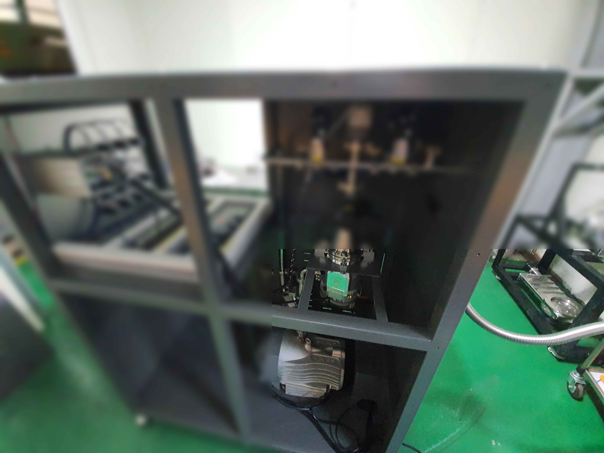
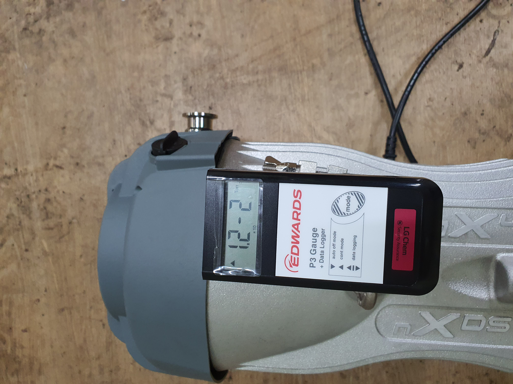
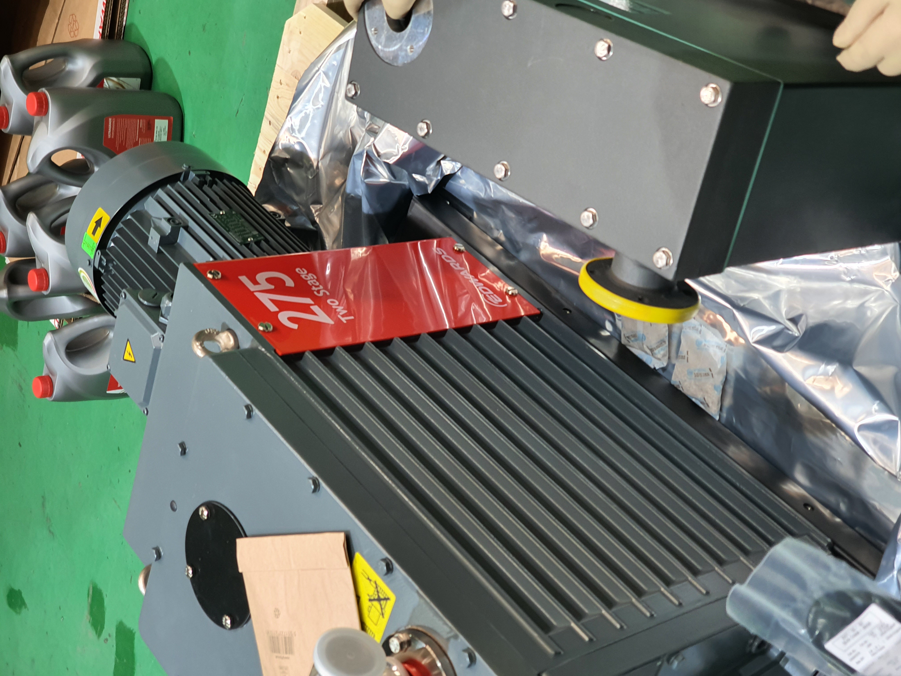
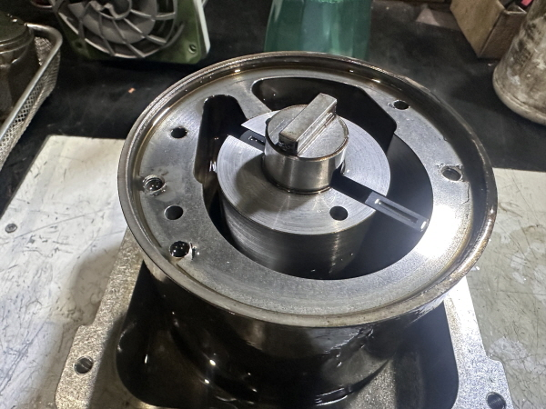

# 진공펌프 수리 시 주의사항 7가지 — 안전·오일·재조립까지

진공펌프 수리, 막상 시작하려면 어디서부터 손을 대야 할지 막막하지 않으셨나요? 순서를 지키지 않으면 작은 문제가 큰 고장으로 번질 수 있습니다. 30년 이상 Edwards 진공펌프를 전문으로 다뤄온 스마텍의 현장 경험을 바탕으로, 수리 전·중·후 반드시 지켜야 할 핵심 주의사항을 정리했습니다.

---

## 전원은 반드시 차단하고 1시간 이상 냉각해야 하지 않나요?

진공펌프 수리의 첫 번째 원칙은 전원 완전 차단입니다. 단순히 스위치를 끄는 것으로는 부족합니다. 국제 안전 기준(Lockout/Tagout, LOTO)에 따라 차단기를 잠그고 "유지보수 중" 태그를 부착해야 예기치 않은 재가동을 막을 수 있습니다.

전원을 끊은 뒤에는 최소 1시간 이상 펌프를 식혀야 합니다. Edwards 공식 서비스 문서에서도 로터리 베인 펌프는 작동 중 상당한 열을 발생시키므로 충분히 냉각된 후에야 분해에 들어가야 한다고 명시하고 있습니다. 뜨거운 상태에서 분해하면 오일이 튀거나 화상을 입을 위험이 있습니다.

---

## 분해 전, 고장 원인을 먼저 진단해야 하지 않나요?

무작정 펌프를 열기 전에 원인을 파악하는 것이 순서입니다. 원인 없이 분해하면 멀쩡한 부품까지 손상될 수 있습니다.

**현장에서 활용하는 주요 점검 항목은 다음과 같습니다.**

| 점검 항목 | 판단 기준 |
|-----------|-----------|
| 진공도 측정 | 200~500 micron → 오일 교체 시기 / 1000 micron 이상 → 내부 수리 필요 |
| 오일 상태 | 검게 변색, 유화, 이물질 혼입 여부 확인 |
| 누설 여부 | 본체·연결부·배관 오일·가스 누설 점검 |
| 소음·진동 | 금속 마찰음, 이상 진동 발생 여부 |
| 모터 상태 | 표면 손상·부식 여부 |

진공 게이지 수치가 1000 micron 이상이라면 내부 베인·베어링·씰 손상 가능성이 높으므로 전문 업체 수리를 검토하시는 것이 합리적입니다.

---

## 화학물질·독성 가스 위험, 어떻게 대비해야 하나요?

진공펌프는 공정 가스, 부식성 화학물질, 독성 증기를 처리하는 경우가 많습니다. 수리 시 이런 물질이 직접 노출될 수 있어 보호 장비 착용이 필수입니다.

**반드시 착용해야 할 보호 장비(PPE):**
- 안전 고글 (눈 보호)
- 내화학성 장갑
- 방진·방독 마스크 (처리 물질에 따라 선택)
- 이상 소음 환경에서는 귀마개 추가

특히 수소 등 가연성 가스를 처리하던 펌프는 분해 시 산소와 접촉해 폭발 위험이 생길 수 있습니다. Edwards 안전 설명서는 이 경우 불활성 가스(질소 등)로 내부를 퍼지한 뒤 분해할 것을 권고하고 있습니다. 또한 수리 중 펌프 배기를 실내로 그대로 방출하지 않도록 반드시 환기 덕트 쪽으로 유도해야 합니다.

---

## 오일 교체, 어떤 순서로 진행해야 하나요?

오일은 로터리 베인 진공펌프 수리에서 가장 자주 다뤄야 하는 요소입니다. 순서를 지키지 않으면 내부 세척이 불완전해집니다.

**오일 교체 4단계 절차:**

1. 펌프를 짧게 운전해 약간 따뜻하게 만든 뒤 전원을 끕니다. (따뜻한 상태가 오일 배출에 유리합니다.)
2. 오일 배출 플러그를 열어 오래된 오일을 완전히 빼냅니다.
3. 새 오일 100~500ml를 넣고 펌프를 5~10회 회전시켜 내부를 세척한 뒤 다시 배출합니다. 오래된 오일이 완전히 제거될 때까지 3~5회 반복합니다.
4. 배출 플러그를 닫고 새 오일을 제조사 권장량으로 채웁니다.

**반드시 지켜야 할 금지 사항:**
- 제조사가 지정하지 않은 오일 사용 금지 (씰 손상·성능 저하 원인)
- 오염된 오일은 유해 폐기물로 별도 처리 (일반 쓰레기로 버리면 안 됩니다)
- 오일 부족 상태로 가동 금지 (베어링·베인 빠른 마모 원인)

스마텍에서는 Edwards 전용 오일(Ultra19)을 공급하고 있으며, 지정 오일 외 사용 시 발생하는 손상은 수리 보증에서 제외됩니다.

---

## 부품 분해 후 재조립, 실수 없이 하려면 어떻게 해야 하나요?

분해 순서를 기록하지 않고 작업하면 재조립 시 실수가 반드시 발생합니다. 현장에서 가장 흔하게 보는 실수가 바로 이 부분입니다.

**재조립 실수를 막는 핵심 원칙:**
- 분해 시 각 부품을 꺼낸 순서대로 늘어놓습니다. 재조립은 역순으로 진행합니다.
- 베인(로터리 펌프 내부의 날개 부품)은 균열·과도한 마모가 있으면 반드시 한 세트 전체를 동시에 교체해야 합니다. 일부만 교체하면 마모 불균형이 발생합니다.
- 베어링 그리스(윤활유) 과다 주입 금지. 과다 주입 시 씰을 밀어내거나 과열을 유발합니다.
- O링·가스켓 등 씰류는 분해 후 반드시 육안 점검하고, 경화·균열이 있으면 교체합니다.
- Edwards 서비스 기준상 3,000시간 사용 후에는 전체 분해 점검(오버홀)을 권고합니다.

---

## 수리 후 바로 정상 가동해도 괜찮을까요?

수리가 끝났다고 바로 풀가동하면 안 됩니다. 반드시 시운전과 검증 절차를 거쳐야 합니다.

**수리 후 필수 검증 4단계:**
1. 진공 게이지로 진공도를 측정해 정상 범위인지 확인합니다.
2. 누설 테스트를 실시해 모든 연결부와 씰의 기밀 유지를 점검합니다.
3. 이상 소음·진동·과열이 없는지 시운전하며 확인합니다.
4. 오일 레벨을 확인하고, 수리 후 며칠간 오일 누설 여부를 특히 주의 깊게 관찰합니다.

---

## 어떤 경우에 전문 업체에 맡겨야 하나요?

자가 수리가 가능한 범위는 생각보다 좁습니다. 아래 기준으로 판단하시기 바랍니다.

**자가 수리 가능 범위:**
- 오일 교체
- 외부 필터 청소 및 교체
- 육안으로 명확히 확인되는 호스·연결부 교체

**전문 업체 수리가 필요한 경우:**
- 진공도가 1000 micron 이상으로 크게 저하된 경우
- 이상 소음 또는 진동이 발생하는 경우
- 내부 베인·베어링·씰 교체가 필요한 경우
- 독성·부식성·가연성 물질을 처리하던 펌프
- 전기 계통(모터) 이상이 의심되는 경우

스마텍은 Edwards 코리아 공식 대리점으로, 특수 측정 장비와 30년 이상의 현장 경험을 바탕으로 수리 후 시운전 및 검증 절차를 포함한 완전한 서비스를 제공합니다. 수리 견적서 발행과 A/S 보증 기간도 명확히 안내드립니다.

진공펌프 수리가 필요하시거나 궁금한 점이 있으시면 언제든지 연락 주시기 바랍니다.

**031-204-7170 / www.smartechvacuum.com**

---

추가로 궁금한 점은 아래로 문의해 주세요.

Tel : 031 204 7170
info@smartechvacuum.com
www.smartechvacuum.com

#진공펌프수리 #진공펌프주의사항 #Edwards진공펌프 #에드워드진공펌프 #진공펌프오일교체 #진공펌프유지보수 #산업용진공펌프 #스마텍 #진공펌프전문
