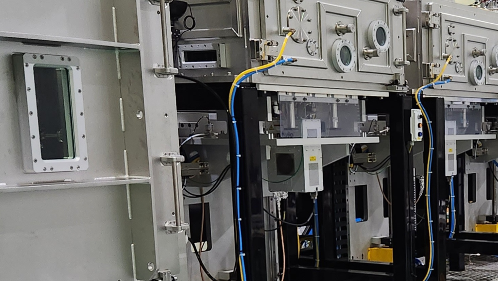

<!-- 수치검증: A항목 2개 확인(10⁻⁵~10⁻⁸ mbar 공정 요구 진공도, 백킹 진공 10⁻¹~10⁻² mbar) / B항목 1개(GXS+iXH 조합 현장 사례로 표현) / 삭제 0개 / 교체 0개 -->

# OLED·LCD 제조에서 드라이펌프로 전환하는 이유 — 오일로터리펌프의 한계

OLED와 LCD 패널을 만드는 증착(evaporation)과 스퍼터링(sputtering) 공정은 10⁻⁵~10⁻⁸ mbar 수준의 초고진공 환경이 전제 조건이다. 이 진공도를 유지하지 못하면 유기 발광층이 오염되고, 픽셀 결함이 쌓여 수율이 떨어진다. 진공 시스템 선택이 품질 관리의 시작인 이유다.

오랫동안 OLED 라인에서도 오일로터리 베인 펌프를 백킹 펌프로 써왔다. 가격이 낮고 유지 방법이 익숙하기 때문이다. 그런데 최근 몇 년 사이 드라이 스크류 펌프로 교체하는 현장이 눈에 띄게 늘었다. 이유는 하나다. 오일 역류(backstreaming) 문제가 해결되지 않아서다.

## 오일로터리펌프의 문제 — 오일 역류(backstreaming)란

오일로터리 베인 펌프는 내부 밀봉과 윤활을 위해 오일을 사용한다. 이 오일이 기화되어 챔버 방향으로 흘러 들어가는 현상이 backstreaming(역류)이다.

OLED 증착 공정에서 오일 분자가 기판 위에 흡착되면 연쇄 문제가 생긴다. 유기 발광층 오염으로 발광 효율이 떨어지고, 전극 접합부에 이물질이 끼어 픽셀 결함이 발생한다. 백킹 펌프로만 사용하더라도, 오일 증기는 터보분자 펌프 앞단을 통해 장기적으로 챔버 내부로 침투한다. 챔버 세정 주기가 짧아지고, 세정 중 생산이 멈추는 다운타임이 늘어난다.

## 오일 트랩으로는 부족한 이유

오일 트랩(cold trap 또는 zeolite trap)은 backstreaming을 줄이는 보조 수단으로 많이 쓰인다. 그러나 완전한 차단은 불가능하다. 이유는 세 가지다.

첫째, 트랩 포화 문제다. 트랩이 포화되면 흡착 효율이 급격히 떨어진다. 교체 시점을 놓치면 보호 기능이 사라진다. 둘째, 시스템 기동 초기(cold start)와 배기 가속 구간에서는 오일 증기가 트랩을 우회한다. 이 구간이 오염에 가장 취약하다. 셋째, 트랩 정기 교체와 재생 비용이 누적되며, 교체 작업 중 생산 중단 시간도 추가된다.

클린룸 환경을 요구하는 OLED 라인에서 이 정도의 오염 위험은 허용치를 초과한다. 트랩을 추가해도 근본 원인인 오일 자체를 없애지 못하는 한, 불량률 관리에는 한계가 있다.

## 드라이 스크류 펌프로 전환할 때 체크할 3가지

드라이 스크류 펌프는 오일을 전혀 사용하지 않는다. 역류 자체가 없다. 대신 전환 전에 확인할 점이 있다.

**1. 도달 진공도 범위 확인**
드라이 스크류 펌프 단독으로는 백킹 진공(약 10⁻¹~10⁻² mbar)을 담당한다. 초고진공은 터보분자 펌프와 조합해야 달성된다. 기존 터보 펌프가 있다면 백킹 라인만 교체하는 방식으로 전환할 수 있다. 다만 기존 오일로터리보다 배기 속도가 다소 낮은 모델로 교체하면 배기 시간이 늘어날 수 있으므로, 현재 사용 중인 오일로터리의 배기 속도(m³/h)와 동급 이상의 드라이 펌프를 선정하는 것이 기본이다. 챔버 용적이 클수록 루츠 부스터와의 조합을 함께 검토한다.

**2. 공정 가스 적합성 확인**
OLED 공정에서 사용하는 질소, 아르곤 같은 불활성 가스는 드라이 스크류 펌프와 문제없이 호환된다. 반응성 가스가 포함된 공정은 사전에 가스 종류와 펌프 재질을 대조해야 한다. 드라이 스크류 펌프는 내부에 오일이 없는 대신 스크류 로터와 케이싱 사이 간극이 매우 좁다. 반응성 가스가 내벽에 고체로 석출되거나 부식을 일으키면 로터가 고착될 수 있어, 가스 종류와 펌프 코팅·재질의 조합을 제조사와 반드시 확인한다.

**3. 소음·진동 환경 검토**
드라이 스크류 펌프는 오일로터리보다 소음과 진동이 클 수 있다. 방진 마운트 설치와 배관 연결부 유연성 확보를 사전에 검토한다. 클린룸 바닥에 직결할 경우 진동이 인근 측정 장비에 영향을 줄 수 있으므로, 방진 패드 또는 플렉시블 벨로스 배관을 적용해 진동 전달을 차단하는 것이 일반적이다. 오일로터리 때와 동일한 배관 레이아웃을 그대로 쓰면 유연성 부족으로 진동이 증폭되는 경우가 있다.

## 전환 전 반드시 확인할 호환성 체크리스트

드라이 스크류 펌프는 외형과 연결 규격이 오일로터리와 다를 수 있다. 설치 전 아래 항목을 현장 도면과 대조한다.

**배기 포트 규격**
펌프 흡기·배기 포트의 플랜지 규격(ISO-KF, ISO-K, CF 등)과 크기를 확인한다. 기존 배관과 규격이 다르면 어댑터 또는 신규 플랜지 가공이 필요하다. 포트 위치(상부·측면·하부)도 펌프 모델마다 달라 배관 경로가 바뀔 수 있다.

**전원 사양**
드라이 스크류 펌프는 모터 출력이 오일로터리보다 높은 경우가 많다. 3상 200V 또는 400V 사양 중 현장 전원 공급 방식과 일치하는지 확인하고, 기동 전류(in-rush current)를 견딜 수 있는 차단기 용량을 미리 검토한다. 인버터(소프트 스타터) 내장 모델은 기동 전류가 낮아 기존 배전반을 그대로 쓸 수 있는 경우가 있다.

**냉각수 연결 여부**
드라이 스크류 펌프 중 수냉식 모델은 냉각수 공급 라인이 필요하다. 공냉식 모델은 냉각수 불필요하지만 설치 공간에 적정 환기가 확보돼야 한다. 클린룸 내 냉각수 라인 증설은 공사 일정이 필요하므로, 도입 전 설비팀과 사전 협의가 필요하다.

## Edwards 드라이펌프 + GXS 부스터 조합 사례

챔버 용적이 크거나 배기 속도가 부족할 경우, GXS(루츠 부스터)와 드라이 스크류 펌프를 조합하는 구성을 검토한다.

GXS 시리즈는 루츠 원리로 작동하며, 드라이 백킹 펌프와 결합하면 중간 진공 구간의 배기 속도를 크게 높인다. 오일 없는 구성이 유지되므로 챔버 오염 위험이 없다. 스마텍에서 납품한 사례 중, 대형 스퍼터링 챔버에 GXS + iXH 조합을 적용해 배기 시간을 단축한 경우가 있다. 챔버 용적과 공정 가스 종류에 따라 최적 조합이 달라지므로, 현장 조건 확인이 먼저다.

## 전환 비용 vs 불량 비용 — 현실적 판단 기준

드라이 펌프의 초기 도입 비용은 오일로터리보다 높다. 이 점이 전환을 주저하게 만든다.

그러나 다음 항목을 비교하면 판단이 달라진다.

| 항목 | 오일로터리 + 트랩 | 드라이 스크류 |
|------|-----------------|------------|
| 오일 교환 비용 | 분기별 발생 | 없음 |
| 트랩 교체 비용 | 연간 발생 | 없음 |
| 챔버 세정 비용 | 오염 발생 시 수십만~수백만 원 | 미발생 |
| 패널 불량률 | 오일 역류에 따라 증가 가능 | 감소 |

구체적인 수치로 판단하려면 다음 항목을 측정한다. 먼저 현재 챔버 세정 주기(일 단위)와 1회 세정 시 생산 중단 시간(시간 단위)을 기록한다. 여기에 시간당 생산 가능 패널 수와 패널 1장당 단가를 곱하면 세정 1회당 손실 금액이 나온다. 예를 들어 세정 1회 중단 시간이 8시간, 시간당 패널 처리량이 20장, 단가가 5만 원이라면 1회 세정당 생산 손실만 800만 원이다. 오일 역류로 세정 주기가 6개월에서 3개월로 짧아진 경우, 연간 손실이 1,600만 원 추가된다. 드라이 펌프 도입 비용과 이 수치를 비교하면 투자 회수 기간이 명확히 보인다.

패널 1장당 단가가 높은 OLED 라인에서 불량 1건의 손실은 펌프 교체 비용을 단기에 넘어설 수 있다. 오일 교환 주기가 3개월 미만으로 짧아지거나, 챔버 세정 횟수가 늘기 시작했다면 전환을 검토할 시점이다. 트랩을 교체해도 세정 주기가 줄지 않는다면, 오일 자체를 없애는 구조 변경이 더 현실적인 해결책이다.

## 오일로터리에서 드라이로 전환한 현장 적용 사례

디스플레이 관련 공정을 운영하는 한 제조 현장에서 오일로터리 베인 펌프 + 제올라이트 트랩 구성을 드라이 스크류 펌프로 교체한 사례가 있다. 전환 이전에는 챔버 세정 주기가 약 90일 간격으로 발생했고, 세정 1회당 약 12시간의 생산 중단이 반복됐다. 트랩을 주기적으로 교체해도 세정 간격이 늘어나지 않았고, 특히 공정 재가동 직후 불량률이 일시적으로 상승하는 패턴이 반복됐다.

드라이 스크류 펌프로 전환한 이후 챔버 내벽 오염 속도가 눈에 띄게 느려졌다. 세정 주기가 90일에서 약 180일로 늘어나면서 연간 계획 외 다운타임이 절반 수준으로 감소했다. 재가동 직후 불량률 급등 현상도 사라졌다. 드라이 펌프 도입에 따른 추가 비용은 세정 감소로 인한 다운타임 절감 효과와 비교해 약 18개월 이내에 회수된 것으로 파악됐다.

물론 현장마다 챔버 용적, 공정 가스 구성, 생산 사이클이 다르기 때문에 동일한 결과를 보장하기는 어렵다. 그러나 백킹 펌프의 오일 역류가 세정 주기와 불량률에 직접 영향을 준다는 공통적인 원인이 있는 현장이라면, 전환 효과를 기대할 수 있다.

## 자주 묻는 질문

**Q. 드라이 펌프로 전환할 때 납기는 얼마나 걸리나요?**
A. 재고 상황과 모델에 따라 다르지만, Edwards 드라이 스크류 펌프(iXH, nXR 시리즈 등)는 일반적으로 수주 내 납품이 가능한 경우가 많다. GXS 부스터와 조합 구성이 필요하거나 특수 사양(가스 처리 옵션 등)이 포함되면 납기가 늘어날 수 있다. 정확한 납기는 모델과 수량을 확인한 후 안내드린다.

**Q. 드라이 스크류 펌프의 백킹 진공도가 오일로터리보다 낮지 않나요?**
A. 도달 진공도(ultimate vacuum)는 오일로터리가 다소 낮은(더 좋은) 경우가 있다. 그러나 백킹 펌프의 역할은 터보분자 펌프의 배기구 압력을 일정 수준(10⁻¹~10⁻² mbar) 이하로 유지하는 것이다. 드라이 스크류 펌프는 이 요건을 충족하며, 오일 역류가 없으므로 터보 펌프와 챔버를 오염시키지 않는다. 실제 공정 진공도는 터보분자 펌프가 결정하므로, 백킹 펌프를 드라이로 교체해도 챔버 도달 진공도에는 영향이 없는 경우가 대부분이다.

**Q. 오일로터리 앞에 달았던 오일 트랩을 드라이 펌프에도 그대로 써도 되나요?**
A. 드라이 스크류 펌프는 오일을 사용하지 않으므로 backstreaming 자체가 발생하지 않는다. 따라서 오일 역류 차단 목적의 오일 트랩은 드라이 펌프 구성에서는 불필요하다. 다만 공정에서 발생하는 파티클(입자) 또는 응축성 부산물이 펌프로 유입되는 것을 막기 위한 인라인 필터나 콜드 트랩은 용도에 따라 유지하거나 재활용할 수 있다. 기존 트랩 재활용 여부는 공정 특성에 따라 판단이 달라지므로 사전 상담을 권한다.

현재 쓰시는 오일로터리 모델과 챔버 용적, 공정 가스 종류를 알려주시면 드라이 전환 시의 구성과 비용을 구체적으로 안내해 드립니다.

031-204-7170 / info@smartechvacuum.com

---

OLED·LCD 증착·스퍼터링 공정용 드라이 스크류 펌프 및 GXS 부스터 선정, 오일로터리 대체 구성 상담. 공정 가스 호환성 및 챔버 용적 기반 최적 조합 검토 가능.
