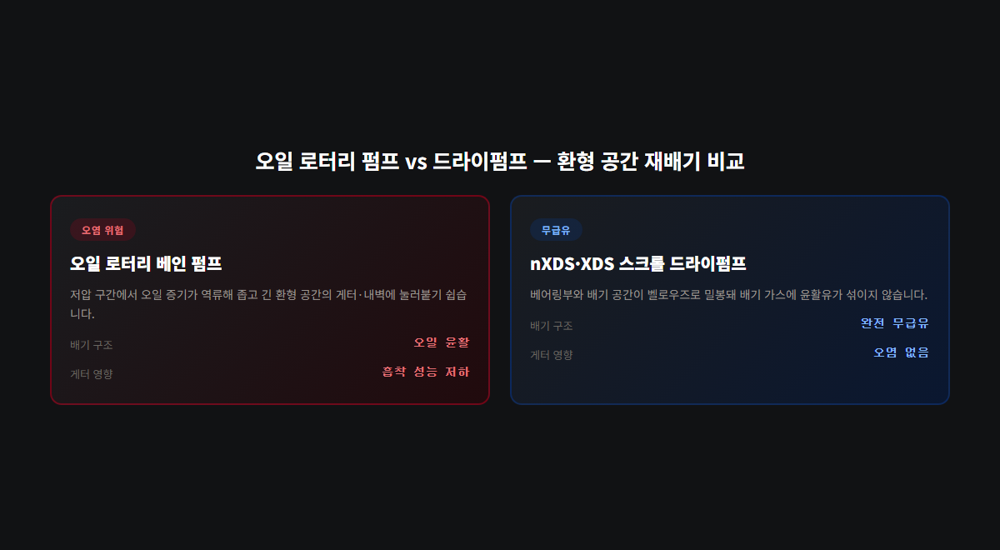
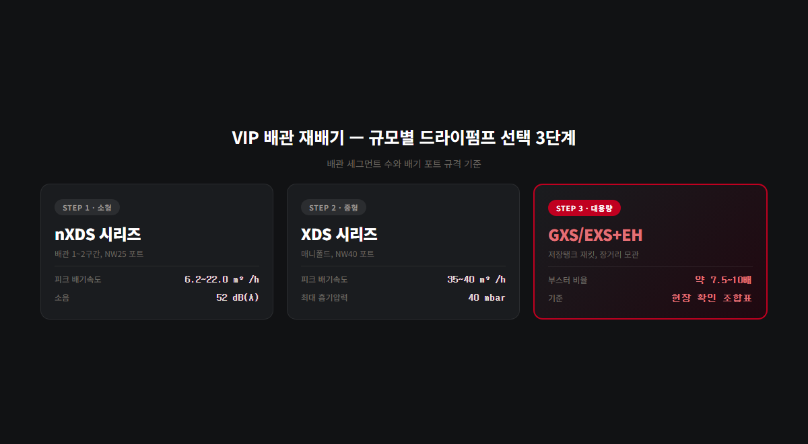

# 액화질소 이중배관 단열, 드라이펌프 선택 기준 정리

액화질소·액체산소 같은 극저온 유체를 옮기는 이중배관(VIP, 진공 단열 배관)은 내관과 외관 사이 환형 공간을 진공으로 배기해 열침입을 막는 구조입니다. 공장 조립품은 출하 전 배기·밀봉까지 끝난 상태로 오지만, 현장에서 배관을 절단·용접하거나 신규로 조립할 때는 그 환형 공간을 다시 배기해야 합니다. 이때 오일 로터리 펌프를 그대로 쓰면 안 되는 이유와, 배관 규모별로 어떤 드라이펌프를 골라야 하는지 정리합니다.

## VIP 환형 공간, 왜 진공이 무너지면 안 될까

VIP는 내관(유체 통로)과 외관(재킷) 두 겹으로 구성되고, 그 사이 환형 공간을 고진공으로 유지해 대류와 전도에 의한 열침입을 최소화합니다. 환형 공간 안쪽에는 대개 게터(getter) 재료가 들어가 있어, 배기가 끝난 뒤에도 서서히 방출되는 잔류 가스를 흡착해 진공도를 오래 유지하는 역할을 합니다.

문제는 이 게터가 오염에 취약하다는 점입니다. 배기 과정에서 오일 성분이 함께 들어가면 게터 표면에 흡착돼 가스 흡착 성능이 떨어지고, 결과적으로 진공 유지 기간이 짧아집니다. 진공이 무너지면 단열 성능도 함께 떨어져 액화질소 증발률이 올라갑니다. 배기 장비 선택이 곧 단열 수명과 직결되는 이유입니다.

## 오일펌프 대신 드라이펌프를 쓰는 이유

오일 로터리 베인 펌프는 저압 구간에서 오일 증기가 역류(backstreaming)할 위험이 있습니다. 배관처럼 좁고 긴 환형 공간에서는 역류된 오일이 게터와 내벽에 그대로 눌러붙기 쉽고, 한번 오염되면 세척도 쉽지 않습니다.

nXDS·XDS 시리즈는 스크롤 방식의 완전 무급유 구조로, 베어링부와 배기 공간이 벨로우즈로 밀봉되어 배기 가스에 윤활유가 섞여 들어가지 않습니다. 재료 준비 단계부터 오염을 배제해야 하는 정밀 진공 환경에 쓰이는 이유도 여기에 있습니다. 배관 하나 재배기하자고 매번 오일을 갈아 끼우고 오염 흔적을 걱정할 필요가 없다는 점도 실무에서는 큰 차이입니다.

## 배관 규모별 드라이펌프 선택 기준

VIP 재배기에 필요한 펌프 용량은 배관 세그먼트 수와 배기 포트 규격에 따라 크게 세 단계로 나뉩니다.

**소형 스크롤 — nXDS 시리즈 (배관 세그먼트 1~2개, NW25 포트)**

| 모델 | 피크 배기속도 | 도달진공도(총압) |
|---|---|---|
| nXDS6i | 6.2 m³/h | 0.020 mbar |
| nXDS10i | 11.4 m³/h | 0.007 mbar |
| nXDS15i | 15.1 m³/h | 0.007 mbar |
| nXDS20i | 22.0 m³/h | 0.030 mbar |

소음 52 dB(A), 정적 기밀도 1×10⁻⁶ mbar·L/s 이하로, 현장에 두고 상시 재배기용으로 쓰기에도 부담이 적은 크기입니다.

**중형 스크롤 — XDS 시리즈 (매니폴드·복수 세그먼트 동시 배기, NW40 포트)**

| 모델 | 피크 배기속도 | 도달진공도 | 가스발라스트 사용 시 |
|---|---|---|---|
| XDS35i | 35 m³/h | 0.01 mbar | 0.02 mbar |
| XDS46i | 40 m³/h | 0.05 mbar | 0.08 mbar |

최대 연속 흡기압력이 40 mbar까지 허용되므로, 대기압에서 시작하는 재배기 작업을 바로 시작할 수 있습니다.

**대용량 — GXS/EXS + EH 부스터 (대형 저장탱크 재킷, 장거리 모관 라인)**

배관 길이가 길거나 다수 세그먼트를 한 번에 묶어 배기해야 하는 대형 설비는 산업용 드라이펌프에 루츠 부스터를 조합합니다. 스마텍 현장 확인 기준 조합은 아래와 같습니다.

| GXS 드라이 단독 | EH 부스터 | 비율(EH/GXS) |
|---|---|---|
| GXS160 (160 m³/h) | EH1200 (1195 m³/h) | 약 7.5배 |
| GXS250 (250 m³/h) | EH2600 (2590 m³/h) | 약 10배 |
| GXS450 (450 m³/h) | EH4200 (4140 m³/h) | 약 9.2배 |

EXS 시리즈는 배기속도 라인업이 GXS와 동일하고, VFD(가변주파수드라이브)가 내장돼 있어 배기 속도를 공정 상황에 맞춰 조절할 수 있습니다. 배기속도의 2~8배라는 일반 공식을 이 조합에 그대로 적용하면 실제보다 작은 부스터를 고르게 되는 경우가 있으므로, 위 표를 우선 기준으로 삼는 것이 안전합니다.

## 배기 후 헬륨 리크 테스트로 마무리

배기만으로 작업이 끝나는 것은 아닙니다. 용접부·플랜지·벨로우즈 이음부에 미세 누설이 있으면 시간이 지나며 진공도가 서서히 무너지고, 단열 성능 저하가 뒤늦게 나타납니다. 배기 완료 직후 헬륨 리크 테스트로 기밀성을 확인하는 절차가 필요한 이유입니다.

ELD500 리크 디텍터는 진공 모드 기준 웨트(Wet) 타입 5×10⁻¹² mbar·L/s, 드라이(Dry) 타입 3×10⁻¹¹ mbar·L/s까지 검출합니다. 측정 준비 시간은 2분 이내이고 흡기 플랜지는 NW25입니다. 배관 이음부에 헬륨을 분사해 검출기 신호 변화를 관찰하는 스프레이 방식이 현장에서 가장 흔하게 쓰입니다.

VIP 배관은 완공 후 재점검이 어려운 구조가 많으므로, 배기와 리크 테스트를 한 세트로 묶어 진행하는 편이 이후 하자 발생을 줄이는 데 유리합니다.

## 옥외 저온 환경에 펌프를 설치할 때 확인할 것

극저온 유체를 다루는 설비는 배관 자체는 물론, 배기에 쓰는 펌프도 저온 환경에 노출되는 경우가 많습니다. nXDS·XDS 시리즈의 공식 운전 온도 범위는 5~40°C로, 겨울철 옥외 또는 냉동창고 인근에 펌프를 상시 배치하는 경우라면 이 범위를 벗어나지 않도록 보온함이나 히팅 재킷 설치를 함께 검토해야 합니다. 펌프 자체가 운전 온도 범위 아래로 떨어지면 기동 부하가 커지고, 장기적으로는 부품 수명에도 영향을 줄 수 있습니다.

반대로 펌프를 실내 유틸리티실에 두고 배관까지 호스로 연결해 배기하는 방식도 현장에서 자주 씁니다. 이 경우 호스 길이가 길어질수록 배기 효율이 떨어지므로, 목표 도달진공도와 배기 시간을 함께 고려해 호스 구경과 길이를 정해야 합니다.

## 게터 오염 여부를 먼저 확인해야 하는 경우

기존 배관을 보수하거나 증설하는 현장이라면, 재배기 펌프를 고르기 전에 기존 환형 공간이 오일 오염 이력이 있는지부터 확인하는 순서가 필요합니다. 과거에 오일 로터리 펌프로 배기한 흔적이 있다면 게터 표면에 이미 오일 성분이 흡착돼 있을 가능성이 있고, 이 경우 드라이펌프로 재배기하더라도 게터 자체의 흡착 성능은 회복되지 않습니다. 게터 교체 여부를 함께 검토해야 재배기 이후 진공 유지 기간을 예측할 수 있습니다.

반대로 처음부터 드라이펌프로만 배기해 온 배관이라면, 게터 오염 걱정 없이 재배기 주기만 관리하면 됩니다. 배관 이력 카드나 시공 기록이 남아 있다면 이 부분을 먼저 확인하는 것이 순서입니다.

## 배관 시공 단계별 체크리스트

VIP 배관 신설·보수 현장에서 순서를 놓치면 재작업이 생기기 쉽습니다. 아래 순서로 점검하면 시행착오를 줄일 수 있습니다.

- 배관 세그먼트 수와 배기 포트 규격(NW25/NW40 등)을 먼저 확인해 펌프 용량을 정한다
- 용접·플랜지 체결을 마친 뒤 곧바로 배기를 시작하지 말고, 육안 검사로 명백한 시공 결함부터 걸러낸다
- 드라이펌프로 목표 도달진공도까지 배기한 뒤, 헬륨 리크 테스트로 이음부 기밀성을 확인한다
- 게터가 포함된 환형 공간이라면, 배기 이력(오일펌프 사용 여부)을 먼저 확인한 뒤 게터 교체 여부를 판단한다
- 장거리 모관 라인이나 저장탱크 재킷처럼 부피가 큰 경우, nXDS·XDS 단독으로 배기 시간이 과도하게 길어지지 않는지 사전에 계산해 GXS/EXS+EH 조합 필요 여부를 판단한다

## 자주 확인하는 질문

**질문 1. 소형 배관 재배기에도 GXS 같은 산업용 드라이펌프를 써야 하나요.**
아닙니다. 배관 세그먼트 1~2개 수준의 소규모 재배기는 nXDS 시리즈로 충분한 경우가 대부분입니다. GXS/EXS+EH 조합은 대형 저장탱크 재킷이나 장거리 모관 라인처럼 배기 대상 부피가 큰 경우에 검토합니다.

**질문 2. 오일펌프로 배기해도 문제없는 경우가 있나요.**
게터가 없는 단순 진공 단열 구조라면 상대적으로 영향이 적을 수 있지만, 오일 역류로 인한 오염 위험 자체가 사라지는 것은 아닙니다. 게터가 포함된 구조라면 오일펌프 사용을 권장하지 않습니다.

**질문 3. 재배기 후 진공도가 금방 다시 나빠지면 무엇을 먼저 확인하나요.**
헬륨 리크 테스트로 이음부 기밀성부터 재확인합니다. 리크가 없는데도 진공도가 빨리 나빠진다면, 게터 오염이나 게터 자체의 수명 소진을 의심할 차례입니다.

**질문 4. XDS와 nXDS 중 무엇을 기준으로 선택하나요.**
배기 포트 규격과 동시에 배기해야 하는 세그먼트 수로 판단합니다. NW25 포트 한두 곳이면 nXDS, NW40 포트에 매니폴드로 여러 구간을 묶어 배기해야 한다면 XDS 시리즈가 적합합니다. 배관 도면과 포트 규격, 재배기 대상 부피를 함께 알려주시면 세 단계(nXDS·XDS·GXS/EXS+EH) 중 어디에 해당하는지 판단해 드립니다.

---

nXDS·XDS·GXS/EXS+EH 모델 선정, VIP 배관 재배기 규모별 펌프 용량 산정, 헬륨 리크 테스트 병행 상담 가능. 오일펌프로 재배기한 이력이 있는 배관은 게터 오염 여부를 먼저 확인하는 것을 권장합니다.
