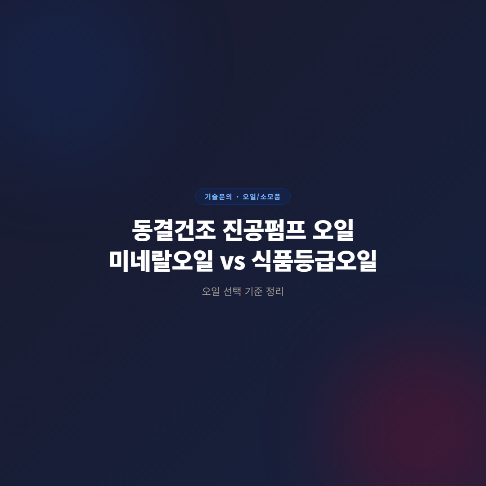
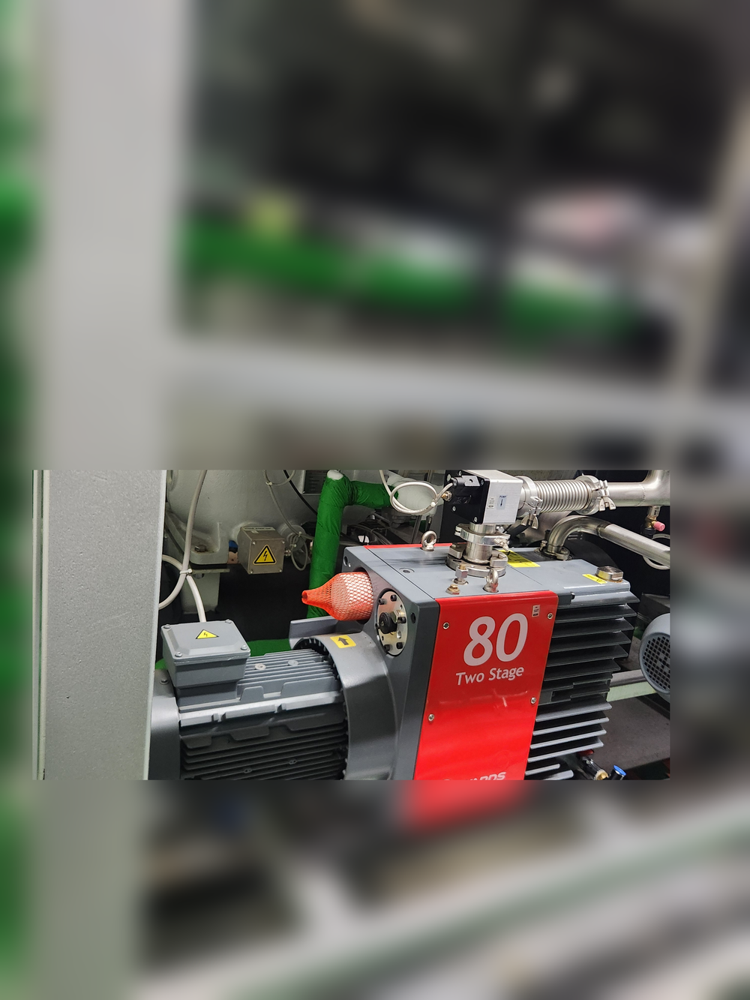
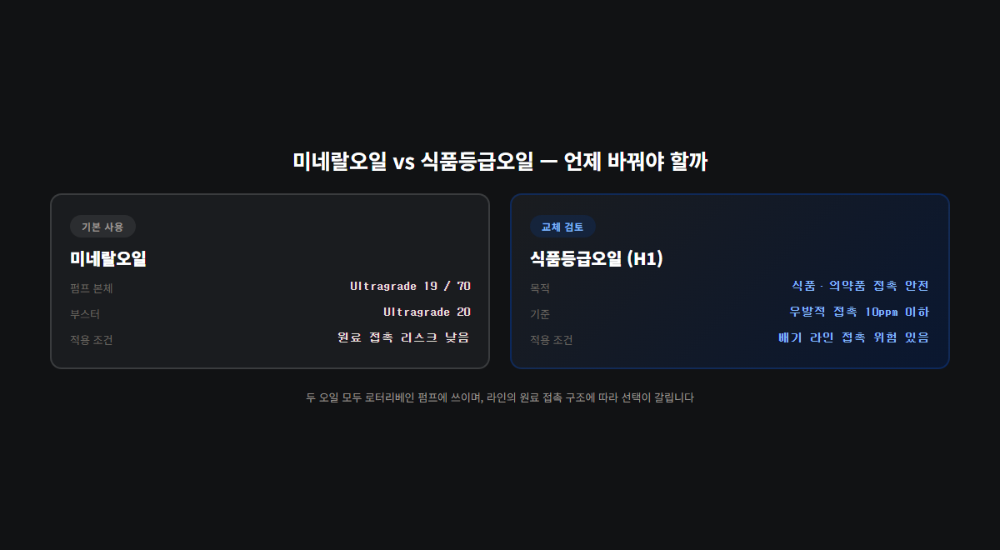
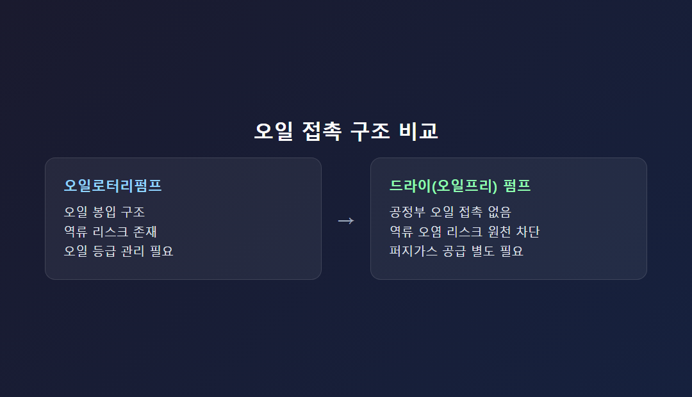

# 동결건조 진공펌프 오일 선택 기준 — 미네랄오일과 식품등급오일 구분법

동결건조 라인에 오일로터리펌프를 쓴다면 오일 선택에서 먼저 확인할 것이 있습니다. 평소 쓰는 오일은 미네랄오일이고, 원료가 배기 라인과 직접 접촉할 위험이 있는 구조라면 식품등급오일(H1 등급)로 교체를 검토해야 한다는 점입니다. 두 오일은 목적이 다르고, 라인 구조에 따라 적용 여부가 갈립니다. 아래에서 스마텍이 취급하는 모델별로 어떤 오일이 기본이고, 언제 식품등급오일로 바꿔야 하는지 순서대로 정리합니다.

## 오일 봉입식 펌프의 역류 리스크부터 이해해야 합니다

동결건조는 냉동 상태의 제품을 저압 환경에서 승화시켜 수분을 제거하는 공정입니다. 챔버 내부가 최종 제품과 직접 맞닿는 구조가 많습니다. 오일 봉입식 펌프는 배기 라인을 통해 오일 증기가 챔버 쪽으로 역류(back-streaming)할 위험을 항상 안고 있습니다. 역류가 발생하면 제품이 오염될 수 있습니다.

이 위험을 관리하는 방법은 두 가지입니다. 오일 자체의 등급을 식품·의약품 접촉에 안전한 수준으로 관리하거나, 오일 접촉 자체가 없는 드라이(오일프리) 펌프로 전환하는 방법입니다. 스마텍 제품 기준으로 RV·E2M 시리즈 오일로터리펌프와 GXS 드라이 스크류 펌프 모두 동결건조 응용이 실제 등록돼 있습니다. 아래 사진은 실제 동결건조 설비에 설치된 E2M80 2단 오일로터리펌프 현장입니다. 코팅·제약 동결건조·플라즈마·진공열처리 응용에 두루 쓰이는 모델로, 이런 라인일수록 오일 등급 관리가 곧 품질관리의 일부가 됩니다.

## 평소 쓰는 오일은 미네랄오일입니다

동결건조 라인에 들어가는 오일로터리펌프는 기본적으로 탄화수소 계열 미네랄오일을 씁니다. RV3~RV12는 Ultragrade 19를 권장오일로 사용하고, E1M18·E2M18·E2M28도 동일하게 Ultragrade 19입니다. 배기속도가 더 큰 E2M40·E2M80은 Ultragrade 70을 씁니다. 대형 라인에서 부스터를 함께 쓴다면 EH 계열 기계식 부스터에는 Ultragrade 20을 권장오일로 사용합니다.

여기서 짚어야 할 점이 있습니다. 이 오일들은 모두 일반 미네랄오일이지, 식품·의약품 접촉을 전제로 만들어진 오일이 아닙니다. 진공 성능만 보면 문제가 없지만, 오일 자체의 접촉 안전성 기준으로 보면 별개 이야기입니다. 귀사 라인이 지금 이 오일 그대로 잘 돌아가고 있다면, 그 자체로는 문제가 아닙니다. 다음 단계에서 언제 바꿔야 하는지를 확인하면 됩니다.

## 식품등급오일(H1)로 바꿔야 하는 조건

모든 동결건조 라인에 식품등급오일이 필요한 것은 아닙니다. 판단 기준은 원료가 오일로터리펌프의 배기 라인과 직접 접촉할 위험이 있는 구조인지 여부입니다. 챔버와 배기 라인이 근접해 있거나, 역류 이력이 실제로 있었던 라인이라면 오일이 접촉부에 노출됐을 때의 안전성을 먼저 따져야 합니다.

업계에서는 이런 접촉 안전 등급을 H1 등급이라 부릅니다. "우발적·기술적으로 불가피한 접촉(incidental, technically unavoidable contact)"을 전제로 하며, 접촉 허용치를 10ppm 이하로 관리하는 개념으로 설명됩니다. ISO 21469 인증 체계도 식품뿐 아니라 제약·화장품·동물사료 분야에서 함께 통용됩니다.

주의할 점은 이 등급 체계가 스마텍의 자체 실측치가 아니라 업계에 통용되는 일반 규격이라는 것입니다. 특정 오일이 몇 ppm까지 안전하다고 단정하기보다, 해당 라인이 식품·의약품 접촉 리스크를 갖고 있는지부터 판단하고 필요하면 식품등급오일로 교체하는 순서가 맞습니다. 귀사 라인이 원료 투입구와 배기 라인이 근접한 구조라면 이 판단을 미룰 이유가 없습니다.

실무에서는 오일 자체뿐 아니라 오일이 접촉하는 씰·개스킷 소재까지 함께 점검하는 경우가 많습니다. 오일 등급을 식품등급으로 올렸는데 씰 소재가 그대로면, 씰이 열화되면서 발생하는 미세 입자가 새로운 오염 경로가 될 수 있기 때문입니다. 정기 점검 시 오일 교환 이력과 함께 씰류 교체 이력도 같이 기록해 두면 나중에 품질 이슈가 생겼을 때 원인을 훨씬 빠르게 좁힐 수 있습니다.

## 모델별 권장오일 정리 (RV·E2M·EH)

| 모델 | 배기속도 | 기본 권장오일 | 비고 |
|---|---|---|---|
| RV3~RV12 | 3.3~12 m³/h | Ultragrade 19 | 질량분석기·동결건조·코팅·진공오븐 |
| E1M18·E2M18·E2M28 | 17~27.5 m³/h | Ultragrade 19 | 터보펌프 백킹·연구실·코팅·동결건조 |
| E2M40·E2M80 | 37~74 m³/h | Ultragrade 70 | 코팅·제약동결건조·플라즈마·진공열처리 |
| EH 부스터 계열 | 310~4,140 m³/h | Ultragrade 20 | 제약동결건조·강 탈가스, 기본펌프 필요 |

소형 RV 시리즈부터 대형 E2M80, 그리고 부스터까지 조합에 따라 권장오일이 나뉩니다. 이 표는 모두 기본(미네랄오일) 사용 조건이며, 원료 접촉 리스크가 있는 라인이라면 이 오일들을 식품등급오일로 교체하는 방향을 검토해야 합니다. 수치는 모두 스마텍 내부 제품 마스터 테이블 기준입니다.

라인 규모를 정할 때는 배기속도만 보지 말고 응용 항목도 함께 확인하는 것이 좋습니다. RV3~RV12는 소형 랩스케일 동결건조기에 주로 들어가고, E2M40·E2M80처럼 배기속도가 높은 모델은 파일럿·생산 규모 설비에 맞습니다. 규모가 커질수록 오일 교환 작업 자체의 난이도와 소요 인력도 늘어나므로, 애초에 오일 접촉이 없는 GXS 드라이 스크류로 설계하는 편이 유지보수 측면에서 유리한 경우도 많습니다. 반대로 소형 라인은 초기 투자비 부담 때문에 오일로터리펌프를 유지하면서 오일 등급 관리로 리스크를 통제하는 방식을 더 많이 선택합니다.

접촉 리스크 확인은 생각보다 간단합니다. 공정 설계 문서나 챔버-배기 라인 배치도를 보면 원료와 배기 라인의 거리, 역류 방지 밸브 유무가 표시돼 있는 경우가 많고, 명시돼 있지 않다면 공정 담당 부서에 문의해 실제 접촉 가능성이 있는지 확인하면 됩니다. 이 확인 절차를 오일 교체 전에 반드시 거쳐야 식품등급오일 적용 여부를 정확히 판단할 수 있습니다.

## 오일로터리 유지 vs 드라이 전환, 판단 기준

오일 접촉 리스크를 관리하며 오일로터리펌프를 계속 쓸지, 아니면 드라이 펌프로 전환할지는 아래 조건으로 판단합니다.

- 원료와 오일이 접촉할 가능성이 구조적으로 있는지 확인합니다.
- 접촉 가능성이 있다면 식품등급오일(H1) 적용 여부부터 점검합니다.
- 오일 교환주기가 최근 눈에 띄게 짧아졌다면 역류 징후일 수 있으니 배기 라인부터 점검합니다.
- 오일 접촉 자체를 없애고 싶다면 GXS 드라이 스크류 전환을 검토합니다. 단, 퍼지가스 공급 라인이 추가로 필요합니다.

현장에서 자주 받는 질문도 짚고 넘어가겠습니다. 지금 쓰는 오일이 미네랄오일인데 그대로 써도 되는지 묻는 경우가 많은데, 원료가 배기 라인과 접촉할 구조가 아니라면 기본 미네랄오일(Ultragrade 19/70/20) 그대로 유지해도 됩니다. 반대로 접촉 가능성이 있는 라인이라면 오일 등급부터 먼저 확인하는 것이 순서입니다. 오일 교환주기를 정할 때도 제조사 권장 주기를 기본값으로 삼되, 오일 색이 탁해지거나 유화(乳化) 징후가 보이면 주기와 무관하게 즉시 교환하는 것이 안전합니다.

## 오일 교환 시 자주 하는 실수 3가지

현장에서 오일 등급을 바꾸는 과정에서 반복되는 실수를 정리했습니다.

첫째, 오일만 식품등급오일로 바꾸고 배기 라인의 잔유는 그대로 두는 경우입니다. 오일을 교체해도 배관 내벽에 남은 이전 오일이 계속 역류 경로에 남아 있으면 오염 리스크가 완전히 사라지지 않습니다. 오일 교체 시점에 배기 라인 세정까지 함께 진행해야 합니다.

둘째, 부스터 오일은 그대로 두고 펌프 본체 오일만 식품등급으로 바꾸는 경우입니다. EH 계열 부스터도 배기 라인 구조상 접촉 경로에 포함될 수 있다면, 펌프 본체와 부스터의 오일 등급을 함께 검토해야 합니다.

셋째, 오일 교환주기를 한 번 늘려 잡은 뒤 다시 점검하지 않는 경우입니다. 초기 몇 달은 정상이던 교환주기가 원료 종류나 운전시간이 바뀌면서 짧아질 수 있습니다. 분기 단위로 실제 교환 이력을 다시 확인하는 루틴을 두는 편이 안전합니다.

이 세 가지만 피해도 동결건조 라인의 오일 관련 품질 이슈 상당수는 사전에 막을 수 있습니다. 오일 등급 하나를 바꾸는 결정이라도 배기 라인·씰 소재·교환주기까지 한 세트로 묶어서 점검해야 재발을 막을 수 있다는 점을 기억해 두시기 바랍니다.

동결건조 라인에서 오일로터리펌프를 계속 쓸 계획이라면 세 가지를 순서대로 확인하시면 됩니다. 원료와 오일의 접촉 가능성, 식품등급오일(H1) 적용 필요 여부, 최근 오일 교환주기 변화입니다. 셋 중 하나라도 해당한다면 지금 쓰는 오일 등급부터 다시 확인하는 게 순서입니다.

---

동결건조 라인 오일 등급 상담(미네랄오일·식품등급오일), GXS 드라이 스크류 전환 검토를 지원합니다. 원료 접촉 리스크가 있는 공정은 오일 교체 전 반드시 적합성을 확인해야 합니다.
