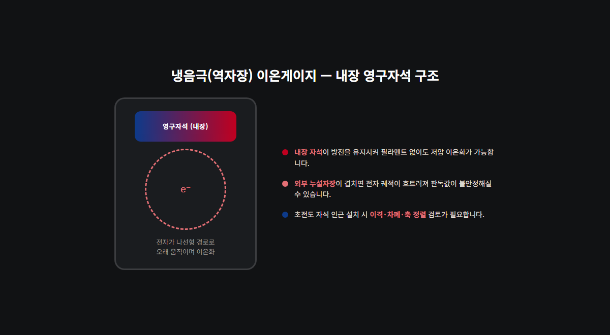

<!-- 수치검증: A항목 4개 확인 (AIM200/WRG200/APG200 측정범위, AIGX 참고범위) / B항목 해당없음(단일 게이지 제품 추천, 펌프+부스터 조합 아님) / 삭제 0개 / 교체 0개 -->

# 초고진공 이온게이지, 초전도 자석 환경에서 냉음극 방식을 쓸 때 확인할 것

핵융합로·입자가속기처럼 초전도 자석과 극저온 챔버가 함께 있는 설비는 진공 측정 조건이 일반 고진공 공정과 다릅니다. 요구 진공도가 10⁻⁷~10⁻⁹ mbar 수준으로 높을 뿐 아니라, 초전도 자석의 누설자장(fringe field)이 진공게이지 바로 옆에서 발생합니다. 냉음극(역자장) 방식 이온게이지는 내부에 영구자석을 쓰기 때문에, 이 환경에서는 설치 위치와 방향을 먼저 검토해야 합니다.

## 핵융합·가속기 환경의 두 가지 변수

이 환경에서 진공 측정에 영향을 주는 요소는 두 가지입니다.

첫째, 초전도 자석의 누설자장입니다. 자석 자체는 4K 부근 극저온에서 작동하며 강한 자기장을 발생시키고, 이 자기장 일부가 자석 외부로 새어 나와 인근 장비에 도달합니다.

둘째, 극저온 표면의 크라이오펌핑 효과입니다. 극저온 표면은 잔류 기체 분자를 물리적으로 흡착한다. 게이지가 극저온 표면에 가까우면 실제 챔버 평균 압력보다 낮게 읽히고, 상온 표면에 가까우면 높게 읽힐 수 있습니다. 게이지 위치 하나로 판독값이 달라진다는 뜻입니다.

두 변수 모두 게이지 자체의 고장이 아니라 설치 조건에서 비롯됩니다. 판독값이 흔들릴 때 게이지 교체부터 검토하면 원인 파악이 늦어집니다.

## 냉음극 게이지 원리와 자기장 간섭

냉음극(역자장/인버티드 마그네트론) 방식 이온게이지는 방전을 유지하기 위해 게이지 내부에 영구자석을 내장한다. 이 자석이 전자를 나선형 경로로 오래 움직이게 만들어 저압에서도 이온화 확률을 높이는 구조입니다.

여기서 발생하는 문제가 있습니다. 초전도 자석의 누설자장이 게이지 내부 자석과 겹치면 전자 궤적이 흐트러지고, 압력 판독값이 불안정해질 수 있다. 강하고 축이 어긋난 외부 자기장 환경에서 냉음극 게이지의 응답 특성이 변한다는 점은 진공 계측 분야에서 확인된 사실입니다.

스마텍이 취급하는 AIM200은 역자장(냉음극) 방식으로 측정범위 1×10⁻²~1×10⁻⁹ mbar이며, 필라멘트가 없어 오염이나 반응성 가스 환경에서 수명이 길다. 다만 위 특성 때문에 초전도 자석 인근 설치 시에는 이격 거리와 차폐를 함께 검토해야 합니다.

## 설치 위치·차폐·축 정렬 기준

실무에서 확인할 항목은 세 가지로 정리됩니다.

1. 이격 거리 — 자석 중심에서 충분히 떨어진 위치에 게이지를 배치하고, 설치 전 해당 위치의 잔류 자기장 세기를 실측해 게이지 사양과 비교한다.
2. 자기 차폐 — 이격이 어려운 구조라면 게이지 주변에 자기 차폐를 적용한다.
3. 축 정렬 — 게이지 방향을 외부 자기장선과 평행하게 맞추면 간섭이 줄어드는 경향이 있다.

내장 자석이 없는 열음극(핫캐소드) 방식은 외부 자기장 간섭에서 상대적으로 자유롭지만, 필라멘트 구조라 반응성 가스나 방사선 환경에서 단선 위험이 있고 정기적인 디가스가 필요하다. 스마텍은 냉음극(AIM200)과 복합(WRG200) 게이지를 주력으로 취급한다.

## 게이지 조합 선택 기준

포트 여유가 있는 구조라면 구간별로 게이지를 분리 설치하는 편이 안정적입니다. 포트가 제한된 크라이오스탯이라면 WRG200(피라니+역자장 복합) 하나로 대기압부터 1×10⁻⁹ mbar까지 커버하는 방식이 유리합니다.

| 게이지 | 측정범위 | 방식 | 핵심 포인트 |
|---|---|---|---|
| AIM200 | 1×10⁻²~1×10⁻⁹ mbar | 역자장(냉음극) | 필라멘트 없음, 위치·차폐 검토 필수 |
| WRG200 | 1×10⁻⁹~1000 mbar | 피라니+역자장 복합 | 포트 제한 챔버에 유리 |
| APG200 | 대기압~5×10⁻⁴ mbar | 피라니 | 펌프다운 초기 구간 병행 |

펌프다운 초기 단계나 예비 배기 구간은 APG200(피라니 방식)을 병행 설치해 모니터링하는 구성이 일반적이다. 세 제품 모두 TIC·ADC·TAG 컨트롤러와 호환되므로, 다채널 시스템에서는 하나의 컨트롤러로 여러 지점을 통합 관리할 수 있다.

판독값이 흔들리는 시점이 자석 여자(勵磁) 시점과 겹치는지, 게이지 포트가 자석 중심에서 얼마나 떨어져 있는지부터 확인하는 것이 순서입니다. 위치·차폐 조건을 조정해도 값이 안정되지 않는다면, 그때 게이지 자체의 이상을 검토합니다.

## 극초고진공 구간에서 게이지 자체 오차가 커지는 이유

압력이 10⁻⁹ mbar 이하로 내려가는 극초고진공 구간에서는 게이지 방식과 무관하게 측정 오차 자체가 커지는 경향이 있습니다. 열음극 방식은 전자가 그리드에 부딪히며 발생하는 연 X선이 이온 컬렉터에서 광전자를 방출시켜, 실제보다 압력이 높게 측정되는 한계가 알려져 있습니다. 이 한계는 컬렉터 구조를 개선한 익스트랙터형 게이지로 일부 완화할 수 있지만, 일반 열음극 게이지에서는 극초고진공 구간일수록 판독값을 그대로 신뢰하기보다 다른 방식과 교차 확인하는 습관이 필요합니다.

냉음극 방식은 이런 광전자 효과에서는 자유롭지만, 앞서 설명한 외부 자기장 간섭이 같은 구간에서 변수로 작용합니다. 결국 극초고진공을 다루는 설비라면 어느 한 방식에만 의존하기보다, 설치 위치가 다른 두 개 이상의 게이지로 교차 검증하는 구성이 안전합니다.

## 설치 전 커미셔닝 단계에서 확인할 순서

신규 설비를 셋업하거나 기존 설비에 게이지를 추가할 때는 아래 순서로 점검하는 편이 시행착오를 줄입니다.

먼저 챔버 도면에서 게이지 포트 위치와 초전도 자석 중심 사이 거리를 표시합니다. 그다음 자석을 여자하지 않은 상태에서 게이지 기준값을 기록해 둡니다. 이후 자석을 서서히 여자하면서 판독값 변화 폭을 구간별로 기록하면, 어느 여자 전류 수준부터 간섭이 시작되는지 파악할 수 있습니다. 이 데이터가 있으면 차폐 필요 여부와 차폐 두께를 정량적으로 판단할 수 있고, 나중에 판독값이 흔들릴 때도 정상 범위인지 이상 신호인지 빠르게 구분할 수 있습니다.

극저온 표면과의 거리도 같은 방식으로 기록해 두는 것이 좋습니다. 크라이오펌핑 편차는 시간이 지나며 서서히 누적되는 경우가 많아, 초기 기준값이 없으면 나중에 변화를 알아채기 어렵습니다.

## 게이지 유지관리와 보정 주기

냉음극 게이지는 필라멘트가 없어 유지관리 부담이 적은 편이지만, 방전 전극 표면에 스퍼터링된 물질이 쌓이면 감도가 서서히 변할 수 있습니다. 정기적으로 기준 게이지와 교차 비교해 보정 편차를 확인하는 절차를 두는 것이 좋습니다. 특히 초전도 자석 인근처럼 외부 자기장 변수가 있는 설치 환경에서는 계절이나 운전 조건에 따라 여자 전류가 달라질 수 있으므로, 보정 주기를 일반 연구용 챔버보다 짧게 잡는 편이 안전합니다.

복합형 WRG200처럼 피라니와 역자장 소자를 함께 쓰는 제품은 두 소자의 교차 구간(피라니 상한과 역자장 하한이 겹치는 압력대)에서 판독값 연속성을 주기적으로 확인하는 것도 필요합니다. 두 소자 간 오차가 커지면 교차 구간에서 압력 그래프가 계단형으로 튀는 형태로 나타나므로, 이 패턴이 보이면 개별 소자 점검을 우선 진행합니다.

## 자주 확인하는 질문

**질문 1. 게이지 하나로 자석 여자 전 구간을 계속 모니터링해도 되나요.**
가능은 하지만, 여자 전후 판독값 편차를 별도로 기록해 두지 않으면 나중에 이상 신호와 정상 간섭을 구분하기 어렵습니다. 커미셔닝 단계에서 기준 데이터를 반드시 남겨야 합니다.

**질문 2. 차폐를 적용하면 간섭이 완전히 사라지나요.**
차폐 두께와 재질에 따라 감소 폭이 다르며, 완전히 제거되지는 않는 경우가 많습니다. 차폐 적용 후에도 일정 수준의 편차가 남을 수 있다는 전제로 기준값을 재설정하는 편이 현실적입니다.

**질문 3. 열음극 방식으로 전환하면 자기장 문제가 전부 해결되나요.**
내장 자석이 없어 자기장 간섭 자체는 줄어들지만, 필라멘트 방식이라 반응성 가스·방사선 환경에서의 단선 위험과 정기 디가스 부담이 새로 생깁니다. 한쪽 문제를 없애면 다른 쪽 유지관리 부담이 늘어나는 구조이므로, 현장 조건에 맞춰 선택해야 합니다.

**질문 4. 게이지 컨트롤러는 채널마다 따로 둬야 하나요.**
TIC·ADC·TAG 계열 컨트롤러는 여러 채널을 하나로 묶어 관리할 수 있도록 설계되어 있습니다. 게이지 종류가 섞여 있어도(AIM200과 APG200 병행 등) 하나의 컨트롤러에서 채널을 자동 인식하는 경우가 많으므로, 신규 설비라면 채널 수와 통신 방식(RS232·RS485)을 먼저 확인한 뒤 컨트롤러를 선정하는 순서를 권장합니다.

---

AIM200·WRG200·APG200 모델 선정, 초전도 자석 인근 설치 위치 검토, TIC/ADC 컨트롤러 연동 상담 가능. 자기 차폐가 필요한 구조는 사전 자기장 실측을 권장합니다.
