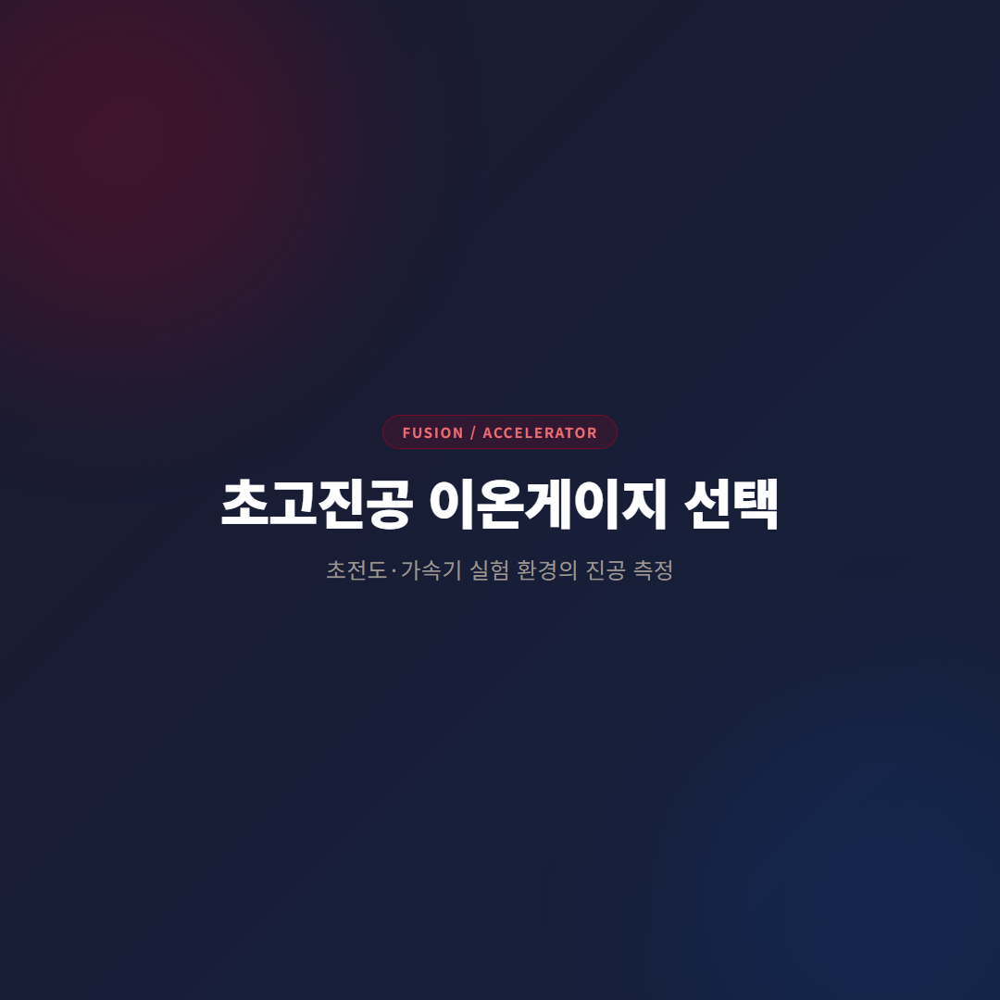
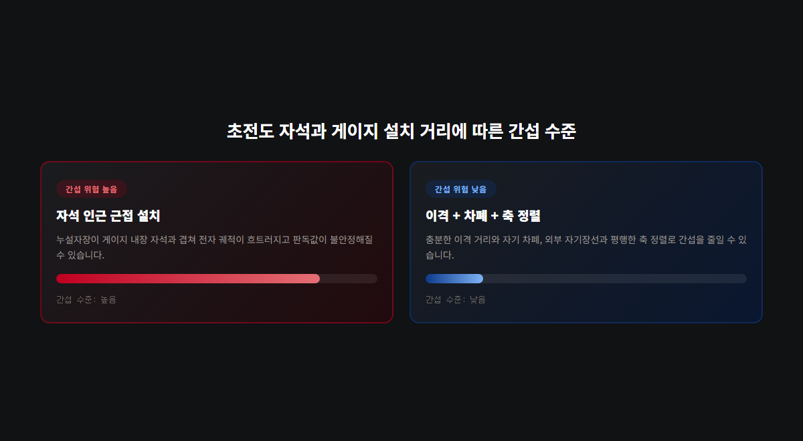
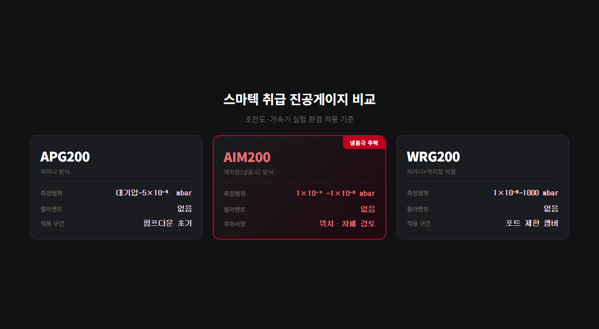

# 초고진공 이온게이지, 초전도 자석 환경에서 냉음극 방식을 쓸 때 확인할 것

핵융합로·입자가속기처럼 초전도 자석과 극저온 챔버가 함께 있는 설비는 진공 측정 조건이 일반 고진공 공정과 다릅니다. 요구 진공도가 10⁻⁷~10⁻⁹ mbar 수준으로 높을 뿐 아니라, 초전도 자석의 누설자장(fringe field)이 진공게이지 바로 옆에서 발생합니다. 냉음극(역자장) 방식 이온게이지는 내부에 영구자석을 쓰기 때문에, 이 환경에서는 설치 위치와 방향을 먼저 검토해야 합니다.

## 핵융합·가속기 환경의 두 가지 변수

이 환경에서 진공 측정에 영향을 주는 요소는 두 가지입니다.

첫째, 초전도 자석의 누설자장입니다. 자석 자체는 4K 부근 극저온에서 작동하며 강한 자기장을 발생시키고, 이 자기장 일부가 자석 외부로 새어 나와 인근 장비에 도달합니다.

둘째, 극저온 표면의 크라이오펌핑 효과입니다. 극저온 표면은 잔류 기체 분자를 물리적으로 흡착한다. 게이지가 극저온 표면에 가까우면 실제 챔버 평균 압력보다 낮게 읽히고, 상온 표면에 가까우면 높게 읽힐 수 있습니다. 게이지 위치 하나로 판독값이 달라진다는 뜻입니다.

두 변수 모두 게이지 자체의 고장이 아니라 설치 조건에서 비롯됩니다. 판독값이 흔들릴 때 게이지 교체부터 검토하면 원인 파악이 늦어집니다.

## 냉음극 게이지 원리와 자기장 간섭

냉음극(역자장/인버티드 마그네트론) 방식 이온게이지는 방전을 유지하기 위해 게이지 내부에 영구자석을 내장한다. 이 자석이 전자를 나선형 경로로 오래 움직이게 만들어 저압에서도 이온화 확률을 높이는 구조입니다.

여기서 발생하는 문제가 있습니다. 초전도 자석의 누설자장이 게이지 내부 자석과 겹치면 전자 궤적이 흐트러지고, 압력 판독값이 불안정해질 수 있다. 강하고 축이 어긋난 외부 자기장 환경에서 냉음극 게이지의 응답 특성이 변한다는 점은 진공 계측 분야에서 확인된 사실입니다.

스마텍이 취급하는 AIM200은 역자장(냉음극) 방식으로 측정범위 1×10⁻²~1×10⁻⁹ mbar이며, 필라멘트가 없어 오염이나 반응성 가스 환경에서 수명이 길다. 다만 위 특성 때문에 초전도 자석 인근 설치 시에는 이격 거리와 차폐를 함께 검토해야 합니다.

## 설치 위치·차폐·축 정렬 기준

실무에서 확인할 항목은 세 가지로 정리됩니다.

1. 이격 거리 — 자석 중심에서 충분히 떨어진 위치에 게이지를 배치하고, 설치 전 해당 위치의 잔류 자기장 세기를 실측해 게이지 사양과 비교한다.
2. 자기 차폐 — 이격이 어려운 구조라면 게이지 주변에 자기 차폐를 적용한다.
3. 축 정렬 — 게이지 방향을 외부 자기장선과 평행하게 맞추면 간섭이 줄어드는 경향이 있다.

내장 자석이 없는 열음극(핫캐소드) 방식은 외부 자기장 간섭에서 상대적으로 자유롭지만, 필라멘트 구조라 반응성 가스나 방사선 환경에서 단선 위험이 있고 정기적인 디가스가 필요하다. 스마텍은 냉음극(AIM200)과 복합(WRG200) 게이지를 주력으로 취급한다.

## 게이지 조합 선택 기준

포트 여유가 있는 구조라면 구간별로 게이지를 분리 설치하는 편이 안정적입니다. 포트가 제한된 크라이오스탯이라면 WRG200(피라니+역자장 복합) 하나로 대기압부터 1×10⁻⁹ mbar까지 커버하는 방식이 유리합니다.

| 게이지 | 측정범위 | 방식 | 핵심 포인트 |
|---|---|---|---|
| AIM200 | 1×10⁻²~1×10⁻⁹ mbar | 역자장(냉음극) | 필라멘트 없음, 위치·차폐 검토 필수 |
| WRG200 | 1×10⁻⁹~1000 mbar | 피라니+역자장 복합 | 포트 제한 챔버에 유리 |
| APG200 | 대기압~5×10⁻⁴ mbar | 피라니 | 펌프다운 초기 구간 병행 |

펌프다운 초기 단계나 예비 배기 구간은 APG200(피라니 방식)을 병행 설치해 모니터링하는 구성이 일반적이다. 세 제품 모두 TIC·ADC·TAG 컨트롤러와 호환되므로, 다채널 시스템에서는 하나의 컨트롤러로 여러 지점을 통합 관리할 수 있다.

판독값이 흔들리는 시점이 자석 여자(勵磁) 시점과 겹치는지, 게이지 포트가 자석 중심에서 얼마나 떨어져 있는지부터 확인하는 것이 순서입니다. 위치·차폐 조건을 조정해도 값이 안정되지 않는다면, 그때 게이지 자체의 이상을 검토합니다.

---

AIM200·WRG200·APG200 모델 선정, 초전도 자석 인근 설치 위치 검토, TIC/ADC 컨트롤러 연동 상담 가능. 자기 차폐가 필요한 구조는 사전 자기장 실측을 권장합니다.
