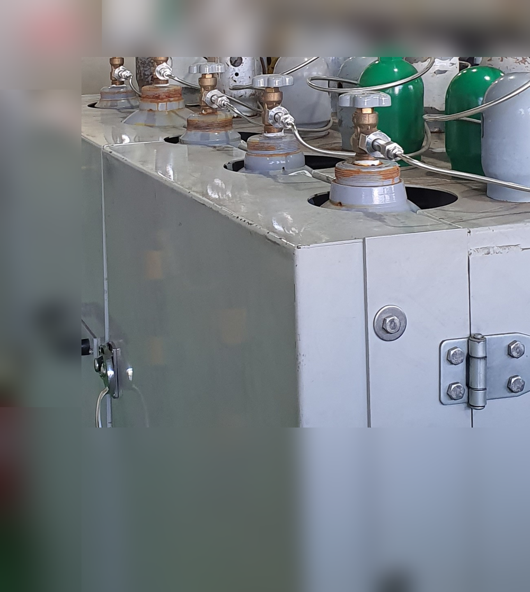

# 특수 가스 충전 설비 진공펌프 — 드라이 스크류가 필요한 3가지 조건

고순도 가스 실린더 충전 설비에 어떤 진공펌프를 써야 할지 — 문의가 들어올 때마다 가장 먼저 확인하는 것이 세 가지입니다. 충전할 가스의 순도 등급, 가스의 화학적 성질, 그리고 폭발·발화 위험 여부. 이 세 가지 중 하나라도 해당하면 오일로터리 펌프로는 해결이 안 됩니다. 드라이 스크류 펌프가 필요한 이유입니다.

가스 실린더 충전 공정에서 진공 배기는 첫 번째 단계입니다. 충전 전 실린더 내부를 진공으로 빼야 이전에 남아 있던 가스가 섞이지 않습니다. 질소(N₂), 아르곤(Ar), 헬륨(He) 같은 불활성 가스부터 수소(H₂), 산소(O₂), 염소(Cl₂), 불화수소(HF), 암모니아(NH₃) 같은 반응성·부식성 가스까지 — 충전 대상에 따라 펌프 선택 기준이 완전히 달라집니다. 배기 공정의 반복 횟수도 많습니다. 하루에 수십 사이클(배기 → 퍼지 → 재배기 → 충전)을 돌리는 설비라면 펌프의 내구성과 공정 적합성이 장비 수명을 결정합니다.

## 특수 가스 충전 설비에서 오일로터리펌프의 한계

오일 로터리 베인 펌프는 초기 도입 비용이 낮고 도달 진공도가 좋습니다. 그래서 가스 충전 설비 초기에 많이 채택됩니다. 문제는 오일이라는 구조적 특성이 특수 가스 환경에서는 독이 된다는 점입니다.

오일 펌프는 압축 공간에 오일이 필요합니다. 이 오일에서 탄화수소 증기가 발생하고, 역류 방지 밸브가 완벽하지 않으면 증기가 실린더 쪽으로 역류합니다. 고순도 가스 충전 라인에서 탄화수소 분자가 실린더 내부에 들어가면 순도 기준을 벗어납니다. 부식성 가스가 오일에 흡수되면 오일이 빠르게 산성화·슬러지화되고, 펌프 내부 베어링과 베인을 갉아먹습니다. 수소처럼 가연성인 가스가 오일 미스트와 배기 라인 안에서 만나면 점화 가능성이 생깁니다. 세 가지 문제가 각각 독립적으로 존재하는 것이 아닙니다. 어느 하나만 해당해도 오일 펌프 사용이 부적합합니다.

## 조건 1 — 고순도 가스(5N 이상) 충전 시 오일 역류가 순도를 오염시킨다

순도 99.999% 이상, 즉 5N급 가스 라인이라면 오일 펌프는 처음부터 배제해야 합니다. 5N급은 불순물 허용량이 10ppm 이하입니다. 반도체·디스플레이·분석기기 교정용 가스 충전 현장에서 흔히 요구되는 수준입니다.

오일 펌프의 탄화수소 역류는 운영 방식이나 유지보수 수준과 관계없이 구조적으로 발생합니다. 오일 미스트 필터나 콜드 트랩을 달아도 100% 차단은 불가능합니다. 실제로 콜드 트랩으로 잡을 수 있는 탄화수소 비율은 99% 수준이며, 나머지 1% 미만의 가스 상태 분자는 통과합니다. 10ppm 기준에서는 이 1%도 치명적입니다. 고순도 가스를 다루는 현장에서 순도 불량이 반복된다면, 배기 펌프에서 오는 오염을 먼저 의심해야 합니다. 드라이 스크류 펌프는 압축 공간에 오일을 사용하지 않으므로 오염원 자체가 없습니다. 순도 불량을 드라이로 전환해 해결한 설비가 여럿 있습니다. 오일 교환 비용과 필터 교체 비용을 계산하면, 총소유비용은 드라이가 더 낮게 나오는 경우도 많습니다.

## 조건 2 — 부식성·반응성 가스와 오일이 만나면 반응한다

Cl₂(염소), HF(불화수소), NH₃(암모니아), F₂(불소) 같은 가스는 오일과 직접 반응합니다.

이 반응의 결과는 두 가지입니다. 오일이 점도를 잃거나, 슬러지가 생겨 펌프 내부 통로를 막습니다. 어느 쪽이든 짧은 시간 안에 펌프가 멈춥니다. 부식성 가스 배기 라인에 오일 펌프를 쓴 설비에서는 오일 교환 주기가 2~4주로 줄어드는 것이 일반적입니다. 정상 오일 교환 주기가 3~6개월인 것과 비교하면 유지비용이 수십 배 늘어나는 셈입니다. 그 상태로 계속 운영하다 로터가 굳어 분해 수리가 불가능해진 펌프를 받는 일도 있습니다. 드라이 스크류 펌프는 오일이 없으니 이 반응 자체가 일어나지 않습니다. 단, 펌프 내부 코팅 재질과 씰 재질이 해당 가스에 적합한지는 반드시 확인해야 합니다. Cl₂ 라인이라면 내염소성 코팅과 PTFE 씰, HF 라인이라면 불소 수지 계열 내부 처리가 필요합니다. Edwards nXR 시리즈는 부식성 가스 대응 버전이 별도로 존재하며, 가스 종류에 따라 내부 사양이 달라집니다.

## 조건 3 — 가연성·폭발성 가스 취급 시 오일은 안전 기준 문제다

수소(H₂)를 포함한 가연성 가스 라인에서 오일 펌프 사용은 방폭 안전 기준 문제로 이어집니다.

오일 미스트에는 발화 가능성이 있습니다. 가연성 가스와 오일 미스트가 배기 라인 안에서 공존하면 점화 조건이 만들어집니다. 수소의 공기 중 폭발 하한(LEL)은 4%로, 다른 가연성 가스보다 훨씬 낮습니다. 소량 누설만으로도 위험 농도에 도달합니다. ATEX 또는 동등 방폭 등급을 요구하는 설비라면 드라이 스크류 펌프가 기본 조건입니다. IEC 60079 기준으로 수소는 가스 그룹 IIC, 온도 클래스 T1에 해당하며, 이 등급에 맞는 인증을 받은 펌프만 해당 라인에 사용할 수 있습니다. 드라이 펌프는 오일이 없어 이 위험 요인 자체가 없습니다. 현재 오일 펌프를 쓰고 있다면 방폭 등급이 없는 경우가 대부분입니다. 설비 인증 과정에서 이 부분이 걸려 교체를 진행하는 케이스를 여러 번 봤습니다.

## 드라이 스크류 펌프 선택 시 확인할 스펙

드라이 스크류 방향으로 정해졌다면 아래 네 가지를 반드시 확인합니다.

**배기속도(m³/h)**: 실린더 용량(리터)을 목표 배기 시간(분)으로 나누면 필요한 배기속도 기준이 나옵니다. 50리터 실린더를 5분 안에 10⁻² mbar까지 빼야 한다면 대략 20~40 m³/h 급 펌프가 기준점입니다. 사이클 횟수가 많고 실린더 용량이 크면 50~100 m³/h 급도 검토합니다.

**도달 진공도**: 드라이 스크류 펌프의 일반 도달 진공도는 0.01~1 mbar 범위입니다. 고순도 가스 충전 전 퍼지 공정에서 10⁻² mbar 이하가 필요한 경우, 단단(싱글 스테이지) 드라이 펌프로 충분한지, 부스터(루츠 펌프)와의 조합이 필요한지를 판단해야 합니다.

**가스 호환 재질(씰·코팅)**: 충전 대상 가스 종류와 펌프 내부 코팅·씰 재질의 매칭 여부. 부식성 가스라면 Chemical Duty 버전 또는 그에 준하는 사양이 있는 모델을 선택해야 합니다. 범용 드라이 펌프를 부식성 가스 라인에 넣으면 수명이 급격히 짧아집니다. 씰은 Viton 계열보다 PTFE 또는 Kalrez가 내화학성이 높습니다.

**DUTY 등급**: 충전 설비는 하루 수십 사이클을 반복합니다. S1 등급(연속 운전 가능)과 S3 등급(간헐 운전용)은 다릅니다. 간헐 운전용 펌프를 연속 사이클에 투입하면 과열로 수명이 단축됩니다. 하루 6시간 이상 가동되는 설비라면 S1 등급을 기준으로 선정합니다.

## 충전 설비 운영 사이클과 펌프 내구성

특수 가스 충전 설비에서 배기 펌프는 하루도 쉬지 않습니다. 배기→퍼지→재배기→충전 사이클이 하루 30~60회 반복되면 연간 펌프 운전 시간은 2,000~5,000시간에 이릅니다. 이 환경에서 오일 펌프와 드라이 펌프의 내구성 차이는 명확하게 갈립니다.

오일 펌프의 이론 수명은 정상 조건에서 20,000시간 이상이지만, 부식성 가스 환경에서는 1,000~3,000시간으로 줄어듭니다. 오일 교환 주기가 2~4주로 당겨지고, 베어링과 베인 교체가 잦아지면 유지보수 비용이 연간 장비 구입 비용을 초과하는 경우도 있습니다. 반면 드라이 스크류 펌프는 압축 공간에 소모성 오일이 없어 유지보수 포인트가 적습니다. 정기 점검 항목은 기어 오일(베어링 윤활용, 가스 접촉 없음)과 씰 상태 확인이 전부입니다. 부식성 가스 대응 사양을 갖춘 드라이 펌프의 씰 교체 주기는 통상 12,000~20,000시간 수준입니다.

충전 사이클 반복에 따른 열 부하도 고려 대상입니다. 드라이 스크류 펌프는 가스 압축 시 발열이 발생합니다. 냉각 방식(공랭·수랭)을 현장 조건에 맞게 선택하면 고부하 환경에서도 안정적인 운전이 가능합니다. 부식성 가스 라인에서는 배기 쪽 배관 재질도 같이 검토해야 합니다. 펌프를 바꿔도 배관 내부에 부식이 진행되면 가스 오염이 이어집니다.

## 자주 묻는 질문

**Q. 오일 펌프를 쓰면서 트랩만 추가하면 안 되나요?**

트랩(콜드 트랩·오일 미스트 필터)은 오염 저감 보조 장치이지 근본 해결책이 아닙니다. 5N 이상 고순도 라인에서는 트랩을 달아도 탄화수소 가스 분자를 100% 차단할 수 없어 순도 기준을 맞추지 못합니다. 부식성 가스 라인에서는 트랩이 가스를 일부 포집하더라도 오일과 가스의 접촉 자체는 차단하지 못합니다. 오일 산화·슬러지 생성은 계속 진행됩니다. 가연성 가스 라인에서는 트랩이 방폭 인증을 대체하지 못합니다. 세 가지 조건 중 하나라도 해당된다면 트랩 추가가 아니라 드라이 펌프로의 전환을 권장합니다.

**Q. 수소 라인에 방폭 등급이 필요한지 어떻게 판단하나요?**

수소(H₂)는 IEC 60079-0 기준으로 가스 그룹 IIC에 해당합니다. 이 그룹은 모든 가연성 가스 중 방폭 요구 수준이 가장 높은 등급입니다. 수소를 취급하는 공간이 폭발 위험 구역(Zone 1 또는 Zone 2)으로 분류되면 해당 구역 내 모든 전기·기계 장비에 방폭 인증이 필요합니다. 진공 펌프도 예외가 아닙니다. 국내에서는 산업안전보건법과 KGS(한국가스안전공사) 기준이 기준이 됩니다. 현재 설비의 방폭 구역 분류가 명확하지 않다면 공인 기관의 위험 장소 분류 검토를 먼저 받는 것을 권장합니다.

**Q. 드라이 스크류 펌프는 납기가 얼마나 걸리나요?**

표준 범용 드라이 스크류 펌프는 재고 상황에 따라 4~8주, 부식성 가스 대응 Chemical Duty 버전은 8~16주가 일반적입니다. Edwards nXR 시리즈처럼 가스 종류별로 내부 사양이 세분화된 제품은 수입 발주 후 국내 입고까지 시간이 걸립니다. 충전 설비 도입이나 기존 오일 펌프 교체를 계획 중이라면 납기를 감안해 최소 2~3개월 전에 모델 검토를 시작하는 것이 현실적입니다. 긴급 교체가 필요한 경우 대여 장비 운영 여부를 공급사에 문의하는 것도 방법입니다.

---

특수 가스 충전 설비용 드라이 스크류 펌프 모델 선정, 부식성·가연성 가스 대응 버전 문의, 오일 펌프에서 드라이로의 전환 컨설팅. 가스 종류와 사이클 조건을 함께 알려주시면 구체적인 검토가 가능합니다.
