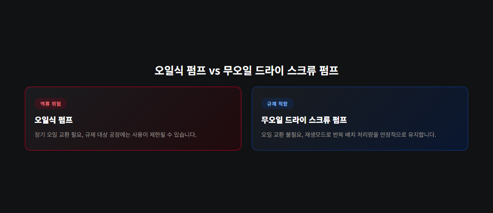

<!-- 수치검증: A항목 3개 확인(동결건조 1~10⁻³ mbar 범위, 물 삼중점 0°C·6mbar, 응축기 -55~-85°C) / B항목 해당없음 / 삭제 0개 / 교체 0개 -->

# 의료·생명공학 진공 시스템 드라이펌프 선택 기준 — 오일 프리부터 동결건조까지

의료기기·바이오 연구실 진공 시스템은 진공도·배기속도 못지않게 "오일이 있느냐 없느냐"가 핵심 기준입니다. 오일식 펌프의 오일 역류(backstreaming) 위험이 멸균 제품 오염, 나아가 규제 위반으로 이어질 수 있기 때문입니다. 이 글은 무오일 드라이펌프를 우선 검토해야 하는 이유와 동결건조 공정에서의 구체적인 사양 기준을 정리합니다.

## 규제 환경에서 오일이 문제가 되는 이유

오일식 펌프는 운전 중 오일 증기가 배기 라인을 타고 챔버 쪽으로 역류할 위험이 있습니다. 백신·주사제 같은 멸균 제품을 다루는 공정에서는 이 역류가 곧 제품 오염으로 이어질 수 있습니다. FDA cGMP 같은 의약품 제조 규제 환경에서는 공정 가스에 윤활유가 닿지 않아야 한다는 요건이 있어, 오일식 펌프 자체가 사용 불가한 경우도 있습니다. 무오일 드라이펌프를 검토 대상 1순위로 놓아야 하는 이유입니다.

## 동결건조 공정의 진공 조건

의료·바이오 공정에서 자주 쓰이는 동결건조(lyophilization)는 진공범위 1~10⁻³ mbar를 요구합니다. 1차 건조 단계에서 시료가 녹지 않도록 목표 압력까지 빠르게 낮춰야 하며, 배기속도가 부족하면 온도·압력 조건이 무너질 수 있습니다. 물의 삼중점은 0°C·약 6 mbar이고, 이보다 낮은 조건이어야 얼음이 액체를 거치지 않고 바로 기체로 승화합니다. 건조 챔버, 응축기(보통 -55°C~-85°C), 진공펌프가 이 조건을 함께 맞춰야 하며, 세 요소 중 하나라도 사양이 어긋나면 목표한 승화 조건을 안정적으로 유지하기 어려워집니다.

## 스크류 방식이 적합한 이유

스크류 방식 드라이펌프는 100% 오일프리로 마모 부품이 없어 오일 교환이나 부품 교체 부담이 적습니다. 재생(regeneration) 모드가 내장돼 공정 종료 후 빠르게 건조시켜 다음 배치 처리량을 높일 수 있습니다. 오일 역류 걱정 없이 반복 운전에 강하다는 점이 의료·바이오 공정에서 스크류 방식이 특히 자주 채택되는 이유입니다.

## 위생·세척 기준도 함께 확인해야 하는 이유

무오일 방식으로 전환한다고 위생 문제가 전부 해결되는 것은 아닙니다. 챔버·배관 재질이 세척·멸균 절차를 견디는지도 함께 확인해야 합니다. 스테인리스 재질 중에서도 내식성이 높은 등급을 쓰는지, 배관 연결부가 세척액이 고이지 않는 구조인지가 실무에서 자주 확인하는 포인트입니다. 오일 문제를 해결해도 세척 사각지대가 남아 있으면 오염 위험 자체는 줄지 않으므로, 펌프 방식 전환과 배관 세척 사양 점검을 함께 진행하는 편이 안전합니다.

## 전환 후 운전 상태 점검 지표

무오일 펌프로 전환한 뒤에도 운전 상태를 정기적으로 확인하는 편이 좋습니다.

- **펌프다운 시간**: 같은 배치 조건에서 목표 압력까지 걸리는 시간이 늘어나면 필터·유로 점검이 필요한 신호입니다.
- **재생모드 소요 시간**: 평소보다 재생에 오래 걸린다면 내부 오염이 누적되고 있다는 뜻일 수 있습니다.
- **배치 간 대기 시간**: 대기 시간이 계속 늘어난다면 처리량 저하로 이어지기 전에 점검이 필요합니다.

세 가지를 기록해두면 정기 점검 시점을 데이터 기반으로 조정할 수 있고, 여러 대를 함께 운영하는 경우 어느 장비부터 점검해야 하는지 우선순위도 정할 수 있습니다.

## 실무에서 자주 나오는 질문 — 기존 오일식 펌프, 언제 바꿔야 하나

이미 오일식 펌프를 쓰고 있다면 당장 전면 교체가 필요한 것은 아닙니다. 다만 아래 상황 중 하나라도 해당하면 전환을 검토할 시점입니다.

- 규제 감사·인증 갱신을 앞두고 있는 경우
- 최근 오일 냄새·오일 얼룩이 챔버 주변에서 발견된 경우
- 배치 처리량을 늘리기 위해 공정 종료 후 대기 시간을 줄여야 하는 경우

셋 다 해당하지 않는다면 현재 오일 교환 주기 관리만 철저히 해도 당장 문제는 없습니다. 다만 규제 대상 공정이 새로 추가된다면 그 라인만이라도 무오일 방식으로 먼저 전환하는 편이 안전합니다.

전환을 라인 전체가 아니라 일부부터 시작하는 방법도 있습니다. 규제 대상 공정 하나만 먼저 무오일로 바꾸고, 나머지 라인은 기존 오일식 펌프의 교환 주기를 앞당겨 관리하면서 예산에 맞춰 순차적으로 전환하는 방식입니다. 한 번에 전체 설비를 바꾸기 부담스러운 경우 이 방법이 현실적인 대안이 될 수 있습니다.

## 오일식과 무오일 방식 비교

오일 역류 위험은 오일식 펌프가 있고 무오일 드라이 스크류 펌프는 없습니다. 규제 적합성(FDA 등)은 오일식이 제한적인 반면 무오일 방식은 적합합니다. 유지보수 측면에서 오일식은 정기 오일 교환이 필요하지만 무오일 방식은 오일 교환이 필요 없습니다. 반복 운전 처리량은 오일식이 오일 상태에 좌우되는 반면, 무오일 방식은 재생모드로 안정적으로 유지됩니다.

다루는 제품이 규제 대상인지, 동결건조라면 목표 진공범위·응축기 사양이 맞는지, 반복 배치 처리량이 중요한지 세 가지를 먼저 정리하면 전환 필요 여부를 빠르게 판단할 수 있습니다. 세 가지 모두 해당하지 않는 일반 연구용 라인이라면 굳이 서둘러 전환하지 않아도 되지만, 규제 대상 공정과 같은 공간에서 장비를 공유한다면 교차 오염 가능성까지 함께 고려해야 합니다.

## 도입 전 점검 순서

- 다루는 제품이 규제 대상(FDA 등)인지, 멸균 공정인지 먼저 확인
- 동결건조라면 목표 진공범위·응축기 온도 사양이 맞는지 재확인
- 챔버·배관 재질이 세척·멸균 절차를 견디는 사양인지 확인
- 반복 배치 처리량이 중요하다면 재생모드 지원 여부 확인
- 펌프다운 시간·재생모드 소요 시간·배치 간 대기 시간을 기록하는 운영 루틴 마련

이 순서로 검토하면 전환 여부와 우선순위를 빠르게 판단할 수 있고, 담당자가 바뀌어도 동일한 기준으로 후속 관리가 이어질 수 있습니다. 규제 대상 여부부터 배치 처리량까지 한 번에 정리해두면, 다음 예산 편성 시점에도 같은 자료를 그대로 활용할 수 있어 검토 시간을 아낄 수 있습니다.
