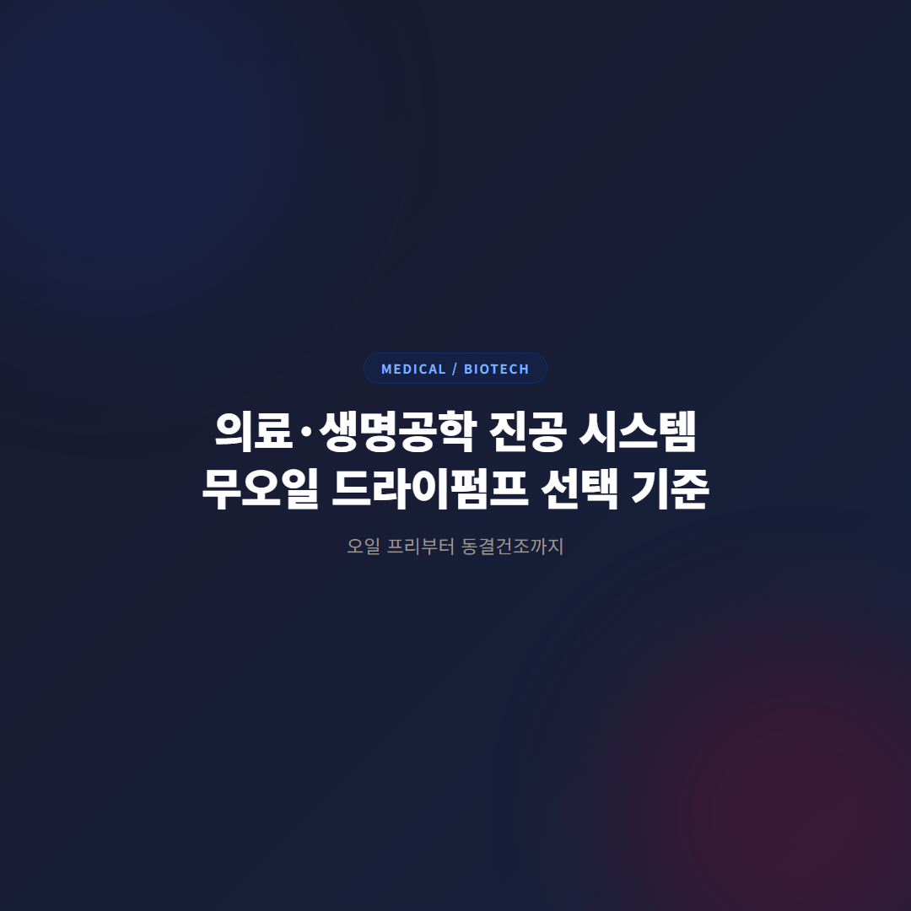
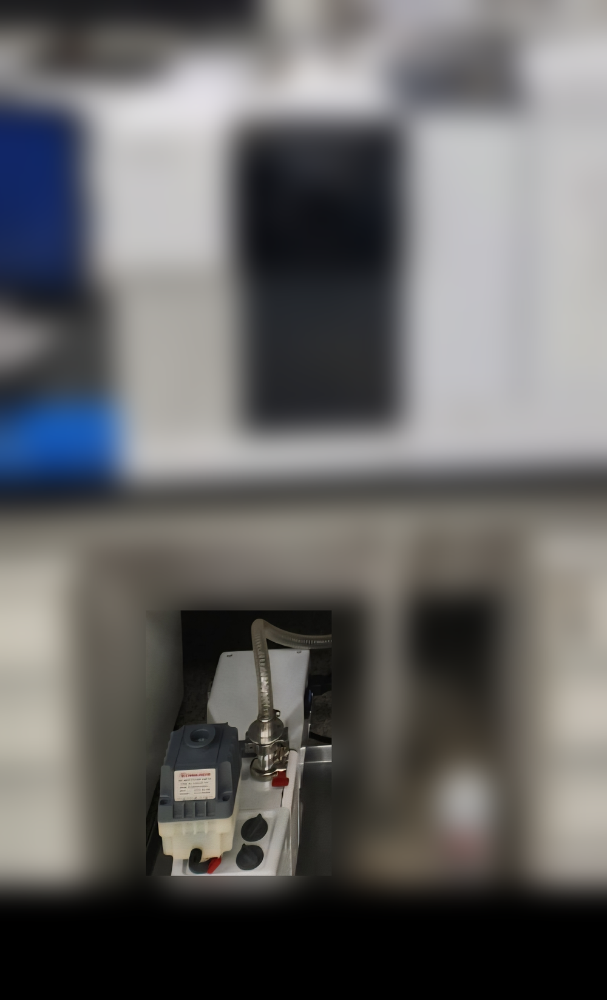
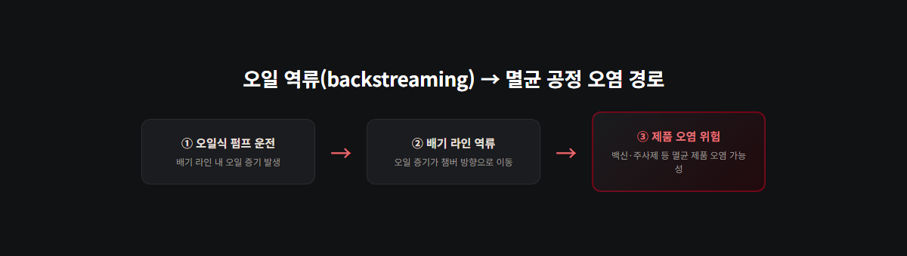
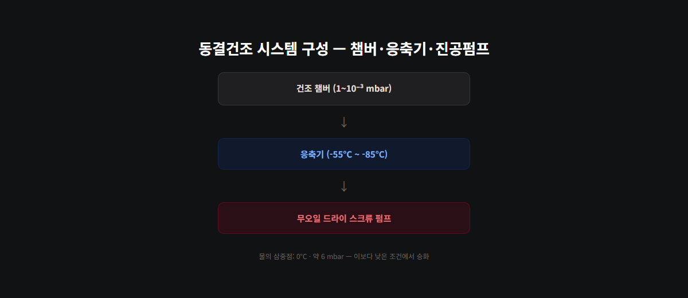

<!-- 수치검증: A항목 5개 확인(E2M0.7·E2M1.5 배기속도/도달진공도, nXDS6i 배기속도/도달진공도, 동결건조 진공범위·삼중점·응축기) / B항목 해당없음 / C항목 3개 확인(E2M 시리즈=오일식 로터리베인, nXDS6i=드라이 스크롤, EMF3=미스트필터 소모품) / 삭제 1개(FDA 21 CFR Part 11 오인용→cGMP로 교체) / 교체 1개 -->

# 의료·생명공학 진공 시스템, 오일펌프 유지와 드라이 전환 판단 기준

GC·GC-MS 같은 분석 장비와 동결건조·멸균 챔버 같은 공정 장비는 오일 유무를 판단하는 기준이 다릅니다. 분석 장비는 소형 오일로터리펌프가 제조사 출고 시부터 붙박이로 달려 있어 전환이 쉽지 않고 꼭 필요하지도 않은 반면, 공정 장비는 제품이 배기 라인과 접촉할 가능성이 있어 오일 역류가 곧 오염·규제 위반으로 이어질 수 있습니다. 이 글은 두 장비군을 나눠 각각의 판단 기준을 정리합니다.

## GC·GC-MS 같은 분석 장비, 오일로터리가 표준인 이유

질량분석기·전자현미경·GC 계열 장비는 E2M0.7(배기속도 0.75 m³/h, 도달진공도 3.0E-03 mbar)·E2M1.5(1.6 m³/h, 1.0E-03 mbar) 같은 초소형 오일로터리베인 펌프를 기본 사양으로 채택합니다. NW10 규격의 작은 입구로 장비 내부 공간에 맞춰 설계돼 있고, 터보펌프 백킹용으로도 널리 쓰입니다.

이 펌프들은 장비 제조사가 애초에 이 크기·성능에 맞춰 시스템을 설계했기 때문에, 다른 펌프로 단순 교체하기가 현실적으로 어렵습니다. 배관 경로, 진동 허용치, 설치 공간까지 전부 E2M 시리즈 기준으로 맞춰져 있어서, 드라이펌프로 바꾸려면 배관을 새로 설계하거나 최악의 경우 장비 자체를 재설계해야 하는 상황도 생깁니다. 그래서 GC·GC-MS를 운용 중인 현장에서는 "오일식이라 문제"보다 "오일식이 기본"이라는 인식이 맞습니다.

## 그래도 오일 역류가 걱정된다면

전면 교체 없이 오일 미스트 배출을 줄이는 방법도 있습니다. EMF3 미스트 필터는 E2M0.7·E2M1.5 배기 라인에 장착해 오일 포집이 가능한 소모품입니다(NW10, 정격유량 3 m³/h). 정기적으로 필터를 교체하면 완전한 드라이 전환 없이도 배출 오일량을 관리할 수 있습니다. 배기구 주변에서 오일 냄새나 얼룩이 자주 발견된다면, 펌프를 바꾸기 전에 필터 교체 주기부터 점검하는 편이 비용 대비 효과가 큽니다.

드라이 대안이 아예 없는 것은 아닙니다. nXDS6i(드라이 스크롤, 6.2 m³/h, 2.0E-02 mbar)는 E2M 시리즈와 동일하게 질량분석기·전자현미경·터보펌프 백킹용으로 쓰이는 오일프리 모델입니다. 다만 입구가 NW25로 E2M 시리즈(NW10)보다 커서, 기존 장비 배관·설치 공간을 다시 맞춰야 하는 경우가 많습니다. 소음도 52 dB(A) 수준으로 조용한 편이라, 신규 장비 도입이나 실험실 리모델링 시점에는 검토할 만한 선택지입니다. 다만 기존 GC를 그대로 쓰면서 펌프만 바꾸는 방식은 대부분 권장하지 않습니다.

## 오일 역류가 정말 위험한 곳은 공정 장비입니다

동결건조기·멸균 챔버·충전 라인은 사정이 다릅니다. 백신·주사제 같은 제품이 배기 라인과 같은 공간을 공유하거나 직접 접촉할 가능성이 있어, 오일 증기가 챔버로 역류(backstreaming)하면 곧바로 제품 오염으로 이어질 수 있습니다. FDA cGMP 같은 의약품 제조 규제 환경에서는 공정 가스에 윤활유가 닿지 않아야 한다는 요건이 있어, 이런 설비는 오일식 펌프 자체가 사용 불가한 경우도 있습니다. 분석 장비와 달리 공정 장비는 "제품이 직접 진공 라인 근처를 지나간다"는 구조적 차이가 판단 기준을 완전히 바꿉니다.

## 동결건조 공정의 진공 조건

동결건조(lyophilization)는 진공범위 1~10⁻³ mbar를 요구합니다. 1차 건조 단계에서 시료가 녹지 않도록 목표 압력까지 빠르게 낮춰야 하는데, 배기속도가 부족하면 온도·압력 조건이 무너집니다. 물의 삼중점은 0°C·약 6 mbar이고, 이보다 낮은 조건이어야 얼음이 액체를 거치지 않고 바로 기체로 승화합니다. 건조 챔버, 응축기(보통 -55°C~-85°C), 진공펌프가 이 조건을 함께 맞춰야 하는 구조입니다.

동결건조 같은 공정 장비에서는 스크류 방식 드라이펌프가 자주 채택됩니다. 100% 오일프리로 마모 부품이 없어 오일 교환·부품 교체 부담이 적고, 재생(regeneration) 모드가 내장돼 공정 종료 후 빠르게 건조시켜 다음 배치 처리량을 높일 수 있습니다. 반복 배치를 많이 돌리는 라인일수록 재생모드의 처리량 이점이 크게 체감됩니다.

## 위생·세척 기준도 함께 봐야 하나요

공정 장비를 무오일로 바꾼다고 위생 문제가 전부 해결되는 건 아닙니다. 챔버·배관 재질이 세척·멸균 절차를 견디는지도 함께 확인해야 합니다. 스테인리스 재질 중에서도 내식성이 높은 등급을 쓰는지, 배관 연결부가 세척액이 고이지 않는 구조인지가 실무에서 자주 확인하는 포인트입니다. 오일 문제를 해결해도 세척 사각지대가 남아 있으면 오염 위험 자체는 줄지 않습니다.

## 그래서 어떻게 판단해야 하나요

장비 유형을 먼저 구분하면 전환 여부가 빠르게 정리됩니다.

- **GC·GC-MS·전자현미경 같은 분석 장비**: E2M0.7·E2M1.5급 오일로터리 유지가 기본입니다. 오일 냄새·미스트가 신경 쓰인다면 EMF3 필터 교체 주기부터 점검하고, 신규 도입 시점이라면 nXDS6i 같은 드라이 스크롤을 검토할 수 있습니다.
- **동결건조기·멸균 챔버·충전 라인 같은 공정 장비**: 제품이 배기 라인과 접촉 가능한 구조라면 무오일 전환을 우선순위로 둡니다. 규제 감사·인증 갱신을 앞두고 있거나 배치 처리량을 늘려야 하는 경우도 전환을 검토할 시점입니다.
- **판단이 애매한 경우**: 같은 실험실 안에 분석 장비와 공정 장비가 함께 있다면, 공정 장비 라인부터 먼저 무오일로 전환하고 분석 장비는 필터 관리로 유지하는 절충안이 현실적입니다.

지금 쓰시는 장비가 분석용인지 공정용인지, 그리고 규제 대상 공정과 같은 공간을 쓰는지 확인하면 전환 필요 여부를 바로 판단할 수 있습니다.

---

E2M0.7/E2M1.5 오일로터리 유지·EMF3 미스트 필터 교체, nXDS6i 드라이 스크롤 전환, 동결건조 진공 시스템 구성 상담.
