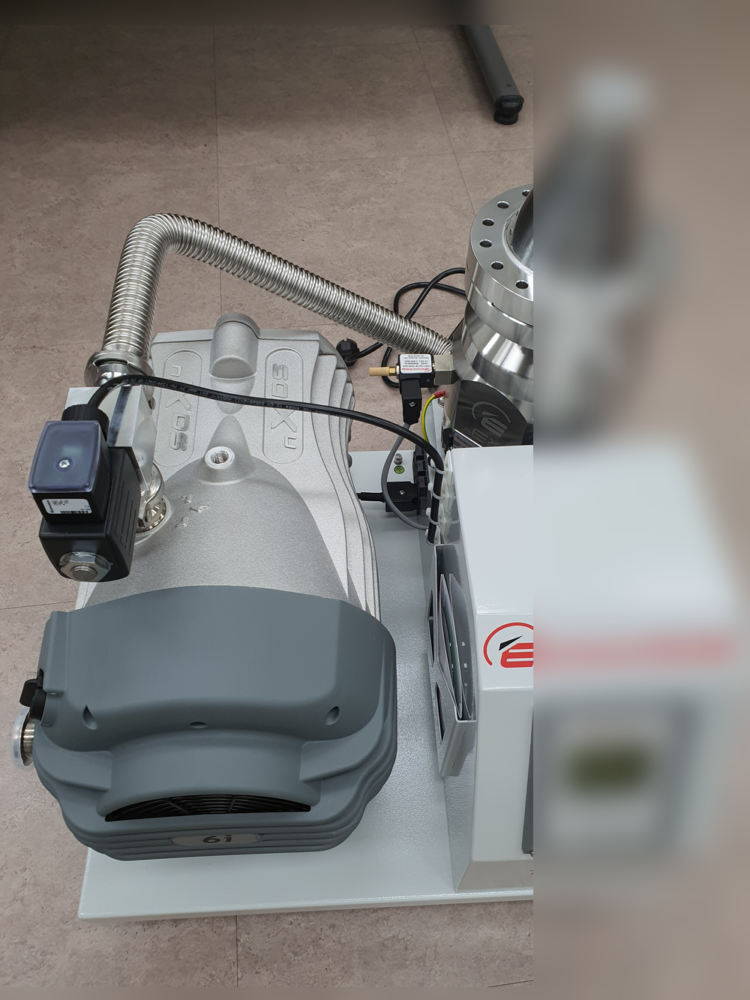
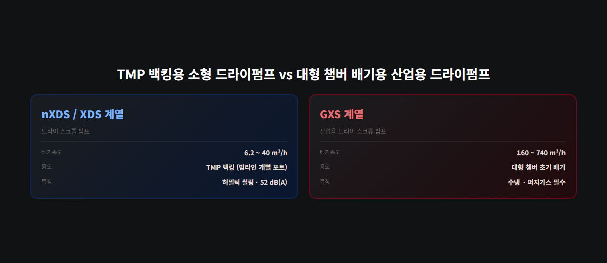
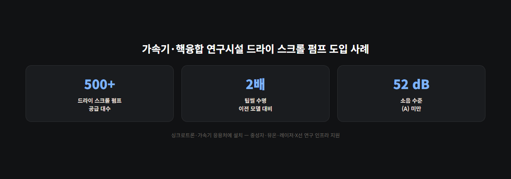

<!-- 수치검증: A항목 9개 확인 / B항목 2개 확인 / C항목 3개 확인 / D항목 1개 확인 / 삭제 0개 / 교체 0개 -->

# 대형 과학장비 러프 진공 — 가속기·핵융합 드라이펌프 선택 기준

가속기 빔라인이나 핵융합 실험 장치는 최종적으로 초고진공(UHV) 수준을 요구하지만, 이 압력은 터보분자펌프(TMP) 혼자 만들지 않습니다. TMP는 입구 압력이 일정 수준까지 내려간 뒤에야 정상 작동하고, 그 앞단(대기압~중간 압력)을 만드는 러프 진공 펌프가 별도로 필요합니다. 대형 과학장비에서는 이 러프 진공 펌프의 선택이 챔버 청정도·정비 주기·소음·설치 환경을 그대로 좌우합니다.

## 오일프리가 필수인 이유

가속기·핵융합 설비의 진공 챔버는 오염에 민감합니다. 오일이 챔버 쪽으로 역류하면 탄화수소가 표면에 흡착돼 초고진공 도달을 방해하고, 빔라인 광학계·검출기 오염으로 이어집니다. 드라이 스크롤 펌프는 허밀틱 벨로우즈 실링 구조로 베어링 윤활유를 진공 공간과 완전히 격리하기 때문에 이 문제에서 자유롭습니다.

방사선이 강한 구역에서는 고려할 점이 하나 더 있습니다. 드라이 러닝 백킹펌프의 실링재로 쓰이는 테프론(불소수지) 계열 소재가 방사선에 취약해질 수 있다는 우려 때문에, 실링재가 필요 없는 다단 루츠 방식을 택한 사례도 있습니다.

## 소형 TMP는 nXDS, 대형 TMP는 XDS35i

빔라인 개별 포트나 실험 챔버에 다는 소형 TMP(55~400 l/s급)에는 nXDS 계열이 공식 권장 백킹펌프로 지정돼 있습니다. nXDS6i(피크 배기속도 6.2 m³/h)와 nXDS10i(11.4 m³/h)는 각각 55~85 l/s급, 240~400 l/s급 TMP의 백킹펌프로 매칭됩니다. 노이즈는 52 dB(A) 수준입니다.

CF160급 이상 대형 TMP(730 l/s급 이상)로 가면 백킹펌프 규모도 커져야 합니다. 이 급의 공식 권장 백킹펌프는 XDS35i·XDS46i입니다. XDS46i는 1~10 mbar 구간에서 배기속도가 최적화돼 터보 백킹에 특히 적합하도록 설계돼 있습니다. 고에너지물리 응용의 대용량 터보펌프(1250 l/s급)에도 XDS35i가 동일하게 권장 백킹펌프로 지정돼 있습니다.

## 대형 챔버 자체 배기는 GXS 계열

빔라인 포트가 아니라 대형 진공 챔버(우주환경 시뮬레이션 챔버 등)를 대기압에서 초기 배기할 때는 nXDS급으로는 배기속도가 부족합니다. 산업용 드라이 스크류 GXS 시리즈(GXS160~GXS750, 160~740 m³/h)가 이 용도로 쓰이며, 대형 진공 챔버 배기가 공식 응용 분야에 포함돼 있습니다. GXS는 오일이 공정부(진공부)에 직접 닿지 않는 구조이지만, 공정 가스에 따라 퍼지 가스(질소 등) 공급이 필수라는 점은 설계 초기에 반영해야 합니다.

## 실제 도입 사례

가속기·핵융합 연구기관에 드라이 스크롤 펌프가 대량 공급된 사례가 있습니다. 500대 이상의 드라이 스크롤 펌프가 싱크로트론·가속기를 포함한 여러 응용처에 설치돼 연구 인프라를 지원하고 있으며, 팁씰 수명이 이전 모델 대비 2배로 늘어난 설계와 특수 공구 없이 현장에서 정비 가능한 구조가 선정 근거로 제시됐습니다.

포항 소재 가속기 빔라인 연구 그룹에서도 8인치(CF160) 터보분자펌프 도입 문의가 있었습니다. 이전에는 4.5인치급 TMP를 쓰다가 빔라인 구간 확장으로 더 큰 사이즈가 필요해진 경우였는데, 이 급의 TMP라면 백킹펌프도 소형 nXDS가 아니라 XDS35i급으로 검토해야 합니다. 이처럼 빔라인 구간이 늘어나거나 TMP 사이즈가 커질 때마다 백킹펌프 스펙도 함께 재검토하는 습관이 필요합니다.

## 정비·소모품도 미리 확인해야 합니다

드라이 스크롤 펌프(nXDS/XDS)는 팁씰(tip-seal)이 주요 소모품입니다. 팁씰 서비스 키트로 교체하며, 특수 공구 없이 현장에서 직접 정비 가능하도록 설계돼 있습니다. GXS 계열은 진공부(공정부)에는 오일이 닿지 않지만, 기어박스 윤활에는 저증기압 특수 오일(PFPE Drynert 25/6)을 사용합니다. 이 오일은 공정부와 격리돼 있어 오염 우려는 없지만, 정기 교환 대상이라는 점은 소모품 관리 계획에 반영해야 합니다.

방사선 환경에서는 백킹펌프 선택 기준이 한 번 더 갈립니다. 유럽 XFEL 빔라인처럼 고진공·초고진공을 유지해야 하는 구간에는 터보펌프와 함께 오일프리 드라이펌프가 표준으로 쓰이지만, J-PARC(일본 대형 양성자가속기시설)처럼 방사선 강도가 매우 높은 구역에서는 실링재 없이 압축하는 다단 루츠 방식을 우선 검토한 사례가 있습니다. 같은 "가속기 설비"라도 방사선 강도에 따라 백킹펌프 방식 자체를 다시 검토해야 한다는 뜻입니다.

## 도입 전 확인할 것

- **TMP 배기속도**: 55~400 l/s급은 nXDS, 730 l/s 이상은 XDS35i·XDS46i가 공식 권장 조합
- **챔버 규모**: 대형 챔버 자체 초기 배기는 GXS160~750 검토
- **방사선 환경**: 방사선이 특히 강한 구역은 실링재 방사선 내성을 별도로 확인 필요
- **납기**: 대형 TMP·드라이펌프 조합은 3개월 이상 소요되는 경우가 흔함
- **정비 체계**: 국내 수리 불가 모델이 많아 예비 유닛 확보 여부를 사전에 검토
- **소모품 계획**: nXDS/XDS는 팁씰 서비스 키트, GXS는 PFPE 기어박스 오일 정기 교환 대상으로 예산에 반영

---

TMP 백킹펌프 매칭, GXS 퍼지 구성 설계, 방사선 환경 실링재 확인 등을 상담합니다. 대형 TMP는 국내 정비가 제한적인 경우가 많아 예비 유닛 확보를 함께 검토하시는 것이 좋습니다.
