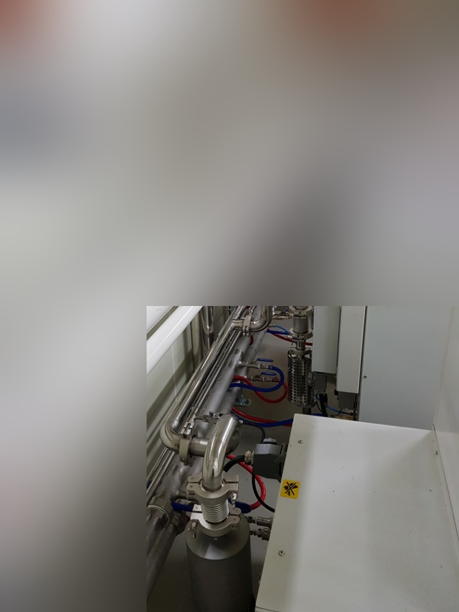
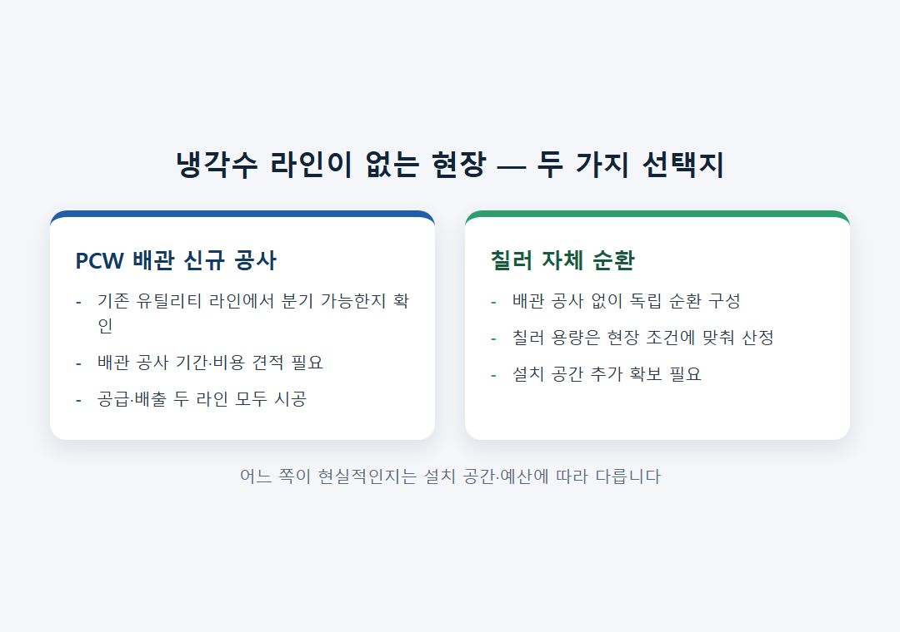
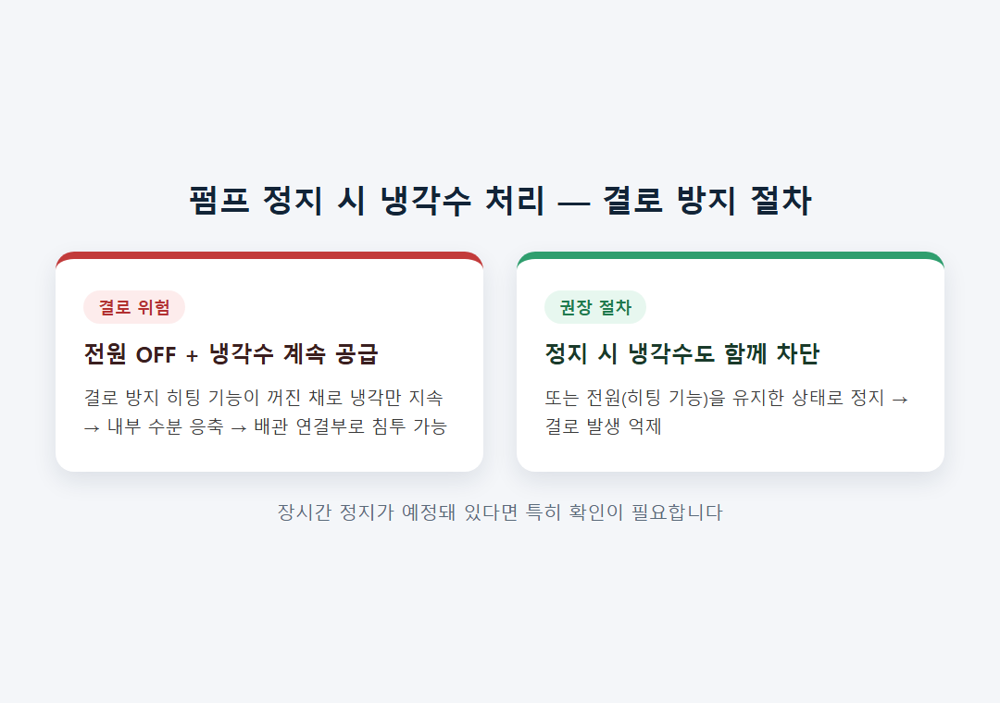

<!-- 수치검증: A항목 6개 확인 / B항목 1개 확인 / C항목 3개 확인 / D항목 0개 / 삭제 0개 / 교체 0개 -->

# 산업용 드라이펌프 냉각 방식 — 수냉 전용 GXS·EXS와 공랭 대안의 실무 판단 기준

산업용 드라이펌프를 도입할 때 냉각 방식은 대부분 선택의 문제가 아니라 확인의 문제입니다. 배기속도가 일정 규모를 넘으면 펌프 자체가 수냉 전용으로 설계돼 있고, 그 아래 소용량 구간에서만 공랭 제품이 대안으로 남기 때문입니다. 아래에서 스펙 기준과 현장 운용 조건을 정리합니다.

## GXS·EXS는 전 모델 수냉 전용 — 공랭 옵션이 없다

GXS·EXS 산업용 드라이 스크류 펌프는 전 모델 데이터시트에 냉각수 스펙이 필수 항목으로 명시돼 있고, 공랭 변형 자체가 존재하지 않습니다. GXS160·GXS250 기준 냉각수 공급압력은 최대 6.9bar, 펌프 통과 최소 차압 1.0bar, 유량은 최소 차압 기준 4.0~7.0L/min입니다. GXS450·GXS750은 유량이 10~15L/min으로 늘어납니다. 냉각수 사용 온도 범위는 전 모델 공통 5~40°C입니다. EXS 계열 역시 동일한 구조로, 냉각수 입구(TP-5)와 출구(TP-6) 포트가 도면상 별도로 표시돼 있어 공급·배출 두 라인 모두 확보가 필요합니다.

같은 배기속도 대역에서 공랭·수냉 변형을 함께 제공하는 제조사도 있습니다. Edwards의 EDS 라인은 공식 웹샵 카탈로그 기준 "Air Cooling (forced-fan)" 변형과 "Water Cooling direct" 변형을 별도 품번으로 구분해 제공합니다. 다만 스마텍이 실제로 공급하는 GXS·EXS 라인은 이 선택지가 없는 수냉 전용 설계이므로, 실무에서는 "이 모델을 쓸 수 있는 냉각수 인프라가 있는가"를 먼저 확인해야 합니다.

배기속도가 작은 구간에는 대안이 있습니다. nXDS 드라이 스크롤 펌프는 온도 감응형 냉각팬으로 방열하는 완전 공랭 구조이며 냉각수 배관이 필요 없습니다. 다만 nXDS의 배기속도는 22m³/h 이하로, GXS160(160m³/h) 이상이 필요한 공정에는 용량 자체가 맞지 않습니다.

## 냉각수 라인이 없는 현장의 두 가지 선택지

기존 설비를 실외에서 실내로 이전하거나 신규 라인을 구성할 때, 질소(N2)는 기존 배관에서 분기만 하면 되는 경우가 많지만 냉각수(PCW)는 별도 배관을 새로 깔아야 하는 경우가 흔합니다. 이때 현장에서 선택할 수 있는 방향은 두 가지입니다. 하나는 PCW 배관을 신규로 공사하는 것이고, 다른 하나는 칠러를 설치해 자체 순환 냉각수를 공급하는 것입니다. 펌프 본체에는 연결 피팅과 밸브가 기본 장착돼 있지만, 공급원 자체는 현장에서 준비해야 하는 항목입니다.

설비를 이전·증설하는 프로젝트라면 펌프 발주 전에 유틸리티 배관 경로부터 확인하는 순서가 안전합니다. 배관 공사와 칠러 도입 중 어느 쪽이 일정·비용 측면에서 현실적인지는 현장 조건에 따라 달라지므로 사전 확인이 필요합니다.

## 정지 시 냉각수 차단 — 수냉식 운전에서 빠뜨리기 쉬운 절차

수냉식 드라이펌프는 정지 후 관리 절차가 하나 더 있습니다. 펌프는 전원이 켜져 있어야 내부 결로를 막는 히팅 기능이 작동합니다. 전원을 끈 상태에서 냉각수 공급을 계속 유지하면 이 히팅 기능 없이 냉각만 이뤄지면서 펌프 내부에 결로가 생길 수 있고, 이 수분이 배관 연결부를 타고 내부로 침투하는 사례가 실제로 접수된 바 있습니다. 원칙은 단순합니다. 펌프를 정지시킬 때는 냉각수 공급도 함께 차단하거나, 정지 중에도 전원(히팅 기능)만은 유지해야 합니다.

공랭식은 이런 정지 절차 자체가 없습니다. 전원만 끄면 됩니다. 대신 배기속도 대역이 제한적이라는 점은 앞서 언급한 그대로입니다.

## 반도체·FPD용 대용량 드라이펌프도 예외 없이 수냉

산업용 GXS·EXS 외에 반도체 공정용 iXH 계열, FPD·솔라 공정용 iXL 계열도 내장 수냉 전용으로 설계돼 있습니다. 배기속도가 커질수록, 그리고 공정 부산물·부식성 가스를 다루는 구조일수록 발열량이 커져 공랭만으로 방열하기 어려워지기 때문입니다. 터보분자펌프 계열(nEXT) 역시 대용량 모델은 수냉 구조를 채택합니다. 결국 산업·반도체용 대용량 드라이펌프 구간에서는 수냉이 사실상 표준이고, 공랭은 소용량 스크롤펌프(nXDS 등) 구간에 한정된 선택지라는 구도로 이해하는 것이 실무적으로 정확합니다.

이 구도를 반대로 적용해 "대용량 공정인데 냉각수 인프라가 부담스러우니 소용량 공랭 펌프 여러 대를 병렬로 쓰겠다"는 접근은 배기속도 총량은 맞출 수 있어도 개별 펌프 대수가 늘어나 설치 공간·전력·유지보수 부담이 오히려 커질 수 있습니다. 배기속도가 GXS·EXS 대역에 들어간다면 냉각수 인프라 구성 쪽을 검토하는 편이 총소유비용 측면에서 유리한 경우가 많습니다.

## 판단 기준 체크리스트

- 필요 배기속도가 GXS160(160m³/h) 이상이면 수냉 전용 GXS·EXS 라인이 사실상 기본 선택지입니다.
- 배기속도가 20m³/h 안팎으로 작다면 nXDS 같은 공랭 스크롤 펌프도 검토 대상입니다.
- 현장에 PCW 라인이 있는지 먼저 확인하고, 없다면 배관 공사와 칠러 도입 중 현실적인 쪽을 견적받습니다.
- 냉각수 사용 가능 온도는 5~40°C이므로 극한 환경이라면 별도 검토가 필요합니다.
- 수냉식을 쓰기로 했다면 정지 시 냉각수 차단(또는 전원 유지) 절차를 운전 매뉴얼에 명시합니다.

---

GXS/EXS 모델 선정, 냉각수 배관·칠러 구성 검토, 정지 절차 상담 가능. 극한 온도 환경이라면 사전 확인이 필요합니다.
