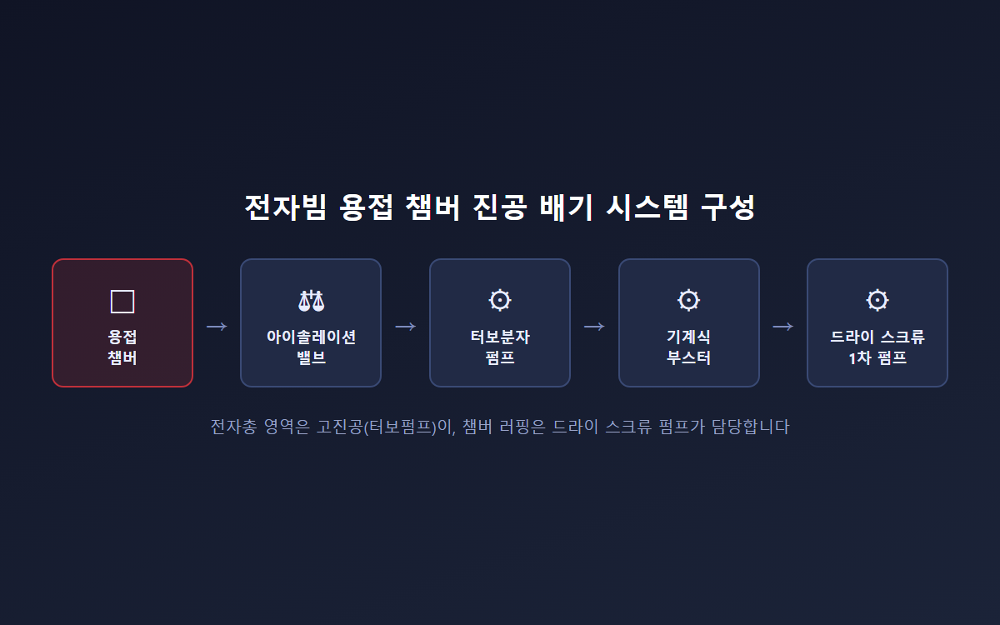
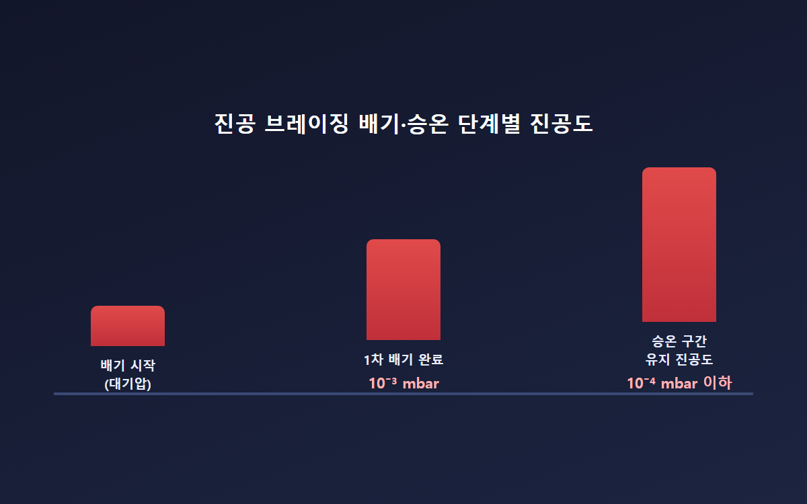
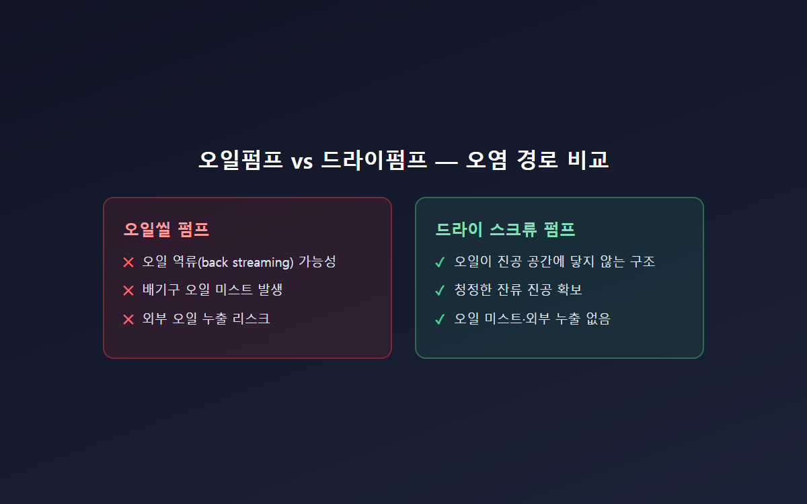
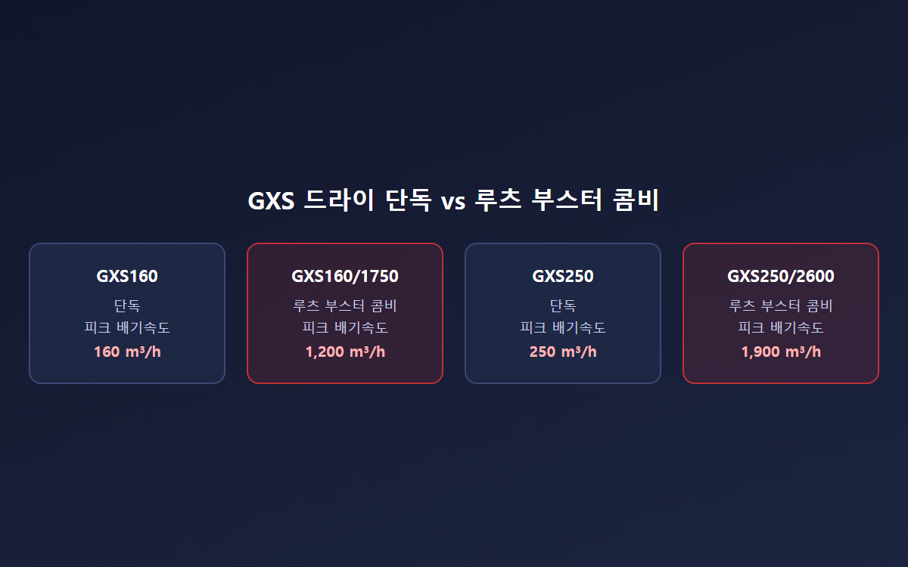

<!-- 수치검증: A항목 9개 확인 / B항목 0개 확인(콤비 모델은 조합 아님) / C항목 2개 확인 / D항목 1개 확인(온도 스펙 확인불가 처리) / 삭제 0개 / 교체 1개 -->

# 전자빔 용접·진공 브레이징 드라이펌프 선택 기준

오일펌프를 쓸지 드라이펌프로 바꿀지 — 전자빔 용접과 진공 브레이징에서 판단 기준 3가지를 정리합니다. 두 공정 모두 진공도가 접합 품질을 결정하는데, 러핑(백킹) 펌프 선택을 잘못하면 오염과 배기 지연이라는 두 가지 문제가 동시에 생깁니다.

## 진공 브레이징과 전자빔 용접, 요구 진공도가 다르다

진공 브레이징은 필러 금속을 접합부에 흘려 넣어 붙이는 공정으로, 진공이 가스를 제거해 금속 젖음성을 높이고 고온과 함께 작용해 산화막을 분해합니다. 브레이징로는 10⁻³ mbar까지 배기한 뒤 단계별로 승온하며, 승온 구간 동안 10⁻⁴ mbar 이하를 유지해야 합니다.

전자빔 용접은 챔버 안에서 고에너지 전자빔으로 모재를 국부 용융시켜 접합합니다. 전자빔이 대기 중 분자와 충돌하면 산란·감쇠되기 때문에, 전자총 주변은 높은 배경 진공을 지속적으로 유지해야 합니다. 두 공정 모두 GXS·EXS 드라이 스크류 펌프의 공식 적용 공정 목록(Metallurgy 카테고리)에 나란히 포함돼 있으며, 실제로 표준 배기 라인업은 브레이징 챔버 → 아이솔레이션 밸브 → 고진공 펌프(터보 또는 확산펌프) → 기계식 부스터 → 1차 펌프 순서로 구성됩니다.

## 오일 오염이 접합 품질에 미치는 영향

오일씰 로터리 피스톤 펌프와 확산펌프 조합은 전통적인 브레이징 방식입니다. 다만 오일 역류는 챔버·노 내부 오염원이 될 수 있고, 접합면에 미세한 오일 흔적이 남으면 젖음성이 떨어져 접합 강도가 낮아질 위험이 있습니다. 드라이 러핑펌프는 오일이 진공 공간에 닿지 않는 구조라 잔류 진공이 더 청정하고, 배기구 오일 미스트나 외부 누출 문제 자체가 없습니다. 청정도가 품질 기준에 직결되는 항공·정밀 부품 접합 공정일수록 이 차이가 크게 작용합니다.

## GXS/EXS 드라이 스크류 펌프 스펙과 선택 기준

GXS 시리즈는 드라이 단독 기준으로 GXS160(피크 배기속도 160 m³/h, 도달진공도 7×10⁻³ mbar), GXS250(250 m³/h, 4×10⁻³ mbar), GXS450(450 m³/h, 5×10⁻³ mbar), GXS750(740 m³/h, 3×10⁻³ mbar) 라인업으로 구성됩니다. 챔버가 크거나 배기 시간을 단축해야 하면 루츠 부스터를 결합한 콤비 모델을 검토합니다. GXS160/1750 콤비는 피크 배기속도가 1200 m³/h까지 올라가 단독 대비 약 7배 수준입니다.

EXS 시리즈는 동일한 스크류 기술 기반에 VFD(가변주파수드라이브)가 내장돼 있어 공정별 속도 제어가 간편합니다. 최상위 콤비인 EXS750/8000은 피크 배기속도 5,980 m³/h까지 지원합니다. 두 시리즈 모두 진공 브레이징·전자빔 용접 공식 적용 목록에 포함돼 있으며, 전자빔 용접 공정에는 금속 스퍼터 대응을 위한 인렛 필터 장착이 권장 액세서리로 명시돼 있습니다.

작은 브레이징로는 GXS250 단독으로도 충분한 경우가 많지만, 대형 전자빔 용접 챔버나 배치 생산 라인이라면 콤비 모델이 유리합니다. 정확한 배기 시간은 챔버 형상과 누설률에 따라 달라지므로, 사양이 불확실하면 별도 확인이 필요합니다.

선정 전에 확인해야 할 항목은 다음과 같습니다.
- 챔버 내부 체적과 목표 배기 시간(승온 스케줄에 맞춰 몇 분 안에 10⁻³ mbar급까지 도달해야 하는지)
- 공정 중 발생하는 가스 종류(아르곤을 포함한 다양한 공정 가스에 대응 가능하지만, 퍼지 가스 공급은 필수 조건입니다)
- 배치 생산인지 연속 생산인지 — 배치 생산은 콤비 모델의 짧은 배기 시간이 특히 유리하게 작용합니다
- 기존 챔버의 인렛 플랜지 규격(ISO63·ISO100·ISO160 등)과 GXS/EXS 인렛 사양의 매칭 여부

## 금속 분진 대응 설계

전자빔 용접의 스퍼터, 브레이징의 필러 메탈 증발분은 펌프 마모의 주요 원인입니다. GXS는 논캔틸레버 양단 지지축 구조로 진동이 낮고, 5리터 물 슬러그와 1kg 미분말 슬러그 처리 테스트를 통과한 설계입니다. 비접촉식 장수명 실에 오일 차단 래버린스 실이 결합돼 있고, 분당 6리터 씰 퍼지로 기어박스를 오염에서 보호하면서 진공 공간은 오일 없는 상태로 유지합니다. 여기에 금속 메시 또는 폴리에스터 소재 인렛 필터를 추가하면 서비스 주기를 늘릴 수 있습니다. 다만 챔버 방사열로부터 펌프·배관을 얼마나 이격해야 하는지에 대한 정확한 온도 기준은 설치 현장 조건에 따라 달라 사양 확인이 필요합니다.

인렛 필터는 펌프 규격에 맞춰 별도로 지정됩니다. 단독 펌프 또는 1750 콤비 조합에는 4인치 필터, 2600 콤비 조합에는 6인치 필터, 4200 콤비 조합에는 8인치 필터가 매칭되며, 폴리에스터 소재는 5마이크론 입자를 99% 이상 걸러내고 스테인리스 메시 소재는 300마이크론 입자를 90% 걸러냅니다. 분진 발생량이 많은 공정일수록 필터 하우징을 스테인리스로 선택하면 세척 주기를 늘릴 수 있습니다.

정비 측면에서도 드라이 방식은 강점이 있습니다. 오일 교환·오일 상태 점검이라는 정기 작업 자체가 없고, 계획되지 않은 다운타임을 줄이는 구조로 설계돼 서비스 간격이 깁니다. 브레이징로나 용접 챔버처럼 생산 스케줄이 촘촘한 라인에서는 이 정비 주기 차이가 곧 가동률 차이로 이어집니다.

---

GXS/EXS 드라이 스크류 펌프 모델 선정, 진공 브레이징·전자빔 용접 배기 시스템 설계 상담. 금속 분진이 많은 공정은 인렛 필터 장착을 권장합니다.
