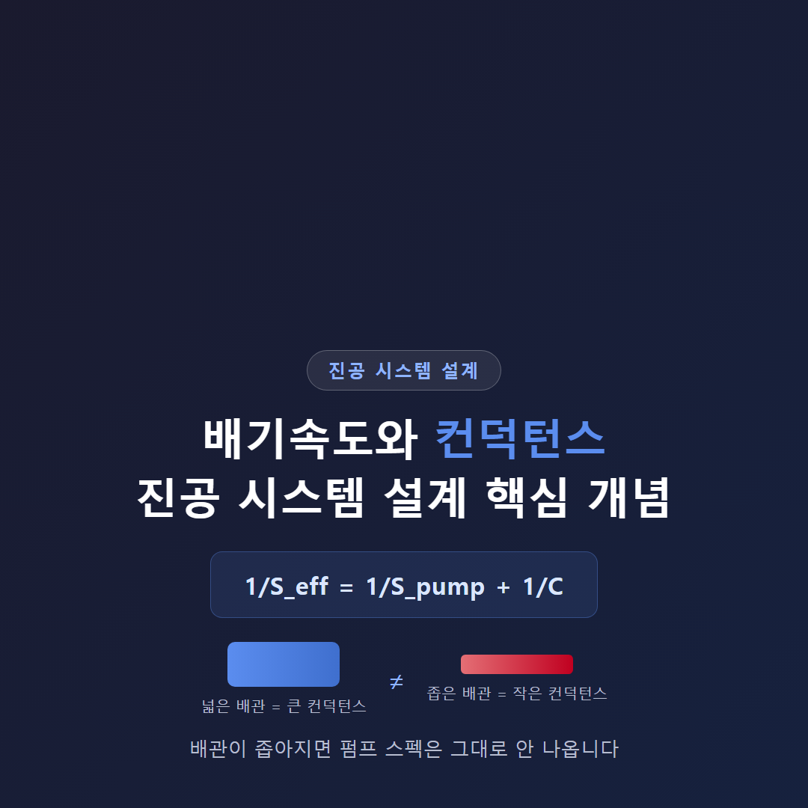
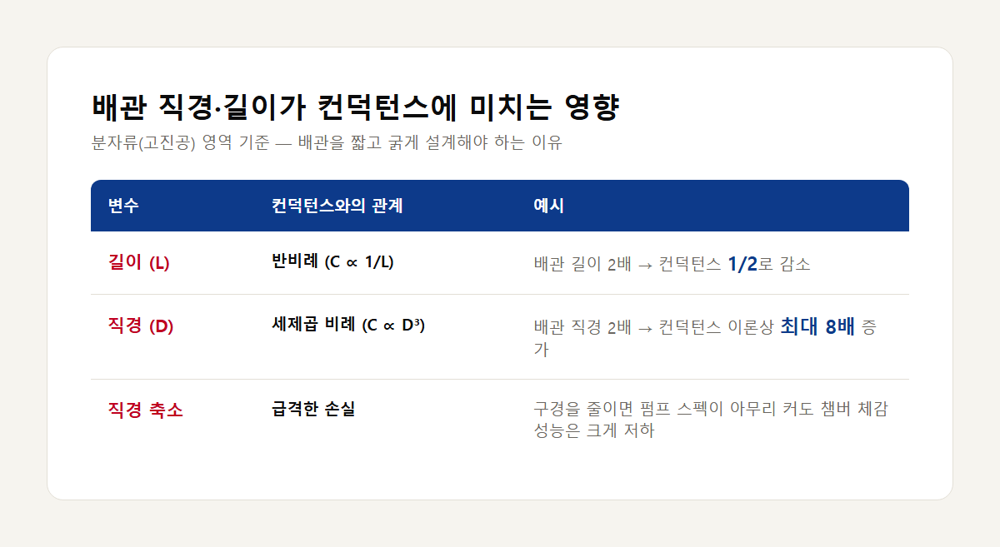

<!-- 수치검증: A항목 9개 확인 / B항목 0개 확인 / C항목 2개 확인 / D항목 0개 확인 / 삭제 0개 / 교체 0개 -->

# 배기속도와 컨덕턴스 — 진공 시스템 설계 시 꼭 알아야 할 개념

펌프 카탈로그의 배기속도는 펌프 자체의 성능 수치입니다. 챔버에서 실제로 체감하는 성능은 별개의 값이며, 이를 유효 배기속도라고 부릅니다. 두 값의 차이를 만드는 요인이 배관·밸브·필터 같은 수동 요소의 컨덕턴스입니다. 진공 시스템을 설계할 때 배기속도만 보고 펌프를 정하면, 실제 성능이 스펙에 못 미치는 경우가 자주 발생합니다.

## 배기속도와 컨덕턴스는 각각 무엇을 의미하나

배기속도(S)는 펌프가 흡입구에서 단위 시간당 처리하는 기체 부피이며, 단위는 m³/h 또는 L/s입니다. 컨덕턴스(C)는 배관·오리피스·밸브 등 수동 요소가 기체 흐름을 얼마나 제한하는지 나타내는 값으로, C = Q/ΔP(기체 처리량을 압력강하로 나눈 값)로 정의됩니다. 두 값은 같은 차원(부피/시간)을 갖지만 용도가 다릅니다. 배기속도는 기체를 능동적으로 제거하는 펌프에, 컨덕턴스는 기체를 수동적으로 통과시키는 배관 요소에 적용하는 용어입니다.

## 유효 배기속도는 어떻게 계산하나

펌프와 챔버 사이에 배관이 존재하면, 챔버 쪽에서 실제로 느껴지는 유효 배기속도(S_eff)는 펌프 자체 배기속도보다 항상 작습니다. 관계식은 아래와 같습니다.

1/S_eff = 1/S_pump + 1/C

곱셈 형태로 정리하면 S_eff = (S × C) / (S + C)입니다. 배관이 여러 요소(밸브, 필터, 배플, 튜빙)로 이어져 있다면 각 요소의 컨덕턴스를 먼저 직렬로 합성한다.

1/C_total = Σ(1/C_i)

병렬로 연결된 배관(예: 두 갈래로 나뉘는 라인)은 반대로 단순히 더한다.

C_total = Σ(C_i)

직렬 합성으로 구한 C_total을 펌프 배기속도와 다시 합쳐야 최종 유효 배기속도가 나온다.

## 배관 길이·직경이 컨덕턴스에 미치는 영향

컨덕턴스는 배관 길이에 반비례한다. 직경의 영향은 이보다 크다. 분자류 영역(고진공, 압력 약 0.01mbar 미만)에서 원형 배관의 컨덕턴스는 직경의 세제곱에 비례한다. 직경을 2배로 늘리면 컨덕턴스는 이론상 8배까지 늘어난다. 배관을 가늘게 줄이면 반대로 컨덕턴스가 급격히 낮아져, 펌프 배기속도가 커도 유효 배기속도는 크게 깎인다. 이 관계 때문에 "진공 연결은 가능한 한 짧고 넓게 구성해야 한다"는 원칙이 오래전부터 전해진다.

실측 데이터로 확인된 예시가 있다. 5m 길이 NW40 배관(굽힘 2곳)에 스크롤 펌프를 연결한 조합에서, 압력 구간별 손실 폭은 다음과 같다.

- 고압 구간(10mbar 초과): 배관 컨덕턴스 영향 최소
- 중압 구간(약 10mbar 부근): 배기속도 손실 약 50%
- 저압 구간(0.1mbar 미만): 손실 무시 가능한 수준

러핑 초반~중반에 해당하는 중압 구간에서 배관 설계 미흡이 가장 크게 드러난다. 참고로 ISO100 게이트밸브 하나의 분자류 영역 컨덕턴스는 약 1,700 L/s 수준이며, 이런 개별 부속 하나하나도 전체 컨덕턴스 손실에 누적된다.

## 흐름 영역별로 설계 우선순위가 달라지는 이유

압력에 따라 기체 흐름은 점성류(1mbar 초과, 압력에 선형 비례), 중간류(0.01~1mbar, 두 특성 혼합), 분자류(0.01mbar 미만, 압력과 무관한 상수)로 구분된다. 실무적으로는 다음과 같이 정리된다.

- 점성류(러핑 초반): 배관 저항의 영향이 상대적으로 작음
- 중간류(러핑 중후반): 배관 설계 실수가 가장 크게 드러나는 구간
- 분자류(고진공): 컨덕턴스가 압력과 무관한 상수가 되어, 배관 직경·길이가 도달진공도에 구조적으로 영향을 줌

고진공을 목표로 하는 설비일수록 배관 설계를 처음부터 정확히 잡아야 하는 이유가 여기에 있다. 설치 이후 배관 구경을 바꾸는 작업은 비용·공정 중단 부담이 커서, 설계 단계에서 컨덕턴스를 계산해 두는 편이 안전하다.

## 배관 구경을 줄여야 하는 현장에서 흔히 나오는 질문

펌프 입구 노즐이 100A인데 현장 배관을 50A로 줄여야 하는 경우, "구경을 줄이면 큰 펌프를 쓸 이유가 없지 않냐"는 질문이 실제로 자주 나온다. 반도체 공정 관련 업체에서 대체 모델 도입을 검토하던 중 실제로 나왔던 질문이다. 담당자는 기존 배관이 50A로 이미 시공돼 있어서, 흡입 노즐이 100A인 펌프를 들여와도 배관 구경을 줄여 연결할 수밖에 없는 상황이었다. "그러면 굳이 큰 노즐 펌프를 쓸 이유가 있느냐"는 질문에는 "그래도 컨덕턴스 영향은 그대로 남는다. 얼마나 빨리 뽑으려 하시는지에 따라 손실 폭이 달라지는데, 초기 구간에서는 배기 시간이 늘어난다"는 답이 나갔다. 노즐 구경 그대로 배관을 유지했을 때와 작은 구경으로 줄였을 때의 차이는, 결국 병목이 어디에서 생기는지의 문제로 귀결된다. 목표 배기 시간이 촉박한 공정일수록 이 차이가 체감되는 폭도 커진다.

배기속도 스펙만으로 펌프를 선정하지 말고, 배관 구경·길이·굽힘 개수를 함께 계산해야 실제 배기 성능을 예측할 수 있다. 목표 압력과 배기 시간이 정해져 있다면, 배관 컨덕턴스를 먼저 확인한 뒤 펌프를 선정하는 순서가 맞다.

## 배관 설계 전 확인해야 할 체크리스트

새 진공 시스템을 설계하거나 기존 설비의 배관을 변경하기 전에는 아래 항목을 순서대로 점검하는 것이 좋다.

- 목표 압력과 목표 배기 시간이 정해져 있는가 — 이 두 값이 없으면 컨덕턴스 계산 자체가 불가능하다.
- 펌프 흡입구 노즐 구경과 실제 배관 구경이 같은가 — 다르면 축소 구간의 컨덕턴스를 별도로 계산해야 한다.
- 배관 총 길이와 굽힘(엘보우) 개수를 파악했는가 — 굽힘은 등가 길이로 환산되어 실제 길이보다 저항이 커진다.
- 배관 사이에 밸브·필터·배플·트랩이 몇 개 들어가는가 — 요소가 늘어날수록 직렬 합성으로 컨덕턴스가 계속 낮아진다.
- 운전 압력대가 점성류·중간류·분자류 중 어디에 해당하는가 — 영역에 따라 배관 설계의 중요도가 달라진다.
- 배관 구경을 줄여야 하는 불가피한 사정이 있다면, 줄어든 구간의 컨덕턴스만큼 배기 시간이 늘어난다는 점을 사전에 계산해 공정 여유 시간에 반영했는가.

## 현장에서 자주 나오는 실수

배관 설계 단계에서 컨덕턴스를 계산하지 않고 진행했다가 나중에 문제가 되는 사례는 대체로 패턴이 비슷하다.

첫째, 펌프 배기속도 스펙만 보고 배관 구경을 기존 설비 규격에 맞춰 그대로 줄이는 경우다. 위에서 다룬 상담 사례처럼 "노즐이 큰 펌프인데 구경을 줄이면 의미가 없지 않냐"는 질문이 나오는 지점이 바로 여기다. 실제로는 의미가 없어지는 것이 아니라, 목표 배기 시간을 맞추기 어려워지는 형태로 손실이 나타난다. 특히 러핑 초기~중반 구간(점성류~중간류)에서 배기 시간이 눈에 띄게 늘어난다.

둘째, 배관 길이를 최소화하려 하지 않고 설비 배치를 먼저 정한 뒤 배관을 나중에 맞추는 경우다. 배관이 길어지면 컨덕턴스는 길이에 반비례해 줄어들고, 굽힘이 늘어나면 등가 길이가 실제 길이보다 커져 손실이 가중된다. 설비 초기 배치 단계에서 펌프와 챔버 거리를 가깝게 잡아야 하는 이유가 여기에 있다.

셋째, 밸브·필터·트랩 같은 부속을 순서대로 추가하면서 각 부속의 컨덕턴스를 개별로만 확인하고, 직렬로 합성했을 때의 총 컨덕턴스는 계산하지 않는 경우다. 개별 부속 하나의 컨덕턴스가 충분히 커 보여도, 여러 개를 직렬로 연결하면 1/C_total = Σ(1/C_i) 관계에 따라 총 컨덕턴스는 개별 값보다 항상 작아진다. 배관 라인을 설계할 때는 반드시 전체 구간을 하나로 묶어 계산해야 한다.

이 세 가지 실수는 공통적으로 "펌프 스펙만 보고 배관은 나중에 맞춘다"는 순서에서 비롯된다. 목표 압력·배기 시간이 정해진 시점에 배관 컨덕턴스를 먼저 계산하고, 그 결과에 맞는 펌프를 고르는 순서로 진행하면 대부분 예방할 수 있다.

---

GXS/EXS 모델 선정, 배관 컨덕턴스 계산, 진공 시스템 배관 설계 상담 가능합니다.
