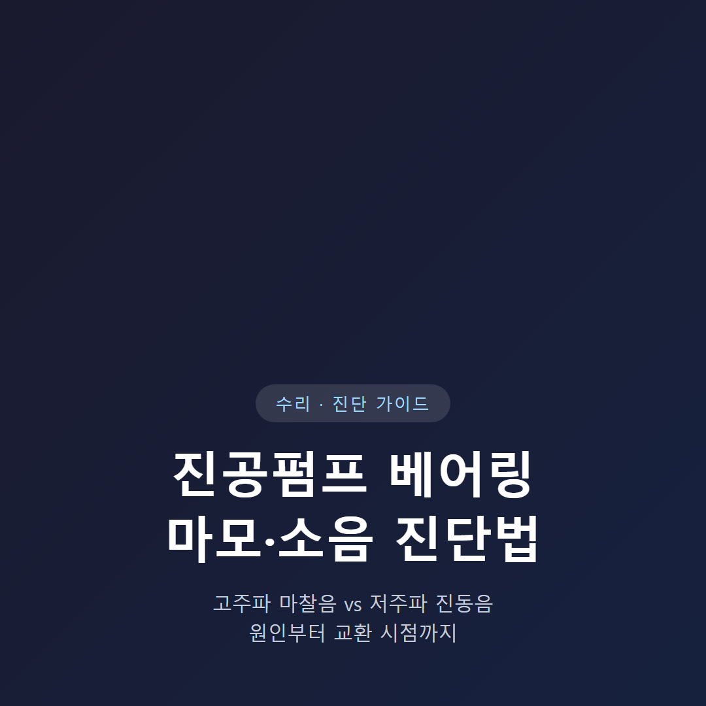
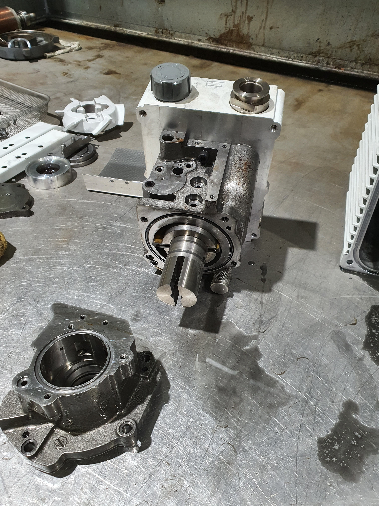
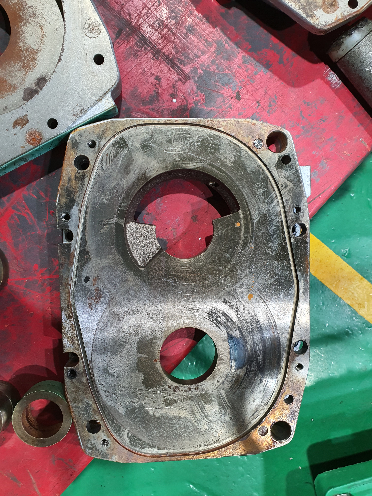
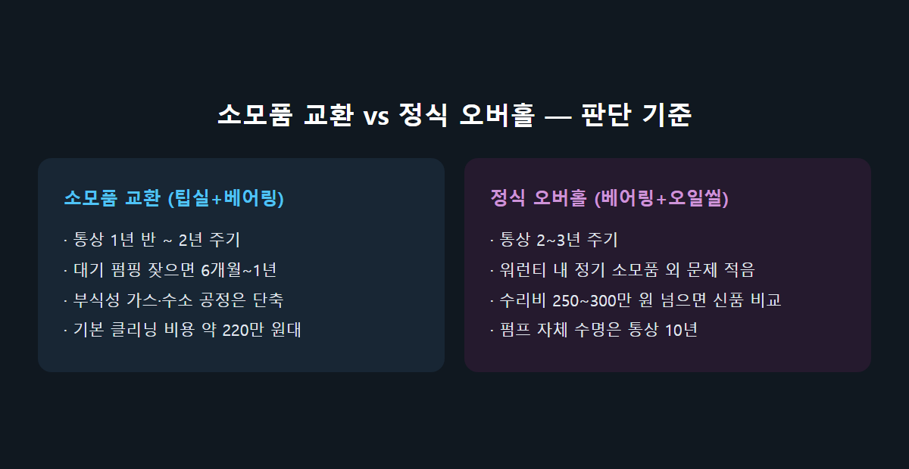
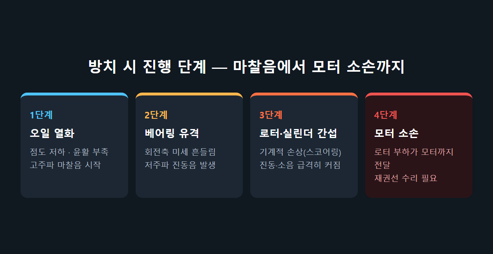

<!-- 수치검증: A항목 5개 확인 / B항목 0개 확인(해당없음) / C항목 2개 확인 / D항목 0개 확인 / 삭제 0개 / 교체 1개(Edwards 매뉴얼 오버홀 주기 수치 → PDF 텍스트 추출 실패로 "사양 확인 필요"로 처리) -->

# 진공펌프 베어링 마모 소음 진단법 — 원인부터 교환 시점까지

오일을 갈아야 할지, 베어링을 분해해야 할지 — 소음만 듣고는 판단하기 어렵습니다. 진공펌프 이상 소음의 원인을 소리 패턴별로 구분하고, 정비와 교환의 기준을 정리합니다.

## 베어링 마모는 왜 생기나

오일 로터리베인 펌프(RV·Duo 계열)는 로터 축 양 끝을 베어링이 지지하는 구조입니다. 로터가 회전하며 베인이 실린더 벽에 접촉해 진공을 만드는 동안, 베어링은 계속 부하(로드)를 받습니다. 아래 조건에서 마모가 빨라집니다.

- 오일 점도 저하·오염: 정해진 주기(예 5일)에 오일을 교환하지 않으면 점도가 뻑뻑해져 윤활막이 얇아집니다. 로터가 뻑뻑하게 돌면서 발열이 커집니다.
- 연결부 미세 누설: 센터링 클램프·벨로즈·오링이 조금만 손상돼도 펌프는 지속적으로 부하를 받고, 오일이 빠르게 줄어듭니다.
- 대기 펌핑(러핑) 과다: 공정 챔버가 크거나 대기 쪽 펌핑 빈도가 높으면 로터·베어링 부하가 늘어 소모 주기가 짧아집니다.
- 급정지·터치다운: 정상 정지 절차 없이 전원을 차단하면 회전체가 관성으로 도는 동안 접촉(터치다운)이 반복돼 베어링에 순간적 부하가 걸립니다.

## 소음 패턴으로 원인을 구분하는 법

- 고주파 마찰음(쇳소리·긁히는 소리): 오일 점도 저하로 금속 접촉이 늘어난 초기 단계에서 흔합니다. 오일 교환·플러싱으로 개선되는지 먼저 확인합니다.
- 저주파 진동음(웅웅거리는 부하음): 베어링 자체 유격으로 회전축이 미세하게 흔들릴 때 납니다. 오일을 갈아도 소리가 그대로면 베어링 자체 마모를 의심합니다.
- 간헐적 덜컹거림: 연결부 누설로 부하가 불규칙하게 걸릴 때 나타나며, 소리가 일정하지 않고 튀는 게 특징입니다.
- 탄 냄새 동반: 마모를 방치해 로터 부하가 모터까지 전달된 말기 신호입니다. 이 단계는 소음 판단보다 즉시 정지·점검이 우선입니다.

소음만으로 단정하기 어려운 이유는 위 패턴이 겹쳐 들리는 경우가 많기 때문입니다. 순서는 이렇습니다. 오일 상태(색·점도·수위)를 먼저 확인하고, 오일을 교환한 뒤 소리 변화를 보고, 그래도 저주파 진동이 남으면 분해해 베어링 유격을 직접 확인합니다.

## 소모품 교환과 정식 오버홀, 기준이 다릅니다

드라이 스크롤·스크류 계열을 포함한 현장 기준은 대체로 이렇습니다.

- 팁실·베어링 기본 소모품 교환: 통상 1년 반~2년 주기. 대기 펌핑이 많거나 부식성 가스·수소를 다루는 공정은 6개월~1년으로 단축됩니다.
- 베어링·오일씰을 포함한 정식 오버홀: 통상 2~3년 주기. 워런티 기간 내에는 이 정기 소모품 외에는 큰 문제가 없다고 안내하는 경우가 많습니다.
- 오일 로터리베인(RV·Duo)은 정기 오일 교환만 지켜도 6개월~1년은 무리 없이 씁니다. 저주파 진동이 새로 생겼다면 주기와 무관하게 점검이 필요합니다.

실제로 랩스케일 드라이 스크롤 펌프의 팁실+베어링 기본 클리닝 비용은 약 220만 원 수준으로 안내되며, 펌프 자체 수명은 통상 10년으로 봅니다. 수리비가 250만~300만 원을 넘어서는 시점부터는 신품 교체와 비교 검토가 필요합니다.

## 현장에서 바로 확인할 수 있는 순서

분해 없이도 아래 순서로 1차 진단이 가능합니다.

- 오일 색·수위 확인: 오일이 검게 변했거나 수위가 낮으면 윤활 부족을 먼저 의심합니다. 오일 색이 정상이고 수위도 맞다면 다음 단계로 넘어갑니다.
- 연결부 점검: 센터링 클램프·벨로즈·오링 체결 상태를 확인합니다. 오일이 최근 유독 빨리 줄었다면 이 부위 누설 가능성이 큽니다.
- 오일 교환 후 소리 재확인: 고주파 마찰음이 줄었다면 윤활 문제였을 가능성이 높습니다. 저주파 진동음이 그대로 남는다면 베어링 자체 마모로 넘어가 분해 점검이 필요합니다.
- 정지 절차 확인: 급정지·전원 차단 방식으로 운전을 끝내고 있다면, 정상 정지 절차로 바꾸는 것만으로도 베어링 수명에 도움이 됩니다.

이 네 단계만 거쳐도 오일 문제인지 베어링 문제인지 상당 부분 구분됩니다. 애매하면 마지막 단계까지 가지 않고 중간에 연락해도 됩니다.

## 방치하면 어디까지 번지나

베어링 유격이 커지면 로터가 실린더 벽·엔드플레이트에 미세하게 간섭하면서 로터·실린더 자체의 기계적 손상(스코어링)으로 진행될 수 있습니다. 여기서 더 방치하면 로터 부하가 모터까지 전달돼 모터 코일 소손으로 이어집니다. 이 경우 베어링·오일씰 교환만으로 끝날 수리가 모터 재권선(외주 작업비 별도) 추가로 확대되고, 납기도 통상 며칠 더 늘어납니다. 소음이 처음 들리는 시점에 오일 상태부터 점검하는 편이 항상 비용과 시간 모두에서 유리합니다.

오일 로터리베인과 드라이 스크롤·스크류의 소모품 주기가 다른 이유도 여기에 있습니다. 오일이 도는 로터리베인은 오일 자체가 냉각·윤활을 동시에 담당해 관리만 잘 하면 베어링 부하가 상대적으로 완만하게 늘어납니다. 반면 팁실로 밀폐하는 드라이 스크롤·스크류는 오일이 없는 대신 팁실 마모 속도가 곧 베어링이 받는 진동·부하와 직결돼, 대기 펌핑이 잦은 공정에서는 교환 주기가 훨씬 빨리 앞당겨집니다. 같은 "베어링 소음"이라도 펌프 방식에 따라 우선 점검 순서가 달라지는 이유입니다.

지금 펌프에서 웅웅거리는 저주파 진동음이 들리고 최근 오일 교환 기록이 없다면, 오일 교환부터 시도해 보고 그래도 소리가 남는지 확인하는 것이 가장 빠른 1차 진단입니다.

---

RV·Duo 오일 로터리베인 펌프 및 드라이 스크롤·스크류 펌프의 베어링 소음 진단, 오일 상태 점검, 분해 오버홀 견적 상담. 급정지·터치다운으로 인한 베어링 손상은 정상 정지 절차 준수만으로도 예방 가능합니다.
