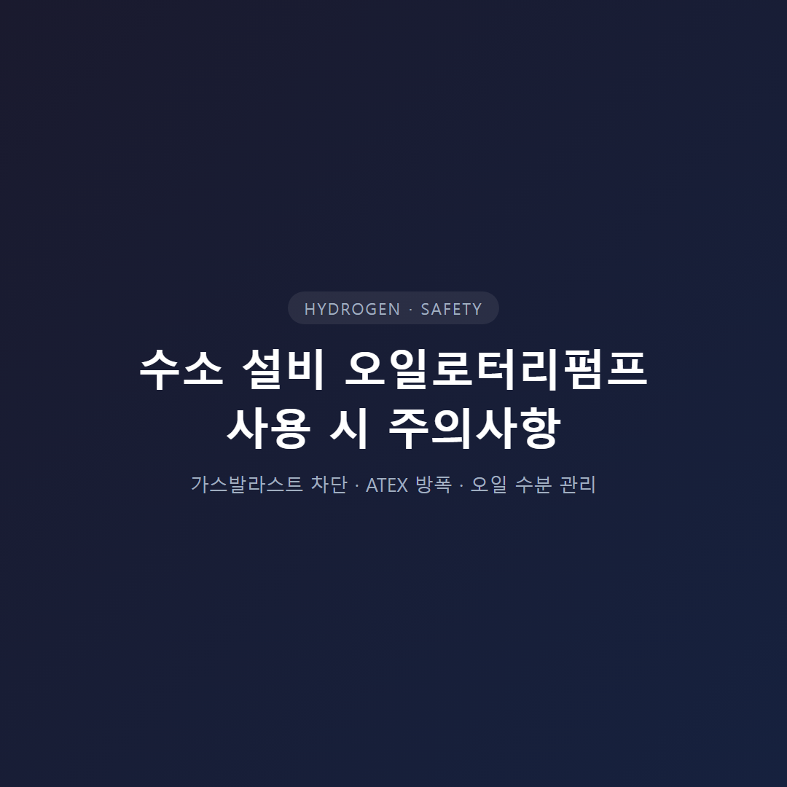
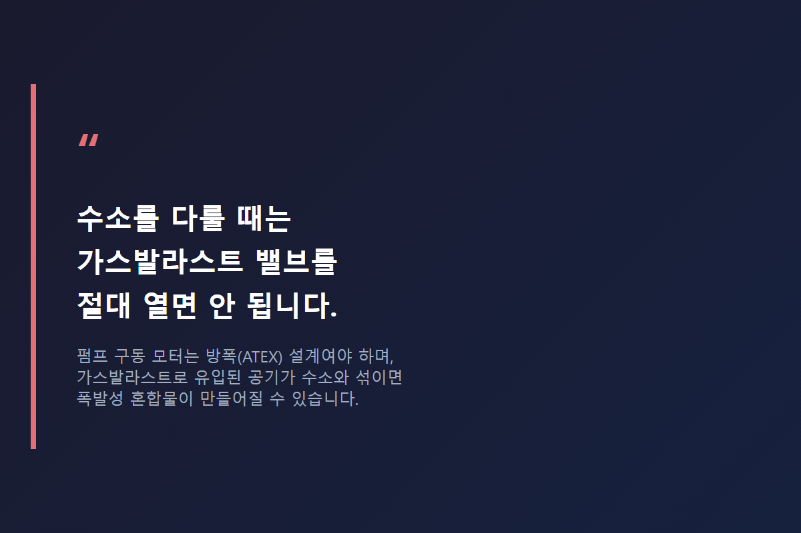
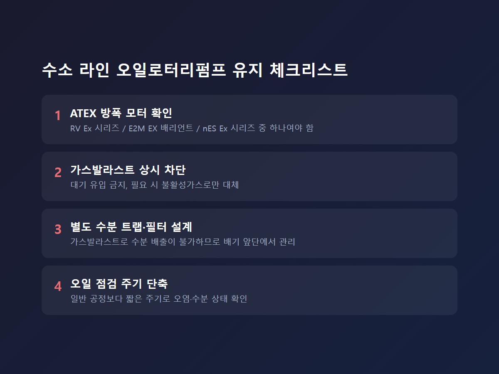

<!-- 수치검증: A항목 6개 확인 / B항목 0개(부스터조합 없음) / C항목 3개 확인 / D항목 0개 / 삭제 0개 / 교체 0개 -->

# 수소 라인에 오일로터리펌프를 쓴다면 반드시 지켜야 할 것

수소 설비의 표준 권장 펌프는 드라이 스크류 계열입니다. 오일이 없어 역류·오염 위험이 낮기 때문입니다. 하지만 현장에는 예산·설비 구조상 오일로터리펌프를 계속 써야 하는 경우가 존재합니다. 소규모 연구용 라인, 저압·간헐 운전 조건이 대표적입니다. 이 글은 그런 경우에 지켜야 할 안전 요건을 정리합니다.

## 가스발라스트를 열면 안 되는 이유

가스발라스트는 수증기 응축을 막으려고 대기(공기)를 펌프 내부에 도입하는 장치입니다. 수소 배기 라인에서 이 장치를 열면 펌프 내부에 수소-산소 폭발성 혼합물이 형성될 수 있습니다.

이 위험은 진공펌프 제조사의 공식 유지보수 자료에 명시돼 있습니다. 수소를 다룰 때는 가스발라스트 밸브를 절대 열면 안 되며, 펌프 구동 모터는 방폭 설계여야 하고 ATEX 규정이 적용된다는 내용입니다. 폭발성·독성 가스를 다루는 특수한 경우에는 대기 대신 질소 같은 불활성 가스를 가스발라스트 매체로 사용하기도 합니다. 일반 공정처럼 필요할 때마다 가스발라스트를 켜는 운영 방식은 수소 라인에는 적용되지 않습니다.

## ATEX 방폭 인증 — 선택이 아니라 전제 조건

수소 라인에 오일로터리펌프를 쓰려면 모터 방폭 인증이 먼저입니다.

- **RV 시리즈(RV3·RV5·RV8·RV12)**: 방폭 모터 옵션이 있고, 별도 ATEX RV 시리즈는 외부 등급 Ex II 2G IIC T4로 표기됩니다. 가연성 가스 배기 시 가스발라스트 포트에 불활성가스 퍼지를 연결해 배기 가스를 폭발 하한계(LEL) 이하로 희석하는 조건이 붙습니다.
- **E2M 시리즈**: EX 배리언트(E2M40T4, E2M80T4, E2M175T3, E2M275T3)가 별도 모델로 존재하며 ATEX cat 3 internal·cat 2 external 인증을 받습니다.
- **nES 시리즈**: 폭발성 대기 전용으로 설계된 Ex 시리즈가 별도 라인업으로 판매됩니다.
- **E2S 시리즈(E2S45·65·85)**: 지금까지 확인된 공식 자료상 별도 EX 배리언트가 없습니다. 수소 라인에는 EX 인증이 있는 E2M 계열로 전환을 검토해야 합니다.

방폭 등급 표기는 제품마다 형식이 조금씩 다르지만, 공통적으로 확인해야 할 항목은 같습니다. 모터가 폭발성 대기 안에서 사용 가능한 인증을 받았는지, 인증 범위가 내부(펌프 내부 가스 접촉부)와 외부(모터 주변 대기) 중 어디까지인지, 그리고 해당 인증서가 실제 설치 환경의 가스 그룹·온도 등급과 일치하는지입니다.

## 오일 관리 — 수소보다 수분·오염이 더 큰 변수

오일이 수소와 직접 반응해 위험해진다는 근거는 확인되지 않았습니다. 진짜 관리 대상은 수분입니다. Edwards 순정 오일(Ultragrade 19·70)의 인화점은 220~230°C로 상온에서는 안정적이지만, 고온으로 가열되거나 기계적으로 교반되면 연무가 발생해 호흡기를 자극할 수 있습니다.

원래는 가스발라스트로 수분을 배출해 오일 오염을 늦추지만, 수소 라인에서는 이 방법을 쓸 수 없습니다. 그렇다면 배기 라인 앞단에 별도의 수분 트랩·필터를 설계해 응축수가 펌프 흡입구까지 유입되지 않도록 막아야 합니다. 정확한 오일 교환 주기는 운전 조건마다 달라 일률적으로 정할 수 없다는 것이 제조사 공통 안내입니다. 수소 라인이라면 일반 공정보다 점검 주기를 짧게 잡는 편이 안전합니다.

## 방폭 전환은 어떻게 시작하나요

기존 오일로터리펌프를 방폭 사양으로 바꾸려면 순서가 있습니다. 먼저 현재 쓰고 있는 모델명과 시리얼 번호를 확인합니다. 모터 방폭 여부는 명판에 별도로 표기되지 않는 경우가 많아 모델명만으로 판단하기 어렵습니다. 다음으로 배기 라인의 수소 농도와 유량을 확인합니다. 유량이 크고 상시 배기 조건이라면 방폭 개조보다 드라이펌프 전환이 더 안전하고 경제적일 수 있습니다.

마지막으로 가스발라스트 배관을 물리적으로 막거나 불활성가스 전용 라인으로 교체하는 개조 작업이 필요합니다. 이 개조는 펌프 제조사 또는 인증된 서비스 업체를 통해 진행해야 하며, 밸브만 임의로 잠그는 방식은 ATEX 인증 요건을 충족하지 못합니다. 개조 이력과 인증 서류는 설비 안전 점검 시 반드시 제시해야 하는 문서이므로 처음부터 정식 절차로 진행하는 것이 나중에 발생할 재작업 비용을 줄이는 길입니다.

## 오일로터리펌프를 유지할 만한 현실적 조건

모든 수소 라인에 드라이펌프가 정답은 아닙니다. 배기 유량이 작고 간헐적으로 운전하는 소규모 연구용 라인이라면, 대형 드라이펌프 도입 비용 대비 오일로터리펌프의 초기 투자 부담이 훨씬 작습니다. 기존 설비에 오일 펌프가 설치돼 있고 공정 변경 없이 수소 배관만 추가하는 상황도 전체 교체보다 방폭 개조가 현실적입니다. 반대로 배기 유량이 크거나 24시간 상시 가동되는 라인이라면, 방폭 개조 비용과 유지관리 부담이 오히려 드라이펌프 신규 도입보다 커질 수 있습니다. 이 판단은 라인마다 다르므로 유량·운전 시간·기존 설비 상태를 함께 놓고 비교해야 합니다.

다만 오일로터리펌프를 유지하기로 했다면 예외는 없습니다. 방폭 모터, 가스발라스트 차단, 수분 트랩 설계 — 세 조건은 라인 규모와 무관하게 모두 충족해야 합니다. 방폭 인증이 없는 펌프거나 가스발라스트를 상시로 열어 쓰고 있다면 지금이 점검 시점입니다.

---

RV·E2M ATEX 방폭 사양 확인, 수소 라인 가스발라스트 차단 설계, 수분 트랩 구성 상담. 방폭 인증이 없는 오일로터리펌프는 수소 라인에 사용하지 않는 것이 원칙이며, 기존 설비를 개조할 때도 반드시 인증된 절차를 거쳐야 합니다.
