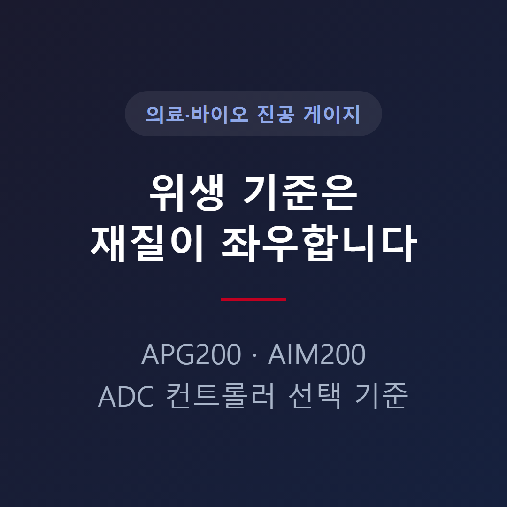
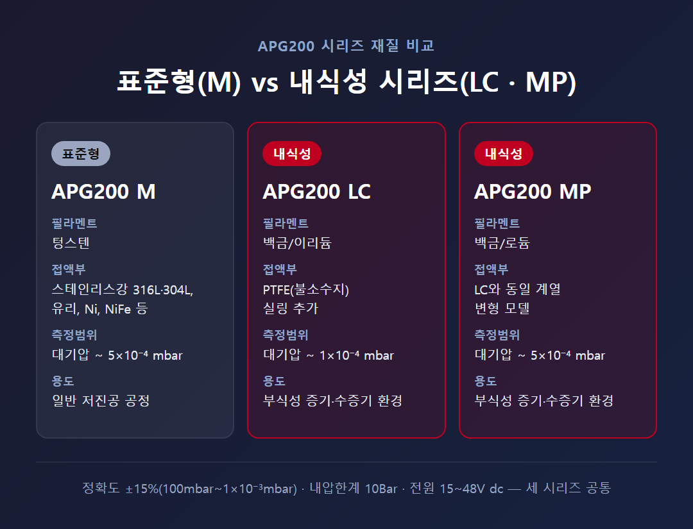
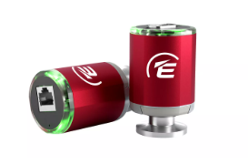
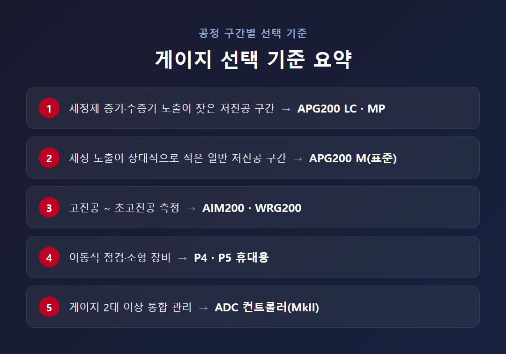

<!-- 수치검증: A항목 12개 확인 / B항목 0개(해당없음) / C항목 5개 확인 / D항목 1개 확인 / 삭제 0개 / 교체 0개 -->

# 의료·바이오 공정 진공 측정, 위생 기준에 맞는 게이지 선택 기준

의료·바이오 공정에서 "위생 기준에 맞는 진공 게이지"는 세정·멸균 절차 자체를 게이지가 인증받는 문제가 아니라, 게이지 접액부(가스와 직접 닿는 부분)가 부식성 세정제 증기와 수증기에 얼마나 오래 견디느냐의 문제다. 표준형 게이지를 그대로 쓰면 측정값이 흔들리거나 교체 주기가 짧아지는 경우가 있는데, 원인은 대부분 필라멘트·셀 재질이다. 아래에서 게이지 종류별로 표준형과 내식성 시리즈의 차이, 그리고 공정 구간별로 어떤 모델을 선택해야 하는지 정리한다.

## 표준형 피라니 게이지가 부식성 환경에서 흔들리는 이유

저진공 구간(대기압~1x10⁻³mbar대)을 측정하는 피라니(Pirani) 게이지는 열전도도로 압력을 측정하는 방식이다. 표준형은 텅스텐 필라멘트를 사용하는데, 텅스텐은 저렴하고 안정적이지만 부식성 가스나 수증기 노출이 반복되면 표면이 산화·부식되면서 측정 오차가 커진다. 세정 사이클이 잦은 동결건조기·멸균 챔버·시약 농축 라인 같은 공정에서 이 문제가 두드러진다.

이 문제를 해결하는 설계 원리는 명확하다. 필라멘트를 텅스텐에서 백금 계열로 바꾸고, 실링 재질에 내식성 소재를 추가하는 것이다. 스마텍이 취급하는 APG200 시리즈는 이 원리를 적용한 M(표준)·LC·MP 세 라인으로 구성돼 있다.

## APG200 M·LC·MP 재질 차이

세 시리즈는 측정 성능은 비슷하지만 접액부 재질이 다르다.

- **APG200 M(표준형)**: 필라멘트 텅스텐, 접액부는 스테인리스강 316L·304L·유리·Ni·NiFe 등. 측정범위 대기압~5x10⁻⁴ mbar, 정확도(100mbar~1x10⁻³mbar) ±15%.
- **APG200 LC(내식성)**: 필라멘트를 백금/이리듐으로 교체하고 PTFE(불소수지) 실링을 추가. 측정범위 대기압~1x10⁻⁴ mbar. 부식성 세정제 증기·수증기 분위기용으로 설계됐다.
- **APG200 MP(내식성)**: 필라멘트를 백금/로듐으로 교체. 측정범위는 M과 동일한 대기압~5x10⁻⁴ mbar.

세 시리즈 모두 정확도 ±15%, 재현성 2%(구간별 상이), 내압한계 10Bar, 전원 15~48V dc, 전자부 분리 시 베이크아웃 150°C 스펙은 동일하다. 즉 성능 저하 없이 재질만 강화한 구조라, 세정 사이클이 잦은 공정이면 LC·MP를 표준으로 잡아도 무리가 없다.

같은 설계 원리는 저진공 피라니 게이지 전반에서 확인된다. 표준 필라멘트를 내식성 필라멘트로 바꾸고 셀을 스테인리스강으로 구성하는 방식은 부식성 공정과 수증기 분위기에 적합하다고 알려져 있다.

## 고진공 구간 — AIM200·WRG200

세정 증기 노출이 저진공 구간만의 문제는 아니다. 다만 고진공 콜드캐소드 방식인 AIM200(측정범위 1x10⁻⁹~1x10⁻² mbar)과, 저진공부터 고진공까지 한 포트로 커버하는 WRG200(측정범위 1x10⁻⁹~1000 mbar)은 접액부가 원래도 스테인리스강(304, 304L, 316L, 347, 430)·Ni-Fe·유리 계열로 구성돼 상대적으로 내식성이 높다. 두 제품은 별도의 내식성 전용 라인이 나뉘어 있지 않으므로, 세정 노출이 특히 심한 지점에는 저진공 구간을 APG200 LC·MP로, 고진공 구간을 표준 AIM200·WRG200으로 나눠 배치하는 구성이 현실적이다.

## 휴대용 게이지·컨트롤러

챔버에 상시 설치가 어려운 소형 장비나 정기 점검용으로는 P4·P5 휴대형 게이지를 쓴다. P4는 압전저항식으로 절대압 2000~1 mbar를 측정하고 접액부는 스테인리스강 1.4305·세라믹·FKM(불소고무)이다. P5는 압전저항식과 열전도 피라니를 결합해 1200~5x10⁻⁵ mbar까지 넓은 구간을 커버하며, 접액부는 스테인리스강 1.4307·니켈·텅스텐·유리 계열이다.

게이지 2개 이상을 한 시스템에서 관리해야 한다면 ADC 컨트롤러를 함께 구성한다. MkII 버전은 게이지 2개를 동시에 지원하고, 셋포인트 2개(48V dc 1A 릴레이)와 RS232 통신을 지원하며, 압력값을 mbar·Torr·Pa·Volts 단위로 전환해 볼 수 있다.

## 참고 — 캐패시턴스 마노미터 방식

캐패시턴스 마노미터는 가스 종류에 무관하게 압력을 절대값으로 측정하는 방식이라, 공정 가스가 자주 바뀌거나 부식성 증기에 노출되는 환경에서 피라니 방식보다 안정적인 특성이 있다고 알려져 있다. 다만 이는 스마텍이 직접 취급하는 제품군은 아니며, 동일 원리를 적용한 타사 사례 참고용으로만 언급한다.

## 선택 기준 요약

- 세정제 증기·수증기 노출이 잦은 저진공 구간 → APG200 LC 또는 MP
- 세정 노출이 상대적으로 적은 일반 저진공 구간 → APG200 M(표준)
- 고진공~초고진공 측정 → AIM200(콜드캐소드) 또는 WRG200(광범위)
- 이동식 점검·소형 장비 → P4·P5 휴대용
- 게이지 2대 이상 통합 관리 → ADC 컨트롤러(MkII)

핵심은 세정·멸균 절차 명칭이 아니라 접액부 재질이 실제 노출 환경을 견디느냐다. 현재 쓰는 게이지가 세정 사이클마다 측정값이 흔들리거나 교체 주기가 눈에 띄게 짧아졌다면, 필라멘트를 내식성 계열로 바꾸는 시점으로 판단할 수 있다.

---

APG200 M/LC/MP 시리즈 선정, AIM200·WRG200 구간 설계, ADC 컨트롤러 연동 상담. 부식성 세정제·수증기 노출 환경에서는 접액부 재질을 반드시 확인한 뒤 게이지를 선정해야 한다.
