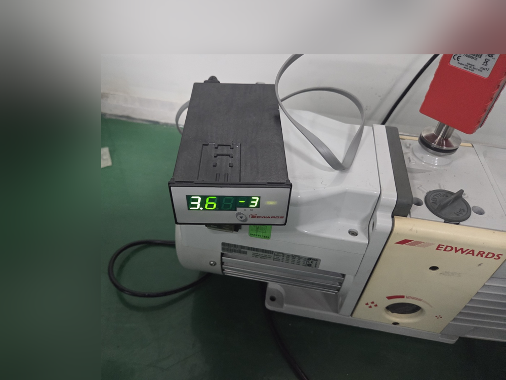
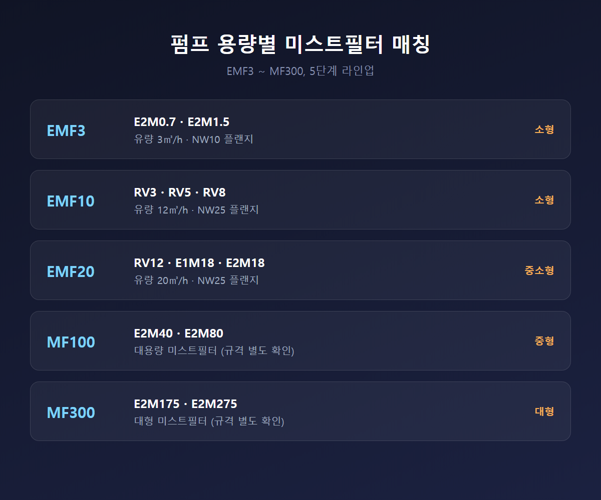

<!-- 수치검증: A항목 3개 확인(EMF3/EMF10/EMF20 유량·플랜지) / B항목 0개(조합 추천 없음) / C항목 1개 확인(오일 로터리 베인 펌프 분류) / D항목 1개 확인(MF/EMF 필터 기능 설명, Edwards 공식) / 삭제 0개 / 교체 2개(MF100·MF300 유량·플랜지 수치 → "확인 불가"로 서술 전환) -->

# 오일로터리펌프 미스트필터 선택 기준 — 펌프 용량별 매칭

오일 로터리 베인 펌프는 회전 로터가 오일로 밀봉된 채 기체를 압축·배출하는 구조다. 이 과정에서 오일이 미세한 안개, 즉 미스트 형태로 배기구를 통해 함께 빠져나간다. 미스트필터는 이 오일 미스트를 걸러 대기와 작업 환경으로 유출되는 것을 막는 소모품이다.

## 미스트필터 없이 배기하면 어떤 문제가 생기나

크게 두 가지로 나뉜다.

- **눈에 보이는 문제**: 배기구 주변 장비 표면과 바닥에 오일 얼룩이 남는다. 배출된 오일 미스트가 응축되어 주변 구조물에 계속 부착되기 때문이다. 배기 라인 자체가 끈적하게 오염되면서 청소 빈도도 늘어난다.
- **눈에 안 보이는 문제**: 배기된 오일 증기가 작업장 공기 중으로 퍼지면 작업자가 이를 흡입하는 오일 흄(fume) 노출로 이어진다. 밀폐되거나 환기가 부족한 실내 설치 환경일수록 누적되기 쉽다.

미스트필터의 기능 자체가 "오일 미스트 제거로 냄새와 오일 증기가 대기 및 작업 환경에 도달하지 않도록 막는 것"으로 명시돼 있다. 미스트필터가 없거나 용량이 안 맞으면 이 기능이 작동하지 않는다는 뜻이다. 특히 신규 설치나 이설 과정에서 필터를 빼놓고 배관만 다시 연결하는 경우가 종종 있는데, 이때는 성능상 문제가 바로 드러나지 않아 한동안 방치되기 쉽다.

## 펌프 용량별 미스트필터 매칭

필터 용량이 펌프 배기 유량보다 작으면 배기 저항이 커져 펌프 성능이 떨어진다. 반대로 소형 펌프에 대용량 필터를 달면 비용만 늘어난다. 펌프 모델과 필터를 맞춰야 하는 이유다.

- **EMF3**: E2M0.7·E2M1.5용. 유량 3㎥/h, NW10 플랜지.
- **EMF10**: RV3·RV5·RV8용. 유량 12㎥/h, NW25 플랜지.
- **EMF20**: RV12·E1M18·E2M18용. 유량 20㎥/h, NW25 플랜지.
- **MF100**: E2M40·E2M80용. 펌프 용량에 맞는 대용량 미스트필터.
- **MF300**: E2M175·E2M275용. 펌프 용량에 맞는 대형 미스트필터.

EMF3~EMF20 세 모델은 유량·플랜지 규격까지 확인됐다. MF100·MF300은 적용 펌프 구간(E2M40~E2M80, E2M175~E2M275)은 확인됐으나, 정확한 유량·플랜지 수치는 이번 조사에서 공식 자료로 재확인하지 못했다. 확인되지 않은 수치를 임의로 적기보다 "대용량·대형" 수준으로만 표기한다.

필터 용량을 고를 때는 펌프 카탈로그의 배기속도(m³/h) 표기와 필터 유량 표기를 나란히 놓고 비교하는 것이 기본이다. 같은 RV 시리즈 안에서도 RV3와 RV8은 배기속도 차이가 있어 필터가 다르게 매칭된다. 모델명만 보고 "RV니까 같은 필터겠지" 식으로 넘기면 배기 저항 문제가 생길 수 있다. 플랜지 규격(NW10·NW25 등)도 배관 지름과 직결되므로, 기존 배관에 맞는 규격인지 함께 확인해야 재시공 없이 바로 연결할 수 있다.

## 필터 구조와 교체 시점

EMF3 기준으로 확인된 구조는 섬유 복합 미스트 필터와 활성탄 탈취 필터, 압력 릴리프 밸브가 함께 내장된 형태다. 필터 소재와 탈취 필터가 이중으로 들어가 있다는 점이 핵심이다. MF100·MF300도 오일 미스트 제거와 탈취 기능을 갖는 동일 계열 제품이지만, 내부 구조가 소형 모델과 완전히 동일하다고 단정할 근거는 확인되지 않았다. 일반적으로 유사한 구조로 만들어진다는 수준으로 이해하면 된다.

교체 시점은 정해진 개월 수보다 상태 기준으로 판단하는 게 안전하다. 필터 내부 오일이 검게 변하거나 배기구 냄새가 심해지거나 필터 몸체 색이 탁해지면 교체 시점이다. 사용 가스 종류와 가동 시간에 따라 편차가 크므로, 정기점검 때 육안 확인을 함께 하는 방식을 권한다.

필터를 오래 방치하면 필터 내부가 오일로 포화되면서 배기 저항이 점점 커진다. 이 상태로 계속 운전하면 펌프 자체에 부하가 걸려 모터 수명이 짧아지거나, 배기 압력이 높아져 도달진공도가 저하되는 문제로 번질 수 있다. 미스트필터는 단순히 냄새를 잡는 부속품이 아니라, 펌프 배기 성능과 수명에도 직접 영향을 주는 소모품으로 봐야 한다.

## 선택 체크리스트

- 현재 펌프 모델명(RV3~RV8·E2M18~E2M275 등)을 먼저 확인한다.
- 펌프 모델에 해당하는 필터 유량·플랜지 규격이 일치하는지 확인한다(EMF3/EMF10/EMF20은 규격 확인 가능, MF100/MF300은 공식 확인 후 적용).
- 필터 내부 오일 색·냄새·필터 색 변화를 정기적으로 점검한다.
- 밀폐된 실내 설치 환경이라면 미스트필터 장착 여부를 우선 점검한다.
- 기존 배관 규격(NW10·NW25 등)과 신규 필터의 플랜지 규격이 맞는지 확인한다.
- MF100·MF300처럼 정확한 유량·플랜지 수치가 공개 자료로 확인되지 않는 모델은 펌프 모델명과 함께 별도 확인한다.
- 여러 대의 펌프를 함께 운영 중이라면 필터 교체 이력을 펌프별로 따로 기록해 관리한다.

친환경 배기, 작업자 안전, 작업장 청결이라는 세 가지 이유만으로도 펌프 용량에 맞는 미스트필터 장착은 기본 사양으로 다뤄야 한다. 특히 실내에 여러 대의 오일로터리펌프를 나란히 운영하는 현장이라면, 미스트필터 한 대 누락이 작업장 전체의 공기질에 영향을 줄 수 있다는 점을 감안해 전수 점검을 권한다.

---

오일로터리펌프 모델별 미스트필터(EMF3·EMF10·EMF20·MF100·MF300) 재고 확인과 규격 매칭 상담. 밀폐된 실내 설치 환경은 미스트필터 장착 여부부터 우선 점검을 권장한다.
