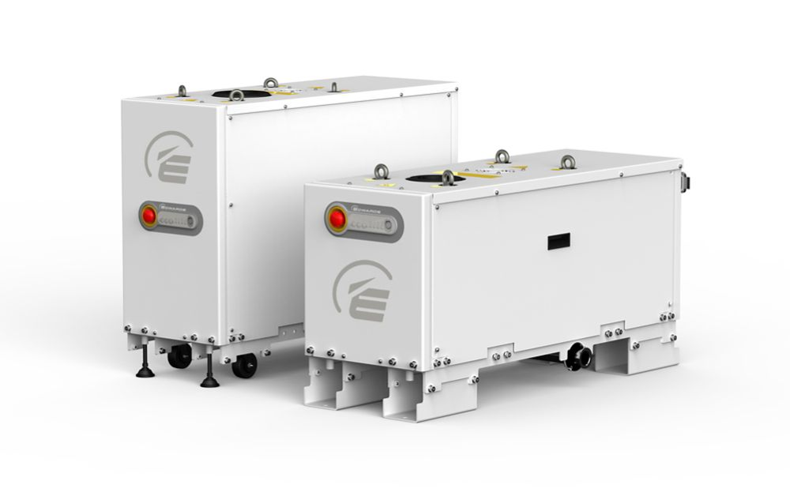
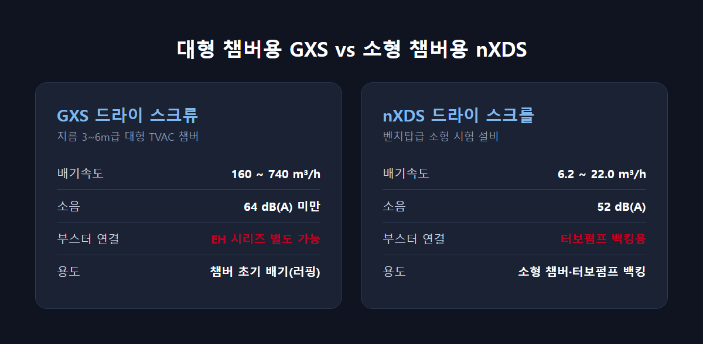

<!-- 수치검증: A항목 9개 확인 / B항목 1개 확인 / C항목 0개 / D항목 0개 / 삭제 0개 / 교체 0개 -->

# 항공우주 환경시험 챔버의 드라이펌프 요건

위성·발사체 부품은 발사 전 반드시 열진공챔버(TVAC)에서 우주 환경을 재현한 시험을 통과해야 한다. 챔버를 대기압에서 목표 압력까지 끌어내리는 초기 배기(러핑) 구간은 드라이펌프가 담당하며, 챔버 크기와 목표 진공도에 따라 적합한 모델이 갈린다.

## TVAC 챔버 구조와 진공 시스템 단계

TVAC 챔버는 온도 영하 180도부터 영상 150도까지, 지름 0.3m급 소형부터 6m급 대형까지 규격이 다양하다. 목표 진공도도 저진공부터 초고진공(UHV)까지 미션 궤도에 따라 달라진다. 저궤도(LEO) 위성용 챔버와 심우주 탐사선용 챔버는 요구되는 최종 압력 자체가 다르며, 일부 UHV 영역 시험은 10⁻¹⁰ mbar 이하까지 내려가야 하는 경우도 있다. 진공 시스템은 러핑펌프 → 터보분자펌프·크라이오펌프 → 이온·NEG펌프 순서로 단계가 이어진다. 드라이펌프가 맡는 구간은 초기 러핑과 터보펌프 백킹이다.

시험 규격은 NASA GSFC-STD-7000, NASA-STD-7012A, 열진공 베이크아웃 관련 NASA MSFC-SPEC-1238 등이 기준으로 언급된다. 다만 개별 펌프 데이터시트 자체에는 이런 규격 준수 여부가 명시돼 있지 않으므로, 규격 대응은 펌프 단품이 아니라 챔버 전체 시스템 설계 단계에서 통합사와 함께 확인해야 하는 항목이다.

## 대형 챔버 — GXS·EXS 드라이 스크류

지름 3~6m급 대형 챔버는 초기 배기 속도가 시험 회전율을 좌우한다. GXS 드라이 스크류 펌프는 공식 애플리케이션 목록에 우주 시뮬레이션 챔버 용도가 명시된 제품군이다. 배기속도는 GXS160(160 m³/h)부터 GXS750(740 m³/h)까지 나뉘며, 콤비타입(예: GXS250/2600)은 이미 부스터가 통합된 일체형이라 GXS250 단독+EH2600 별도 구성과는 다른 제품이다.

더 큰 배기량이 필요하면 GXS 단독 모델에 EH 부스터를 별도로 연결한다. 현장에서 실제로 쓰이는 조합은 GXS160+EH1200, GXS250+EH2600, GXS450+EH4200이며, 배기속도의 2~8배라는 일반 공식을 그대로 대입하면 실제보다 작은 부스터를 잘못 고르게 된다.

GXS는 윤활유 순환 외에도 축 밀봉부에 퍼지 가스를 흘려 기어박스 오염을 막는 구조다. 경장비(Light Duty)는 밀봉 퍼지만 적용하고, 중장비(Medium Duty)는 가변 가스발라스트와 입구 퍼지를 추가해 수분·용제 성분이 섞인 가스도 처리한다. 냉각수 공급 압력은 최대 6.9bar, 최소 차압 1.0bar 수준을 요구하므로 설치 전 유틸리티 조건도 함께 확인해야 한다. 소음은 GXS160/250이 64dB(A) 미만, GXS750 계열은 최대 70dB(A)까지 올라간다.

## 소형 챔버·터보펌프 백킹 — nXDS·nXRi

벤치탑급 소형 시험 설비나 부품 단위 아웃가싱 시험에는 nXDS 드라이 스크롤 펌프가 적합하다. nXDS6i(6.2 m³/h)부터 nXDS20i(22.0 m³/h)까지 4개 모델이 있고 소음은 52dB(A) 수준이다. 조금 더 큰 배기량이 필요하면 XDS35i(피크 배기속도 35 m³/h, 도달진공도 0.01 mbar)나 XDS46i(피크 배기속도 40 m³/h)로 올라간다. 이 계열은 입구 압력 1~10 mbar 구간에서 배기속도가 최적화돼 있어 터보분자펌프 백킹용으로 특화됐다.

nEXT 터보펌프의 공식 권장 백킹펌프는 소형 nEXT55/85에 nXDS6i, 중형 nEXT240/300/400에 nXDS10i, 대형 nEXT730/930/1230에 nXRi 또는 XDS35i다. nXRi는 애플리케이션 목록에 "UHV, 고에너지 물리"가 직접 명시된 다단 루츠 드라이펌프로, 배기속도 30~120 m³/h 구간을 5개 모델(nXR30i·40i·60i·90i·120i)로 세분화했다. 무게는 30i/40i가 27kg, 60i/90i/120i가 29kg으로 전 모델 30kg 미만이라 벤치탑이나 이동식 시험대에도 쉽게 통합된다. 완전 오일프리 구조에 회전속도 15,000rpm으로 도달진공도 0.03mbar를 전 모델 공통으로 확보한다.

## 오일프리가 필수에 가까운 이유

위성 광학계·태양전지판·센서류는 극미량의 오일 증기에도 성능이 저하될 수 있다. 오일이 없는 드라이 스크류·스크롤 방식은 이 오염 경로 자체를 없앤다. GXS는 윤활유도 저증기압 PFPE 오일을 사용해 기어박스와 진공 공간을 분리하는 구조다. 오일 로터리펌프 대비 초기 투자비는 높지만, 챔버 내부 오염을 원천 차단해야 하는 항공우주 시험 환경에서는 이 구조적 차이가 선택을 좌우하는 경우가 많다.

## 선정 체크리스트

- 챔버 크기: 대형(3m 이상)은 GXS/EXS, 소형(벤치탑)은 nXDS/nXRi
- 목표 진공도: 저~중진공은 드라이 단독, UHV까지는 터보·크라이오·이온펌프 조합
- 부스터 필요 여부: 대용량 배기 시 EH 부스터를 현장 확인 조합표 기준으로 연결
- 오염 민감도: 광학·전자 부품이 있으면 오일프리가 사실상 필수
- 소음·설치 환경: 실험동 인접 시설은 GXS(64dB 미만)·nXDS(52dB) 같은 저소음 모델 우선 검토

---

GXS/EXS 대형 챔버 배기 구성, nXDS/nXRi 소형 챔버·터보펌프 백킹 구성 상담 가능. EH 부스터 조합은 반드시 현장 확인 기준으로 검토해야 한다.
