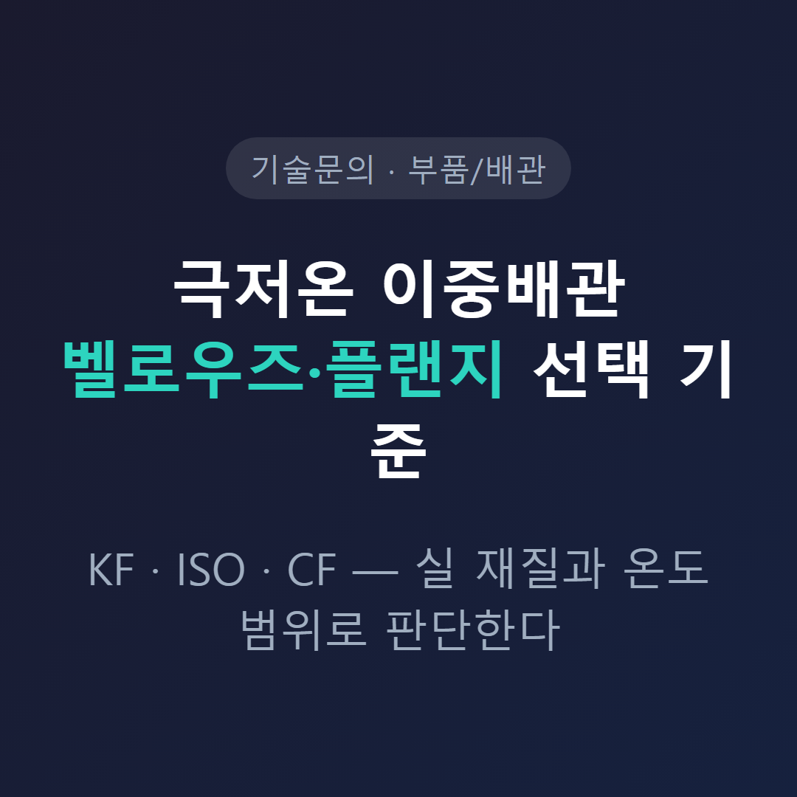
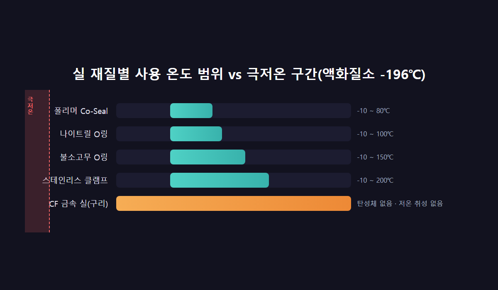
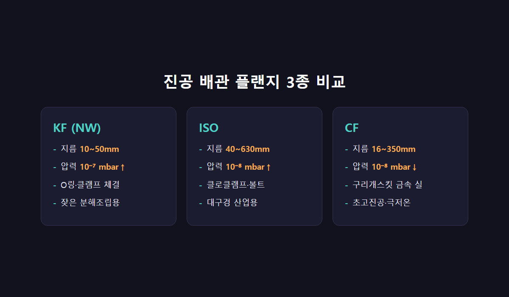
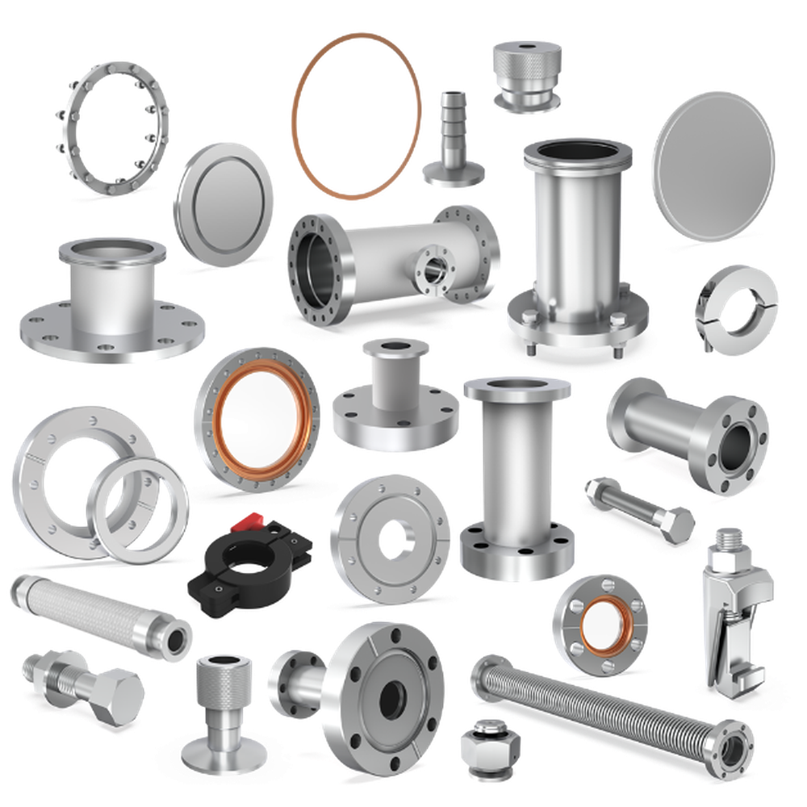

<!-- 수치검증: A항목 4개 확인(플랜지 규격·압력범위·실 재질별 온도범위·벨로우즈 압력범위) / B항목 0개(펌프+부스터 조합 추천 없음) / C항목 1개 확인(GXS=드라이 스크류, EH=기계식 부스터, product_master_table.csv 대조) / D항목 0개 / 삭제 0개 / 교체 0개 -->

# 극저온 배관 플랜지·벨로우즈 선택 기준 — KF·ISO·CF 실 재질 비교

진공 배관 플랜지는 KF(NW)·ISO·CF 세 종류로 나뉘며, 각각 도달 가능한 진공도와 실(seal) 방식이 다르다. 극저온 이중배관(VIP, Vacuum Insulated Pipe)처럼 배관 자체가 영하 100°C 이하로 냉각되는 구간에서는 플랜지 종류보다 실 재질의 사용 온도 범위가 먼저 확인해야 할 기준이다. 여기에 배관 신축과 진동을 흡수하는 벨로우즈 선택 기준까지 함께 정리한다.

## 실 재질별 사용 온도 범위 — 극저온 판단의 출발점

KF·ISO 플랜지에 쓰이는 탄성체 실은 재질별로 명확한 사용 온도 범위가 정해져 있다.

- 폴리머 Co-Seal: -10°C ~ 80°C
- 나이트릴 O링: -10°C ~ 100°C
- 불소고무(플루오로엘라스토머) O링: -10°C ~ 150°C(간헐 베이크 시 200°C)
- 스테인리스 클램프: -10°C ~ 200°C

이 표에서 확인해야 할 지점은 하한선이다. 나열한 모든 탄성체 기반 실의 사용 온도 하한은 -10°C다. 액화질소는 -196°C, 액체산소는 -183°C까지 내려간다. 배관 구간이 이 온도까지 냉각된다면, 표준 KF·ISO 탄성체 실은 제조사가 보증하는 범위를 크게 벗어난 상태로 쓰이는 셈이다. 저온에서 탄성체는 유연성을 잃고 굳으며, 굳은 실은 미세 누설로 이어진다.

반면 CF 플랜지는 구리 개스킷을 나이프엣지로 냉간 압착하는 금속 대 금속 실이라 탄성체 자체가 없다. 저온 취성 문제가 구조적으로 발생하지 않는다. 극저온 접점에는 CF나 용접형 연결을 우선 검토하는 이유다.

## KF·ISO·CF 플랜지 규격 비교

세 플랜지의 규격과 적용 압력 범위는 아래와 같다.

- **KF(NW)**: 공칭 지름 10~50mm, 적용 압력 10⁻⁷ mbar 이상. O링 또는 성형 알루미늄 실을 클램프로 체결. 잦은 분해·조립에 적합.
- **ISO**: 공칭 지름 40~630mm, 적용 압력 10⁻⁸ mbar 이상. 클로 클램프 또는 볼트+센터링 링 체결. 대구경 산업용 배관에 사용.
- **CF**: 공칭 지름 16~350mm, 적용 압력 10⁻⁸ mbar 미만(초고진공). 최대 450°C까지 베이크아웃 가능.

배관 하나에 세 종류를 함께 쓰는 구성도 흔하다. 진공도 요구가 낮은 구간은 KF, 대구경 메인 라인은 ISO, 초고진공·극저온이 필요한 특정 포트만 CF로 나눠 설계하는 방식이다. 설계 도면에 플랜지 종류가 구간별로 다르게 표시돼 있다면, 그 구간마다 요구되는 진공도·온도 조건이 다르다는 뜻으로 읽으면 된다.

## 벨로우즈 선택 — 길이가 신축·진동 흡수량을 결정한다

벨로우즈는 적용 압력 범위 10⁻⁷ mbar부터 1 bar까지 대응하는 주름진 금속 구조로, 배관의 열수축과 펌프·부스터 진동을 흡수하는 역할을 한다. 강체(rigid) 배관으로 통짜 연결하면 구조는 단순해지지만, 그만큼 신축과 진동을 흡수할 곳이 사라져 배관과 연결 장비에 하중이 그대로 전달된다.

실제 현장에서는 벨로우즈 길이 부족이 장비 이상으로 이어진 사례가 있다. 드라이 스크류 펌프와 그 위 부스터 사이 벨로우즈가 진공 형성 시 정상보다 심하게 수축돼 펌프가 살짝 들리는 현상이 발생했는데, 원인은 벨로우즈 길이가 짧아 수축분을 다 흡수하지 못했기 때문이었다. 대응은 벨로우즈를 더 길게 하거나 통자 배관으로 바꾸는 것인데, 통짜 배관은 진동 흡수 기능 자체를 포기하는 트레이드오프가 따른다.

부스터를 다른 용량으로 교체하면서 배출구 규격이 달라지는 경우도 흔하다. 이때는 설치 구조를 먼저 확인해야 한다. 프레임 위에 부스터를 얹어 쓰는 구조라면 벨로우즈 타입 어댑터로, 드라이펌프에 부스터를 바로 얹는 다이렉트 구조라면 통짜 플랜지 어댑터로 연결하는 것이 일반적이다. 어느 쪽 구조인지 헷갈린다면 현재 배관 연결부 사진 한 장으로 판단하는 편이 말로 설명하는 것보다 훨씬 빠르고 정확하다.

## 재질 선택 — 알루미늄 vs 스테인리스

플랜지 몸체·클램프 재질도 배관 환경에 따라 갈린다. 알루미늄은 유기산·지방산·프레온·질산 계열에 대한 내식성이 좋고 가벼워 다루기 쉽지만, 강산·알칼리·염소계 용제·수은에는 약하다. 스테인리스는 유기산·알칼리·질산에 강하고 산화성 염소·일부 유기산·염산·불산에는 약한 편이다. 이 내식성 기준은 상온 기준 자료이며, 극저온 접점에서 몸체 재질의 저온 인성(취성 여부)까지 보증하는 수치는 아니다. 극저온 구간에 놓이는 배관이라면 내식성과 별개로 몸체 재질의 저온 기계적 성질도 제작사·설계 도면 기준으로 별도 확인이 필요하다. 실(seal) 재질뿐 아니라 몸체·클램프 재질까지 함께 확인해야 배관 전체의 신뢰성이 맞춰진다.

## 선택 순서 정리

- 배관 구간의 실제 냉각 온도를 먼저 확인한다. -10°C보다 낮다면 탄성체 실 KF·ISO는 보증 범위 밖이다.
- 상온 구간의 배기·조립용이라면 KF(소구경·잦은 분해) 또는 ISO(대구경)로 충분하다.
- 초고진공이거나 극저온 접점이라면 CF 금속 실 또는 용접형 연결을 우선 검토한다.
- 부스터 교체 등으로 배출구 규격이 바뀌면 설치 구조(프레임형 vs 다이렉트형)를 먼저 확인한 뒤 어댑터 종류를 정한다.
- 벨로우즈는 길이를 넉넉히 잡는다. 짧은 벨로우즈는 진공 형성 시 수축분을 흡수하지 못해 펌프나 배관에 하중을 전달한다.

---

KF·ISO·CF 플랜지 선정, 극저온 구간 실 재질 검토, 벨로우즈·어댑터 규격 상담 가능.
