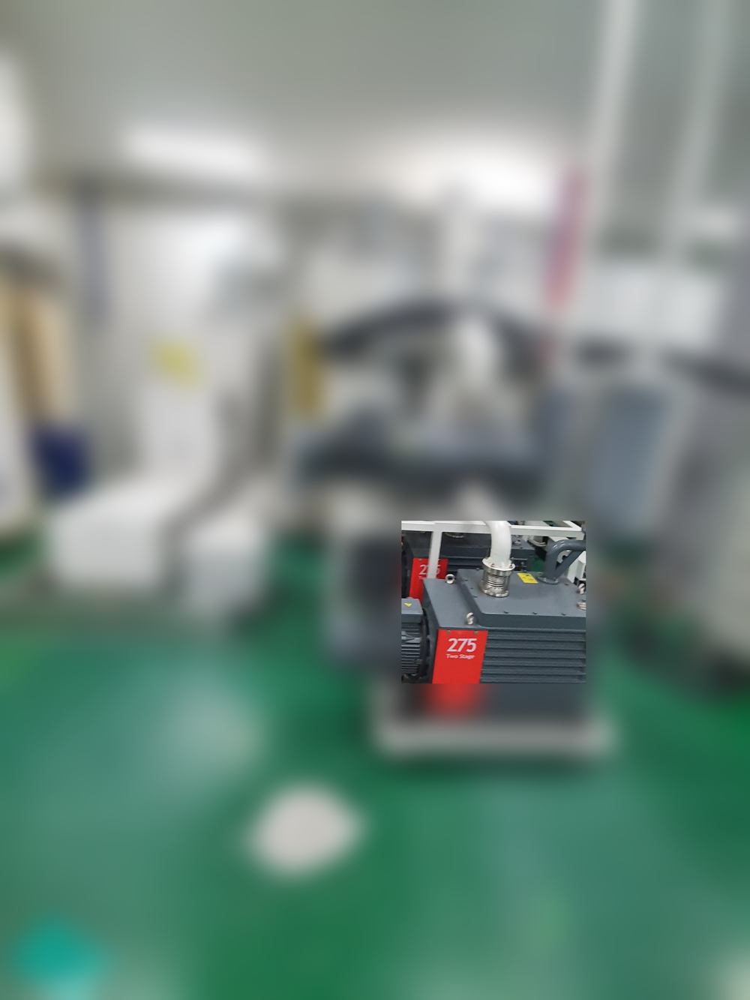
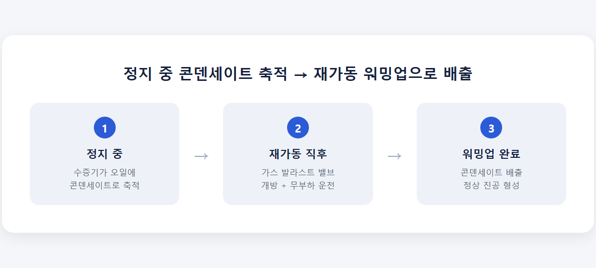
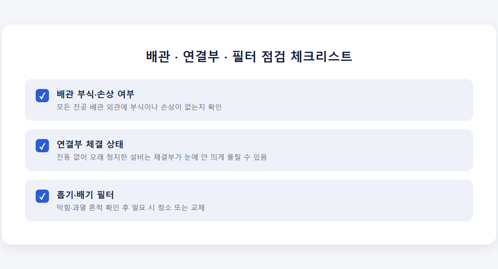
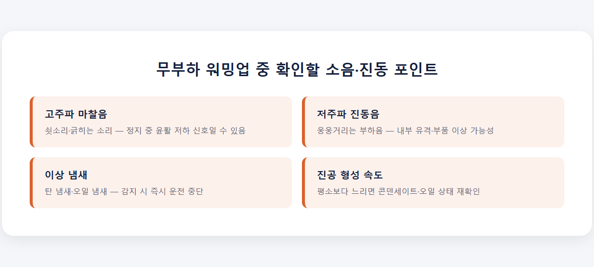
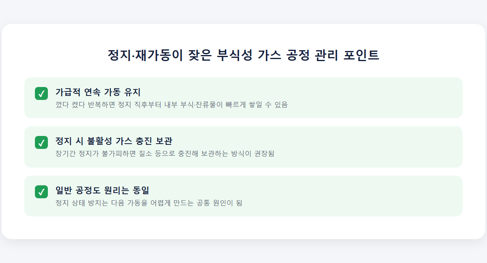

<!-- 수치검증: A항목 6개 확인 / B항목 0개(해당없음, 조합추천 없음) / C항목 0개(해당없음, 특정모델 타입서술 없음) / D항목 0개(해당없음, 기능주장 없음) / 삭제 0개 / 교체 0개 -->

# 진공펌프 재가동 전 점검사항 — 장기 정지 후 확인할 5가지

진공펌프를 일주일 이상 세워뒀다가 다시 켤 때는 전원부터 넣기 전에 확인해야 할 항목이 있습니다. 정지 기간 중 펌프 내부에서는 콘덴세이트 축적, 오일 열화, 부식 같은 변화가 눈에 안 보이게 진행됩니다. 재가동 전 점검 순서를 정리합니다.

## 정지 기간이 길면 왜 재가동이 까다로워지나요

펌프가 멈춰 있는 동안 흡기구 압력이 챔버 쪽과 역전되면서 오일이나 오일 증기가 흡기 쪽으로 역류하는 석백(suck-back) 현상이 생길 수 있습니다. 동시에 정지 중 응축된 수증기가 오일에 그대로 남아 콘덴세이트로 축적됩니다. 찬 상태에서 그대로 재가동하면 이 콘덴세이트가 초반 진공 형성을 방해하므로, 무부하 상태로 가스 발라스트 밸브를 열고 펌프가 따뜻해질 때까지 운전해 콘덴세이트를 배출하는 절차가 필요합니다. 추가로 유입되는 공기(또는 비응축성 가스)가 수증기를 흡수해 함께 배출시키는 원리로, 오염 정도에 따라 수 시간이 걸릴 수 있습니다.

## 냉각수 계통부터 확인이 필요합니다

수냉식 펌프는 냉각수가 정상 순환하지 않는 상태에서 가동하면 안 됩니다. 인터록이 있는 설비는 냉각수 미순환 시 자동으로 기동이 막히지만, 인터록이 없는 구형 설비는 사람이 직접 확인해야 합니다. 정지 기간이 길었던 라인은 냉각수 배관 안에 스케일·이물질이 가라앉아 있을 수 있으므로, 밸브 개방 여부와 유량이 정상인지 먼저 확인한 뒤 펌프를 기동하는 순서가 안전합니다.

## 오일 레벨·색상 점검이 두 번째입니다

사이트글라스 기준으로 오일이 최대(MAX)와 최소(MIN) 사이에 있는지 확인합니다. 정상 가동 중 오일은 최소치 아래로 내려가면 안 되는데, 장기 정지 후에는 이 기준을 다시 확인하는 절차 자체를 생략하기 쉽습니다. 오일 색이 눈에 띄게 변했다면, 특히 어두워졌다면 열화·오염·콘덴세이트 혼입 수준이 허용 범위를 넘었다는 신호입니다. 재가동 후 사이트글라스에서 오일 레벨이 3~5mm 정도 낮아지는 현상은 펌프가 정상 작동하고 있다는 신호이므로 문제로 볼 필요는 없습니다.

## 배관·연결부·필터 육안 점검

모든 진공 배관에 부식이나 손상이 없는지, 연결부가 헐거워지지 않았는지 확인합니다. 진동 없이 오래 정지해 있던 설비는 체결부가 눈에 안 띄게 풀려 있는 경우가 있습니다. 흡기·배기 필터도 함께 확인해 막힘이나 과열 흔적이 있으면 청소하거나 교체합니다. 이 단계를 건너뛰고 전원부터 넣으면 이후 문제가 배관에 있는지 펌프 자체에 있는지 구분하기 어려워집니다.

## 무부하 워밍업 중 소음·진동 확인

재가동 직후 바로 공정에 투입하지 말고, 가스 발라스트를 연 무부하 상태에서 일정 시간 돌리며 소리를 확인합니다. 평소와 다른 고주파 마찰음이나 저주파 진동음이 이 단계에서 들리면 정지 기간 중 내부에서 문제가 생겼다는 신호일 수 있습니다. 워밍업 단계에서 이상을 잡아내면 공정 중단 없이 대응할 수 있지만, 그대로 공정에 투입한 뒤 알게 되면 손실이 커집니다.

## 정지 기간에 따라 점검 강도를 다르게 잡으세요

정지 기간이 하루 이틀이라면 위 항목을 간단히 훑는 정도로도 충분합니다. 문제는 일주일을 넘기거나 한 달 이상 세워둔 경우입니다. 정지 기간이 길어질수록 오일 침전물이 가라앉고, 콘덴세이트가 오일 전체에 고르게 섞이며, 배관 안쪽 습기나 미세 부식이 진행될 시간도 그만큼 늘어납니다. 실무적으로는 이렇게 구분하는 게 도움이 됩니다.

- 1주일 미만 정지: 오일 레벨·색상 육안 확인, 무부하 워밍업 5~10분이면 충분합니다.
- 1주일~1개월 정지: 위 항목에 더해 배관·연결부·필터까지 전부 점검하고, 워밍업 시간을 평소보다 길게 잡습니다.
- 1개월 이상 정지: 냉각수 계통, 오일 상태, 배관, 필터를 모두 점검하고, 정지 기간 중 오일 색이 어두워졌다면 재가동 전에 아예 오일부터 교환하는 편이 안전합니다. 부식성 가스를 다루던 라인이라면 내부 잔류물 여부까지 확인 대상에 포함해야 합니다.

정지 기간을 정확히 기록해두지 않았다면, 마지막 오일 교환일과 마지막 가동일부터 역산해 점검 강도를 정하시면 됩니다.

## 정지·재가동을 자주 반복하는 라인이라면

부식성 가스를 다루는 설비는 정지 상태를 짧게라도 방치하면 내부에 부식과 잔류물이 빠르게 쌓여, 다음 가동 시 성능 저하나 고장으로 이어지는 경우가 실제 현장에서 확인됩니다. 이런 라인은 계속 가동하거나, 정지가 불가피하다면 질소 같은 불활성 가스로 충진해 보관하는 방식이 권장됩니다. 부식성 가스가 아닌 일반 공정이라도 "정지 상태를 방치하면 내부에 잔류물이 쌓여 다음 가동이 어려워진다"는 원리는 동일하게 적용되므로, 정지·재가동이 잦은 라인이라면 최소한의 보관 절차를 미리 정해두는 것이 좋습니다.

순서를 정리하면 냉각수 계통, 오일 레벨·색상, 배관·연결부·필터, 무부하 워밍업 중 소음·진동 확인, 그리고 정지 기간이 길었다면 내부 잔류물·부식 가능성까지입니다. 이 다섯 가지를 순서대로 거치면 재가동 직후 트러블의 대부분은 전원을 넣기 전에 이미 걸러집니다. 반대로 이 순서를 생략하고 바로 공정에 투입하면, 문제가 생겼을 때 원인이 오일인지 배관인지 베어링인지 구분하는 데 훨씬 오래 걸리고, 결과적으로 공정 재개도 그만큼 늦어집니다.

---

진공펌프 재가동 전 오일·냉각수·배관 점검, 정지 기간별 관리 방법 상담. 부식성 가스 공정은 정지 상태 방치만으로도 고장 원인이 될 수 있어 별도 확인이 필요합니다.
