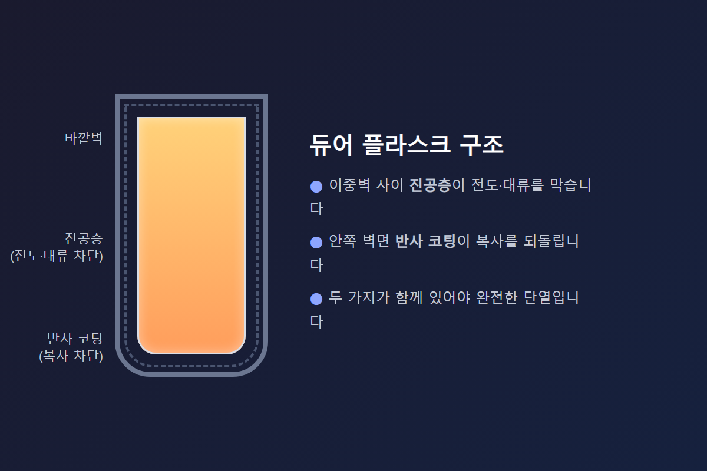
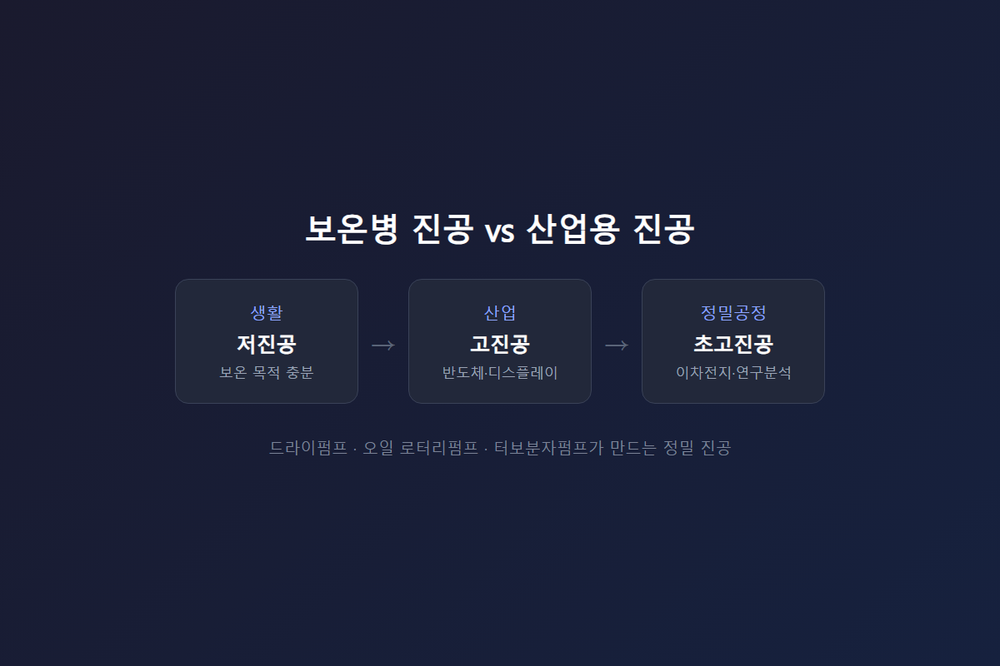

<!-- 수치검증: A항목 0개(공식 스펙 수치 미사용, 일반 물리 원리만 서술) / B항목 0개 / C항목 0개 / D항목 0개 / 삭제 0개 / 교체 0개 -->

# 열전달 3가지로 이해하는 진공 단열의 원리

열이 이동하는 방법은 전도·대류·복사, 세 가지뿐입니다. 진공은 이 중 두 가지만 막습니다. 나머지 하나는 진공만으로 막을 수 없어서 별도 처리가 필요합니다. 이 원리를 이해하면 보온병부터 산업용 진공 챔버까지, 왜 그런 구조로 설계되는지가 한 번에 정리됩니다.

## 전도와 대류 — 매질이 있어야 성립하는 열전달

전도는 물질을 이루는 입자들이 충돌하며 에너지를 옆으로 전달하는 방식입니다. 고체에서 가장 활발하고, 반드시 전달할 입자(매질)가 있어야 성립합니다. 프라이팬 손잡이가 뜨거워지는 것, 겨울철 금속 난간이 유독 차갑게 느껴지는 것 모두 전도입니다. 금속은 입자 사이 에너지 전달이 빠르고, 나무나 플라스틱은 느립니다. 그래서 조리도구 손잡이는 나무나 플라스틱을 쓰는 경우가 많습니다.

대류는 기체나 액체 같은 유체가 온도차로 밀도 차이를 만들고, 그 유체 자체가 이동하면서 열을 옮기는 방식입니다. 역시 유동할 매질이 필요합니다. 난방기를 바닥 쪽에 두는 이유, 에어컨을 천장 쪽에 두는 이유도 대류 방향을 활용한 설계입니다. 데운 공기는 위로 올라가고, 차가운 공기는 아래로 가라앉습니다.

두 방식 모두 공통점이 있습니다. 매질이 없으면 아예 성립하지 않습니다. 진공 공간에는 입자도 유체도 없으므로, 전도와 대류는 진공에서 원천 차단됩니다. 보온병의 이중벽 사이를 진공으로 만드는 이유가 바로 이것입니다. 물질을 완전히 비워버리면 열을 전달할 매개체 자체가 사라지는 셈입니다.

## 복사 — 진공도 막지 못하는 열전달

복사는 전자기파 형태로 에너지가 방출되는 방식입니다. 매질이 필요 없다는 점에서 앞의 두 방식과 근본적으로 다릅니다. 태양빛이 아무것도 없는 우주 공간을 건너 지구까지 도달하는 것이 대표적인 복사 사례입니다. 난로 앞에 서 있을 때 공기를 거치지 않고도 얼굴이 따뜻해지는 느낌, 그것도 복사입니다.

절대영도보다 온도가 높은 모든 물체는 복사로 에너지를 방출합니다. 사람 몸도, 뜨거운 물이 든 보온병 내부도 마찬가지입니다. 진공은 매질이 없는 공간일 뿐이므로, 복사를 막을 방법이 되지 못합니다. 진공층만 있는 용기라면 시간이 지나며 복사로 열이 계속 빠져나갑니다.

그래서 실제 보온병(듀어 플라스크 구조)은 진공층만 두지 않고, 안쪽 벽면에 반사 코팅을 추가합니다. 복사로 빠져나가려는 열을 거울처럼 반사시켜 되돌리는 방식입니다. 은도금이나 금속 증착으로 만든 반사면이 이 역할을 합니다.

## 정리 — 진공은 절반만 막는다

전도와 대류는 진공이 막습니다. 복사는 반사 처리가 따로 필요합니다. 이 두 가지 원리가 결합해야 완전한 단열 구조가 됩니다. 보온병 마개 부위가 몸통보다 열 손실이 큰 이유도 여기에 있습니다. 마개와 병목은 진공층을 두르기 어려운 구조라, 그 부분만큼은 전도·대류가 여전히 살아있는 통로로 남기 때문입니다.

정리하면 다음과 같습니다.

- 전도 차단: 진공(매질 제거)으로 해결
- 대류 차단: 진공(매질 제거)으로 해결
- 복사 차단: 반사 코팅으로 별도 해결
- 취약 지점: 진공층을 두르기 어려운 마개·이음새 부위

이 네 가지만 기억하면 보온 용기뿐 아니라 단열이 필요한 대부분의 구조를 이해할 수 있습니다.

## 산업용 진공과 생활 속 진공은 정밀도가 다르다

보온병의 진공은 어느 정도 공기를 빼내는 수준으로도 보온 목적을 충분히 달성합니다. 반면 반도체·디스플레이·이차전지 같은 산업 공정은 챔버 안에 남은 미세한 기체 분자 하나까지 불량 요인이 될 수 있어, 저진공을 넘어 고진공·초고진공까지 정밀하게 관리합니다.

이런 수준의 진공을 만들고 유지하는 장비가 드라이 진공펌프, 오일 로터리펌프, 터보분자펌프입니다. 열전달 3가지 원리는 결국 보온병 설계와 산업용 진공 시스템 설계 모두에 그대로 적용되는 공통 원리입니다. 다만 산업 현장에서는 단순히 열 손실을 막는 것을 넘어, 공정 중 발생하는 가스를 신속하게 배기하고 일정한 압력을 유지하는 능력까지 함께 요구됩니다.

같은 "진공"이라는 단어를 쓰지만, 보온병 진공과 반도체 공정 진공 사이에는 압력 수준으로 몇 자릿수 이상의 차이가 있습니다. 목표 압력이 낮아질수록(진공도가 높아질수록) 요구되는 펌프 성능과 시스템 설계 난이도도 함께 올라갑니다.

## 자주 나오는 질문

**진공이면 열이 아예 안 빠져나가는 것 아닌가요?**
아닙니다. 복사는 진공에서도 그대로 전달됩니다. 진공은 전도와 대류 두 가지만 차단할 뿐입니다.

**보온병이 예전보다 빨리 식는다면 어디를 먼저 봐야 하나요?**
몸통보다 마개 쪽 밀폐 상태를 먼저 확인하는 것이 순서입니다. 패킹이 낡아 틈이 생기면 그 틈으로 대류가 살아나 열 손실이 빨라집니다.

**진공단열은 보온병 말고 어디에 또 쓰이나요?**
겨울철 창문 단열 필름, 아이스박스의 이중 벽 구조, 우주복의 다층 단열재도 같은 원리를 응용합니다. 매질을 없애 전도·대류를 막고, 반사 처리로 복사까지 함께 줄이는 조합은 형태만 다를 뿐 원리는 동일합니다.

**산업 현장에서는 왜 이렇게까지 정밀한 진공이 필요한가요?**
반도체 웨이퍼나 이차전지 전극처럼 미세 오염에 민감한 공정에서는, 챔버 안에 남아있는 기체 분자 하나가 불량으로 이어질 수 있습니다. 그래서 저진공 수준이 아니라 고진공·초고진공까지 관리하며, 이 정밀도를 만드는 것이 산업용 진공펌프의 역할입니다.

---

전도·대류 차단은 진공, 복사 차단은 반사 코팅 — 두 원리가 함께 있어야 완전한 단열이 됩니다.
