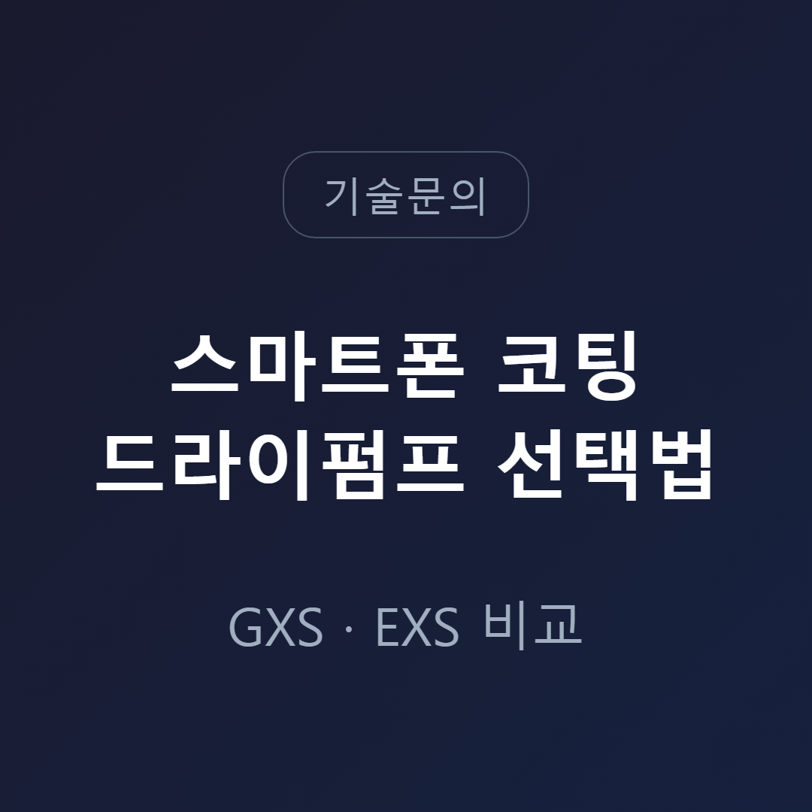
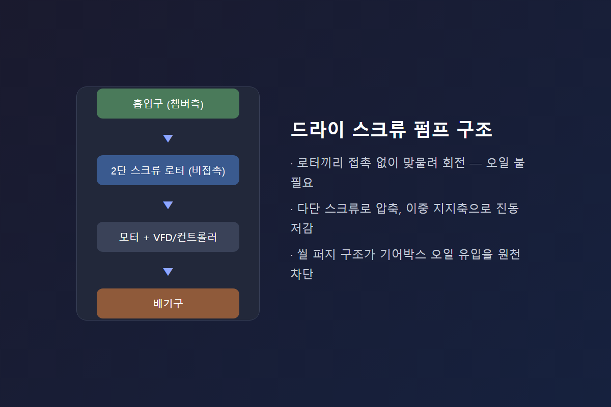
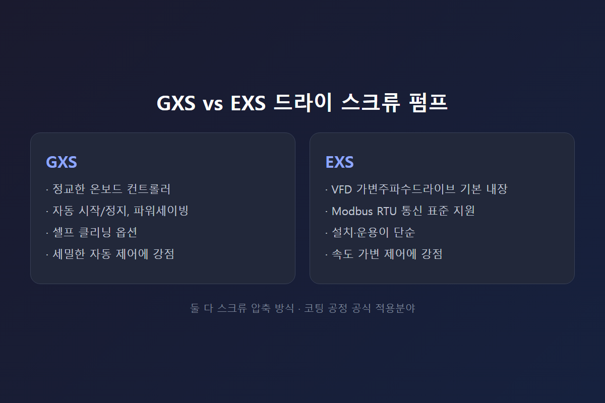
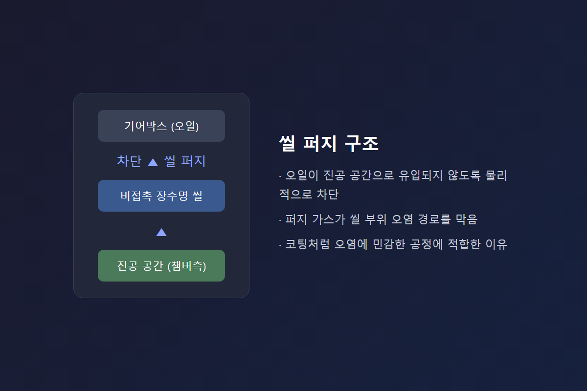
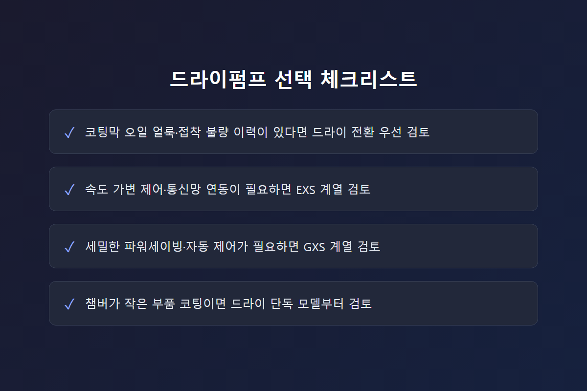

<!-- 수치검증: A항목 8개 확인(GXS/EXS 도달진공도·배기속도·소음·오일종류) / B항목 1개 확인(GXS+EH 현장조합, "현장 확인 필요"로 완곡 처리) / C항목 2개 확인(GXS=스크류, EH=루츠부스터 구분) / D항목 0개 / 삭제 0개 / 교체 0개 -->

# 스마트폰 코팅 진공 공정의 드라이펌프 선택법

스마트폰 커버글라스·카메라 렌즈·금속 하우징의 코팅 공정은 진공 챔버 안에서 진행됩니다. 이 공정에서 드라이 스크류 펌프를 선택할 때 확인해야 할 기준을 정리합니다.

## 코팅 공정에서 오일프리 펌프가 필요한 이유

코팅 공정은 챔버 내부 청정도가 곧 제품 품질입니다. 오일 로터리펌프는 배기 과정에서 오일 미스트가 역류(백스트리밍)할 가능성이 있고, 이 성분이 챔버로 되돌아가면 코팅막에 얼룩이나 접착 불량을 일으킬 수 있습니다. Edwards GXS·EXS 드라이 스크류 펌프는 공식 적용분야에 롤투롤 웹 코팅, 하드코팅(CVD/DLC), 표면 활성화, 플라즈마 스프레이, 글라스 코팅을 명시하고 있어 이런 공정에 적합한 제품군으로 분류됩니다.

스마트폰 부품에 적용되는 코팅은 크게 세 갈래로 나눌 수 있습니다. 커버글라스의 지문방지·반사방지 코팅, 카메라 렌즈의 반사방지·적외선 차단 코팅, 금속 하우징의 표면경화·발색 코팅입니다. 세 공정 모두 스퍼터링이나 플라즈마 기반 증착을 거치는 경우가 많고, 챔버 내부에 오일 성분이 조금이라도 유입되면 코팅막 접착력이 떨어지거나 얼룩이 남는 문제로 이어집니다. 드라이 스크류 펌프가 이런 공정에 기본값처럼 채택되는 이유입니다.

## GXS 스크류 로터의 구조적 강점

GXS는 다단(multi-stage) 스크류 로터에 이중 지지축(non-cantilever) 설계를 적용해 회전 시 진동을 낮추고 기동 신뢰성을 높였습니다. 브로슈어에는 5리터 물 슬러그, 1kg 분말 슬러그까지 처리할 수 있다는 테스트 결과가 소개돼 있습니다. 코팅 공정에서 발생할 수 있는 미세 입자성 부산물에 대응하는 여유도로 볼 수 있습니다.

## GXS와 EXS 비교

두 시리즈 모두 스크류 압축 방식을 공유하지만 성격이 다릅니다.

- **GXS**: 온보드 컨트롤러가 정교함(자동 시작·정지, 파워세이빙, 셀프 클리닝 옵션). GXS160 피크 배기속도 160 m³/hr·도달진공도 7×10⁻³ mbar, GXS250 250 m³/hr·4×10⁻³ mbar.
- **EXS**: VFD(가변주파수드라이브) 표준 내장, Modbus RTU 통신 지원, 설치·운용이 단순함. EXS160·EXS250은 도달진공도 1×10⁻² mbar 수준.

속도 가변 제어나 기존 설비관리 시스템 연동이 필요하면 EXS, 세밀한 자동 제어·파워세이빙이 필요하면 GXS 쪽이 유리합니다.

## 씰 퍼지 구조가 오염을 막는 원리

GXS·EXS는 비접촉식 장수명 씰과 씰 퍼지(shaft seal purge) 구조로 기어박스 오일이 진공 공간으로 넘어오지 못하게 막습니다. 이 구조 덕분에 코팅처럼 오염에 민감한 공정에서도 안정적으로 운전할 수 있습니다. 씰이 마모되거나 퍼지 공급이 불안정해지면 정상 상태에서 없던 냄새나 진동이 나타날 수 있어 정기 점검이 필요합니다.

## 스마트폰 부품 코팅 규모에 맞는 용량

디스플레이 유리 같은 대면적 코팅과 달리, 스마트폰 부품(커버글라스·렌즈·하우징)은 챔버가 상대적으로 작은 경우가 많습니다. GXS750/8000급 대용량 조합보다 GXS160~450, EXS160~450 구간의 드라이 단독 모델로 충분한 경우가 많습니다. 대유량이 필요한 대면적 공정에서는 GXS160+EH1200, GXS250+EH2600처럼 루츠 부스터(EH 시리즈)를 별도 연결하기도 합니다. 정확한 조합은 챔버 부피와 목표 도달시간에 따라 달라져 현장 확인이 필요합니다.

## 유지보수 시 확인할 점

드라이펌프는 오일 로터리펌프보다 유지보수 항목이 단순하지만, 씰과 퍼지 계통 점검은 정기적으로 필요합니다. 냉각수 유량과 온도, 퍼지 가스 압력, 배기 배압이 정상 범위인지 주기적으로 확인하는 것이 코팅 품질을 일정하게 유지하는 핵심입니다. 특히 코팅 공정은 소량의 오염도 결과물에 바로 드러나기 때문에, 다른 공정보다 점검 주기를 촘촘하게 가져가는 편이 안전합니다.

## 선택 체크리스트

- 코팅막 오일 얼룩·접착 불량 이력이 있다면 드라이 전환을 우선 검토
- 속도 가변 제어나 통신망 연동이 필요하면 EXS 계열
- 세밀한 파워세이빙·자동 제어가 필요하면 GXS 계열
- 챔버가 작은 부품 코팅이면 드라이 단독 모델부터 검토

## 자주 나오는 질문

**GXS와 EXS 중 어느 쪽이 스마트폰 코팅에 더 많이 쓰이나요?**
둘 다 동일하게 코팅 공정을 공식 적용분야로 제시합니다. 세밀한 자동 제어와 파워세이빙이 필요하면 GXS, 속도 가변 제어와 기존 통신망 연동이 우선이면 EXS가 접근하기 편합니다. 공정 조건에 따라 갈리는 선택이라 어느 한쪽이 절대적으로 우세하다고 말하기는 어렵습니다.

**드라이펌프로 바꾸면 배기속도가 부족해지지 않을까요?**
챔버 부피와 목표 도달시간이 같다면, 오일 로터리펌프 대비 드라이 스크류 펌프의 배기속도가 부족한 경우는 드뭅니다. 다만 대면적 스퍼터링처럼 유량 자체가 크게 필요한 공정에서는 GXS·EXS에 EH 루츠 부스터를 별도로 연결하는 조합을 검토합니다.

**씰 퍼지 가스는 별도로 준비해야 하나요?**
네. 씰 퍼지에는 별도의 퍼지 가스 공급 라인이 필요합니다. 기존 설비에 퍼지 가스 인프라가 없다면 설치 단계에서 함께 계획해야 합니다.

---

GXS/EXS 모델 선정, 챔버 조건에 맞는 부스터 조합 여부, 씰 퍼지 점검 주기·냉각수 계통 상담까지 함께 가능합니다.
