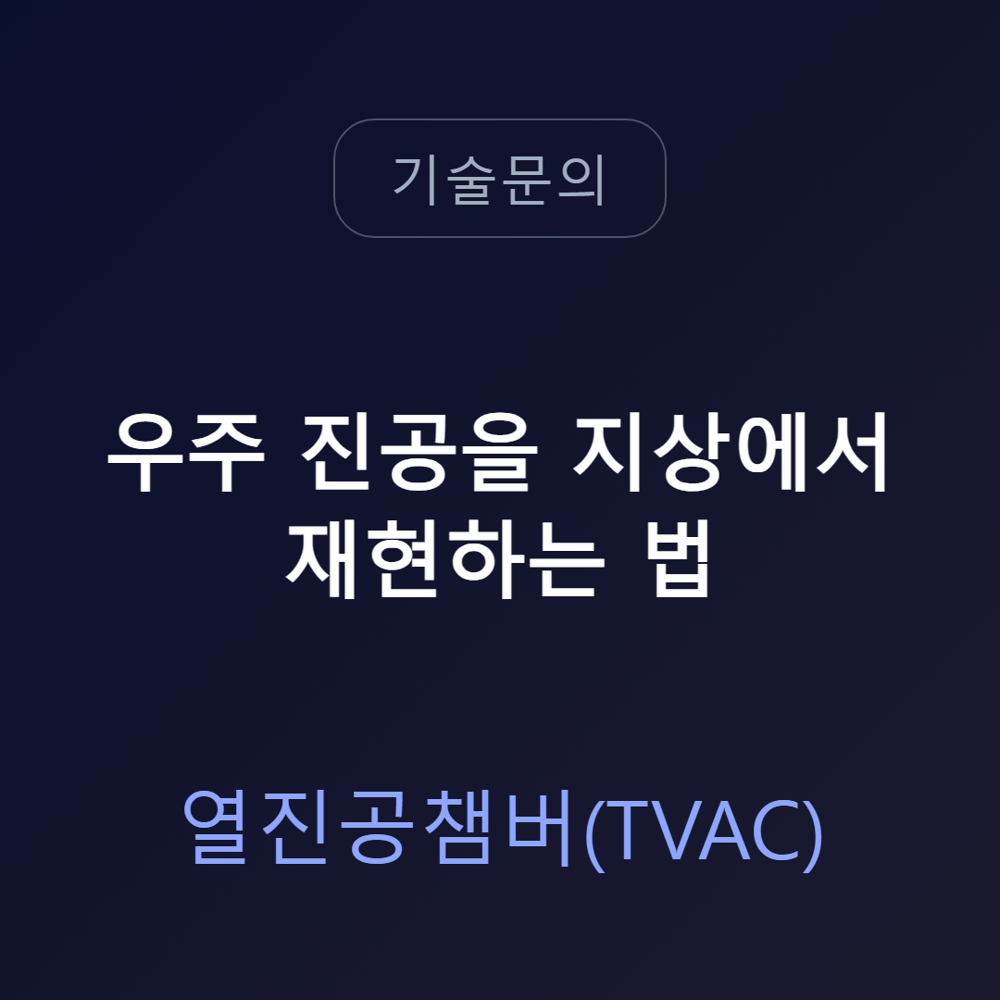
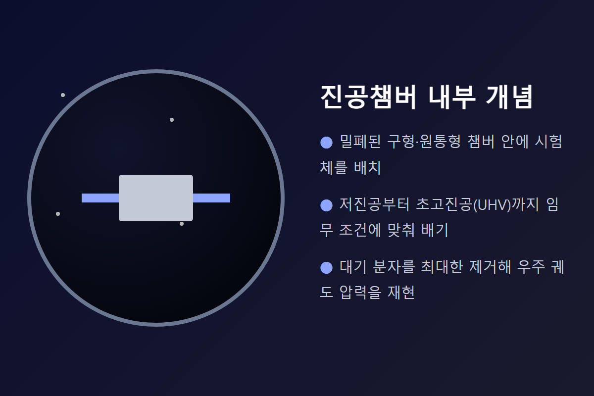
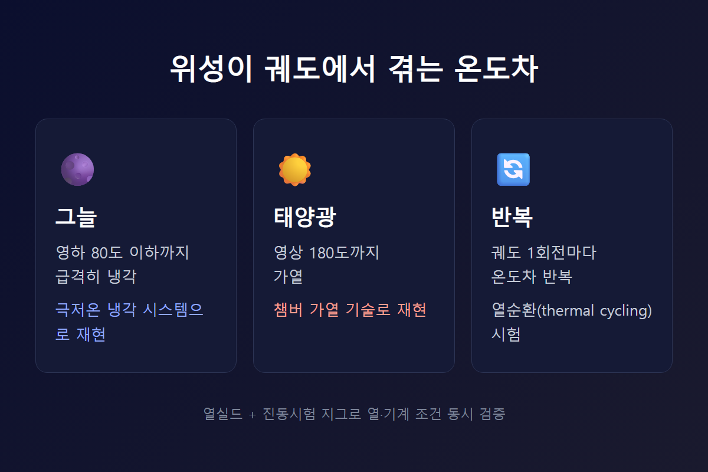
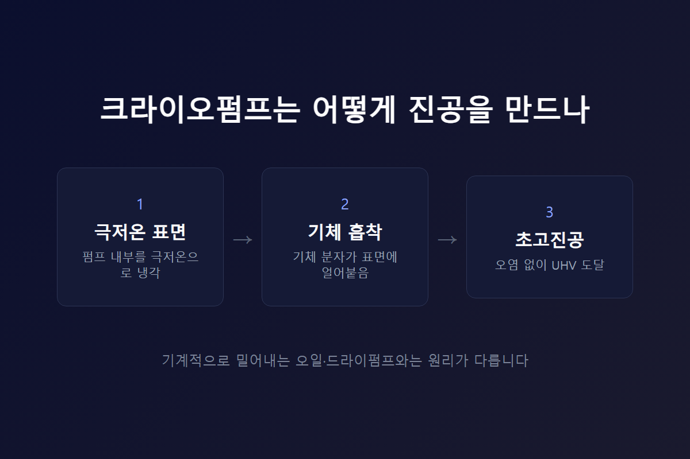
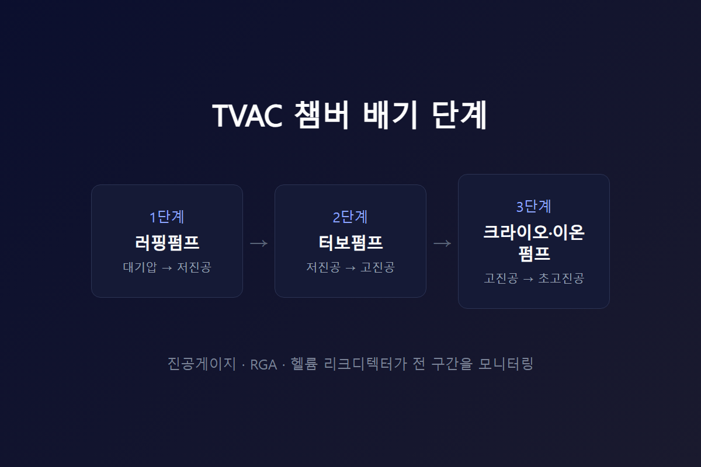

<!-- 수치검증: A항목 2개 확인 / B항목 0개(해당없음) / C항목 1개 확인(크라이오펌프=흡착식) / D항목 0개 / 삭제 0개 / 교체 0개 -->
---
category: 기술문의
---

# 우주 진공을 지상에서 재현하는 열진공챔버(TVAC)의 3가지 조건

인공위성과 우주선 부품은 발사 전 반드시 지상 시험을 거칩니다. 우주에서 결함이 발견되면 수리가 사실상 불가능하기 때문입니다. 이때 사용하는 설비가 열진공챔버(TVAC, Thermal Vacuum Chamber)입니다. TVAC는 우주선·인공위성 구성품과 추진 시스템을 시험하기 위해 우주의 진공을 재현하는 통제된 환경입니다.

우주 환경을 지상에서 흉내 내려면 세 가지 조건이 동시에 맞아야 합니다. 진공도, 온도, 그리고 이 둘을 만들어내는 펌프 구성입니다. 세 조건 중 하나라도 어긋나면 시험 결과 자체가 실제 궤도 상황과 달라질 수 있습니다.

## 진공도 — 임무 프로파일마다 목표가 다르다

지구를 도는 저궤도(LEO) 위성과 심우주로 나가는 탐사선은 겪는 압력 자체가 서로 다릅니다. TVAC 설비는 이 차이에 맞춰 저진공부터 초고진공(UHV)까지 폭넓은 압력대를 구현할 수 있어야 합니다.

초고진공은 통상 10⁻⁷ hPa(mbar) 이하로 정의됩니다. 이 정도 압력대에서는 공기 분자가 거의 남지 않기 때문에, 소재 표면에서 기체가 빠져나오는 아웃가싱(outgassing) 현상까지 관찰할 수 있습니다. 실제로 TVAC의 주요 용도 중 하나가 이 아웃가싱 연구이며, 소재 선정 단계에서부터 이 결과를 반영하는 경우가 많습니다.

## 온도 — 그늘과 태양광의 온도차를 그대로 재현

진공만으로는 우주 환경이 완성되지 않습니다. 위성은 궤도를 돌며 그늘에서는 영하 80도 이하, 태양광이 닿는 쪽은 영상 180도까지 온도차를 반복해서 겪습니다.

TVAC는 극저온 냉각 시스템으로 저온 환경을, 별도의 가열 기술로 고온 환경을 구현해 이 온도차를 재현합니다. 큐브샛(CubeSat)처럼 소형 위성을 시험할 때는 진동시험용 고정지그를 함께 설계해, 열 조건과 기계적 조건을 동시에 검증하는 경우도 있습니다.

## 펌프 구성 — 단계별로 쌓아 올리는 초고진공

TVAC 챔버는 펌프 한 대로 완성되지 않습니다. 1차 펌프(러핑용)로 대기압에서 저진공까지 낮추고, 터보펌프로 고진공까지 끌어올린 다음, 초고진공이 필요한 구간에서 크라이오펌프나 이온펌프를 추가로 투입하는 단계별 구성이 일반적입니다. 여기에 진공게이지, 잔류가스분석기(RGA), 헬륨 리크디텍터 같은 모니터링 장비가 단계마다 함께 붙습니다.

크라이오펌프는 다른 펌프와 작동 원리 자체가 다릅니다. 오일로터리펌프나 드라이펌프는 기체를 기계적으로 밀어내지만, 크라이오펌프는 극저온 표면에 기체 분자를 얼려 붙잡는 흡착 방식입니다. 오염 물질을 거의 배출하지 않아, 우주 환경처럼 극도로 깨끗한 초고진공이 필요한 시험 설비에 주로 쓰입니다.

## 크라이오펌프 도입을 검토할 때 흔히 겪는 문제

크라이오펌프는 성능 검증보다 도입 과정에서 더 많은 시간이 걸리는 장비입니다. 초고진공 스펙 자체는 제조사 간 큰 차이가 없어서, 실제로는 어카운트 구조와 가격 조건 비교에 더 오랜 시간이 소요됩니다.

한 연구소 사례에서는 기술 검토가 이미 끝난 상태에서도, 담당자가 바뀌면서 같은 내용을 다시 확인하는 미팅이 추가로 필요했습니다. 대리점을 통해 공급받는 구조인지, 본사 직접 공급인지에 따라서도 견적·기술지원 창구가 달라집니다. 크라이오펌프처럼 도입 단가가 높은 장비일수록, 기술 스펙을 먼저 확정한 뒤 공급 경로와 가격 조건을 별도로 비교하는 순서가 시간을 아낍니다.

## 왜 굳이 크라이오펌프여야 하는가

터보펌프만으로도 고진공까지는 도달할 수 있습니다. 하지만 초고진공 영역, 특히 수소·헬륨처럼 가벼운 기체를 배기해야 하는 조건에서는 크라이오펌프가 유리합니다. 극저온 표면이 이런 경량 기체 분자까지 붙잡아 두기 때문입니다.

반대로 크라이오펌프는 흡착한 기체가 표면에 쌓이면 주기적으로 녹여 배출하는 재생(regeneration) 과정이 필요합니다. 이 재생 주기와 시험 일정이 맞지 않으면 챔버 가동률이 떨어질 수 있어서, 도입 전에 예상 시험 빈도와 재생 주기를 함께 검토하는 것이 좋습니다.

## 챔버를 설계하기 전에 확인할 4가지

새로 TVAC 시스템을 검토한다면 펌프 선정보다 먼저 아래를 확인하는 것이 순서입니다.

- 시험 대상물 크기와 실험실 공간 — 챔버 체적이 곧 필요한 배기 용량을 결정한다.
- 시험 목적 — 부품 시험인지, 소재 아웃가싱 연구인지, 열순환 시험인지에 따라 구성이 달라진다.
- 챔버 형상 — 원통형과 정육면체형은 내부 열·진공 분포가 다르게 나타난다.
- 부가 장치 — 열실드, 진동시험 고정지그 등 목적에 맞는 부속을 미리 정한다.

이 네 가지가 정리되면 러핑펌프부터 크라이오펌프까지 어떤 조합이 필요한지 명확해집니다. 챔버 규모와 목표 진공도가 정해지면 단계별 펌프 구성도 그에 맞춰 결정됩니다.

시험 빈도가 잦은 설비라면 재생 시간이 짧은 펌프 구성을, 시험 간격이 넓은 설비라면 도달 진공도 자체를 우선하는 구성을 검토하는 식으로, 운영 패턴에 맞춰 펌프 조합의 우선순위를 다르게 잡는 것이 합리적입니다.

---

TVAC 챔버 진공 시스템 구성 상담, 크라이오펌프·터보펌프 선정 문의 가능. 초고진공 구간은 오염 방지를 위해 오일 성분이 없는 펌프 조합으로 설계하는 것이 원칙입니다. 러핑 단계부터 크라이오 단계까지 전체 배기 계통을 함께 검토하면 재작업 없이 한 번에 목표 진공도에 맞는 구성을 확정할 수 있습니다.
